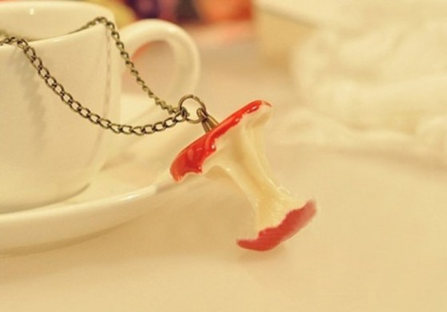

# Apie graužtukus

Rašai savo sukurtą istoriją. Knygą. Kiekviena istorija, žinoma, turi savus veikėjus, kuriuos nupiešti yra autoriaus, kitaip tariant, tavo pareiga, o kaip visą tai suinterpretuos ir įsivaizduos skaitytojas – tai jau labai individualu. Taigi, kiekvienas veikėjas, personažas turi įgyti, suformuoti kažkokį paveikslą tavo, kaip kūrėjo, galvoje. Galbūt, tu visą veikėjo modelį turi galvoje ir tiesiog aprašinėji, tarsi aprašinėtum nuotrauką. Gal tai žmogus, kuris tau labai įdomus, kuris atkreipė tavo dėmesį ar sužavėjo, o galbūt tai žmogus su kuriuo visad labai troškai susipažinti, o gal tiesiog žmogus, kurį pamatei gatvėje ir kuris tavo galva puikiai tiktų tavo norimai papasakoti istorijai. Kartais būna taip, kad galvoje pradžioje yra tik tam tikros gairės, o likusios susidėlioja tik jau rašymo eigoje. Arba galvoje tūno visa istorija, kuri tiesiogiai susijusi su tuo konkrečiu veikėju  ir tada galima numanyti kokį poveikį ši istorija, patyrimas turėtų ir tiesiog aprašyti, kaip numanai atrodytų šios istorijos padariniai atsispindintys veikėjuje. Kaip ten bebūtų personažas yra absoliučiai tavo kūrinys, kuris visiškai priklauso tik nuo tavęs vieno. Tavo vieno fantazijos vaisius.

Ir tarkime, kaip pagrindinį istorijos veikėją aprašai žmogų, kurį laikytum tiesiog tobula pora sau. Ne visi iškarto gali atsakyti į klausimą, koks žmogus jiems būtų tobula pora. Žinoma, visi kartoja tas pačias frazes: mielas, protingas, gražus, geras and so on, bet tai yra gan abstraktu ir neatfiltruoja pakankamai daug žmonių. Tačiau gyvenimo eigoje, kai jau patirčių bagažas vis kaupiasi, ima ryškėti tos tikrosios gairės, kokių tu norėtum ir jas įvardinti tampa kiek lengviau. Taigi, tos gairės išryškėja ir savo knygoje pagrindinį personažą aprašai būtent tokį. O kas jei vieną dieną atsibudęs sužinotum, kad tavo salione atsirado būtent šis tavo aprašytas žmogutis. Vienas prie vieno, kaip iš knygos puslapių. Žinoma, tu pirmiausia sutrinki radęs nepažįstamą savo namuose. Išsigąsti, sustresuoji. Tačiau šis žmogutis elgiasi, lyg judu būtumėt pažįstami. Subalamutrinta čia viskas kažkaip :j Taigi, bebendraujant supranti, įžvelgi, kad tai tavo kūrinys. Tavo veikėjas. Hey, man rodos tokia tematika net ir filmas yra, tik sorry, pavadinimo tikrai nežinau. Žiūrėjau jį apsnūdęs arba  maišau su savo mintimis ir įdėjomis, kurios sukasi prieš  užmiegant. Taigi, kiek pamenu, tai toje istorijoje autorius po kiek laiko pradėjo pavargti nuo savo kūrinio, kuris pradžioje atrodęs toks tobulas, po kiek laiko tiesiog ima ir pabosta. Tobulybė yra nuobodi. Žmonėms visada reikia tikslo, paskatos, kad galėtų veikti, kad galėtų suktis tame pačiame rate, kaip, kad žiurkėnai. Ir ką šis autorius padaro? Jis ima atlikinėti korekcijas savo knygoje. Pataiso veikėjos aprašymą taip, kaip jam patogiau tam momentui. Tačiau pataisymai nelabai vykę ir tik pridaro dar daugiau žalos. Tada iš paskos seka kiti pataisymai, kurie turi taisyti pastarojo pataisymo sukurtas problemas, nepatogumus ir taip be galo, pakol iš tobulo partnerio lieka viena didelė klaida ir nesusipratimas ir autorius ima visko gailėtis ir nori grįžti į pradinį tašką į tada, kai viskas buvo tobula, bet to paprasčiausiai neįvyksta. Džiaugsmo, laimės ir pykčio, bei pakrikusių nervų kupina istorija.  Tačiau gan panašiai elgiamės ko ne kiekvienas iš mūsų…

Tai apie ką gi aš… Kažkada pamenu bandžiau suformuluoti ir į vieną įrašą sudėti viską kas man atrodė labiausiai žavu merginose ir apie kokią partnerę aš svajočiau. Nors pačio to straipsnio dabar ir neskaičiau, tačiau žinau, kad šiuo metu jau ne visos mintys sutaptų ir kad ir kaip bandžiau viską sukonkretinti tada, vis vien nemažai dalykų išliko gan abstraktūs ar nepasakyti. Dabar tokio sąrašo neketinu daryt ar perdarinėt, kuo toliau, tuo spalvos jame po truputis ryškėja, tačiau tampa vis sunkiau nusakomos. Tarsi pamatytum naują, dar niekam nematytą spalvą, kuri neturi pavadinimo ir bandytum ją nupasakoti kitam. Tai ką tu pasakosi ir tai ką įsivaizduos tas žmogus, bus du, absoliučiai skirtingi dalykai. Ir nors teigiu, kad tai ganėtinai abstraktu, tačiau štai, galiu pasigirti, kad per gyvenimą teko sutikti du, taip, du žmogeliukus, kurie buvo tiksliai tai apie ką aš galvoju ir apie ką būtų galima svajoti. Taip taikliai, kad net baugu. Tai žmonės šalia kitų pasijunti kitaip. Žmonės, dėl kurių rodos būtų galima padaryti bet ką… Visgi vieno iš jų galimybės pažinti neturiu ir nežinau koks visgi tai žmogus ir pilnai neatmetu galimybės, kad susipažinus ta idilė galbūt ir sugriūtų, tačiau tai buvo tas žmogus, kuris šitaip smarkiai krito į akį vos tik spėjus pamatyti. Vienas iš tų variantų, kaip, kad panos sako „kojos sulinko“. Ir galbūt kitiem tai nėra toks retas reiškinys, o man buvo pats pirmasis ir lyg šiolei vienintelis, kai pasijunti so much nesavas ir galvoji „wtf tu čia dabar darai?“.

O kitas žmogeliukas aplankė mane dar šiandien… Heh, tuo pat metu apima ir džiaugsmas ir neapsakomas liūdesys  Džiaugsmas dėlto, kad pakankamai netikėtai, neplanuotai, susitikom po dviejų metų pertraukos, tad gera vėl pamatyti tuos žmones, kuriuos taip nori matyti ir kurių pasiilgai. Apima neapsakomas šiltumo jausmas, kuris nepaleidžia nuo pat pirmos šypsenos ir pirmo apsikabinimo vos tik susitikus. Tačiau laikas su tokiais žmonėmis tiesiog pralekia neskaičiuojamas, nes na taip, kai gera, laikas tiesiog garuoja, o vat tada ima ir pasidaro liūdna dėlto, kad vos tik spėjus išsiskirti, apima tas trūkumo jausmas. Graužatis, kad vat gyvenime ne viskas būna taip, kaip norėtum. Gyvenimui tavo norai nerūpi. Dar liūdniau, kai pagalvoji, kad to žmogaus nematysi dar tiek pat… O ką kalbėti ir apie tai, kad apima graužatis dėlto, kad suvoki turintis šiuo metu artimą, kuris daugiau mažiau stengiasi, deda viltis ir kuris nors ir turi tų bruožų, kurių taip ieškau žmonyse, juda teigiama linkme, padėti pirmi geri žingsniai, tačiau kaip bebūtų visai neprilygsta tam žmogučiui, kuris ką tik išvažiavo namo. Pasijunti esąs nesąžiningas to, esančio greta, atžvilgiu, nors teoriškai, nieko blogo lyg ir nepadarei. Pasikeitė tik viena – tai kas anksčiau tenkino ir atrodė gerai, ima netenkinti taip jau labai, kai pats savo akim pamatai, kad yra geriau. Tačiau aš nebūsiu, kaip tas autorius ir kaitalioti jau parašytų eilučių neketinu. Tai būtų savanaudiška. Nors kitą vertus, kai pagalvoji, tai ar tai, kad viską pasilaikau sau ir nepasisakau, argi nėra savanaudiška? Ar nenoras gadinti reikalų, bei skaudinti kito, brangaus žmogaus gali būti laikytinas savanaudišku? Tačiau reikia suprasti, kad jeigu yra siena, viena puiki, tvirta ir visakeriopiškai gera siena, tai kaip bebūtų jin ir lieka siena ir visas namas, kuris tau reikalingas, iš jos na tiesiog niekaip neišeina.

Kiekvienas nešiojasi kažkokį graužtuką, kuris neduoda ramybės. Kiekvienam laiko momentui turim kiekvienas po tokį. Kartais nuspiriam į šoną, užsimirštam, kad turim jį ar periodiškai juos kaitaliojam į kitus, tačiau visada turim bent po vieną. Maniškis šiuo metu, vat būtent toks.

