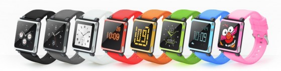
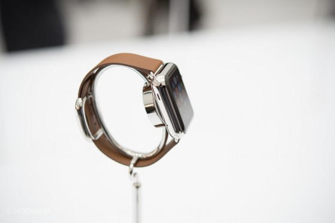
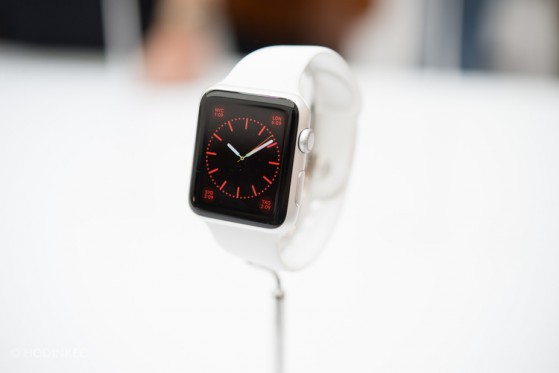
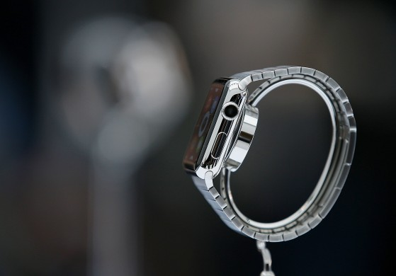

# Mintys apie Apple Watch

Taigi, Apple antradienį vykusiame renginyje pristatė naujausius savo gaminius: iPhone 6, kiek didesnį jo brolį iPhone 6 Plus, bei pirmą kartą nuo 2010-tųjų metų – visiškai naują produktų kategoriją. Šį kartą tai išmanusis laikrodis.

Paskutiniu metu atrodo, kad visi labai trokšta, kad kompanijai Apple nesisektų. Nežinau, iš kur išsivysto tokia neapykanta, nes nemėgti kompanijos, kuri orientuojasi į vartotojo patirtį, bei gaminių kokybę, iš pirmos pažiūros atrodytų nelogiška. Visada laikydavau, kad vienintelė priežastis, dėlko žmonės gali nekęsti šios kompanijos, tai overpriced produktai. Žinoma, jūs galite žymiai pigiau nusipirkti kitą telefoną ir taip, milžiniškas marketingas, kuris skiriamas iPhone’ams ar Macbook’ams reklamuoti yra įskaičiuotas į šio įrenginio kainą. Ir visgi, jei palyginti to paties segmento gaminius iš kitų kompanijų, pvz [HTC One](http://www.omnitel.lt/mobilieji-telefonai/htc/htc-one-m8-/64491?ci=850), [Sony Z2](http://www.omnitel.lt/mobilieji-telefonai/sony-/sony-xperia-z2/64859?ci=850) ar [Samsung S5](http://www.omnitel.lt/mobilieji-telefonai/samsung/samsung-galaxy-s5-g900-/64239?ci=850), kurie reklamuojami taipogi nemažais mastais, galima greitai pamatyti, kad jie parduodami už 2200 Lt, kai tuo tarpu [iPhone 5s ](http://www.omnitel.lt/mobilieji-telefonai/apple/iphone-5s-16gb/62849?ci=850)kaina siekia 2400Lt . Išaiškėja, kad Apple telefonas ne toks jau ir baisiai brangesnis lyginant su konkurentais, kaip kad atrodė pradžioje. Nemėgti kompanijos už tai, kad ne taip, kaip konkurentai šie negamina biudžetinių, paprastam žmogui įperkamų telefonų, manau neteisinga, o tai, kad iPhone’as turi dviejų branduolių 1,3Ghz procesorių, kai kiti Android telefonai jau pradėjo diegti 4 branduolių 2,5Ghz procesorius yra labai realityvu, kai telefonas nepaisant to veikia nė dalelyte prasčiau ar lėčiau.

Kas šiuo metu liečia konkrečiai šį Apple laikrodį, kuris pavadintas ne iWatch, kaip buvo tikėtasi, o Apple Watch – tai vadinamasis hate bandwagon, kai nemėgti, šaipytis iš kažkokio konkretaus produkto pasidaro tiesiog populiaru ir nors stumiantieji ne tik, kad nematė, nepaminkė galutinio produkto rankose ir jo nesupranta, bet šio produkto dar apskritai net nėra ir žmonės net nežino ar jiems šis produktas iš tikrųjų nepatiks. Galvojate Apple nežino, kad gaminys susilaukė mixed nuomonių? Ir nejau pamirštate, kad šioje kompanijoje dirba geriausi marketingo specialistai visame technologijų pasaulyje? Dar yra laiko ir nemažai problemų, susijusių su laikrodžiu bus vienaip ar kitaip sprendžiamos. Man tai iš dalies primena situaciją su Xbox One: tikriausiai pamenat, kaip visas internetas masiškai juokėsi iš konsolės ir skelbė konsolių karą[ jau pasibaigusiu](http://www.cinemablend.com/images/sections/63897/_1399422276.jpg), jam net neprasidėjus, tačiau nepaisant visų tų kalbų per pirmas 24h Microsoft’as pardavė milijoną šių konsolių, ką vadinti blogu startu tiesiog neapsiverčia liežuvis. Ir visiškai tvirtai galiu garantuoti, kad neskaitant visų neigiamų atsiliepimų, kitais metais, kai laikrodis galiausiai pasieks parduotuvių lentynas, bus tuojau pat išgraibstytas ir tai jį padarys iki tol geriausiai parduotu išmaniuoju laikrodžiu.

Apple teigia, kad prie išmaniojo laikrodžio dirbo jau kelis metus. Atrodytu keistoka, nes išmaniųjų laikrodžių lenktynės prasidėjo tik prieš gerus metus. Tačiau pasižiūrėkime mažumėle į praeitį:

Ar atpažįstate? Tai buvo šeštos kartos [iPad Nano](https://www.google.lt/search?q=ipod+nano+6th+generation&num=30&source=lnms&tbm=isch&sa=X&ei=tJASVLP0BcPIyAO6pIC4BA&ved=0CAgQ_AUoAQ&biw=1918&bih=1019), pristatytas 2010-aisiais. Įžvelgiant panašumų? Nors tuomet Apple pati dirželių ir nepardavinėjo ir tai buvo palikta priedų gamintojams, tačiau jau tada kompanija į operacinę šio grotuvo sistemą įtraukė skirtingus laikrodžio programos dizainus \(watch faces\) ir turėjo puikią progą prasitestuoti funkcijas, dizainą, patyrinėti, kaip vartotojo sąsaja veikia ant tokio dydžio ekrano. Įdomu ir tai, kad pernai nemažai tech saitų darė palyginimą su Samsung’o tais metais pristatytu [Galaxy Gear](http://siliconangle.com/files/2013/09/galaxy-gear-samsung-corp.jpg) laikrodžiu ir išaiškino, kad šis, tuomet jau 3 metų Apple gaminys beveik visais atžvilgiais pranašesnis, nei pirmasis Samsung’o laikrodis.

Džiaugiuosi, kad Apple visgi nusprendė imtis šio žingsnio ir pristatė savo laikrodį. Kodėl? Pirmiausia dėlto, kad tai smarkiai pastūmės kitus išmaniųjų laikrodžių gamintojus. Kaip galvojate ar reikės ilgai laukti, pakol Samsung’as pateiks savo naują Galaxy laikrodį, kuris turėtų atremti Apple priimtus sprendimus? Ypač, kad Apple gaminys rinkoje pasirodys tik už pusmečio. Samsung’as iki šiol naudoja filosofiją, kai meta pinigus į sieną ir žiūri kas prilips. Iki šiolei jų laikrodis buvo vienas iš to rezultatų ir tai tebuvo bandymas užbėgti už akių, nenorint, kad pasikartotų 2007-tųjų metų įvykiai, kai Apple prezentacija įrodė, kaip smarkiai visa industrija buvo atsilikusi. Dabar Samsung’as gavo konkurencijos nuo savo pagrindinio priešo, o konkurencija skatina staigų progresą. Tarkime ir dabar, tiek Google, tiek Apple ėmesi ganėtinai skirtingų požiūrių į laikrodį: Google mano, kad laikrodis ant riešo turėtų būti tik jūsų telefono ekrano praplėtimas, iš esmės skirtas pranešimų atvaizdavimui. Email’ai, sms’ai, greita paieška, bei kalendoriaus priminimai. Greita informacija jums ant rankos, o platesnėms funkcijoms, vis vien naudosite savo telefoną. Ši filosofija atsispindi ne tik pačios operacinės sistemos funkcijomis, tačiau ir vartotojo sąsaja. Tuo tarpu Apple pabandė sutalpinti ko ne visą miniatiūrinį telefoną jums ant rankos. Būčiau tikrai nusivylęs, jei Apple Watch tikrai tesugebėtų pasiūlyti tik pranešimų atvaizdavimą, analoginių laikrodžių ekrano dizainus, bei pedometrą ir tada pradėčiau svarstyti, kas gi nutiko šiai kompanijai. Bet manau, kad taip nebus ir šiam laikrodukui numatyta kur kas daugiau ir tai kas buvo parodyta pristatymo metu, ištikrųjų yra tik ledkalnio viršūnė, kaip kad sakė Tim’as Cook’as. Manau, kad toks ganėtinai išankstinis laikrodžio dizaino pristatymas, kai pats laikrodis prekyboje pasirodys dar negreit, buvo tik tam, kad nenutiktų taip, kaip nutiko su iPhone 6, kai iš kinų pusės įvyko nutekėjimas ir apie naujojo telefono dizainą žmonės jau žinojo kelis mėnesius ankščiau laiko. Apple pristatė dizainą pagal savo žaidimo taisykles, galėdami kontroliuoti ir sudaryti tokį įspūdį, kokį nori dar iki tol, kol kinai gavo prikišti rankas. O programinė laikrodžio dalis bus pristatyta tik ko gero daug arčiau laikrodžio išleidimo. Ne tik dėlto, kad iki to laiko ji bus gerokai tobulinama, bet galbūt ir dėlto, kad kompanija nori išlaikyti funkcionalumą paslaptyje, nes prasidės kopijavimas. Net jei standartinis funkcionalumas būtų ribotas, tikrai bus paliktos durys programėlių kūrėjams ir tikiu, kad šie gali sugalvoti pakankamai įdomių sprendimų: pvz appsas skirtas junginėti televizoriaus programas ar dainas kompiuteryje ar pvz muzikos, bei podcastų klausimas per bluetooth ausines, bei iš vidinės laikrodžio atminties nė neturint pačio telefono, kas padarytų šį laikroduką dar patrauklesniu sportuojant ir iš esmės padarytų Nike Fuelband, bei Fitbit tą patį, ką iPod’as padarė kitiems MP3 grotuvams. Ir tokios funkcijos turi savo panaudojimą ir pasirodytų patrauklios nemažai daliai žmonių, o kiek ištikrųjų reikia dabar parodytų nuotraukų peržiūros, planetų ar žemėlapių ant 1,5 colio ekrano – didelis, didelis klaustukas.

Tačiau pagrindinis dalykas ką būtent dabar Apple padarė ryškiai geriau, nei bet koks smart laikrodis pasirodęs iki šiolei – personalizacija. Skirtingi laikrodžių dydžiai, nes vienas dydis negali būti tinkamas visoms rankoms. Ar matėte, kaip Moto 360 atrodo ant[ moteriškos rankos](http://r.phonedog.com/shared/images/2014/6/182511-moto360flightsmall.jpg)? Primena vaikišką ranką ;\) Skirtingi laikrodžių dizainų variantai – įprastinis, sportinis, prabangus. Taipogi daugybė skirtingų dirželių – nuo natūralios odos ar sportuojantiems skirtos gumos iki taip standartiniams laikrodžiams būdingų metalinių dirželių. O jei ir nerandate jums tinkamo tarp siūlomų, neabejokite, kad aksesuarų gamintojai prigamins toną, įtinkančių kiekvieno poreikiams. Sau norimą laikrodžio variantą gali rasti nuo nerūpestingo paauglio iki verslininko. Na ir galiausiai net ir dirželių keitimo mechanizmas, kuris padarytas labai protingai. Tai yra detalės, kurioms Apple visada skiria preciziškai daug dėmesio. Tai yra itin tikslus žingsnis ir tikiu, kad sekantys sėkmingi android laikrodžiai tiesiog privalės imtis tokio pačio metodo. Tai yra geras pavyzdys, kaip Apple atėjimas, keičia visą rinką.

Antra priežastis, kodėl galima džiaugtis yra ta, kad naujoms technologijoms daugiau nei bet kam kitam reikia early adopters – žmonių, kurie patys pirmieji susidurtų su problemomis, kylančiomis kasdieniniame naudojime. Būtent tokių žmonių pasiūlymų dėka gimsta naujos funkcijos, atsiranda nauji panaudojamumo scenarijai, apie kuriuos kūrėjai pradžioje nė nebuvo pagalvoję. Ir niekas kitas neturi didesnės testinės aikštelės, nei Apple, nes tai kompanija turinti didžiausią lojalių fanų bendruomenę, kurie pirks produktą vien tik dėl brando. Būtent tokių žmonių dėka produktai išsivysto tinkama linkme ir sekantys šio produkto leidimai tampa patrauklūs daug didesniam pirkėjų ratui.  Nors nei aš, nei jūs nesiruošiame pirkti išmaniojo laikrodžio dabartinėje jų būklėje, tačiau ši produktų kategorija gali pasidaryti visai patraukli ties 3-čia ar tai 5-ta iteracija.

Kaip ten bebūtų nežadu būti Apple gynėju ir ginti šį produktą, taip kaip ir nežadu aklai stumti ant jo, nes dabar tai madinga. Realybė yra tokia, kad Apple įsiliejimas į išmaniųjų laikrodžių rinką yra tikrai aktualus pačiai rinkai, tačiau ne itin reikšmingas paprastiems pirkėjams. Ir tai galioja ne tik Apple Watch, bet aplamai bet kuriam išmaniąjam laikrodžiui. Šie prietaisai yra gamintojų bandymas prastumti produktą, kuris pirkėjams tiesiog ne itin reikalingas. Atsiranda nemažai argumentų, kad va, kai Apple pristatė iPad’ą irgi buvo tas pats, visi rėkė, kad nereikalingas device’as, o tai tapo ypač sėkmingu produktu ir dabar, apklausų duomenimis, net 37% išmaniaisiais įrenginiais besinaudojančių lietuvių norėtų įsigyti planšetinį kompiuterį. Tačiau, jei planšeto atveju, šis įrenginys suteikia platesnį panaudojamumą ir turi pranašumų lyginant su telefonu: didelis ekranas daug labiau tinkamas interneto naršymui, basic darbų atlikimui būnant ne namie, bei ženkliai geresnis baterijos darbo laikas, tai išmanusis laikrodis šiai dienai nesprendžia, nei vienos problemos, o tik pridaro naujų. Tai įrenginys, kuris nors ir pradžiugintų nerdiškų polinkių turintį jūsų draugą, tačiau neturi patrauklumo eiliniam žmogui. Tačiau manau, kad Apple Watch tolimesnėje ateityje turi potencialo tapti grėsme vidutinio segmento laikrodžių gamintojams. Priežastis paprasta – Apple dėmesingumas detalėms atsiperka ir šiuose laikrodžiuose iš dizaino perspektyvos daug daugiau detalių yra padarytos gerai, nei kad lyginant su vidutinio segmento šveicariškais ar kiniškais laikrodžiais, kurių rinka jau labai senai yra sustagarėjusi ir kuri ima didelius pinigus už dažnu atveju visai to nevertus laikrodžius. Kaip ten bebūtų, nemanau, kad tai nutiks greitai. Gamintojai sugaiš dar nemažai laiko pakol išspręs baterijos problemas ir iki tol žmonės priiminės sprendimą pagal tai ar jie nori ilgaamžio laikrodžio ar funkcionalaus laikrodžio, kurį reikės krauti kasdien, bei kuris ant riešo išbus maximum vos kelis metus. Eiliniam pirkėjui dar labai ilgą laiką mechaninis laikrodis darys daug didesnį įspūdį, nei bet koks protingas laikrodis.

Taipogi bus įdomu stebėti rinkos reakciją, kai Apple pristatys tikrąją šių laikrodžių kainą. Taip, bus ir tie 349$, bet tai už patį paprasčiausią sportinį variantą. Manau, kad tai bus sudarę labai klaidingus žmonių lūkesčius dėl kitų variantų kainų. Standartinis variantas, pagamintas iš nerūdijančio plieno ir su safyriniu ekranu tiek tikrai nekainuos ir priklausomai nuo dirželio, kaina sieks tikriausiai apie 500-700$. Nė jau nekalbu apie 18 karatų auksą, kur tikriausiai vien pats auksas tame laikrodyje kainuotų apie 1000$, o pats laikrodis gali iššokti ir iki porą tūkstančių dolerių ar net daugiau. Labai aktuali citata:

_When the prices of the steel and \(especially\) gold Apple Watches are announced, I expect the tech press to have the biggest collective shit-fit in the history of Apple-versus-the-standard-tech-industry. The utilitarian mindset that asks “Why would anyone waste money on a gold watch?” isn’t going to be able to come to grips with what Apple is doing here. They’re going to say that Jony Ive and Tim Cook have lost their minds. They’re going to wear out their keyboards typing “This never would have happened if Steve Jobs were alive.”_

Žinoma produktas turi ir daugiau ryškių problemų:

-Prietaisas yra gan storas, ko pasekoje jis nepalenda lengvai po marškiniais ar aptempto megztuko rankove;  
-Nemaža dalis funkcijų, tokių kaip paišymas ekrane, planetos, emoji ar tapšnojimo nusiuntimas pašnekovui atrodo visiškai gimmick funkcijos skirtos vienam, dviem kartui pasimaivyti iki kol bus visai užmirštos ir nenaudojamos;  
-Ratukas \(digital crow\) labai tikėtina, kad gali būti gan dažnai pasuktas ar paspaustas netyčia. Kadangi laikrodis neturi lock screen ir užsidega pakėlus ranką ar tai reiškia, kad bus netyčia primaigoma to net nenorint?  
-Kur kairiarankiams skirtas modelis?!  
-Žingsniai skaičiuojasi tiesiog judinant ranką. Pasiruoškite nueiti 300 žingsnių tiesiog rašant kompiuterio klaviatūra ar valgant.  
-Baterija. Nors prezentacijos metu apie šio laikrodžio bateriją nutylėta, nes greičiausiai tikimasi iki pasirodymo ją dar patobulinti, tačiau užuominos leido suprasti, kad krauti įrenginį reikėtų kasnakt. Kas ypač padaro beprasmę tokią funkciją, kaip tylus vibracinis žadintuvas;  
-Vartotojo sąsaja. Įdomu, kaip visas iOS 7 ir dabar jau ir iOS 8 dizainas, kuris yra plokščias, siūlo daug šviesių, ryškių spalvų, buvo visiškai pamirštas ant šio laikrodžio. Nemaža dalis interface’o labiau primena Windows Phone operacinę, o ne iOS.  
-iPhone reikalavimas. Iš esmės, jei šalia neturimas iPhone’as, įrenginys yra bevertis. Kas atrodo ganėtinai prastai turint omenyje, kad laikrodis ganėtinai nemažai akcentuotas, kaip aktyvių, sportuojančių žmonių draugas, tačiau bėgikui neužtenka turėti laikrodį ant riešo, jam vis vien tektų į savo sportines kelnes kažkur sugrūsti ir telefoną. Iš esmės GPS galėtų būti įmontuotas į patį laikrodį ir tokiu principu jis galėtų veikti visiškai autonominiu režimu nuo telefono, but I guess, tai visai nužudytų įrenginio bateriją.  
-Gan smarkiai abejoju Apple Watch Edition laikrodžiais su 18 karatų auksu. Šis variantas kainuos velniškai daug, o tie žmonės į kuriuos šis laikrodis ir galėtų apeliuoti, niekada nepirktų išmanaus laikrodžio, o tik prabangų mechaninį laikrodį iš respektabilios laikrodžių kompanijos, kuris laikytų dešimtmečius, o ne po kelerius metus.

Be viso to, man visgi patiko:

-Safyrinis ekranas;  
-Stiliaus, bei mados žurnalistais ganėtinai linkę pripažinti, kad šio device’o dizainas, bei kokybė pralenkia dauguma laikrodžių šioje kainų kategorijoje: skaitmeninių, mechaninių, bei išmaniųjų laikrodžių rinkoje. Ir nesunku pripažinti, kad [tai ](http://static.squarespace.com/static/4fa14d3ce4b08a53fa26468e/541084a3e4b00c94d885cded/541084f2e4b09a04d20c6ae8/1410368760365/AppleWatchHODINKEE-52.jpg?format=1500w)atrodo išties geriau ir kokybiškiau, nei [tai](http://reanimated.lt/wp-content/uploads/2014/09/V6tv6IN.jpg);  
-Multitouch’as tokiame ekrane yra beviltiškas, tad rankenėlės integravimas į korpūsą ištikrųjų yra gan geras sprendimas, palengvinantis naudojimąsi ir zoom’ą;  
-Pirmas įrenginys, kai lietimui jautrus ekranas, fiksuoja [lietimo stiprumą](http://static.squarespace.com/static/5290accde4b070d80c59f1f8/t/52ee68bde4b0f8f91740da55/1391356108266/Template6.jpg?format=500w);  
-Orientavimasis į sportą, bei sveikatą \(pedometras, bėgimo nuotolis, laikas, kalorijos, širdies darbas\);  
-Home screen ekranas. Nors iš pirmos pažiūros toks korio principas atrodo ganėtinai chaotiškas, bet susdėliojus ikonas pagal save, susigrupavus pagal paskirtį ar naudojamumą toks atvaizdavimas turėtų būti tikrai patogus vien dėlto, kad galima matyti iškarto daug visko ir dar geriau – matyti į kurią pusę reikia judėti, norint pasiekti norimą programą. Manau visai logiškas sprendimas, veikiantis geriau, nei tarkime programėlių sąrašas ar standartinis grid’as turintis ten po 4 ar 6 programėles viename lange;  
-Apple Pay servisas bus pasiekiamas ir per laikrodį. Atsiskaityti parduotuvėje, kavinėje ar greito maisto restorane netraukiant nei piniginės, nei telefono būtų tikrai šaunu. Saugumas implementuotas tokiu principu: laikrodžio spaudimo matavimo sensoriai lengvai gali nustatyti kada laikrodis yra nuimamas nuo rankos. Taigi, pirmą kartą norint atsiskaityti laikroduku, reikės suvesti kortelės pin kodą. Vėlesniem atsiskaitymams, tol kol laikrodis nė karto nebuvo nuimtas nuo riešo, kodo nebereikia ir užtenka laikrodžio ekrane viso labo patvirtinti atsiskaitymą. O kai prietaisas nuimamas nuo riešo, kodas nusiresetina ir sekantį kartą jį vėl reikės įvedinėti. Gana gudru, tačiau realybėje, kurioje laikrodį krauti reiktų kasnakt, tai reikštų, kad pin kodą reikėtų įvedinėti ko ne kiekvieną kartą;  
-Laiko sinchronizavimas su serveriu. Reiškia laikas automatiškai sukinėjasi vasaros-žiemos laiku ar keliaujant į kitą šalį.

Bonus faktai: sunku nemylėti ir tas mažytes detales, kuriomis Apple visada būtinai pasirūpina, nors galėtų to tiesiog ir nedaryti. Pvz: dažniausiai laikrodžių gamintojai savo demonstracinėse laikrodžių nuotraukose būna nustatę laiką 10:10. Apple norėdama pabrėžti, kad yra mažumėle pranašesni, nustatinėja laiką: 10:09. Arba kitas geras pavyzdys: demonstraciniame klipe laikrodžio ratukas naudojamas pakeisti datai ir juo nustatoma 1984-tųjų sausio 24, data, kai buvo pristatytas pirmasis Macintosh’as ;\) Miela, ne kitaip ;\)

Tai tiek mano minčių apie Apple laikrodį. Bus įdomu pažiūrėti kas iš to išsivystys sekančiose iteracijose ir kokius laikrodžius pateiks pasiūla už kelių metų. Pirmas leidimas visgi visada būna gan nepatogus, storas ir su trūkstamu funkcionalumu. Galbūt antroji versija ims ir atrodys [jau taip](http://cdn0.vox-cdn.com/entry_photo_images/10681880/10700498_269033999971188_4970410257673245250_o_verge_super_wide.jpg), jugi kur kas maloniau akiai, argi ne? Kaip ten bebūtų išmanieji laikrodžiai artimiausiu metu tikrai niekur nedings, nes manau, kad Apple parduos pakankamai įspūdingą kiekį šių laikrodukų pirmais metais, kad imtųsi jo tobulinimo ir antros versijos išleidimo, o kiti gamintojai vaikydamiesi Apple sėkmės ir pardavimų taipogi nenorės sustoti. O jei laikrodis gaus tinkamą funkcionalumą, žmonės netruks pamatyti, kad turėti tokį ant riešo yra daug naudingiau ir patogiau, nei jų iki šiol turėtas vidutinis klasikinis laikrodukas, sugebantis rodyti tik laiką ir datą.  
O mes kol kas džiaukimės savo mobiliaisiais telefonais, kurie pradėjo implementuoti 1440p raiškos ekranus, kurie telefonams visiškai nereikalingi, bei kurie vis dar turi prastus akumuliatorius, tačiau yra absoliučiai pagrindiniai mūsų nešiojamieji įrenginiai.

