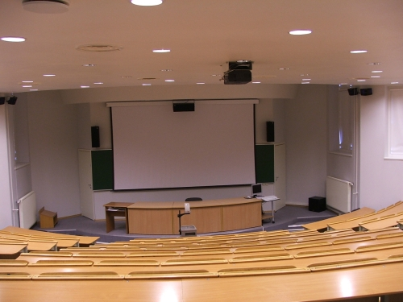

# Mano studijos ir profesinė karjera

Naršydamas po kompiuteryje saugomus failus, netikėtai atradau savo konspektą, kurį pasiruošiau dar studijuodamas Šiauliuose, kalbos kultūros paskaitai. Tema, kuria turėjau šnekėti – _Mano studijos ir profesinė karjera_. Dažniausiai ruošdamasis kalbėti nesiruošiu jokių konspektų, o tiesiog apgalvoju, ką reikėtų pasakyti, galvoje susidėlioju eiliškumą, kas po ko ir nuėjęs kalbėti tiesiog improvizuoju ir sekasi pusę velnio. Tą kartą kalba buvo labai svarbi. Ne tiek dėl dėstomos gan sudėtingos disciplinos, ne itin malonios publikos ar priekabios dėstytojos, kiek dėl savęs pačio, nes būtent tada galutinai ir neatšaukiamai buvo priimtas sprendimas mesti universitetą ir ši kalba buvo tarsi viso to užtvirtinimas, paviešinimas. Kitaip sakant, uždėjau štampą ant jau kurį laiką galvoje besisukusios minties.

_Potraukį elektronikai turiu nuo mažų dienų. Dar būdamas mažas, mėgdavau ardyti įvairius smulkius elektroninius prietaisus, juos modifikuoti. Žinoma, po visų „modifikacijų“ dažniausiai prietaisas nustodavo veikęs, tačiau visas nagrinėjimo bei įvairių idėjų išbandymo procesas atnešdavo daugybę džiaugsmo. Tai paliko pėdsaką mano gyvenime, dėl to ko gero ir nusprendžiau pasirinkti būtent šias studijas._

_Skirtingai nei dauguma iš čia esančių, aš nesu iš Šiaulių krašto, mano gimtinė pajūris, Šilutės rajonas. Kaip nutiko, kad studijuoti pasirinkau būtent Šiaulius, juk artimiausias universitetas nuo mano namų yra Klaipėdoje? Tai lėmė kelios priežastys. Pirmiausia, buvau, o gal dar ir esu savęs iki galo neatradęs žmogus, baigdamas vidurinę mokyklą aš visiškai nežinojau, kokia kryptimi pasukti. Išsilaikiau brandos egzaminus iš savo mėgstamų disciplinų, o tada jau žiūrėjau, kokios studijų galimybės man atsiveria. Daugiausiai alternatyvų suteikė inžineriniai mokslai, tad nusprendžiau rinktis kurią nors  iš jų. Kadangi neįsivaizdavau savęs dirbančio mechanikos ar statybų srityse, tai pasirinkau patraukliausiai atrodančias elektronikos studijas. Na, o Klaipėdos universitete tokios studijų programos nėra  – ten daugiau orientuojamasi į socialinius mokslus bei menus, tad atvykau studijuoti į Šiaulius, kur prieš daugybę metų mokėsi bei susipažino mano tėvai._  
_Tačiau bėgant metams ir vis labiau pasineriant į šios specialybės subtilybes tapo akivaizdu, kad savo ateities sieti su elektronika visai nesinori. Elektronika galbūt tebus vienas iš keleto mano hobių. Įsivaizduoju save grįžusį po dienos darbų besikuičiantį po asmeninius smulkius elektroninius galvosūkius, savo paties malonumui, tačiau ne dirbantį  nuolatinį darbą, susijusį su šia specialybe._

_Šiuo metu akys labiausiai krypsta į finansų ar nuosavo verslo sferas, kurios su elektronika neturi nieko bendro. Mūsų šeima visada buvo daugiau ar mažiau susijusi su šiomis sritimis ir man dažnai tekdavo susidurti su įvairiomis su šia sfera  susijusiomis problemomis. Anksčiau tiesiog nepastebėdavau, kokį mano susidomėjimą kelia šių problemų sprendimas. Tai tiesiog būdavo natūralus dalykas ir nė negalvojau, kad galėčiau gyvenime užsiimti su finansų valdymu susijusia veikla. Dirbant su pinigais, visada reikia šalto ir racionalaus mąstymo, nebijoti prisiimti atsakomybę bei kartais priimti skubius, tačiau užtikrintus sprendimus. Manau, kad visomis šiomis savybėmis aš pasižymiu ir  kad mano profesinė karjera pasuks būtent tuo keliu._

_Pastaruoju metu galima pastebėti tendenciją, kad didelė dalis jaunimo įstoja bet kur ir stengiasi studijas pabaigti kuo greičiau, nesvarbu, ar jiems patinka tos krypties studijos ar ne. Tai vadinamasis mokslas dėl diplomo. Taip pat nemaža dalis ką tik baigusių vidurinę mokyklą abiturientų  būna tokie pavargę nuo mokslų, kad nori pailsėti metus ar du. Per tą laiką jie pradeda dirbti ir pajutę pinigų „skonį“ grįžti prie mokslų nebesugeba. Visi esame jauni ir jei jaučiame, kad esame ne ten, kur turėtumėme būti, tai nėra nieko baisaus perstoti į patrauklesnes studijas. Sugaištas laikas nebus toks beprasmis, nes per tą laiką įgavome daug patirties, kuri galės dar ne kartą pagelbėti. O ir žymiai geriau sugaišti šiek tiek laiko beieškant savo gyvenimo kelio nei pasirinkti neteisingą ir kiekvieną dieną skųstis, kad dirbi nemėgstamą darbą._

_2010-05-26_

P.S.  tai ne viskas ką tada kalbėjau, galbūt formuluotės buvo kiek kitokios. Kaip bebūtų tai tik konspektas, padėjęs man nepaklysti tarp savų minčių.

P.S.2. ne vienas žmogus išgirdęs apie mano situaciją, klausdavo ar nesigailiu? Ar nesigailiu taip ir nepabaigęs tai ką pradėjau ar nesigailiu iššvaistęs du savo gyvenimo metus veltui ir pan.  
Atsakau: tikrai ne. Greičiau jaučiuosi „sutaupęs“ du ar net daugiau savo gyvenimo metų. Iš vis manau, kad universiteto metimas buvo vienas geresnių mano priimtų sprendimų, dėlto, kad po to gyvenimas pasikeitė gan kardinaliai \(į gerąją pusę\).

