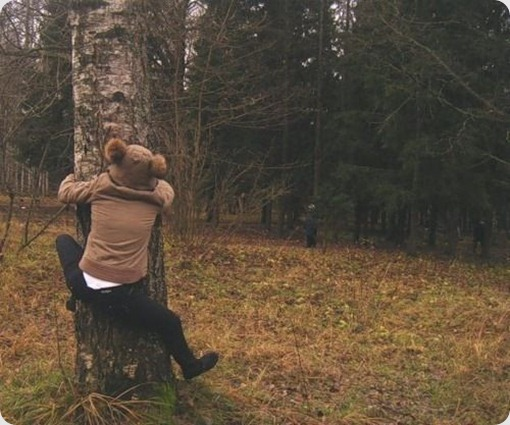

# Apie Kalėdas

Aš nebūčiau aš, jei nebrūkštelčiau ką nors šventiško. Some thoughts apie tai kodėl vienintelės Kalėdos praslysta pro mano antišventinę politiką.

Nors esu netikintis, tačiau Kalėdų atžvilgiu išlaikau solidarumą ir šios šventės, kaip kitų nenurašau. Taip, yra nemažai zyziančių, kad jos per daug komerciškos, perdaug orientuotos į vaikus ir banalios. Taip tikrai nėra malonu, kad iki šventės likus dar pusantro mėnesio, jau prasideda reklaminis bombardavimas. Ant kiekvieno produkto, ant kiekvieno visiškai nereikalingo daikto būtinai turi būt kalėdinė tematika, kvietimas pirkti ar padovanoti savo artimiesiem. Taip, mėsos plaktukas yra būtent tai, ko reikia mano sesers 2-metų dukrytei… Prekybininkai išnaudoja šią šventę labiausiai ir naudodamiesi, kad žmonėms reikia pirkti, bando prastumti kuo daugiau. Kitą vertus – yra paklausa yra ir pasiūla. Jei pats prekiaučiau ir ši šventė būtų puiki proga gerokai padidinti, galbūt net padvigubinti pardavimus, tai why not?

Tačiau visiškai sutikti su šiais kategoriškai nusistačiusiais žmonėm – negaliu. Ši šventė man labiau siejasi su šeimos būvimu kartu, o ne su dovanomis ar jų pirkimu. Nors šeima mano ir nedidelė – tik mama ir sesuo, o pastaroji per Kalėdas retais atvejais būdavo kartu, tad švęsdavom viso labo dviese, tačiau tai šios šventės nė kiek nesumenkino ir išlaikė šeimos asmeniškumą, intymumą. Žinoma, galbūt į viską žiūrima kiek kitaip, jei santykiai šeimoje yra prasti ir per Kalėdas jie nė kiek nepagerėja. Na arba atvirkščiai jei pagerėja, bet visa tai būna su šlykščiomis dirbtinėmis kaukėmis, ir ištikrųjų sėdi dantis sukandę. Mano šeimoje tokių atvejų nebuvo ir tikrai praleisdavome vakarą ramiai besišnekučiuodami žvakių šviesoje. Kuom ir džiaugiuosi.

Taipogi dar viena iš priežasčių, kodėl Kalėdos man vis dar branginamos – tai atmosfera. Nei viena kita šventė: naujieji metai, gimtadieniai, Velykos ar dar bala žino kas, neturi tokio specifiškumo ir atmosferos. Būtent ši žiemos šventė turi tuos žavius išskirtinius elementus: sniegą, šaltuką, kuris naikinamas karšta arbata, vilnonėmis kojinėmis, namų šiluma ar tiesiog pledu, eglės puošimo senoviniais žaisliukais \(kai kurie jų dar iš tų laikų, kai mano mama pati buvo vaikas\) ritualą, bei galiausiai žvakių šviesą, kino filmų žiūrėjimą su šeima, na ir žinoma mandarinų kvapą. Visa tai susijungia į vieną gražią visumą, kurią ir vadiname Kalėdomis.

Dėl visų šių smulkmenų tai yra paskutinė iš švenčių, kurią miniu. Dėl gimtadienio šventimo, jums jau esu pasakojęs, na o kitos šventės tiesiog nevertos dėmesio. Tačiau taip jau išėjo, kad šiemet ir tų pačių Kalėdų kaip ir neturiu. Per savo 22 metus pirmą kartą esu ne namie, ne su šeima. Taip jau susiklostė aplinkybės, kad turiu dirbti būtent švenčių laikotarpiu. Jei esat matę filmą “I’m legend” pagrindinis filmo veikėjas pacitavo vieną labai gerą Marley eilutę: kai likus dviem dienom iki koncerto Bob’as buvo pašautas, po dviejų dienų jis vis vien lipo ant scenos. Žmonės jo klausė “Kodėl? Kodėl neatšauki koncerto ir nesiilsi?”, šis atsakė: _“The people that are trying to make the world worse never take a day off, why should I?_”. Šią frazę galima pritaikyti ir mano atveju. Bandiūgoms Kalėdos – darbo diena. Tai kodėl man turėtų?

Tačiau dėl šventės nebuvimo visai nesijaudinu. Dauguma mano naujųjų draugų išsivažinėjo į namus, nes yra ne vilniečiai, o tikrų vilniečių pasirodo pažįstu vos vieną kitą ir tiesiog nebėra ką kviestis pabuvimui kartu. Tai ar sėdėčiau ir žiūrėčiau filmus barake vienas, ar darysiu tai darbovietėje nebelieka jokio skirtumo, išskyrus finansinį.

Skorpioniško zodiako ženklo aprašymai dažnai teigia, kad tai vienas iš tų ženklų, kuriam labai svarbi gera savijauta, bei komfortas. Negalėčiau tam prieštarauti, nes man komforto zona tikrai labai svarbi. Kaip dovaną sau pasidariau šventinį kambario aptvarkymą. Kadangi pats tvarkos ganėtinai prisilaikau, tai teko tvarkyti sugyventinių betvarkę. Pirmą kartą gal per pusmetį kambarys yra išties tvarkingas! Džiaugsmas mano akims ir iškart savijauta ir jaukumas level up’ino.

Kūčias praleidęs smilkalų kvapo kupiname kambaryje, žvakių prieblandoje, geriant mėgiamą kokteilį, bei žiūrint visai ne kalėdišką Dexterį, spėjau pagalvoti, kad iki naujų metų, kaip ir reikėtų užbaigti visus nebaigtus darbus. Kaip visuomet atsiranda vienas ar kitas, kurio užbaigti vis vien nepavyks. Tai mano senai trokštamas graffity. Tikiuos, kad vieną dieną tai galų gale bus įgyvendinta, o kol kas viskas taip ir lieka tik eskizo pavidale.

Kaip ten bebūtų, kad ir Kalėdos be sniego, be šeimos, sėdint darbe prie kompiuterio, tačiau tai vis vien išlaiko savo magiją, iš kurios išauga ne visi :j

Linksmų ir JAUKIŲ jums švenčių, gerbiamieji.

