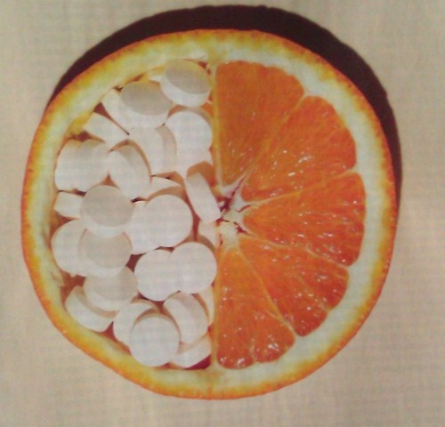

# Apie populiariuosius vaistukus

Esu gan imlus ligoms, dėlto rudeniui jau baksnojantis į langą – visai nesidžiaugiu ir norisi priklijuoti kalendoriaus lapelius atgal ir vėl atsidurti kažkur vidurvasaryje. Sirgti, žinoma, nepatinka niekam, tačiau galima pastebėti, kad nemažai žmonių apie vaistus nusimano prastokai, o dėl žinių trūkumo kyla įvairūs liaudį klaidinantys mitai, kurie kartais prasilenkia su tikrove. Netikėtai G+ radau auksinį straipsniuką, atmintinę, kurią verta turėti po ranka, bo ten labai paprastai ir aiškiai supažindinama su populiariaisiais vaistais nuo skausmo. Tad jaučiu pareigą dalintis šiomis žiniomis, dėl kurių galbūt šiek tiek pasikeis ir jūsų pačių gydymosi metodai :j

Kai pacientai kreipiasi į šeimos gydytoją dažniausiai skausmą būna malšinę vienu iš dviejų vaistų: paracetamoliu arba ibuprofenu \(dažniausiai kažkodėl perka ibumetiną\).

Kaip šitie vaistai veikia ir kuom jie skiriasi? Pabandysiu paaiškinti kuo paprasčiau.

**Ibuprofenas** yra nesteroidinis vaistas nuo uždegimo – jis sutrikdo organizme vieną į hormoną panašios medžiagos \(prostagalindino\) gamybą – ši medžiaga veikdama smegenyse pakelia kūno „termostato“ rodyklę aukščiau \(kūnas mažiau vėsinasi ir dėl ko kyla temperatūra\), o audiniuose yra reikalingas, kad vystytųsi uždegimas \(dėl uždegimo audiniai patinsta ir taip imuninėms ląstelėms būtų lengviau landžioti tarp ląstelių\), bei dalyvauja skausmo perdavime. Taigi: ibuprofenas mažina kūno temperatūrą, mažina skausmą, ir slopina uždegimą.

**Paracetamolio** veikimas nėra visiškai aiškus. Įtariama, kad jis ne tiek sutrikdo skausmo perdavimą \(kaip kad daro ibuprofenas\), bet smegenyse padidina skausmo slenkstį – reikia didesnio skausmo, kad jis būtų jaučiamas. Taigi – paracetamolis mažina kūno temperatūrą ir panaikina silpną skausmą, bet neslopina uždegimo \(tik per placebo ir antrines reakcijas – kai mažiau skauda, tai viskas atrodo geriau :j \).

**Aspirinas** yra acetilsalicilo rūgštis, kurią organizmas metabolizuoja į salicilio rūgštį. Šios rūgšties ir taip natūraliai susidaro organizme, jos taip pat yra ir maiste \(įvairūs augalai, kurių arbatos geriamos peršalus, dažniausiai turi santykinai daug šių ir panašių medžiagų\). Aspirinas irgi yra priskiriamas nesteroidiniams vaistams nuo uždegimo, bet veikia šiek tiek kitaip, nei jau minėtas ibumetinas – taikosi į kitą fermentą. Be skausmo, temperatūros ir uždegimo mažinimo jis taip pat mažina ir krešėjimą, todėl kartais naudojamas kaip nebrangus ir gerai toleruojamas vaistas. Taip pat yra įvairių tyrimų apie tai, jog galbūt aspirinas sumažina kai kurių vėžių riziką, tačiau vieni tyrimai teigia vienaip, kiti kitaip. Iš viso tai aspirinas yra vienas labiausiai tyrinėjamų vaisų ir vis ieškoma kur dar būtų galima jį panaudoti.

Tai kame skirtumas?  
1\) Paracetamolis netinka slopinti uždegimui. Jei kažkas paraudę/patinę ir skauda geriau rinktis ibuprofeną. Jei skauda galvą – geriau paracetamolį.

2\) Didelėmis dozėmis paracetamolis yra kenskmingas kepenims ir kuo žmogaus kepenys yra labiau pažeistos, tuo ta „didelė“ dozė yra mažesnė, kartais net mažesnė už tą, kurią reikėtų išgerti skausmui slopinti. Todėl, jei žinote, kad turite „silpnas“ kepenis ar piknaudžiaujate alkoholiu geriau paracetamolio negerti ir neduoti žmonėms, dėl kurių kepenų sveikatos kyla… abejonių. Taip pat ilgalaikis paracetamolio vartojimas padidina kai kurių inkstų vėžių riziką 0,5 karto. Jei giminėje buvo žmonių su tokiomis ligomis – tuomet stenkitęs ilgą laiką nevartoti šio vaisto.

3\) Ibuprofenas slopina prostaglandinų sitezę visame organizme, o skrandyje jie yra reikalingi apsaugoti skrandžio sienelę nuo tos piktos rūgšties, kuri padeda virškinti maistą. Jei žmogus vartoja ibuprofeną pripuolamai, tai nieko baisaus, bet jeigu vartoja nuolatos \(pvz.: dėl lėtinės sąnarių ligos\),  jis nejaučia skausmo ir skrandyje, kuris kyla esant opai ir dėl to ne tik išsigraužia naują opą, bet dar ir nieko nedaro, jei ji nerandama atsitiktinio patikrinimo metu \(arba komplikuojasi kraujavimu ar prakiurimu\).

4\) Paracetamolis skrandžiui kenkia daug mažiau nei ibumetinas ar aspirinas.

4\) Ibuprofenas veikia ilgiau už paracetamolį – todėl jį gerti reikia rečiau.

5\) Aspirinas turi nemažai šalutinių poveikių, bet sveikiems žmonėms jie paprastai būna menki ir rūpesčių nesudaro ar net nėra pastebimi. Didžiausias šalutinis poveikis – tai vėlgi tos pačios virškinamojo trakto opos, kurios yra pavojingesnės, nei vartojant kitus nesteroidinius vaistus nuo uždegimo: šiuo atveju ne tik, kad yra opa ir jos neskauda, bet ji dar ir blogai ar iš viso nekreša dėl aspirino vartojimo! Išsivysto lėtinis kraujavimas, kuris dažnai būna anemijos priežastimi ir gali būti mirtinas. Turbūs viena iš baisiausių aspirino vartojimo komplikacijų yra Rėjaus sindromas. Šio sindromo tikroji priežastis yra nežinoma, bet yra pastebėta, kad kai kuriems vaikams jis išsivysto po aspirino vartojimo esant virusinei infekcijai \(itin bjauru tai, kad didžioji dalis virusinių infekcijų tai realiai jokiais simptomais nepasireiškia\).

Kadangi daug žmonių aspiriną geria kaip kraują skystinantį vaistą \(jo niekada taip negalima gerti savarankiškai, būtinas gydytojo nurodymas\), jo galima nusipirkti dideliais kiekiais. Kartais filmų prisižiūrėję paaugliai nusprendžia nusižudyti „tabletėmis“, nes filmuose tai kažkodėl rodoma kaip neskausminga ir rami mirtis \(patikėkite, taip nėra\), todėl nusprendžia išgerti visas aspirino tabletes kiek randa – dalis tikrai dėl to miršta \(apie 2%\), dėl plaučių edemos \(patinimo\), kai jie užspaudžia širdį, bet iki tol ir vemia ir viduriuoja, traukuliai, haliucinacijos ir panš… Lėtinis apsinuodyjimas dažniausiai būna vaikams, kurių tėveliai truputį „persistengia“ su gydymu \(pvz.: kas vakarą vaikui duoda gluosnio žievės nuoviro ir panš\), ir jo mirtingumas jau siekia 20-30%, dažniausiai mirštama dėl smegenų edemos ar inkstų pakenkimo.

6\) Asmenys alergiški aspirinui yra alergiški ir ibuprofenui. Tiek paracetamolis, tiek ibuprofenas yra siejami su galima astmos išsivytymo rizika, bet panašu, kad jau sergantiems ibuprofenas gali išprovokuoti priepuolį. Gali nereiškia, kad turi.

Trumpai, kad būtų lengva atsiminti:

-Galvos skausmui slopinti: tinka visi, bet geriausia – paracetamolis.  
-Migreniniam galvos skausmui: tinka ibuprofenas.  
-Jei tinsta ir raudona: ibuprofenas.  
-Jei nesveikos kepenys ar išgeriat: ibuprofenas.  
-Jei tik karščiavimas: tinka visi, bet geriausia – paracetamolis.  
-Mažina uždegimą: ibuprofenas ir aspirinas.  
-Po fizinės traumos \(pvz.: skauda mėlynę ar susimušėte sąnarį\): tinka ibumetinas.  
-Mėnesinių skausmui: ibuprofenas, mažiau tinka aspirinas, mažiausiai tinka paracetamolis.  
-Peršalimo simptomai: paracetamolis.

2 ar daugiau nesteroidinių vaistų nuo uždegimo vienu metu vartoti negalima, bet galima vartoti drauge su paracetamoliu. Prieš vartojant bet kokį vaistą būtina perskaityti informacinį lapelį ir pasitarti su gydytoju ar vaistininku. Tie lapeliai ten ne šiaip sau idėti.

Kadangi artėja peršalimų sezonas, tai labai vilioja milteliai nuo peršalimo. Jie yra geras dalykas \(nors veikia tik simptomiškai ir realiai negydo \(jei tik galite, geriau „išsigulėkite“ su paprasčiausia arbata ir katinu ant kelių\)\), bet dažnai yra ir ganėtinai brangūs ir jų sudedamąsias dalis galima susipirkti atskirai. Pvz.: po ranka turiu vieną populiaraus vaisto nuo peršalimo miltelių dėžutę, kurioje yra 10 pakelių ir ji kainuoja ~25Lt, bet realiai kiekviename maišelyje yra po 1,5 tab \(500mg\) paracetamolio tabletės, 1 tab \(60mg\) vitamino C, ir 1 tab \(10 mg\) fenilefrino hidrochlorido – tai kraujo spaudimą veikiantis vaistas, kurį geria hipotonikai \(turinys per mažą spaudimą\). Vietiškai jis naudojamas kai kurių akių ligų gydyme ir kaip purškalas į nosį, nes sutraukia kraujagysles ir dėl to mažėja paburkimas \(sloga\). Čia jis yra geriamos formos, žinoma, nepavojingas sveikiems žmonėms.

Dažniausiai visi „vaistai nuo peršalimo“ turi šiuos 3 pagrindinius ingredientus: vienas mažina temp., kitas padeda organizmui kovoti su virusais \(60mg vitamino C yra viename-dvejuose apelsinuose/viename kivije/2 keptose paprikose/pusėje kantalupės meliono ir panš, \), o trečiasis sukelia energijos antplūdžio įspūdį \(šiuo atveju per org. kraujagyslių sutraukimą, dažniausiai tam naudojamas kofeinas, kurio jau ir taip kiša kur netingi \_\). Visa kita – tai kvapikliai, dažikliai ir „skonikliai“. Pliusas, kad viskas viename pakelyje ir pačiam nereikia tablečių trinti ;\) Rašau, nes kai kurie žmonės labai sveiksta kai geria DAUG vaistų ir jei jūsų namuose kaip tik toks vienas yra, tai netingėkite pasiklausti vaistininko, kas ten realiai į tokius miltukus ir panašiai įeina – jūsų dėmesys trinant paracetamolio tabletę tarp dviejų šaukštelių ir dar maišant su vitamino C miltukais gali suveikti kaip labai didelis placebo. O kitiems kaip tik – gal tai atmuš norą gerti visokius -oldrexus ir -flu po kiekvieno nusičiaudėjimo :j

Šis straipsnis nėra prof. mediko nuomonė, tad vadovaukitės sveiku protu ir nepabijokite pasikonsultuoti pas savo gydytoją.

Autorė: [enorca](http://enorca.blogspot.com/)

