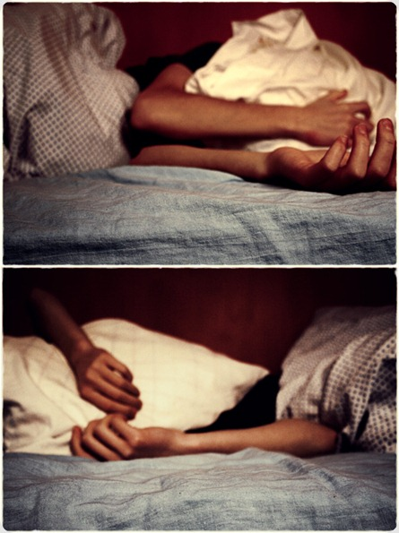

# Bandant užmigti…

_Nes naktimis geriau rašosi…_

Dar ne taip senai rutuliojau galvoje mintį, kad kiekvieną kartą, kai sėdžiu savo naktinėje pamainoje, galėčiau kažką brūkštelti. Vis vien gi naktis ilga, turėčiau daugiau kuom užsiimti, nors ir taip stebuklingai dingsta laikas internetuose. Bet, kad kai išsikeli sau kažkokius pasižadėjimus, tai automatiškai perauga į prievolę ir darai tai ne dėlto, kad norisi, o dėlto, kad reikia. O tai niekada neatneša nieko gero.

Vat, kad ir dabar, užuot miegojus, man būtinai prireikė atsikratyti galvoje besisukančių minčių. You know, tai tampa tarsi kažkokia priklausomybės forma. Anksčiau mokėdavau po šiokios tokios kovos, nustumti viską į šalį ir užmigti, tai dabar, mintys tiek kamuoja, kad tenka vidurį nakties atsikelti, užrašyti jas ir tik tada gali eiti ramiai miegoti. To neatlikus prasivartaliosi su mintimis pusė nakties ir tada galbūt užmigsi.

Nesiskųsčiau, jei visas būtų tada, kai galima. Na pvz būna ne itin svarbios paskaitos ir vietoj ėjimo į jas gali atsigriebti ir pramiegoti visas tas valandas, kurių nepavyko. Būtų tikrai gerai. Bet kaip taisyklė, tai labiausiai minčių generatorius sukasi tada, kai kitą dieną negali ilgai užsibūti lovoje. Kai jau pradraugavęs su savo mintimis valandėlių porą, pajauti, kad visgi ateina miegas po truputį ir prisimeni nusistatyti žadintuvą, o jis tau parašo, kad skambės už nepilnai 4 valandų, va tai labiausiai demotivuoja. Kodėl būtent dabar, kodėl būtent šiąnakt…

Nors dar ir vidurinės laikais būdavau gan miegalius ir visada laukdavau savaitgalio, kad galėčiau lovoj pasivartalioti iki pietų, tačiau dabar, kai jaučiu nuolatinį miego trūkumą, vertinu jį daug labiau. Tai tapo itin didele vertybe. Ir visgi taip dažnai kažkokie mažmožiai sutrukdo ja mėgautis. Parvažiuoji iš darbo svajodamas, kaip krisi į lovą ir štai su kambariokais įsiveli į kokią diskusiją trunkančią valandėlę kitą. Arba pas jų ateina svečiai. Arba pats būni prigėręs energetinio gėrimo, kuris netikėtai visgi suveikė ir sėdi prie pc’iuko visiškai nenorėdamas miego. Arba galų gale kažkas visgi pasiūlo kažką nuveikti kartu. Kadangi tai nėra toks dažnas variantas – tikrai nepatogu atsisakyti. Ir taip visada. Kiekvieną miegojimui skirtą dieną/vakarą susiglemžia kažkas. Ir mintyse tos ištisos miegojimo valandos atrodo vis toliau ir toliau… Vis mažiau pasiekiamos. Išvis atrodo, kad vieną dieną krisi miegot ir pramiegosi ištisas kelias dienas. Ir iš tiesų jau yra taip buvę ne vieną kartą. Pralakstai su savo reikalais dvi dienas be miego ir štai krenti į lovą diena ar vakaras bebūtų ir pramiegi lygiai parą. Nebūčiau studentas jai nuolatos netruktų miego ir maisto. Na ir dar sekso nepamirštam. Jaunystės dienos, skant. Manau vaikinai, gyvenantys barake, mane pilnai suprast :j

Šiaip pastebėjimas į tą pačią temą: žmonės nekalba apie dalykus, kai jų yra pakankamai. Gyvenimiškas pavyzdys: kas gi kalbės apie tualetinį popierių, kai jo yra užtektinai. Kambariokai tariasi kurio eilė pirkti tik tada, kai jis baigėsi arba eina į pabaigą. Tai lygiai taip pat vaikinai, kurie turi reguliarų lytinį gyvenimą, nekalba ir nelaido taip būdingų juokelių apie antrą galą. Jiems to nereikia, nes patenkina savo poreikius ir niekas jų nekamuoja. Kalba tie, kurie jaučia trūkumą. Kaip kad alkani kalba apie maistą, ištroškę apie vandenį, persidirbę apie atostogas. Taip lygiai ir mano atveju, nerašyčiau gi apie miegą, jei miegočiau pakankamai :j Just keep it in mind…

