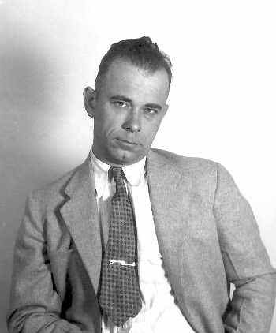

# Visų laikų ieškomiausias bankų plėšikas

Gal nevisi žinote, bet šiais metais FTB (Federalinių Tyrimų Biuras) švenčia 100 metų jubiliejų. Tai viena iš žinomiausių organizacijų, kuri veikia jau ir ne vien JAV teritorijoje, bei 1996 metais buvo svarstoma apie FTB biuro įkurimą Lietuvoje.

Šio gražaus jubiliejaus proga, sumaniau parašyti straipsniuką apie vieną didžiausių FTB priešų, Valstybės Priešu Nr.

John Herbert Dillinger:

Šis žmogus išgarsėjo 1933 metais, kai buvo sučiuptas už kelių bankų apiplėšimą, o vėliau keturių savo gaujos išlaisvintas. FTB gavo užduotį išsiaiškinti kur slepiasi bėgliai, o Dillinger\`is su bendrais toliau plėšė bankus ir nušaudavo visus jį persiokiojusius policininkus. 1934 metais plėšiką vėl pavyko pagauti, tačiau laukdamas tesimo, jis sugebėjo išsilaisvinti, pagrąsinęs kalėjimo prižiūrėtojui netikru mediniu revolveriu. Nusikaltėlis pagrobė du automatus ir pabėgo šerifo mašina. Kadangi jis kirto valstijos sieną vogtu automobiliu, ši byla atiteko FTB valion.

Dillingerio bylą FTB vadas Hooveris paskyrė dviem ištikimiausiem savo vyrams: Cowley ir Purvisui. Jie pratėjo tyrimą, kurio metu pavyko surasti Dillingerį, kuris tuo metu planavo traukinio su amunicija vagystę. FTB paspendė spąstus, bet Dillingeris sugebėjo pabėgti su nemažu kiekiu amunicijos. Ši pasala buvo labai nesėkminga FTB – buvo nušauta 13 tikrai gerų agentų. Ant Dillingerio bylos buvo užrašyta: Valstybės priešas Nr. 1. Nuo to laiko atsirado ieškomiausių Amerikoje žmonių sąrašas, kuriame nusikaltėliai surašyti nesunumeruotu sąrašu (kad niekam nekiltų pagunda tapti pirmu numeriu).

Pasalos metu įkliuvo vienas iš Dillingerio gaujos narių. Surengęs slaptą išlaisvinimo operaciją – Dillingeris sugebėjo išlaisvinti savo draugą. Prasidėjo visa eilė bankų plėšimų visoje šalyje – Dillingeris tūrėjo nemažą nuvoktų ginklų arsenalą. Dillingerio nuotraukos paplito visoje šalyje. Jis tapo legenda. Kadangi žmonės pradėjo atpažinti šį nusikaltėlį gatvėje, jis sugalvojo planą. Pasisamdęs odos daktarą, pasislėpė trobelėje kalnuose ir atsiliko veido pakeitimo operaciją. Išsigydęs visas žaisdas jis atrodė, kaip visai kitas žmogus. Jį sunkiai atpažino, net jo gaujos nariai. Ir bankų plėšimai vėl prasidėjo. 1934 metų liepos 21 dieną Cowley ir Purvisas aptiko Dillingerį.

Viena viešnamio prostitutė, kuri glaudžiai bendravo su Dillingeriu pranešė FTB, kad Dillingeris bus kino teatre kartu su ja. Buvo sukurtas planas, kad mergina numes skarelę ir sieks jos pasiimti, tokiu būdu kiek atsilikdama nuo Dillingerio. Tada FTB ir galės jį nušauti. Specialieji agentai apsuko pastatą ir kai Dillingeris išėjo iš salės kiek sutriko, su mergina buvo kažkoks vyriškis visai nepanašus į ieškomą nusikaltėlį. Tačiau mergina numetė skarelę, iš visų pusių išlindo agentai ir įsakė Dillingeriui pasiduoti. Tačiau blogiukas pabandė išsitraukti pistoletą. Pabandė, bet nebespėjo – buvo nukautas trimis šūviais ir iškart mirė. Taip FTB įveikė didįjį gangsterį už kurį buvo žadama 10 000 000 JAV dolerių.
