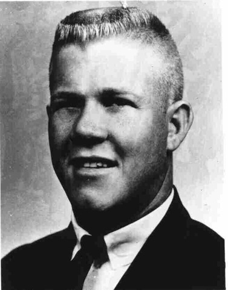
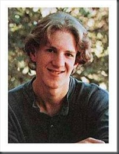
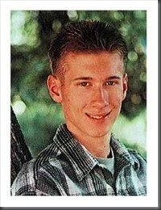
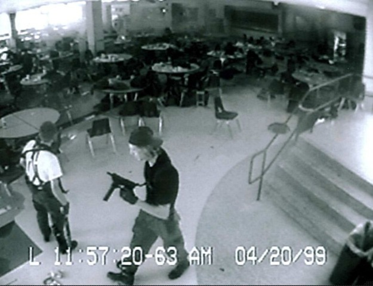
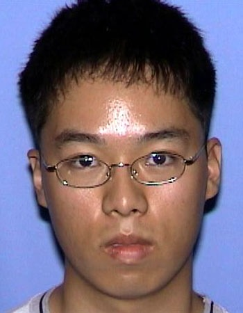

# Žudynės mokyklų koridoriuose

Vieną kartą belaukdamas traukinio stotyje aptikau krūvelę nemokamai platinamo žurnaliuko. Ten perskaičiau išties įdomu straipsniuką.

Kasmet pasaulį sukrečia vis nauji pranešimai iš JAV mokyklų ir universitetų. Pranešimai apie mokyklose aidančius šūvius, apie vis naujas aukas ir nepaaiškinamus jų žudikų motyvus. Šie metai ne išimtis – krūvinų aukų jau ne viena. O baisiausia, kad Amerikoje kilusi tragedijų banga pamažu pradeda ristis per visą pasaulį. Taigi apžvelkime garsiausiai nuskambėjusias žudynių mokyklose istorijas.

#### Teksaso universiteto žudynės

Vienų žiauriausių žudynių JAV mokyklose autorius – Charles Whitmanas, 1966-ųjų metų rugpjūčio 1 dieną Teksaso universitete, Austine, studentas nužudė 14 žmonių, dar 31 sunkiai sužeidė. Prieš žudynes universitete jis dar nužudė savo žmoną ir motiną. Netrukus žuvo pats – nuo policijos kulkų.

Charles Whitmanas buvo savo tėvų pasididžiavimas. Nuo ankstyvos vaikystės buvo puikus beisbolo žaidėjas, vietinėje bažnyčioje su dviem savo broliais nuolat patarnavo kunigams per mišias, tapo jauniausiu ir sumaniausiu skautu, o vos šešerių atlikęs IQ testą tėvus pradžiugino aukštu rezulatu – 138.

Vėliau viskas pradėjo keistis. Prieš tėvų valią 18 metų įstojo į karinį laivyną, vėliau buvo priimtas į Teksaso universitetą studijuoti mechaninės inžinerijos. Studijų metais vaikinas domėjosi karatė, nardymu ir medžiokle. Dėl pastarojo hobio kartą papuolė į bėdą: nušovęs elnią atsitempė jį į savo bendrabučio kambarį ir ten vonioje jį išskrodė. Už šias “studentiškas išdaigas” Charles buvo pašalintas iš universiteto, todėl tęsė savo tarnybą laivyne, netrukus vedė ir… vėl prisidirbo. Tarnybos metu buvo nuteistas už nelegalius lošimus ir savavališką ginklo laikymą. Vis dėlto, tarnybą jis baigė garbingai ir vėl grįžo į universitetą. Paskutiniais savo gyvenimo metais vaikinas pradėjo skūstis slegiančia depresija, netgi lankėsi pas psichologus, kurie šiam išrašė stiprių narkotinių vaistų. Tačiau slėgė jį ir kitos problemos. Po mirties atlikus Charles kūno skrodimą jo galvoje rastas smegenų auglys, manoma, kad tai viena iš priežasčių kodėl jis ryžosi beprotiškiems veiksmams, sukrėtusiems visą šalį. Pirmiausia jis nužudė savo mamą. Priešmirtiniame laiške jis aiškino, kad nežino kodėl taip pasielgė, kad atsiprašo už tai mamos, bet tikisi, kad dabar i laimingesniame pasaulyje. Taip pat šiame laiške aiškino, kodėl nužudė savo miegančią žmoną. tačiau kodėl reikėjo žudyti visai niekuo dėtus žmones iš universiteto jis neužsiminė nė žodžiu.

Visus savo užgyventus turtus jis paprašė paaukoti psichinių ligų fondams, esą gal kada nors kam nors pavyks ištirti tokių kaip ši tragedijų priežastis ir užkirsti joms kelią.

#### Košmaras Kolumbaino mokykloje

Žudynės Kolumbaino mokykloje viena dažniausiai minimų tregedijų įvykusių JAV mokyklose. Būtent šios, 1999 metais įvykusios žudynės, manoma, įkvėpė daugelį paskutiniais metais ginklą prieš savo bendraklasius, bendrakursius ar dėstytojus pakėlusių žudikų, juolab, kad apie šį įvykį vėliau buvo sukurtas ne vienas filmas, o ieškodami šios tragedijos priežasčių, daugelis romantizavo jos kaltininkus.

1999 metų balandžio 20 dieną du šios mokyklos moksleiviai: 18 metų Ericas Harris ir 17-os Dylanas Kleboldas nužudė 12 moksleivių ir 1 mokytoją, dar daugiau jų sužeidė ir galop nusižudė patys.

Tai nebuvo spontaniškos, neplanuotos žudynės. Vaikinai visą jų eigą buvo gerai apgalvoję. Iš pradžių jie pasirūpino gausiu ginklų arsenalu. Lemiamą dieną į mokyklą išvyko vienu metu, tačiau skirtingais automobiliais. Vaikinų būta itin šaltakraujiškų: jie iš ankto pasirūpino net tuo, kaip nukreipti specialiųjų tarnybų dėmesį nuo netrukus įvyksiančių įvykių. Kiek toliau nuo mokyklos jie paslėpė bombą, kurios sprogimas turėjo atitraukti visų dėmesį, tačiau šis planas išdegė nevisai taip, kaip tikėtasi: bomba sprogo, tačiau ne visu galingumu, tad didelės žalos nepridarė ir ugnis tuojau pat buvo užgesinta.

Tuo tarpuvaikinai į mokyklos valgyklą įnešė du krepšius – juose taip pat buvo bombos, nustatytos, kad sprogtų vienu metu. Sprogimo metu būtų žuvę daugiau kaip 600 mokinių. Viskas buvo suplanuota nepriekaištingai. Į valgyklą jie įžengė būtent tą akimirką, kai mokyklos sargas keitė vaizdo kamerų kasetes. Kai kasetė buvo pakeista, vaikinų valgykloje jau nebuvo nė kvapo – liko tik jų palikti krepšiai. Kodėl jie norėjo likti nepastebėti? Paaiškėjo, kad po sprogimo jie ketino vaidinti išgyvenusias aukas. Taigi, pirmasis jų planas buvo nužudyti kuo daugiau žmonių, o patiems likti gyviems.

Palikę krepšius valgykloje jie grįžo į savo automobilius laukti sprogimo. Automobilių stovėjimo aikštelėje Ericas netikėtai sutiko seną savo priešą Brooksą Browną, su kuriuo dažnai ginčydavosi. Šis pastebėjęs, kad Ericas turi sportinį krepšį (jame buvo ginklai) nustebo, nes tąryt vykusioje kūno kultūros pamokoje Ericas nedalyvavo. “Brooksai, šią akimirką tu man patinki”, – pasakė jam Ericas, – “Dink iš čia. Eik namo.” Vėliau Brooksas bus įtarinėjamas žinojęs apie tai, kas netrukus nutiks mokykloje, nes jis nuolankiai pakluso Erico patarimui ir pasišalino iš mokyklos teritorijos, prieš tai įspėjęs atokiau nuo jos laikytis kelis savo draugus. Šis vaikinas, beje bivo geras Dylano vaikystės draugas.

Tačiau bombos nesprogo, tad vaikinai ėmėsi plano B. Susitikę apsiginklavo ir patraukė tos pačios valgyklos link. Netrukus prasidėjusios žudynės priminė kompiuterinį žaidimą. Vaikinai su šautuvais rankose vaikėsi moksleivius ir be jokio gailesčio juo šaidė: į galvas, nugaras, bet kur. Su keletu aukų jie net diskutavo, kodėl netūrėtų jų žudyti. Vieniems pasisekė – kiti neįtikino. Vienos sužeistos merginos Ericas paaklausė, ar ji tikinti Dievu, išgirdęs teigiamą atsakymą – paleido šūvį į galvą.

Visa tai truko ilgiau nei valandą. Viena mokytoja vėliau pasakojo, kad maždaug po pusvalandžio šaudynių ji išgirdo žudikus kalbantis, esą “nebėra jokio jaudulio šaudyti”. Dylanas pasakė, kad “gal jei pradėtume juos pjaustyti, būtų linksmiau?”. Tačiau kulkų buvo likę per daug ir jie toliau tęsė kruviną žygį per mokyklą šaudydami visus sutiktus kelyje. Daug moksleivių gulėdami draugų kraujo klane išsigelbėjo tik apsimetę, kad yra mirę. Galų gale, pavargę ir nebejaučiantys azarto lakstyti po mokyklą, vaikinai paprasčiausiai nusišovė

Pasakojama, kad abu vaikinai mokykloje nepritapdavo prie bendraamžių. Daug draugų netūrėjo, patirdavo patyčių. Dylanas dažnai buvęs prislėgtas, tūrėjo savižudiškų minčių. O štai Erico charakteristikoje pažymima, kad jis buvo aštraus proto cinikas, nekentė prisitaikėlių ir kvailių. “Jūs silpnapročiai, perskaitykite bent porą knygų – praplėsit savo žodyną”, – rašydavo dienoraštyje jis. Abu busimieji žudikai jau prieš šį įvykį buvo pakliuvę į policijos akiratį – dėl vagysčių ir pan. Vis dėlto, niekas negalėjo suprasti, kodėl du jauni žmonės ryžosi tokiai šaltakraujiškai beprotybei. Po šių įvykių JAV kilo diskusijos dėl ginklo laikymo ir kompiuterinių žaidimų įtakos paaugliams (abu jie buvo ištikimi “Doom” fanai), tačiau niekas nepasikeitė iki šiol.

#### Didžiosios žudynės

Didžiausios kada nors įvykusios žudynės JAV mokslo istaigose įvyko Vidžinijos technologijos universitete. Būtent šios žudynės buvo įkvėptos jau minėtų Kolumbaino mokyklos įvykių. Tik šįkart savo įsiūtį leijo ne du, o vienas žmogžudys. Pavydo apimtas, smurto manijos kamuojamas ir užguitas studentas, prieš ištaškydamas smegenis sau, nušovė 32 žmones, kurių tarpe buvo ir studentų, ir dėstytojų. Dar daugiau jų sužeidė.

O viskas prasidėjo ankstų pirmadienio rytą, kai korėjietis studentas Cho Seung-hui Virdžinijos technologijos universiteto studentų bendrabutyje nušovė du studentus. Vėliau paaiškėjo, kad viena šių aukų – mergina. Cho buvo įsimilėjęs, tačiau ji tuo pačiu neatsakė. Išvydęs ją su tariamu jos meilužiu korėjietis įsiuto – žudynės, jo manymu, buvo geriausiais kerštas.

Po pirmųjų šūvių į universiteto teritoriją atvykusi policija pamanė, kad tai, kas ką tik įvyko tebuvo pavienis konfliktas, o galimas žudikas greičiausiai jau seniai pasprukęs iš nusikaltimo vietos. Universiteto administracija studentams išsiuntinėjo perspėjantį elektroninio pašto laišką, kuriame paragino studentus būti atsargiais ir pastebėjus ką įtartino apie tai tuoj pat pranešti. Vėliau daugelis studentų piktinosi, kad to buvę maža – juk daug kas to laiško tiesiog negavo – t.y. tuo metu sedėjo paskaitose arba, nenujausdami nelaimės, rinkosi auditorijose. Dalis pavyzdingai į paskaitas atėjusių studentų iš auditorijos patys jau nebeišėjo, nes po poros valandų pertraukos universiteto miestelį vėl sukrėtėmžudynės. Beje, per šią tarp žudynių įvykusią pertrauką, Cho Seung-hui išsiuntė siuntinį JAV televizijai NBC. Šiame siuntinyje buvo 1800 žodžių pikta kalba, kurioje žudikas smerkia Ameriką, jos kultūrą ir žmones, 43 muotraukos, iš kurių 11-oje jis užfiksuotas pozuojantis su ginklu, bei 28 vaizdo klipai.

Pasigirdus naujiems šūviams, antrąkart į universitetą atvykusi policija rado iš vidaus užrakintas duris (Cho veikė labiau šaltakraujiškai ir apgalvotai, kad aukos nepabėgtų jis grandinėmis užrakino duris!), jas teko laužti jėga. Pasiekus antrą aukštą, iš kurio sklido šūvių garsai, šaudymas liovėsi. Cho nusižudė.

“Jūsų dėka aš mirštu kaip Jėzus Kristus, kad įkvėpčiau silpnų ir negalinčių apsiginti žmonių kartas”, – savo priešmirtiniame laiške rašė nuo depresijos gydęsis vaikinas. Jis visada, net patalpų viduje dėdavosi akinius nuo saulės, kalbėdavosi tik pašnibždomis, buvo užsisklendęs ir vienišas. Anglų literatūrą studijavęs ir apie skerdynes rašęs Cho savo kruvinas literatūrines fantazijas įgyvendino realybėje.
