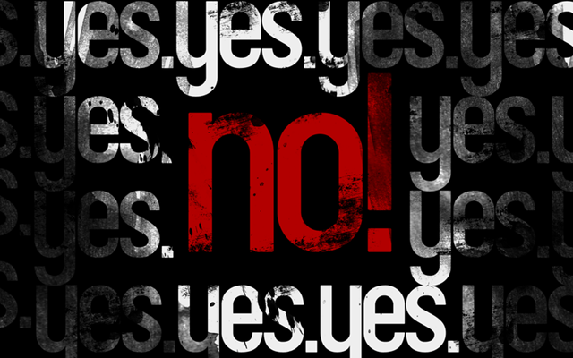

# Kai sakoma “Ne”

“Ne” reiškia ne.  
“Ne dabar” reiškia ne.  
“Aš turiu antra puse” reiškia ne.  
“Gal vėliau/kita karta” reiškia ne.  
“Ačiū, ne” reiškia ne.  
“Tu ne mano skonio” reiškia ne.  
“Atšok/atsiknisk” reiškia ne.  
“Aš norėčiau pabūti viena” reiškia ne.  
“Tu man išties patinki, bet…” reiškia ne.  
“Gal geriau tiesiog pamiegam” reiškia ne.  
“Nesu tikra” reiškia ne.  
Tylėjimas reiškia ne.  
“———” reiškia ne.  
Prievarta yra “ne” nesupratimas.

Žodelis “ne” yra labai galingas žodis sugebantis atstumti ne tik, kad kitus, galbūt net labai artimus žmones, bet ir jums atsivėrusias galimybes.  
Pamenu buvau kuriam laikui patapęs “Ne” žmogumi. Praktiškai visom atsivėrusiom galimybėm sakydavau “Ne”. Po truputis mano gyvenimas tapo vis nuobodesnis, pasiūlymų nuveikti ką nors išties įdomaus ar šiaip “crazy” vis mažėjo ir mažėjo, atsirado monotoniją, kurios aš tiesiog negaliu pernešti, ji mane ima žudyti.

Kaip visada kartojau ir dar ko gero ilgai kartosiu – viskas slypi požiūryje: pakeisk savo požiūrį į tam tikrus dalykus ir gyvenimas atsivers visai kitu kampu. Pažiūrėjęs filmą “Yes Man” su Jim’u, supratau, kad aš pasidariau per daug didelis nuoboda, visom savo gyvenimo galimybėm sakantis “Ne”. Tas filmas labai padėjo pakeisti savo požiūrį ir dabar dažniausiai aš atsakau “O kodėl gi ne. Davai padarom”. Žinoma, viskas yra proto ribose, nesakau visiškai viskam “taip”, visgi turiu tam tikrus principus, kurie man yra begalo svarbūs, taipogi mūsų norai nevisada sutinka su mūsų galimybėmis…

Taigi, apibendrinus šito įrašo esmė – kitą kartą prieš sakydami “Ne” pirmiausia kiek giliau pagalvokite. Pirmas įspūdis dažnai būna klaidingas, o ir mažai dalykų yra svarbesni, už smagiai, laimingai, bei turiningai praleistą laiką…

