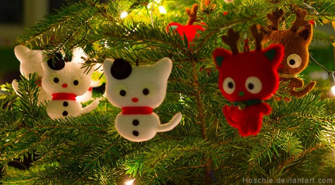

# Kalėdų lūkesčiai

Pamenat galbūt paveikslėlį, apibūdinantį požiūrio į Kalėdas etapus? Pirmiausia tiki Kalėdų seneliu, vėliau netiki Kalėdų seneliu, dar vėliau pats esi Kalėdų senelis, o galiausiai imi atrodyti kaip tikras Kalėdų senelis :j

Taip, dar kol kas būti pačiam Kalėdų seneliu neteko, tačiau taipogi ko gero išaugau iš to anti-kalėdinio nihilizmo, kai paauglystės metu ant šventės smarkiai stumiama dėl jos komercializacijos, šventumo nebuvimo, bei nupiginimo. Kaip bebūtų, dabar tai tapo ko gero įsimintiausia metų švente, nes tik ji turi tokius ryškius atributus, kaip kad tas žavingas eglutės kvapas kambaryje \(jei jūs statotės tikrą\), jos puošimo ritualas \(namie visada tai būdavo ekskliuzyviai mano pareigos ir galėdavau pasireikšti kiek įmanydamas\), žiupsnelis atsakingumo \(mama duodavo senovinius stiklinius eglutės žaisliukus, kuriuos dar pati kabindavo būdama visai maža\), mandarinai, sniegas ir šaltukas lauke, bei rankas, bei gomurį maloniai šildanti arbata, grįžus iš ten.

O štai, pamenu, kai teko pereiti iš to pirmojo, tikėjimo etapo į antrąjį. Perėjimas buvo skaudus ir gniuždantis vaikiškus įsitikinimus. Galbūt niekada smarkiai ir negalvojau apie tai, kad kažkoks dėdulė iš tikrųjų gali lysti per kaminus ar skrajoti su elniais and so on, tačiau to tikrai nesiedavau su tikrąja tų dovanėlių atsiradimo priežastimi. Galbūt, tiesiog, net negalvodavau kas ir kaip, o eglutė ir po ja atsirandančios dovanos būdavo kažkas tokio magiško, paslaptingo. Pamenu net tai, kaip miegojau tame pačiame kambaryje, kur ir eglutė ir kas 10 minučių žvilgtelėdavau ar jau… Ir ryte visada rasdavau ką nors vaikiškai nuostabaus :j  
Tačiau vat vienais metais, net nepamenu keleri tada man buvo, mama buvo išvykusi į užsienį ir mane paliko kartu su seserimi. O šioji užuot pasirūpinusi visais reikaliukais dar iš vakaro, kai aš jau nuėjau miegoti, nutarė tai padaryti anksti ryte. Čia ir buvo jos klaida, nes sesulė tais laikais būdavo tikra miegalė, o aš apimtas euforijos, atsikėliau gal kiek po šeštos valandos ryto. Džiaugsmingai nubėgęs prie eglutės ir nieko neradęs, gavau tarsi smūgį ir apėmė toks liūdesys,  kad apsiverkiau pačiomis gailiausiomis ašaromis ir grįžau atgal į lovą, sesers taip ir nežadinus. Tai buvo vienas iš ryškesnių mano susidūrimų su realybe ir tai labai gniuždė. Buvau ko gero liūdniausias pasaulio vaikas, bandęs išverkti visas savo ašaras į pagalvę. Sesuo atsikėlė tik apie devynias ir ėjo manęs žadinti, kiek nustebusi, kad vis dar neatsikėliau, kad nelaukiu dovanų. O aš visą tą laiką tiesiog pasislėpęs gailėjausi dėl savo sudaužytų vaikystės lūkesčių. Atsikėlęs seseriai neišsidaviau, kad visgi sužinojau didžiąją paslaptį ir vaidinau patenkintą, nors prie eglutės ir slinkau tikrai vėžliškai. Vėliau dovanos mažumėle pradžiugino ir apie visą tai dienos eigoje užsimiršau, nors diena vis vien bėgo labai slogiai ir slunkiškai. Tačiau jau nebebuvau toks pats naiviai pozityviai nusiteikęs vaikis ir šitas tradicijos sudaužymas, kiek paveikia vaikišką protą ir dėlto kiekvienais metais vis labiau ėmė vystytis pyktis šios šventės pusėn, kol būtent paauglystėje tai ir įgavo epogėjų.

Taip, galbūt šiemetinės Kalėdos man taipogi ne pačios šventiškiausios ir apsiriboja tik vainiku ant durų ir keliais skanumynais, kuriais nusprendžiau save pats palepinti, ir kaip ir praeitais metais šiomis dienomis tenka sėdėti darbe,  tačiau kadangi bendrabučio chebrytė išsivažinėjusi ir kompanijos paprasčiausiai nėra ir šventės vis vien būtų leidžiamos būnant vienam, tai didelio liūdesio tai ir nekelia. Čia galbūt pasidarbuoja mano intravertiškoji pusė ir galiu kuo puikiausiai atšvęsti jas ir vienas su karštu vynu ir geru kino filmu, pasislėpus po šiltu pledu. Ir nors Kalėdos, visumoje yra vaikiška šventė, tiesiog dabar pradėjau galvoti, kad visgi tai šventė tiems, kurie tą šventę sugeba savyje atrasti.

_Ir jeigu tavo getas nesišypso per Kalėdas_  
_Tai reiškia pozityvui ten senai nebėra vietos._

Su Šv. Kalėdomis, brangusis skaitytojau!

