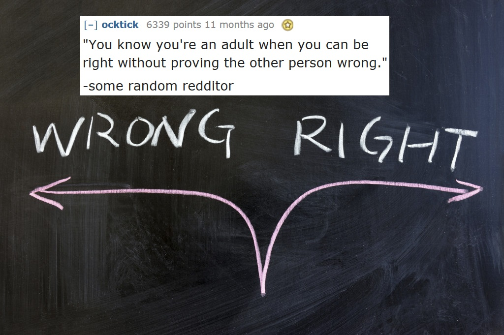

# Kokia eilutė kardinaliai pakeitė jūsų mąstyseną?

* Buvau 34 metų amžiaus, su keliomis profesijomis, trimis jaunais vaikais ir bebaigiąs skyrybų procesą, kai aptarinėjau savo ateitį su geriausiu draugu. Draugas patarė grįžti į mokslus ir galbūt studijuoti mano naujai atrastą aistrą – geologiją. Mano atsakymas buvo: „bet kol pabaigsiu studijuoti, man jau bus 40…“. Mano draugo atsakymas, pakeitęs mano gyvenimą buvo: „Būsi 40-ties bet kuriuo atveju“.
* Kai buvau neapykantos pilna, savęs susinaikinimo keliu pasukusi paauglė, mano krikštatėvis pasakė: „žiūrėk, aš tave myliu ir visada būsiu su tavimi, padėsiu tau susirinkti iš dalių… Bet dėl dievo meilės, ar tų dalių tikrai turi būti tiek daug?“.
* Ko gero jau esate matę ne vieną kartą, tačiau: „meistras yra suklydęs daugiau kartų, nei naujokas apskritai yra bandęs.“ Arba: Sucking at something is the first step to being sorta good at something.
* Argi ne juokinga, kaip diena iš dienos niekas nesikeičia, tačiau kai pasižiūri atgal – pasikeitę viskas.
* Praktikavimuisi talento nereikia. Taipogi: atkaklus darbas nugali talentą, jei šis atkakliai nedirba.
* Kai numirė mano šuo, močiutė tarė: „skausmas yra neišvengiamas, kentėjimas yra pasirinktinis“. Iš pat pradžių galvojau, kad koks tai pesimistinis požiūris. Bet su laiku supratau psichologinį tvirtumą ir optimizmą, kurį neša šis pasakymas.
* Viena mėgstamiausių Louis CK citatų: „kai žmogus tau pasako, kad jį užgavai, tu negali nuspręsti, jog taip nėra“.
* Niekas negalvoja apie save ar savo motyvus, kaip piktavališkus. Kiekvienas yra savo asmeninės istorijos pagrindinis herojus. Labai svarbu, kai kuri istorijai antagonistą.
* Niekada nepriskirk pagiežai to, ką galima paaiškinti paprasčiausiu kvailumu. Kitaip tariant: žmonės nėra nepagarbūs ir pikti, jie yra tiesiog kvaili. Jei žiūri į konfliktinę situaciją iš tos pusės – naudoji daug mažiau savigynos ir esi daug labiau suprantantis juos.
* Dažniausiai viskas yra būtent taip, kaip atrodo. Nereikia daryti per daug komplikuotų teorijų, pakankamai paprastoms situacijoms.
* Mano žmona buvo pati pirmoji, pasakiusi man, jog pykčio laikymas savyje yra tas pats, kas išgerti nuodus ir tikėtis, kad kitas žmogus mirs.
* Tėvai augina gerus vaikus, kai užuot to, jie turėtų auginti gerus žmones. Vaikams reikia būti vaikams: leisti kartas nuo karto susimauti, kartas nuo karto paliūdėti. Jie dar tik ruošiasi gyvenimui ir bus pasiruošę su juo susidurti, kai ateis laikas. Kokia prasmė mokinti vaiką būti vaiku? Jie jau gimė tai natūraliai mokėdami. Vaikus reikia užauginti taip, kad jie būtų pagarbos verti žmonės. Daugybė tėvų užaugina pavyzdingus vaikus, tačiau kai šie vaikai užauga yra visiškai pasimetę ir nežino ką daryti susidūrę su tikromis gyvenimo problemomis.
* Kiekvienas darbas turi aspektų, kurių jį dirbantys žmonės nekenčia. Svarbiausia yra ar tie aspektai, kurie tau labai patinka atsveria tuos, kurių nekenti.
* Aš jaudinausi jog esu blogas tėvas. Tada kažkas tarė man: „blogas tėvas nesijaudintų dėlto ar jis yra blogas tėvas.“ Tai išblaškė mano abejones per milisekundes.
* Kai liejau savo draugui širdį dėlto, jog netikiu, kad žmonės gali mane nuoširdžiai mėgti, nes aš pats nemėgstu savęs, šis pasakė: mes nežiūrim į tave taip, kaip tu žiūri į save. Žinau, kad depresija iškreipia, kaip tu matai pasaulį ir kad esu perdėtai savikritiškas, tačiau išgirdus tai iš žmogaus, kuriam aš tikrai rūpiu, priverta mane tuom patikėti. Tai leido man suprasti, kad kartais tiesiog reikia pakeisti perspektyvą ir pažiūrėti į viską iš šalies.
* „Kai kurios durys uždarytos ne be priežasties“. Visada mėgdavau truputėlis kištis į kitų žmonių gyvenimus, ragindavau išsipasakoti, net įkalbinėdavau, kai šie nenorėdavo ko nors papasakoti. Visad galvodavau, kad jei kalbėsi apie tai, pasijusi geriau. Tiesa yra ta, kad žmonės turi pasirinkti su kuo apie tai nori aptarti, bei pajausti kada jie pasiruošę ir tam tinkamas metas. Ir mažiausiai tokiems žmonėms reikia, kad kažkoks šiknius zystų ir trauktų per prievartą „atsiverti“. Jei žmogus nenori pasidalinti savo problemomis su tavimi, tai daryk prielaidą, jog tam yra rimta priežastis ir tiesiog paleisk. Kai ir jei prireiks – jie tave susiras patys.
* Ne visi draugai turi išlikti amžinais draugais. Kai kurios draugystės būna skirtos tam tikram tavo gyvenimo etapui. And that’s OK.

