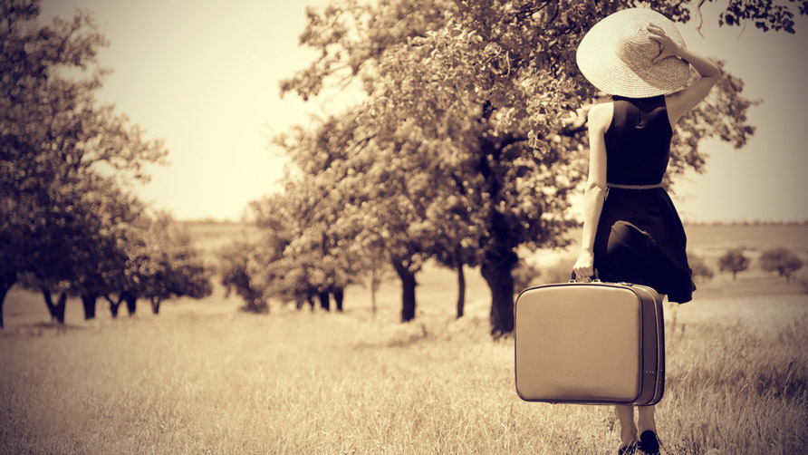

# Nesusitikinėk su mergina, kuri keliauja

Ji yra viena iš tų, kurių plaukai susivėlę ir nublukinti saulės. Jos oda toli gražu nebe tokia šviesi ir švelni kaip kad būdavo seniau. Ji paragavo gyvenimo ir šis pažymėjo ją ryškiomis saulės nudegimo žymėmis, smulkiomis žaizdelėmis, nubrozdinimais ar įkandimais. Bet už kiekvieną savo odos trūkumą ji galėtų papasakoti po įdomią istoriją.

Nesusitikinėk su mergina, kuri daug keliauja – ją sunku patenkinti. Įprastinis pasimatymas mieste – vakarienė restorane ir filmas kino salėje – siurbtų jos energiją, kantrybę ir gyvenimą. Jos siela siekia naujų potyrių, atradimų bei nuotykių. Jos visiškai nesužavėtų tavo naujutėlaitis automobilis, prabangus laikrodis ar paaukštinimas darbe. Ji verčiau užkoptų į uolą ar iššoktų iš lėktuvo, nei klausytųsi tavo pagyrų. Galbūt, ji ir turi savų trūkumų, tačiau ji toli gražu ne iš tų merginų, kurių svarbiausi dienos siekiai – pasidaryti manikiūrą, apsilankyti soliariume ar naršyti „Facebook’e“.

Nesusitikinėk su mergina, kuri keliauja, nes ji įtikinės tave nusipirkti lėktuvo bilietus kiekvieną kartą, kai tik ras viliojantį oro linijų pasiūlymą. Ji niekada neis į prabangius restoranus, klubus ir tikrai niekada nemokės 100 € už „Avicii“ koncertą, nes ji žino, kad vienas toks savaitgalis gali prilygti išvykai į kitą šalį.

Gan tikėtina, kad ji nesugebės dirbti pastovaus darbo. Arba bent jau svajos apie tai, kaip meta savo dabartinį. Ji neketina sunkiai dirbti, nes, kaip sakoma, jei nedirbi tam, kad įgyvendintum savo svajones, dirbi kažkam kitam, jog šie įgyvendintų savąsias. Ji yra freelancer’ė. Dirba pati sau – dizaino, rašymo, fotografijos ar kitose srityse, kuriose reikia kūrybos ir vaizduotės. Negaišink savo ir jos laiko nuobodžiais pasakojimais iš nuobodaus darbo.

Nesusitikinėk su mergina, kuri keliauja. Ji gali būti iššvaisčiusi aukštojoje įgytas žinias, kardinaliai pakeitusi darbo sritį ir sudeginusi bet kokias karjeros galimybes. Tikėtina, kad ji dirbs nardymo instruktore ar jogos mokytoja. Ji nėra tikra, kada gaus savo kitą algą, tačiau ji nedirba it robotas nuo ryto iki vakaro. Ji ima iš gyvenimo viską, ką šis sugeba pasiūlyti, ir provokuoja tave daryti tą patį.

Keliaujanti mergina pasirinkusi neužtikrintą gyvenimo būdą. Ji neturi plano ar nuolatinio adreso. Ji plaukia pasroviui ir seka paskui savo širdį, šoka pagal savo pačios melodiją. Ji nežiūri į laikrodį – jos dienas kontroliuoja saulė ir mėnulis. Kai jūra šaukia, jos gyvenimas sustoja ir ši bent akimirkai užmiršta apie visa kita. Ji tiesmukiškai kalba tik tai, ką galvoja. Ji nesistengs padaryti įspūdžio tavo tėvams ar draugams. Nors moka elgtis santūriai, tačiau tikrai nenutylės, jei kalba pasisuks apie pasaulines problemas, užsienio politiką ar socialinę atsakomybę.

Merginai, kuri daug keliauja, tu nesi reikalingas. Ji moka pati pasistatyti palapinę ar įsukti medvaržtį. Ji puikiai gamina pati ir jai visiškai nereikia, jog mokėtum už jos maistą. Ji per daug nepriklausoma – net jei atsisakysi keliauti kartu su ja, jos tai tikrai nesustabdys. Pasiekusi savo kelionės tikslą, ji net gali pamiršti tau parašyti. Ji per daug užsiėmusi gyvendama dabartimi, pažindama aplinkinį pasaulį, save ir kitus. Jai patinka ilgi pokalbiai su nepažįstamaisiais ir ji sutiks daugybę, labai skirtingų, tačiau įdomių žmonių iš viso pasaulio, su kuriais sies tokios pačios aistros ir svajonės. Vos per porą valandų ji gali užmegzti gan svarbias draugystes, jai reiškiančias daugiau nei mintys apie tave.

Taigi niekada nesusitikinėk su mergina, kuri keliauja, nebent tu gali išlaikyti jos tempą. Ir jei netyčia įsimylėjai tokią merginą – nedrįsk jos užlaikyti, reikalauti jos skirti laiko tau. Paleisk ją, nes ji yra kaip laisvas paukštis – bandant ją suvaržyti, įtalpinti į savo gyvenimą, jai vis labiau ims trūkti oro. Jos siela ir mintys privalo būti laisvi. Kiekviena aplankyta vieta jai primena apie jos keliones ir apie tai, kad jai reikia vėl išvykti. Tokios svajonės niekada ir nesibaigs, iki kol vieną dieną spontaniškai taip ir pasielgs, palikdama tik pėdsakus tavo širdyje.



