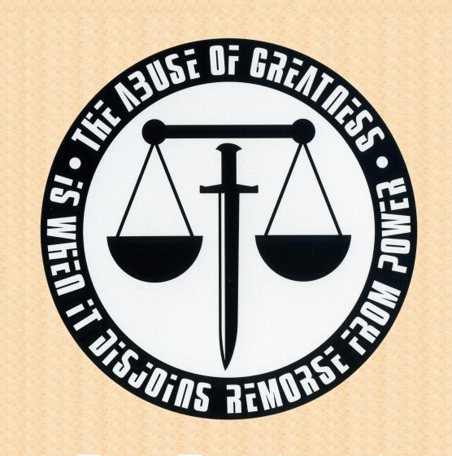

# Noblesse oblige

Dar visai nesenai jus pažindinau su terminu _Mens Rea_, o šiandien noriu pasidalinti dar viena įdomia fraze, turinčią mintį. Užtikau ją žiūrėdamas anime \(jei kam įdomu – tai aukštą produkcijos lygį, bei nuostabiai gražų opening’ą ir endingą turintis 2009-tųjų [_Eden Of The East_](http://myanimelist.net/anime/5630/Higashi_no_Eden)\). Ir nors pats anime sukėlęs didelius lūkesčius, pabaigoje susilpnėja ir nevisus juos pateisina, tačiau naujas, dar negirdėtas terminas po šio darbo tikrai įsirėžė atmintin. Tas terminas – _oblesse oblige_.

Tai sena prancūzų frazė, kurios pažodinis vertimas būtų „nobility obliges“, kitaip tariant „padėtis įpareigoja“. Akademinis prancūzų kalbos žodynas šį terminą apibrėžia taip:  tas kuris turi aukštą poziciją turi ir elgtis taip, kad pateisintų su ta pozicija įgaunamą reputaciją.

Taigi šis terminas iš esmės reiškia, kad kartu su turtu, galia, šlove ir prestižu, atkeliauja ir būtinosios atsakomybės, kurių nevalia užmiršti. Įtakingas žmogus tampa atsakingas už jam pavaldžius, už jį supančius, už silpnesnius ar tiesiog už mažiau sėkmingus žmones. Jis turi rūpintis jų gerove, kad jiems nenutiktų kažkas blogo, bei būti geros elgsenos pavyzdžiu jiems. Dažnai tai reiškia, kad toks žmogus netgi prisiima kaltę savo vardu, tik todėl, kad su pasekmėmis jo padėties žmogui susidoroti gali būti lengviau. Žinoma, tikrai ne visada norisi būti tuo žmogumi į kurį, kad ir ne tiesiogiai, bet nukreipiamos akys, bei keliami lūkesčiai, kuriuos kartais pateisini būna išties sunku, tačiau būtent šiai ne visada maloniai socialiniai situacijai ir gimė šis prancūzų išsireiškimas. Kaip bebūtų, ne visada turime pasirinkimą…

Kuo aukštesnę poziciją žmogus užima, tuo daugiau atsakomybių, tuo daugiau priklausomų nuo jo žmonių jį prislegia. Tad nenuostabu, kad tokiam žmogui nepridera elgtis neapgalvotai, neatsakingai ar krėsti k0kias šunybes.

Įsivaizduokit šalies prezidentą, kuris pasirodytų girtas, viešai išsijuoktų ar įžeistų kitos šalies prezidentą ar visai spjautų ant savo šalies žmonių. Tai nepriimtina, netoleruotina ir sukeltų begales etninių diskusijų.  
Taigi, užimama padėtis įpareigoja.

