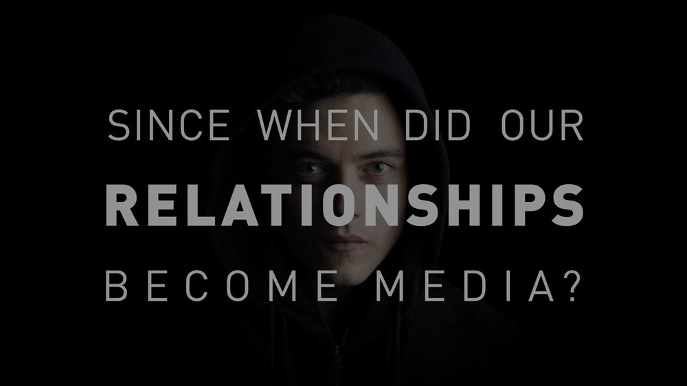

# Pakeisti pasaulį taip, jog tai kažką reikštų

„Vieną kartą mano tėvas pasiėmė mane iš mokyklos, mes išėjom iš pamokų ir nuėjome prie paplūdimio. Į vandenį lysti buvo per šalta, todėl tiesiog sėdėjome ant kilimėlio ir valgėme picą. Kai grįžau namo, mano batai buvo pilni smėlio, aš juos nusimoviau ir numečiau ant žemės. Aš nesupratau. Man buvo šešeri. Mano mama mane apšaukė dėl netvarkos, o jis nepyko. Jis sakė, kad milijardus metų pasaulio žemės ir vandenynai judėjo kol atnešė smėlį į paplūdimį. Tada aš jį pasiėmiau. Kiekvieną dieną jis sakydavo „Mes keičiame pasaulį“ – tai buvo graži mintis iki tol, kol pagalvojau, kiek man gyvenimų reiktų nešioti smėlį savo batuose, kad išneščiau visą paplūdimį ir kažką pakeisčiau pasaulyje. Kiekvieną dieną mes keičiame pasaulį, bet pakeisti pasaulį taip, jog  tai kažką reikštų – tai užtrunka daugiau laiko, nei mes turime. Tai niekada nenutinka iš karto. Viskas vyksta lėtai, metodiškai, varginančiai. Nekiekvienas iš mūsų turi tokią jėgą.“

Mr. Robot – serialas, iš pirmos pažiūros apie IT bei revoliucijas, tačiau iš tikrųjų apie žmones ir psichologiją. Turi ryškius savo trūkumus, tačiau užburia ir periodiškai pateikia velniškai geras mintis, pasvarstymus. Pvz.: _The world is a dangerous place not because of those who do evil, but because of those who look on and do nothing._

Galbūt būtent dėlto šių metų Golden Globes apdovanojimuose pelnė „Geriausio metų serialo“ titulą.



