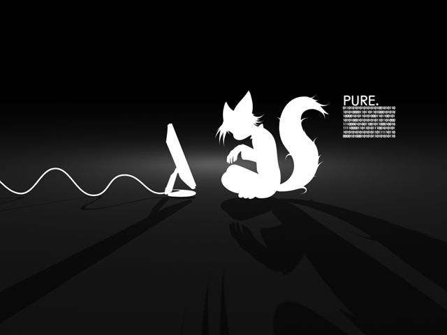

# Piratavimas arba skaitmeninio turinio mokėjimo ypatumai

Anądien eilinį kartą chillinant ant suoliuko su draugais iškilo nedidelis nuomonių skirtumas apie mokėjimą už skaitmeninį turinį. Mano pašnekovas, kaip ir gana įprasta mūsuose, teigė, kad niekada nemokėtų už skaitmenį turinį, skant: “nėra ten už ką mokėti; už tokį niekalą niekad nemokėčiau pinigų”.  
Vat čia ir atsirado prieštaravimas iš mano pusės. Taip suprantu, pats esu ne ką geresnis ir patinkančius filmus, muziką ar žaidimus siunčiuosi būtent torrent’ų pagalba, bet bent jau suprantu mokančius už skaitmeninį turinį žmones. Šiuo atveju aš gal ir norėčiau susimokėti už dėmesio vertą skaitmeninį turinį, tačiau būnant tokioje socialinėje padėtyje \(studentas, kuriam galva plyšta nuo minčių, kaip reiks susimokėti rugsėjį už nuomą\) to padaryti niekaip neišgaliu.  
Visada vertinau kokybiškumą ir tarkim už tokį gėrį, kaip _Starcraft 2_ ar paskutinį _Eminem’o_ albumą _Recovery_ aš su mielu noru susimokėčiau. Tai tarsi padėka kūrėjams už tokį sunkų jų darbą ir už rezultatą, kuris džiugina mano sielą, ausis, bei akis dar ilgą laiką.

Esu didelis melomanas ir nors fizinių albumų kolekcija mano spintoje esti tikrai menka, tačiau nė negaliu palyginti ją su parsisiųstais albumais, nors jų ir keliais šimtais kartų daugiau. Nusipiratavęs muzikinį albumą, tu jį paklausai, pasidžiaugi, na ir pasidedi kažkur kietajame diske, kol kartas nuo karto random režimu veikiantis grotuvas atkapsto vieną ar kitą dainą iš albumo. Bet vat, kai turi fizinio pavidalo albumą pojūtis visai kitoks. Tai visai kitas lygis, kurį nes sunku išreikšti žodžiais. Tas kvapas, vaizdas, kai laikai dėžutę, kai užsileidi pirmąją dainą ir klausydamas jos skaitai albumo knygutėje esančias padėkas ar dainos žodžius, kai išgirsti kiekvieną menkiausią žodį, bei užuodi dažų kvapą… Ech… Na gerai, anksčiau ar vėliau ta pati muzika vis vien atsibosta ir albumas keliauja į lentyną. Bet ir čia jis tampa tavo kolekciniu vienetu, džiugina tavo, bei tavo svečių akis, kiekvieną kartą, kai įeinama į kambarį. Nežinau, galbūt jūs to ir nesuprantat, bet man tai yra nepaprasta. Pats turiu svajonę apie tai, kaip nusipirksiu patefoną ir iš interneto siuntinėsiuosi pačias įdomiausias, rečiausias plokšteles ir mėgausiuosi jų šiltu garsu…

Galbūt iš dalies kaltas lietuvių būdas – kam mokėti už dalyką, kurį gali gauti nemokamai. Na ištikro – imi parsisiunti žaidimą, jį peržaidei, ištrynei ir viskas. Būni laimingas, nes gavai ir malonumą žaisdamas, bei vis dar turi tą 100 Lt savo kišenėje, kurį būtum atidavęs už žaidimo kompaktą.

Šiuo atveju aš didžiausią pliusą galiu uždėti tiems žmonėms, kurie visgi naudojasi torrent’ais ir parsisiunčia muzikinius albumus, ar žaidimus, juos išbando ir jei turinys atitinką jų lūkesčius – nueina į parduotuvę ir nusiperka originalą. Tokius žmones aš gerbiu ir pastebiu, kad jų atsiranda vis daugiau \(na arba jų skaičius nesikeičia, tiesiog ėmiau dažniau tokius sutikti\). Na tikrai, juk visi prieš pirkdami norime žinoti ką perkame. Galbūt tavo mylimiausias atlikėjas išleido naują albumą ir nusipirki jį nė kart negirdėjęs, tikiesi kad jis bus išties geras, tačiau kai perklausai didelio susidomėjimo nepalieka. Tada gali nusivilti, nes prastai išleidai pinigus – pirkai katę maiše. Mokėjai pinigus realiai nežinodamas ką gausi. Su žaidimais irgi yra pan. Taip, visada galima pasižiūrėti klipukus youtubėj, bet kaip žaidimai atrodo internetiniuose vaizdeliuose toli gražu neprilygsta tam, kaip žaidimas sukasi tavo kompiuteryje. Juk dažnai būna, kad kompiuterio specifikacija atitinka rekomenduojamus kompiuterio resursus, bet pasileidus žaidimą tenką grafiką nustatyti tik ant medium lygio, kas tikrai suprastina žaidimo grožį. Tokiu atveju išleidęs pinigus žaidimui, gali vėl būti nusivylęs \(žinoma, žaidimo gerumas nepriklauso nuo grafikos\).

Bet sakyti, kad mokėti už skaitmeninį turinį yra visiška nesąmonė, nes moki už kažką nematerialaus, neapčiuopiamo, manau yra neteisinga. Tarkim, yra žmonių, kuriems priimtina vogti iš parduotuvės. Jie irgi gali pasakyti: “nesuprantu, kaip galima mokėti už tą drabužį, ar už tą vyną”. Tačiau jums vogti iš parduotuvės yra nepriimtina. Tai lygiai taip pat vieniem žmonėms yra visiškai priimtina mokėti už skaitmeninį turinį, o vat jums tai nepriimtina ir jūs pasirenkate jį vogti. Ir vienintelis pasiteisinimas būna – nes tai daro visi.

Ne, toli gražu ne visi, jei pasižiūrėtume į statistikas, tai kad ir kiek daug žaidimai būtų nupirataujami, bet vis vien daug daugiau žmonių juos vis dėlto nusiperka. Kodėl? Todėl, kad tikras save gerbiantis geimeris nesileis iki tokio žemo lygio ir nevoks svetimo turinio, ypač jei jis tikrai vertas dėmesio. Pagalvokime, kas būtų jei visi, absoliučiai visi vogtų ir kūrėjams nemokėtų nė cento. Gi kompanijos liktų be uždarbio, neturėtų pinigų sumokėti žmonėm, kurie dirbo kurdami tą skaitmeninį turinį ir paprasčiausiai juos visus atleistų ir/arba bankrutuotų. Nebeliktų didžiųjų kompanijų, kurios ir sukuria visą kokybišką turinį ir liktų tik kelios mažos kompanijėlės, kurios kuria nemokamą turinį. Bet žinoma, nemokamas sūris niekada nepasieks kokybiškumo kartelės. Argi koks nemokamas žaidimas gali nors kiek prilygti tokiam grandui, kaip Starcraftui?

Vertinančių ir mokančių pinigus už skaitmeninį turinį žmonių visada buvo ir bus, tai žmonės, kurie supranta kitų žmonių triūsą ir kurie jaučiasi geriau atsidėkoję už jį, o ne pavogę, kaip kokie paprasti kišenvagiai. Ir Lietuvoje tokių žmonių taipogi netrūksta, būtent Starcraft’o startas tai parodė. Net naktį susirinko būrelis žmonių tiek Klaipėdoje, tiek Vilniuje kad tik galėtų pirmieji įsigyti ir išbandyti šį gėrį. Aš juos suprantu. Tikiuosi kadanors suprasti imsite ir jūs.

