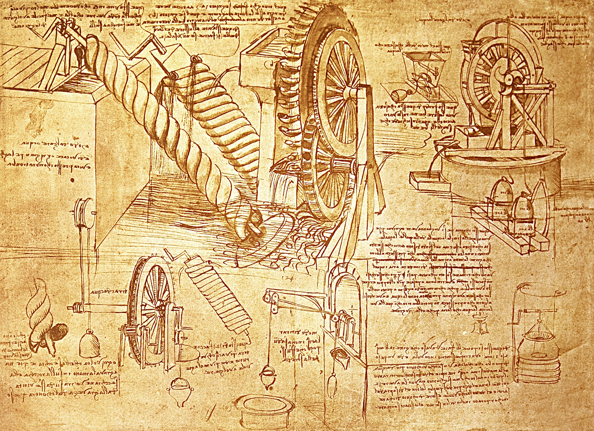

# Did any of Leonardo Da Vinci’s research actually lead to technological advancement?

I actually wrote a paper on this last year, which allows me the delicious pretentiousness of quoting myself.

His rediscovered papers helped design a surgical robot in the late 1990s, and improved a specific type of heart surgery in the early 2000s.

**On the subject of Leonardo’s research being lost until too late, for those unfamiliar:**  
Upon Leonardo’s death in 1519, his student Melzi took possession of his notes but the dense content proved impossible to prepare for publication. No small part of the blame here may be laid at the doorstep of the master himself, for Leonardo’s style was difficult at best.  
He is well-known for his “mirrored” handwriting, with the notes moving from right to left across the page, but that was only the first layer of the problem. He used no punctuation, invented his own shorthand as well as compounding and dividing words at apparent random, and even formed letters of the alphabet in his own personal way. Oftentimes he eschewed the written word completely in favor of multi-page sequences of hand-drawn images, which like his writing ran backwards from right to left.  
And of course the knowledge contained within this labyrinthine set of documentation was revolutionary for the time: in scientific terms only a few others on the planet would have been able to follow along Leonardo’s path of analysis with true understanding and comprehension, and even thirty years after Leonardo’s death the scholar Vasari referred to him as heretical.  
It would have taken a unique person to decipher Leonardo’s notes, make sense of the findings within, organize and compile them into something suitable for publication, and then have the bravery to publish in an inimical political and religious climate—and perhaps in the end there was no one better suited to accomplish this than Leonardo himself. Our best hope at the time was the aforementioned student, Francesco Melzi, who made a valiant attempt but found himself adrift in the eighteen volumes of notes Leonardo left him. Even with two assistants to help process the deluge and forty years of effort, he was overwhelmed, and upon his death in 1568 the studies ended up passing from person to person throughout the centuries, never fully appreciated or understood, until finally being published in 1900 after the surviving folios made their way to London and the Royal Collection.  
Their significance was immediately recognized, but “by then, their power to affect the progress of anatomical knowledge had long passed.”

**On the subject of whether or not any of it is still useful:**  
One of Leonardo’s modern-day proponents is a British heart surgeon, Francis Wells. Doctor Wells specializes in mitral valve repair operations. Typically, this type of repair is accomplished by narrowing the valve’s diameter to restrict backflow, but after studying Leonardo’s anatomical analyses of the heart, the surgeon discovered there was a better way, thanks to Leonardo’s identification of the opening phase of the valve’s movement as crucial to the overall cycle. With this new knowledge, Doctor Wells has modified his mitral valve repair procedures and successfully treated 80 patients, restoring them to a quality of life previously not possible. He suggests, “Leonardo had a depth of appreciation of the anatomy and physiology of the body—its structure and function—that perhaps has been overlooked by some,” and is studying the rest of Leonardo’s anatomical work in hopes of finding other refinements to modern procedures.  
Even more compelling is Leonardo’s influence on the cutting edge of modern medicine—the development of precision robots to assist in surgical procedures. Leonardo himself, despite his prescience in so many other technological areas, may have been surprised to learn that since 1983, some surgeries have been accomplished with robotic tools. There is some reason to think Leonardo may have anticipated this eventuality, however; in 1495, Leonardo designed and built one of the first humanoid robots, a mechanical knight capable of sitting up, turning his head, and waving his arms, all in time to the sounds of artificial drums. When modern-day robotics expert Mark Rosenheim set out to duplicate this robot, it took him five years of work, and in his research he discovered:  
Leonardo’s anatomical drawings were unique and gave him the information needed to emulate the complex joints and muscles of the human body. The wrist joint, which is one of the body’s most complicated joints, presented challenges to robot design. However, Leonardo’s principles enabled engineers to construct a suitable model. It is from these and other experiments that the first prototype for robotic surgery was developed.  
And so in 1998, the first da Vinci robot-assisted surgery, a heart bypass, was performed, inaugurating a career for the telepresence tool that has resulted in over 200,000 surgeries performed by a robot designed in part with the help of Leonardo’s anatomical studies. Each of these procedures was safer, faster, and less invasive compared to the non-robotically-assisted alternative, and each patient has Leonardo’s work to thank for their speedy and comfortable recovery. As of 2009, there are over 1,600 da Vinci robots installed worldwide, performing minimally-invasive laparoscopic surgeries to treat heart, prostate, kidney, bladder, and testicular issues, from malignant tumor removal to complete organ transplant.

**tl;dr** Leonardo Da Vinci actually created a robotic wrist that was better than anything else for 500 years. I mean, he is often mentioned as one of the great geniuses of all times, but I always assumed that was exaggeration….  
But…  
We _barely_ didn’t get anything from him. I italicized the term barely, because robotically assisted surgery is pretty awesome on its own, but the guy put so much effort to encrypt his work that mankind never benefited from it. He was a genius, but he contributed **far**, far less to progress and science than he could have had. It’s a shame that we sat on 500 years worth of technology, but he’s to be blamed for it.

by [TrekkieTechie](http://www.reddit.com/r/AskHistorians/comments/2ndkka/did_any_of_leonardo_da_vincis_research_actually/)

