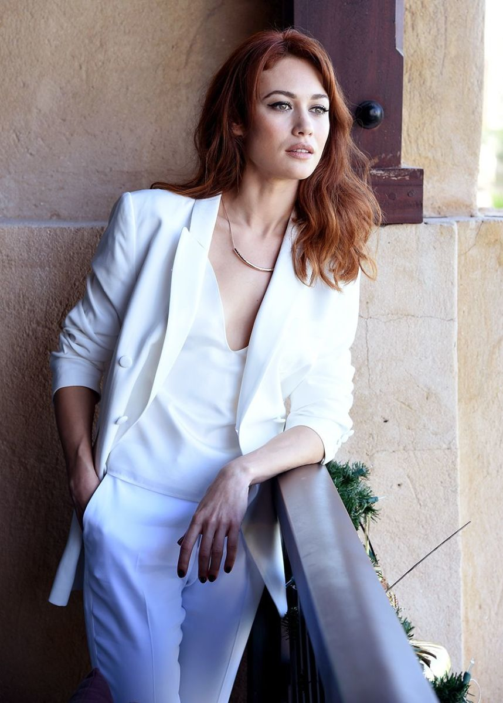

# Sapnas su Olga

Dievaži, hilarious, kokių tik kartais sapnų man neprisisapnuoja. Nepaisant visų šyzų, kartais, tačiau tikrom retenybėm, būna ir kažkas labai tokio. Kažkas įsimintino ir žavingo. Vakarykštis sapnas buvo su kviestine kino žvaigžde. Leiskite pristatyti: ukrainietė aktorė ir modelis Olga Kurylenko. Taip, tai ta pati mergina iš kritiškai geimerių suvertinto kino filmo [Hitman \(2007\)](http://www.imdb.com/title/tt0465494/),  Bond’u apsimesti bebandančio Craig’o filmo [Quantum of Solace \(2008\)](http://www.imdb.com/title/tt0830515/) ir galiausiai šiemetinio klasikinių sci-fi filmų tribute’o su nuspėjama pabaiga, tačiau labai gražaus dizaino – [Oblivion \(2013\)](http://www.imdb.com/title/tt1483013/), apie kurį dar spėsiu papasakoti \(taip, visgi dar grįšiu prie filmų aprašymų, turėkit kantrybės\). Olga yra ta aktorė, kurią siūlyčiau pačią pirmą, jei kada būtų filmuojamas žaidimo[ Portal motyvais paremtas filmas](http://www.deviantart.com/art/Portal-For-science-you-monster-383649030).

Net neįsivaizduoju kodėl prisisapnavo konkrečiai ji. Oblivion’ą žiūrėjau jau prieš kurį laiką, o ir šiaip, nors ir daili, tačiau nėra ji toks neapsakomo grožio angeliukas, kaip kad pvz numylėtinės Keyra, Natalie ar Alysha. Erotinių elementų sapne taipogi nebuvo, tad išties kyla klausimas, kas ten dėjosi mano galvoje… O visgi buvo intrigos…

Nežinau ar jums yra pažįstamas toks nemalonus jausmas, kai tiesiog dingsta susidomėjimas konkrečiu žmogumi. Esu pasakojęs, kad man galbūt įdomesnis, esu labiau priklausomas nuo perpratimo proceso, o ne nuo rezultato. Kai jau daugiau mažiau perkandai žmogų, kai baigiasi tyrinėjimai, savęs pateikimai ir pan. su tuom dingsta ir pažinties žavesys ir lieka banali monotonija, su kuria aš baisiausiai nenoriu sutarti gražiuoju. Man visa tai yra pažįstama labiau, nei norėtųsi. Bendrauji, bendrauji ir vieną dieną supranti, kad tas žmogus tau yra tiesiog nuobodus… Ir to pasekoje mano dėmesys šokinėja ir šokinėja ir negaliu apsiriboti ilgam ties vienu ir tuo pačiu tašku. Ir nesvarbu ar kalba eina apie merginas ar apie muzikos, bei kino žanrus ar apie bet kokią kitą temą. Žinau, kad tai nėra į gerą, tačiau tai dilema, kurioje šiuo metu gyvenu ir kurios nemoku spręsti.

Taigi, kodėl visą tai pasakoju? Nes visa tai ir yra tiesiogiai susiję su mano sapnu. Minėtasis personažas, Olga, mano sapne ir buvo mano pagrindinis intereso taškas. Ir toks stiprus, kad net sunku patikėti. Iš tiesų, galbūt gyvenime ir ieškau tokio žmogaus, kuris sugebėtų prikaustyti mano dėmesį pakankamai stipriai… Taigi, Olga buvo be galo stilinga, elegantiška, inteligentiška, moterišku šarmu trykštanti, savimi labai pasitikinti, savarankiška, stipri ir unikali. Kitaip tariant fatališka moteris. Tačiau jau kažkieno kito. Kažkokiomis miglotomis aplinkybėmis \(čia gi sapnas, žmonės, nesitikėkit milžiniško detalumo\) mes su ja kartas nuo karto susitikdavome ir spėdavome persimesti vos viena kita, iš pažiūros atrodytų, nieko nekaltomis frazėmis, tačiau iš esmės tarp mūsų vyko tikras psichologinis katės-pėlės žaidimas. Sukaustyti situacijos, mes absoliučiai nedarėmė nieko akivaiždžiai. Viskas buvo taip užslėpta, kad iš esmės net pats galėtum suabejoti ar išvis čia kažkas vyksta. Tačiau niekam kitam to žinoti ir nereikėjo, svarbiausia visą tai juto vieninteliai žaidėjai – mudu du. Tačiau, kaip bebūtų, tarp šių vos trumpučių permetamų frazių slypėjo didelė aistra, kurią užfiksavau iš absoliučiai subtilių simbolių, kuriuos mėtant tiesiai prieš jos dabartinį vyrą moron’ą jis nepamatytų nieko. Mes kalbėjomės vos akimirką trunkančiais žvilgniais, o ne žodžiais ar veiksmais. Galvą perveriančiais, neįtikėtinai deginančiais žvilgsniais. Viso ko variklis, varomoji jėga buvo intriga. Ši moteris buvo mano tikslas, iš jos taipogi užfiksavau susidomėjimą, kurį ji bandė maskuoti, tačiau nepakankamai, kad to akylai neužfiksuočiau. Už dėmesingo žvilgsnio visvien užkliūdavo bandomas sutramdyti šypsnis, kuris išsprūsdavo vos menku lūpų sujudinimu, tačiau kuris man pasakydavo daugiau, nei reikia. Žinojau, kad ji yra vienintelis dalykas kurio aš trokštu, niekas aplinkui nebeegzistavo ir nebuvo įdomu, tačiau absoliučiai nežinojau ką reikia daryti, nes žinojau, kad šią moterį reikia užsitarnauti. Taip paprastai neateisi ir nepasiimsi – viskas būtų sugadinta, intriga baigta, kitaip tariant game over. Čia iš tos serijos, kai net nenori sužinoti merginos vardo, kad tiesiog nesugadinti idilės… Vyko įtemtas psichologinis žaidimas, kuriame gauni arba viską arba nieko ir šioji, mano sapno versijos Olga buvo mano siekiamybė betkokia kaina.

Kai nubudau, pasidarė net šiektiek ir liūdna, kad tai buvo tik sapnas ir kad tokie interesai visgi neegzistuoja… Dar.

