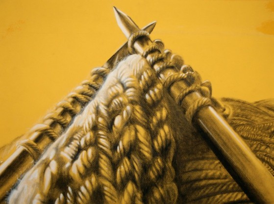

# What one thing has always bothered you, but seems to bother no one else?

-There is this one woman who gets the same bus I do every day. She sits there knitting a sock. Except this sock must be magical or something because I kid you not it has not grown in six months of her knitting this thing. She either knits one sock a day of exactly the same pattern and just happens to be in the same place every morning or she is the worlds shittiest knitter. Thing is she is still trying to knit this sock, when it is now summer and she would never even wear it. Everyone else just sits there and accepts that she is a terrible knitter, allowing her to continuously twiddle some sticks but I think she needs a new hobby. I don’t even know why this bothers me at all. It’s not even a pretty sock.

– Glich in the Matrix

