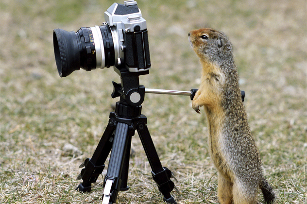

# Šnipai tarp gyvūnų

Paspekuliuokim mažumėle. Kas jei staiga pasaulio mokslininkai išaiškina faktą, jog viena gyvūnų rūšis yra kilusi visai ne iš mūsų planetos ir visą tą laiką mus slapta špininėjo? Kokia gyvūnų rūšis labiausiai tikėtina tai galėtų būti?

-Musės. Jų galima rasti bet kur, mėgsta erzinti žmones, turi devynias galybes akių, kurios turėtų būti super kamera ir yra tiesiog puikiai pritaikytos šnipinėjimui ir informacijos rinkimui. O dar jos labai mėgsta mūsų išmatas ir šiukšles, kitaip tariant renka mėginius. O išvis labiausiai mėgsta maniakiškai trinti savo kojomis, tarsi sakydamos „excellent“ ar planuotų pasaulio užkariavimą. Rusai netgi turi prietarą, jog jei kambaryje yra musė, negalima pasakoti nieko slapto, nes musės yra Babos Jagos šnipės. Tai labai senas pagoniškas prietaras, kilęs dar prieš komunizmo revoliuciją, tad galbūt jie apie piktuosius musių kėslus žinojo jau prieš gerą šimtmetį.

-Katės. Tik pagalvokit: jos elgiasi, tarsi viskas priklausytų joms, nuolatos spokso į mus, yra nepriklausomos, o egiptiečiai jas garbino, kaip dievus. Jos infiltravo mūsų namus, šeimas, protus ir mūsų internetą. Šia tema yra paruoštas ir [infografikas](http://theoatmeal.com/misc/frame/cat_kill).

-Aštuonkojai. Šitie tai net [neužsimaskavę](http://www.vanishingtattoo.com/tds/images/octopus/octopus_large/octopus_001.jpg). Užtenka tik žvilgtelti į juos ir pasidaro aišku, jog aštuonkojai ne iš mūsų planetos. Ir net nereikia jų milžiniškų galvų, čiuptuvų, rašalo ar besikeičiančių kūno spalvų – aštuonkojai buvo prigauti turint neįprastai didelį intelektą. Keletas įrodymų [čia](http://goo.gl/J7kiWh), [čia ](http://goo.gl/Z3Qya1)ir [čia](http://goo.gl/Zk1zBe). Jų motyvas ganėtinai aiškus: didelę dalį mūsų planetos sudaro vandenynai, tad šie slapukai tyrinėja mūsų gyvenseną, grobia mūsų technologijas, jas reverse engineerin’a ir kai suras visas silpnąsias mūsų vietas vieną dieną sugebės atimti iš mūsų planetą. Žmonės yra spekuliavę, kad jei paliktume žemę, tai labiausiai tikėtina, kad būtent šie gyvūnai išsivystytų į sekančią protingą gyvybės formą. O gal jie jau tai ir padarė?

-Voverės ir šunys. Kas jei vienu metu žemėje yra net dvi ateivių rūšys? Voverės atvyko pirmesnės, pradėjo žmonių tyrinėjimą su mintimi mus visus užvaldyti. Šunys sužinojo apie šį planą ir atsiuntė savo milžinišką ir gerai diversikuotą armiją mūsų ginti. Voverių ir šunų karas tęsiasi jau milijonus metų, įvairiose planetose ir mes esame vieni iš jo liudininkų. Apie šį karą net yra sukurtas filmas – Transformeriai, tiesiog jog voverės ir šunys nieko neįtartų, pagrindiniai veikėjai buvo pakeisti į mašinas-robotus, tačiau iš esmės siužetas yra užšifruota voverių – šunų karo dokumentika.

-Uodai. Tik pagalvokite kiek kraujo mėginių šieji jau yra prisivogę. Jie tikriausiai vykdo Nojaus Arkos tipo projektą ir į savo kolekciją ima mėginius iš kiekvienos sutiktos gyvūnų rūšies. Mes galvojame, kad tik nesenai sukūrėme skraidančius dronus, kai iš tikrųjų bio-dronai tarp mūsų skraido ir mus zonduoja jau išties senai. Dar vienas akivaizdus to įrodymas yra tai, jog skirtingai nuo visų kitų gyvūnų rūšių, uodai neturi jokios reikšmingos įtakos ekosistemoje. Kitaip tariant, jei kuri nors masinė gyvūnų rūšis išnyktų, būtų galima pastebėti gan dideles to pasekmes gamtoje, tuo tarpu išnykus uodams ne tik, kad niekas nepasikeistų, tačiau net ir nutiktų pozityvus efektas – būtų mažiau uodų pernešamų ligų. Yra nustatyta, kad gamtoje yra užtektinai kitų vabzdžių rūšių, kurios atstotų išnykusių uodų vietą tiems, kas jais mito iki šiol. Kalbant apie ligas, galbūt tai ir yra jų atliekami medicininiai eksperimentai, atliekami bandant nustatyti, kaip žmonės prisitaiko ir įveikia įvairias ligas. Yra teorijų, kad traiškydami uodus, mes užmušame tik pačius silpniausius, taip po truputėlis filtruojasi vis stipresnių, atkaklesnių ir geriau manevruojančių uodų genomas ir uodai darosi vis įžūlesni.

-Skruzdės. Neįtikėtinai efektyvios, motyvuotos, atkaklios, su aukštai pažengusia socialine struktūra, vidiniais karais, agrikultūra. Neapsigaukite dėl jų dydžio, nes vienoje jų kolonijoje įprastai būna milijonai kovingai nusiteikusių skruzdžių.

–[Lėtūnai](https://www.kevinabarnes.com/wp-content/uploads/2013/02/tardigrada.png). Dulkių siurblio maišą primenantis vandens gyvūnas, galintis išgyventi temperatūras aukštesnes, nei vandens virimo temperatūra, slėgį, kelis kart didesnį, nei randamas žemėje, radiacijos dozes šimtus kartų didesnes, nei mirtinas žmonėms, bei kosmoso vakuumą, o be maisto ir vandens gali išbūti ilgiau, nei 10 metų. Jei tai jums neperša minties apie bioinžinerinius micro šnipinėjimo robotus, tai tada aš nežinau…

-Na ir galiausiai… Žmonės. Kokia daugiau rūšis, netinka mūsų planetoje labiau, nei žmonės? Praktiškai, kad ir kur mes būtume, privalome statytis pavesines, užuovėjas, gyvenamuosius, apšiltintus būstus, turime gamintis ir nešioti apsauginius rūbus, net negalime paeiti akmenuotu paviršiumi. Mūsų oda labai minkšta, galime užsigauti ar susižeisti, praktiškai nuo bet ko, esame lėti, silpni, be papildomų priemonių net negalime apsiginti nuo daugumos gamtoje sutinkamų plėšrūnų, neišgyvename minusinės temperatūros ar net elementariai sėdėdami saulės atokaitoje sugebame nusideginti odą. Kaip mes galime būti tokie netikę gyvenimui žemėje? Ir visgi dominuojame visas pasaulio rūšis ir skelbiamės šią planetą esančia mūsų. Kažkur man čia nesiriša galai… Susidaro vaizdas, kad mes kilę iš visai kitur, o čia atsidūrėme bala žino kokiomis aplinkybėmis.

Tiek šiam kartui spekuliacijų ;\)

