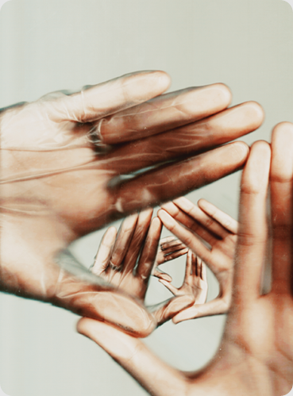

# Trikampiai

Ne, pašaukimo matematikai aš nepajutau ir kas, kas, tačiau smarkiai gilintis į šį mokslą ir išradinėti naujų formulių tikrai neketinu. Nors pažįstu, kas galėtų. Bet ir negaliu skųstis – nors matematika ir būdavo nemėgiama disciplina kur per prievartą reikėdavo labiau intensyviai sukti smegenų krumpliaračius ir spręsti daug neįdomių uždavinių, tačiau nebuvau joje toks jau nevykėlis ir visgi sugebėdavau laikytis ties lyderių saujele. Nors ir nebuvau joje pačioj aukščiausioj vietoj. Tokią situaciją labai gerai apibendrina mano visai nesenai užtikta mintis, kuri tiesiog įsirėžė į atmintį: _**ne visuomet privalai būti geriausias, bet visuomet turi būti tarp geriausiųjų**_. Vadovaujantis tokia mintimi būni pranašesnis už tuos, kurie stengiasi vienareikšmiškai būti geriausiais. Pripažinkit, pažįstat tokių. Kur gi pranašumas? Jie turi vieną esminį trūkumą – tiesiog negali pakęsti būti nugalėti, pranokti. Juos tai žudo iš vidaus ir jie sunkiai besitvardo. Ir vat būtent tuom gali pasinaudoti kiti, tokie, kuriems nebūtina kažką įrodyti prieš kitus. Užtenka kartkartėmis įrodyti sau pačiam. Apie tai jau kažkada esu rašęs.

Taigi, labai nukrypau nuo temos. Trikampiai. Ar pastebėjote, kad gyvenime yra pilna absurdiškų trikampių. Trikampių, kurių du kampus gali pasigauti, o trečiasis lieka nepasiekiamas. Na elementarus pavyzdys: draugai, darbas, meilė. Kaip, kad [Kenneth Koch](http://reanimated.lt/tipografija-social-life-with-friends) savo poemoje rašė:

_Is of these three you may have two  
And two can pay you dividends  
But never may have three._

Jei tik buvote kada rimtai įsimylėję ir tuo pat metu dirbote – reiškia galit garantuoti, kad jūsų social ratas tapo apleistu. Visą dieną prasedėjot darbe, vakare skyrėt dėmesio savo mylimajai, o kada tūsas su draugais? Situacija kartojasi, kai esi įsimylėjęs, varai su draugais į kalnų žygius, tranzavimo keliones, ar pasisedėjimą prie laužiuko iki pat paryčių, tačiau, gerbiamasai – o kiek daug tu sukūrei, parašei ar padarei? Na ir galiausiai: pralenkęs nugarą visą dieną, vakare, nubėgęs pasilinksminti su draugais, tačiau paryčiais gryžęs ant stalo nerandi rėmelio su mylimos merginos nuotrauka. Gali turėti du, bet trys pasiekiami tik Chuck’o :D Aišku niekas nedraudžia pabandyti. Beveik esu įsitikinęs, kad dienelę, dvi, ar net savaitėlę tai gali išdegti. Chalange accepted? Sėkmės jum… :j

Ir tokių trikampių yra daug daugiau, tereikia juos įžvelgti. Jaunesniems puikiai tinka šis trikampis: geri pažymiai, draugai, pakankamai miego. IT’išnikai mėgsta kišti stabilumą, funkcionalumą, bei user friendly’škumą, kalbant apie OS: Windows, Mac ir Linux. Kitas pavyzdys: žino ką reikia padaryti, moka padaryti ir turi galimybių padaryti. Arba legendinis ir dažnai sutinkamas produkcijos trikampis: kokybė, greitis ir maža kaina. Visuomet tik 2…

Na ir pagrindinis, kuris man ir šovė šį vakarą į galvą ir nepaleidžia, kaip koks kirminas iš galvos, kuris grauš smegenėles kol ne materializuosiu raidiniu pavidalu. Protas, grožis ir social skills \(a.k.a lots of friends\). Kažkodėl pagalvojau, jog jūs pritaikėt būtent panelėm. Na taip, jos būna tikrai labai akivaizdūs šio trikampio pavyzdžiai, tačiau trijulė puikiai tinka ir vaikinam. Rinkis 2, bet trečio tau bus pagailėta. Kas geriau? Turėti bent kiek daugiau protelio ir būrį draugų, tačiau kompleksuoti dėl savo išvaizdos? Turėjau tokią klasiokę… RIP… O gal geriau būti gražiai fyfutei su krūvomis draugų ir pažįstamų, tačiau į bet kokį klausimą, atsakymas bus vienas: “Nu jiooooo”? Kiek gi tokių duckface’inių panelių tenka matyti klubuose, miestuose ir prekybcentrių drabužių parduotuvėse… Na, bet kaip sakoma: “palaiminti kvailiai…”. Ir ištikrųjų, tokie žmonės atrodo kur kas laimingesni… Ko negali kalbėt apie raukšles smegenyse turinčius žmones. Iškart visokie filosofavimai, hipotezės, egzistencializmai ir t.t. Viskas pasidaro taip komplikuota ir nebeatneša elementarios, žmogui, taip trošktamos laimės… Grįžtam, prie trikampių. Merginos, kurios mane patį labiausiai domina: išvaizdžios, apsiskaičiusios ir tai atsispindi pasiekimuose \(moksle, karjeroje, o galbūt asmeniniame versle\), tačiau būtent dėlto gaunančios perdėtai kritiškus pavydžių panelių žvilgsnius, kurie bandomi maskuoti dirbtinėmis šypsenomis, kai tuo tarpu iš nugaros bandoma įkasti. Situacija ne geresnė ir vaikinų fronte: tie kur mandresni – nori pasinaudoti, o tie standartiniai apsiskaitėliai, kurie, kaip ir tiktų: patys iškart save nusirašo dėl merginos išvaizdos. Maždaug: “aj ji pasikėlus” arba “tikriausiai turi vaikiną”. Ant mandrųjų tokia mergina nepasimauna, nes nėra naivi ir tuoj pat permato jų ketinimus, o prie tų nedrąsėlių, kur neprieina – moteriška savigarba neleidžia prieiti pačiai \(dažniausiai merginų protas kužda kažkokią nesąmonę, kad priėjus ir užkalbinus – ji tarsi nusižemins or smth like that…\). Va taip ir išeina, kad atrodo panelė, kuri turi viską, teturi vieną ar du artimus žmones, kuriuos brangina, tačiau jokio draugų pulko, kurį tikėtumeisi išvysti – nėra. Taip jau mūsų pasaulis veikia. Gali turėti du, bet negali turėt visų…

Pačiam galioja ta pati taisyklė ir būtent dėl jos, jaučiu didžiausią nerimą ir laikau tai pagrindiniu savo asmeniniu inkaru, kuris stabdo visą mano asmenybės potencialą… Jaučiu lack of social experience ir nieko čia nepadarysi. Atrodo esu tikrai draugiškas, įsitraukiantis į pokalbį, pajuokaujantis and so on, bet matyt mano sąvokos _social_ įsivaizdavimas transliuojasi ne tokiomis pat bangomis, kaip, kad kito mano amžiaus jaunimo… Galėčiau perlipti per save ir ištraukti tą inkarą, bet kuris tada iš likusių dviejų nukentėtų? Nes gali turėt tik… Na gerai, _**būna išimčių. VISADA būna išimčių.**_ Dar viena įsitvirtinusi mano galvoje mintis \(kažkaip puikiai man jas šį kartą visas įpinti sekasi :j\). Tačiau šiuo aspektu išimtys yra gerokai retos, o tie kurie pakliuvo į tą tarpą ir savo delne laiko visus tris trikampio kampus – dažnai nesupranta ir neįvertina to \(permeskit per atmintį žmones ir rasit bent vieną ar kitą tokį, kuris turi daugiau, nei bet kas kitas ir vis vien skundžiasi… Nes žmonės jau tokie. Kad ir kaip viskas gerai būtų, vis tiek galima dėl kažko pasiskųsti. Gi kitaip būtų tiesiog neįdomu…\).

Taigi, o kuris trikampiukas jums labiausiai neduoda ramybės gyvenime?

