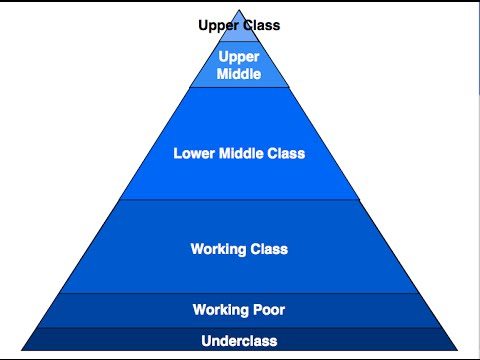

# Socialinės klasės

Tikriausiai visi esame susidūrę su terminais blue-collar worker, working class hero ir pan. Bet akivaizdu, jog kiekvienas iš mūsų skirtingai galėtų įvardinti kas pvz yra turtingas žmogus. Dar kitaip tokie terminai apibrėžiami valstybiniu lygmeniu.

Jeigu imti šiuos apibrėžimus iš išsivysčiusių vakarų šalių, kai Lower Class apima žmones, gaunančius mažiau nei 16 000$ per metus, tai kokie 99% Lietuvos gautųsi Lower ir Lower Middle class. Tačiau akivaizdu, jog tai netiesa - išties netrūksta žmonių, kurie perka naujus automobilius, butus, statosi namus ir pan, ko šių klasių žmonės pagal standartinius tokių klasių apibrėžimus tiesiog negalėtų sau leisti. Taigi, iš karto pasimato, jog vertinti pajamas izoliuotai, neimant į kontekstą išlaidų, pragyvenimo lygio ir perkamosios galios - yra visiškai neteisinga. Taip, pvz Luxenburg'e vidutinė alga yra 4 kartus aukštesnė, bet nereikia pamiršti, kad už būsto nuomą mokama 4x, už darželį 3x, o už vakarienę restorane 2x daugiau nei mūsų šalyje.

Kiekvieną socialinę klasę vieną nuo kitos mėgstama atskirti pagal gaunamas pajamas, tačiau manau, jog tai nebūtinai yra pagrindinis kriterijus ir galima juos praplėsti. Socialinė klasė iš tiesų susideda ne tik iš to kiek uždirbi, tačiau ir iš išsilavinimo, kaip rengiesi, bendrauji, kokie tavo įpročiai, pomėgiai ar kiek įtakos aplinkiniams sukuri. Pabandysiu išskirti savo supratimą, kaip aš asmeniškai galėčiau išskirti šias klases mūsų, t.y. Lietuvos kontekste.

### Lower Class

Į lower class priskirčiau iš valstybinės paramos gyvenančius žmones, kurie neturi jokių kitokių pajamų. Tai būtų bedarbiai, nedarbingumo ar panašių pašalpų gavėjai bei pensininkai. Iš principo - skurdo riba.

Ši grupė mūsų šalyje užima didesnę proporciją, nei kad įprasta išsivysčiusiose šalyse. Manyčiau, kad gali siekti iki 15% visuomenės. Ją labai išpučia didelis išties menkas išmokas gaunančių pensininkų kiekis. Tačiau nereikia apsigauti ir visą kaltę versti vien valstybei - nemoka normalių pensininkų, politikai kalti. Pirmiausia tai susiduriame su mažos šalies apribojimais - turint mažą žmonių kiekį, turime mažai gamybos, mažai eksporto. Norint surinkti didelį pensijų biudžetą, tektų arba labai smarkiai karpyti kitų sričių biudžetus arba apkarstyti visus išties slegiančiais mokesčiais. Bet kuriuo atveju - nepatenkintų skaičius ko gero ne itin sumažėtų. Tačiau nederėtų visos kaltės versti ir į šią pusę - net ir padarius milžiniškas teigiamas reformas ir pensininkams gaunant daug oresnes pensijas, dauguma jų vis vien neišliptų iš šios klasės ribų. Viena iš mažiau aptariamų priežasčių, kurią galėčiau išskirti būtų praėjusios santvarkos pasekmė. Dažniausiai tarybinio žmogaus finansiniai reikalai pasibaigdavo tik algos gavimu bei mokesčių sumokėjimu. Pridėkim dar kelias istorijas apie infliaciją ir bankrutavusius bankus ir turime rezultatą, kai žmonės turi išties skurdų finansinį išprusimą, labai nepasitiki bet kokiomis institucijomis, kurių darbas susijęs su pinigais, o daugybę metų visame pasaulyje veikiantys finansiniai įrankiai atrodo nepatikimi.

Taigi šios klasės mažėjimas galėtų įvykti tik su išsilavinimo ir finansinio apšvietimo didėjimu visuomenėje.

### Working Class

Working class būtų visi už minimalią ar arti minimalios algos dirbantys asmenys. Daugiausiai tai būtų fizinio darbo darbininkai kaip kasininkai, padavėjai, sandėlininkai, sargai, krovikai, valytojai, seselės ir kiti panašių specialybių žmonės.

Nors gyvenimo kokybės atžvilgiu jie gali būti ten pat, kaip lower class, tačiau šioji klasė skiriasi tuo, jog nors turi ir nedideles, tačiau savo asmenines pajamas. T.y. mažiau priklausomybės, nėra valstybės išlaikytiniai. Tačiau mažų pajamų iš esmės užtenka tik pragyvenimui nuo algos iki algos, tad taupyti šios klasės žmonėms sekasi sunkiai, o tai reiškia, kad iš jos išlipti durys gan smarkiai privertos.

Tiek Lower, tiek Working class dažniausiai gyvena arba nuomojamuose būstuose arba jei turi savo nekilnojamo turto, tai tik dėlto, kad tai yra tėvų ar sovietinių laikų palikimas, nes algos dydis riboja tai, jog galėtų gauti banko paramą savo būsto įsigyjimui. Dažniausiai vairuoja seną, t.y. daugiau nei 20 metų senumo automobilį.

Daugiausiai šią klasę sudaro vyresnio amžiaus darbininkai, kurie jau yra sunkiai paklausūs rinkoje ir kuriems pasiekus pensijos amžių ko gero labiausiai tikėtina, jog gresia kritimas į lower class. Ši klasė taipogi yra proporciškai išsipūtusi \(iki maždaug 35%\), tačiau šį kartą jau ne tiek daug kaip praėjusios klasės atveju.

### Lower Middle Class

Lower middle class tai vidutines pajamas \(1000-2000€\) gaunantys paprasti darbuotojai. Praktiškai didžioji dalis ofiso planktono. Dažniausiai tai standartinė šeima su 2 darbingais žmonėmis ir vienu ar dviem vaikais. Kartą į metus išvažiuoja pramogauti į vietinį kurortą arba kartą į metus ar 2 skrenda kur nors tolėliau į Europą. Važinėja sąlyginai nesenu automobiliu \(iki 10 metų\) arba turi įsigiję naują auto ar butą su paskola. Pajamas sudaro tik algos, papildomų pajamų šaltinių nėra arba jei yra tai iš nedidelės apimties veiklos, kurią labiau būtų galima priskirti hobiui ir kuri generuoja išties nedaug. Po visų mėnesinių išlaidų lieka pinigų taupymui ir įprastai turi 3-6 mėnesių algą siekiantį santaupų rezervą.

Jeigu lower middle class pavyksta padaryti karjerą ar įsteigti sėkmingą verslą - tuomet peršoka į upper middle class. Jeigu ne - įstringama tokiame white-collar darbuotojo rate, kai dirbamas profesinis, vadybinis ar administracinis samdomas darbas greičiausiai iki pat pensijos.

Ties lower middle procentinės visuomenės proporcijos lyginant su vakarietiškais standartais jau apsilygina ir likusios klasės jau nebepasižymi dideliais nuokrypiai. Šita klasė sudaro didžiausią visuomenės dalį mūsų šalyje ir spėčiau, jog gali sudaryti apie 40%.

### Upper Middle Class

Aukštesnes pajamas \(2000-3000€\) gaunantys darbuotojai. Daugiausia skyrių, padalinių vadovai, mažojo ir vidutinio verslo direktoriai, įmonių savininkai. Taipogi gali būti daktarai, architektai, teisininkai. Nuo lower middle class daugiausiai skiriasi tuom, kad turi pastovių papildomų pajamų šaltinių bei sugeba didesnės apimties pirkinius įsigyti arba be paskolų pagalbos arba jas gan neilgai trukus padengia. Labai dažnu atveju turi kelis nekilnojamo turto objektus, papildomas pajamas gauna iš jų nuomos ar nedidelės apimties verslo. Gali nesunkiai taupyti ar investuoti pinigus.

Įprastai upper middle class su pinigais jaučiasi gan komfortabiliai, moka juos valdyti, turi gerą finansinį išprusimą ir visai tikėtina, kad su laiku peršoka į upper class, nebent tam koją pakištų asmeniniai fuckup'ai, kaip kad verslo bankrotas ar nemokėjimas suvaldyti savo išaugusių išlaidų, kas būna dažna upper middle class varžanti priežastis.

Ši klasė būtų iki 9-10% Lietuvos dirbančiųjų.

### Upper Class

Išties aukštas pajamas gaunančius upper middle class atstovus nuo tiesiog upper class, mano galva atskiria du pagrindiniai niuansai - laisvė nedirbti ir jau sukaupto turto kiekis. Nors darbo vietos netekimas upper middle class atstovui gali nesukelti didelių pasekmių gan nemažą laiko tarpą, tačiau eventually ta darbo priklausomybė vis vien išlenda ir jam reikės imtis veiksmų arba išeikvos turtą ir grįš atgal į lower middle class.

Tuo tarpu upper class atstovas visus procesus, savo turtą ir finansinį aparatą susikonstravęs taip, kad dirbti jam tiesioginio poreikio nėra. Jis pvz gali būti atsakingas už plėtrą, strategiją ar partnerystes, rūpintis verslo perspektyvomis, žiūrėti big picture, o visomis vidinėmis detalėmis pasirūpina kiti, jo paskirti žmonės. Tokiu atveju dirbama, nes patinka, nes reikia saviraiškos, nes norisi galios, pripažinimo ar dėl daugybės kitų priežasčių. Bet visą tai yra tik jo pasirinkimas, o ne poreikis. Tai būtų didelių kompanijų/korporacijų direktoriai, išties sėkmingų UAB'ų bendrasavininkai, akcininkai ir pan., žmonės kurių bendras realus turtas gali būti skaičiuojamas net ne milijonais, o dešimtimis ar net šimtais milijonų.

Nemanau, kad tokių žmonių kiekis Lietuvoje siekia bent 1%, tačiau abejojantiems ir manantiems, kad mūsų šalyje milijonierių išties mažai, primenu, kad visgi turime 1 tikrą milijardierių ir bent kelis žmones, kurie labai sparčiai prie to artėja.

