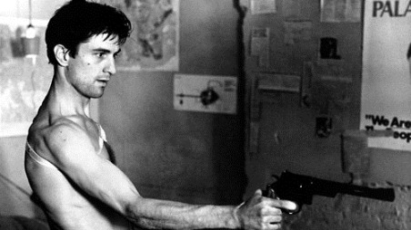

# Atsiliepimai apie filmus

### [The Sunset Limited \(2011\)](https://www.imdb.com/title/tt1510938/?ref_=ttqt_qt_tt)

* Filmas, kuriame du veikėjai įsivelia į filosofinius debatus ir dvasinę kovą apie pozityvumą vs pesimistinę desperaciją/cinizmą, apie tikėjimą vs ateizmą, apie individualizmą ir skirtingus požiūrius į gyvenimą ir gyvenimo pagrįstumą.
* Samuel L. Jackson'as nors yra pakankamai respectinamas aktorius, tačiau dažnai nėra pakankamai įvertinamas. Pirmiausia ko gero dėlto, kad jis šioje industrijoje aktyviai dirba jau daugiau nei 30 metų ir yra išties itin produktyvus - kiekvienais metais pasirodo bent po keletą filmų. Kas šiaip, žinoma, nebūtų blogai, tiesiog su tokiu dideliu repertuaru visada atsiranda ir ne itin stiprių vaidmenų, kuriuose aktoriui išreikšti savo sugebėjimus nelabai yra galimybių. Kalbu apie vaidmenis Jurassic Park, Star Wars ar Marvel filmuose. Tačiau užtenka pažiūrėti Pulp Fiction, Django Unchained ar Black Snake Moan ir supranti, kad tai yra velniškai geras aktorius, kuris net ir savo tipinį seno pikto juodaodžio vaidmenį gali suvaidinti su išties daug subtilumų ir niuansų. The Sunset Limited drąsiai galima įrašyti prie jo stipriųjų vaidmenų.
* Vos pradėjus žiūrėti filmą, pagalvojau, kad jis akivaizdžiai tiktų teatro scenai, scenarijau pakeitimų nė nereikėtų. Ir buvau visiškai teisus: filmo scenarijus iš tiesų ir yra parašyta, kaip [pjesė ](https://antilogicalism.files.wordpress.com/2017/09/the-sunset-limited.pdf)ir skirta atlikimui scenoje.
* Kai kas gal filmą galėtų pakritikuoti jog veikėjai yra perspausti - visiškai balta arba visiškai juoda, tačiau manau, kad toks over the top atvaizdavimas ir buvo pasirinktas tam, kad reprezentuoti dvi visiškai priešingas filosofijas ir jog eigoje įžvelgtume abiejų jų trūkumus.
* Kadangi diskusija filme vyksta gan greitai ir yra išties nuostabių frazių, kurioms reikia laiko sugrumuliuoti, filmą reikia žiūrėti išties atidžiai, o ir ko gero bent kelis kartus arba tiesiog neskubant perskaityti pačią pjesę.

> When you read the history of the world you are reading a saga of bloodshed and greed and folly the import of which is impossible to ignore. And yet we imagine that the future will somehow be different.

> Black: I ain't a doubter, but I am a questioner.  
> White: What's the difference?  
> Black: A questioner wants the truth. A doubter wants to be told there ain't no such thing.

### [Jacob's Ladder \(1990\)](https://www.imdb.com/title/tt0099871/)

* Nesumaišyti su 2019-tų versija, kuri turi įspūdingą 2,3 balo įvertinimą IMDB sistemoje :D
* Vienas iš tų filmų, kurį įtariau esant geru, tačiau žinojau, kad jis bus savotiškas, galbūt sunkokai žiūrimas ir kuris būtent dėlto mano archyve pragulėjo bent keletą metų, kol galiausiai radau išties tinkamą nusiteikimą būtent jam.
* 90-ųjų psichologinis siaubo filmas, kuriame veiksmas vyksta 1975-ųjų gan tarybiškai atrodančiame New York'e. Šis filmų žanras yra gan nedėkingas režisieriams, nes padaryti jį "right" yra išties sudėtinga. Filmo pradžioje labai nesunku apsigauti palaikant jį nuobodžiu, ne itin puikiai išsilaikiusiu ir vietomis, net ir cheesy filmu. Tačiau taipogi galima argumentuoti ir į atvirkščią pusę - kai kurios scenos, kaip pvz kratomos galvos, pragaro ligoninės ar žmogaus be kojų, galima laikyti išties ikoninėmis ir įkvėpusiomis ne vieną matytą sceną kur kas labiau žinomuose, moderniuose filmuose. 
* Taipogi Jacob's Ladder tapo gan dideliu žaidimų serijos Silent Hill įkvėpimu ir kai kuriuose žaidimo dalyse net yra tiesiogiai referencinamas.
* Pradžioje susidaro įspūdis, kad tai filmas apie PTSD ar mental health, tačiau tai klaidingas įspūdis. Iš tiesų tai biblijinių motyvų kupinas filmas \(tai turėtų išduoti vien filmo pavadinimas\), kuris nors ir prasideda įtemptai, tačiau pamažu praranda pagreitį ir užsibaigia dramiškai, o ne su siaubo elementais. O eigoje kelia beviltiškumo, paranojos ir nejaukumo jausmą, jog something isn't right, jog prarandi kontrolę ir dėsningai vis labiau neriama į tokią karštinės metu sapnuojamo sapno miglą, kai prarandamas sąryšis su realybe, nebežinai kuo tikėti ir ribos tarpusavyje ima lietis. Tarsi šizofrenija, perteikiama video formatu. O tai iš tiesų ir yra gero psichologinio siaubo filmo požymis.
* Vienas iš tų filmų, kurį tikrai galima žiūrėti antrą kartą ir ne dėlto, jog jis būtų sunkiai perprantamas iš pirmo karto, visgi pabaiga nutėškiama per daug atvirai, o dėlto, jog antrąjį kartą pastebi daug daugiau detalių į kurias neatkreipei dėmesio pirmąjį kartą ir filmas įgauna naujų spalvų ir gali papildomai įvertinti.
* Iš tiesų esminė kritika šiam filmui tai ir būtų - jog jis galėjo užsibaigti viena scena anksčiau. Manau, kad kai pabaiga yra atvira ir leidžia kurti savo interpretacijas ir pasvarstymus ir jei jų metu pavyksta suvesti galus, ko galbūt nepavyko dar žiūrėjimo metu - filmas tavo galvoje tampa geresniu, įvertini jo ambicijas labiau, nei tais variantais, kai didžiąją filmo dalį tave klaidinęs ir neleidęs iki galo suprasti kas vyksta, ima ir pabaigoje atskleidžia visas savo kortas ir nepalikdamas absoliučiai jokios nežinios ir mistiškumo. Tokios pat kritikos pvz susilaukė ir puikiai žinomas 99-ųjų _The Sixth Sense_.
* Sakyčiau, jog kiek modernesnė, tačiau idealogiškai labai artima šiam filmui galėtų būti 2005-ųjų _The Jacket_ versija_._

> Eckhart saw Hell too. He said: "The only thing that burns in Hell is the part of you that won't let go of life, your memories, your attachments. They burn them all away. But they're not punishing you", he said. "They're freeing your soul. So, if you're frightened of dying and ... you're holding on, you'll see devils tearing your life away. But if you've made your peace, then the devils are really angels, freeing you from the earth."

### [LOVE DEATH + ROBOTS \(2019\)](https://www.youtube.com/watch?v=wUFwunMKa4E)

* Paskutinis iš tiesų įsimintinas, dėmesį išties patraukęs ir lūkesčius pateisinęs reginys Netflix'e buvo Devilman crybaby. Dabar šį titulą sėkmingai gali perimti šis serialas.
* Pirmą kartą su antologija susidūriau dar mokydamasis mokykloje, kai išvydau Animatrix \(2003\). Ir šioji įsiminė, jog vat iki šiol dar prisimenu. Dabar su šiuo žanru daugiausiai žmonės susipažinę iš Black Mirror \(kurio naujausias 5 sezonas buvo stebėtinai silpnas\).
* Love Death + Robots apima 18 trumpų serijų, kurias ir vienija šios 3 esminės temos.
* Kadangi epizodai kardinaliai skirtingi, tai žinoma patiko toli gražu ne visi, bet antologijos tuom ir geros, jog kažką sau rasti tokiame asorti gali kiekvienas.
* Epizodai Good Hunting ar Shape-Shifters per gan trumpą laiką spėjo išvystyti gan nemažai istorijos ir visai nesunku būtų įsivaizduoti, kad šiuos pavienius epizodus būtų galima išplėsti į atskirus show.
* Labai neblogai parašyta Zima Blue epizodas, o ir jo stilistika primena, lyg taipogi būtų iš Animatrix. Įsimintina liko ir The witness. Sužavėjo ne tiek savo istorija, kiek labai unikalia stilistika. Pirmą kartą mačiau kažką tokio panašaus. Galbūt turi panašumų su Into the spiderverse, tik daug labiau NSFW ;\)
* Džiaugiuosi ir tuom, kad tai ne vienkartinis reikalas ir jau yra paskelbtas antrasis sezonas.

### [Chernobyl \(2019\)](https://www.youtube.com/watch?v=s9APLXM9Ei8)

* Vienas įspūdingiausių ir geriausių serialų, kurį mačiau per pastaruosius keletą metų ir kuris išties puikiai atpasakoja įvykusio tragedijos masiškumą ir kraupumą. Toks siaubo ir katastrofų žanrų mišinys, kuris net tokią sceną, kaip 90 sekundžių trukmės akmenų metimą su kastuvu, gali padaryti absoliučiai bauginančią. 
* Senokai jau teko susidurti su serialu, apie kurį kalba net tie aplinkiniai, kurie įprastai serialų nelabai žiūri. Šiuo metu tai patį aukščiausią reitingą turintis serialas, kuris nusipelnė pasidžiaugti tokia šlove ir kiek liūdnoka stebėti, kai mūsuose garsiausiai einantis atsiliepimas yra pašiepimas dėl plastikinių langų.
* O geras jis ne dėlto, kad filmuotas Lietuvoje ar kad jame vaidina vienas kitas lietuvių aktorius. Geras dėl puikiai savo darbą atlikusių aktorių, puikiai parašytų dialogų, dėl veikėjų išvystymo ir jų dinamikos tarpusavyje, siužeto, tempo, garso takelio, atmosferos, scenų, kostiumų, makeup'o ir kinematografijos. Praktiškai nė neabejoju, jog Emmy apdovanojimuose turėtų susirinkti visą krūvą apdovanojimų, nes tai išties stipriausias metų serialas. Dvigubai džiugina ir tai, kad titruose galima matyti dešimtis lietuviškų pavardžių, vienaip ar kitaip prisidėjusių prie šio serialo gamybos.
* Po pirmos serijos [pasiskaitinėjau apie katastrofą](../istorija/#cernobylis) plačiau ir išties džiugina ir serialo tikslumas. Nuo buities, atmosferos iki realių faktų perteikimo ar net personažų išvaizdos \(ypač 3 teisiamieji\). Žiūrint tikras įvykių nuotraukas, kaip pvz [ši](https://pbs.twimg.com/media/D7npH33XsAUv4Yc.jpg), pasimato kaip on point viskas perteikta seriale. Netgi buvo panaudoti realūs skambučio į gaisrinę įrašai ir televizijos pranešimai. 
* Gerai ir tai, kad nors serialas JAV gamybos, tačiau išvengta gan įprasto jiems rusų vaizdavimo stereotipiškai, komiškai - t.y. nekompetentingais, degtinę geriančiais durneliais. Veikėjai išlaikyti natūralūs, realistiški. Taipogi ir tai, kad iš principo seriale nėra išties neigiamų veikėjų. Neigiama piešiama melais ir informacijos slėpimu pagrįsta sistema ir tai, kaip nuo jos nukenčia visi. Bei nebuvo bandyta kiršti žalios energetikos pozicija apie tai kokia branduolinė industrija pavojinga. 
* Nors atominai reaktoriai yra išties sudėtinga tema, tačiau seriale padarytas geras darbas išaiškinant jų veikimą. Nupaprastinta tiek, kad visiškai nenutuokiantis žmogus suprastų patį principą, tačiau nenuklystama nuo faktų, kad net šią sritį suprantantys žmonės gali tiesiog pritariamai linksėti.
* Labai gerai, kad jis tokios trumpos, fiksuotos trukmės. Kiekviena scena seriale buvo reikalinga, svarbi, visiškai nesijautė tuščių, fillerinių vietų, tad istorija papasakota labai balansuotai. Net ir paskutinė serija išlaikė dėmesį, nerimą ir įtampą, ko įprastai nebūna serialų finaluose.
* Po paskutinės serijos buvo paminėtos, net tos smulkios detalės, dėl kurių kažkas kibdavo, kaip pvz kad moteris mokslininkė iš tiesų neegzistavo ar kad 3 vyrai herojai kurie atsuko vožtuvus, išties nemirė, nors serialas taip ir leido suprasti. Yra išleistas atskiras[ podcast'as](https://www.youtube.com/watch?v=rUeHPCYtWYQ), kuriame režisierius aptaria kiekvieną seriją atskirai. Apie tai kas parodyta, ko neparodė, kokias kūrybines laisves leido sau priimti, norint istoriją geriau perteikti ekranuose. Tikrai padeda šį serialą vertinti ir jo kūrėjus gerbi dar labiau.

`Every lie we tell incurs a debt to the truth. Sooner or later that debt is paid.   
  
Why worry about something that isn’t going to happen? That’s perfect. They should put that on our money.`

Taipogi ištrauka iš Lyudmilla Ignatenko \(gaisrininko žmona\) knygos Voices From Chernobyl:

> At the morgue they said, "Want to see what we'll dress him in?" I do! They dressed him up in formal wear, with his service cap. They couldn't get shoes on him because his feet had swelled up. They had to cut up the formal wear, too, because they couldn't get it on him, there wasn't a whole body to put it on. It was all — wounds. The last two days in the hospital — I'd lift his arm, and meanwhile the bone is shaking, just sort of dangling, the body has gone away from it. Pieces of his lungs, of his liver, were coming out of his mouth. He was choking on his internal organs. I'd wrap my hand in a bandage and put it in his mouth, take out all that stuff. It's impossible to talk about. It's impossible to write about. And even to live through. It was all mine.

### [The way way back \(2013\)](https://www.youtube.com/watch?v=6qoaVUdbWMs)

* Po Kings of summer norėjosi pažiūrėti dar kokį coming of age stiliaus filmą. Besiknaisiodamas radau rekomendacijas į šį.
* Istorija apie kuklų paauglį berniuką, kuris kartu su savo mama, jos naujuoju, gan nemaloniu valdingu jos vaikinu ir jo dukra išsiruošia atostogauti. Negalėdamas pritapti, stengiasi kuo mažiau būti namie ir netikėtai susipažįsta ir susidraugauja su vyruku, dirbančiu vandens pramogų parke.
* Coming-of-age stiliaus filmai dažniausiai būna visi tokie lengvi, gan nerūpestingi ir dažniausiai rodantys vasaros laikotarpį.
* Nors filmas pozicionuojamas kaip komedija ir jame ir buvo kelios visai juokingos frazės, bet overall tai yra labiau toks feeling good filmas, kurį reikėtų žiūrėti norint lengvučio, gerai nuteikiančio filmo. Galbūt tokio, kuriame gali pilnai suprasti pagrindinį veikėją, nes tikrai teko patirti tą laikotarpį, kai buvai panašaus amžiaus ir tekdavo būti su suaugiais ir ten, kur visai nenori būti. 

> `Owen: I'm afraid I'm gonna have to ask you to leave.  
> Duncan: What?  
> Owen: Yeah, you're going to have to take off. I'm getting complaints. You're having way too much fun. It's making everyone uncomfortable.  
> Duncan: Okay.  
> [walks away from picinic table where he has been sitting alone]  
> Owen: Hey, hey! Whoa, whoa. I'm just kidding. Wow! That wasn't even my best stuff. Are you for real? Listen, I can tell you're in complete awe of our picnic table. It is one-of-a-kind, except for the 200 other ones here that are exactly like it. There is more to the park to be seen.`

### [Avengers: Endgame \(2019\)](https://www.youtube.com/watch?v=TcMBFSGVi1c)

* Net 3h ilgio filmas, užbaigiantis visą prieš dešimtmetį pradėtą Marvel arką.
* Nors filmas išties ilgas, tačiau žiūrint visai neprailgo ir laikas prabėgo išties greitai. Bendrai paėmus, tikrai enjoyable filmas, su sąlyga, kad žmogui tinka fantastika/comic book filmai.
* Filme tikrai yra problemų, pvz yra sudėta tikrai nemažai humoro, kuris deja tikrai ne visada veikia \(kad ir ta pati scena su Fortnite :/\), paliktos kelios loginės spragos ar kad Captain Marvel veikėja yra visiškai antiklimatiška ir neįdomi, bet bendrai paėmus tai ganėtinai solidus šios istorijos užbaigimas, gan neblogai uždarantis keletos veikėjų arkas.
* Taipogi gražus fanservice sprendimas buvo, grąžinti žiūrovą į nemažą dalį svarbiausių scenų iš visų praėjusių filmų. Tikrai sukelia tokį pabaigos, restrospektyvos jausmą.
* Patiko ir tai, kad filmo traileris parodė tik filmo pradžios įvykius, pro kuriuos buvo prabėgta labai greitai ir pvz. kerštas villain'ui įvyko dar filmo pačioje pradžioje, tad ganėtinai apvertė lūkesčius.
* Asmeniškai manau, kad Infinity War man patiko kiek labiau. Galbūt dėlto, kad pastarasis filmas buvo tamsesnis. Ne kasdien pamatysi herojų filmą, kuriame herojai pralaimi ir ties tuo filmas ir užsibaigia. Tikrai buvo netikėta. Šis filmas prasidėjo irgi tamsokai, buvo bandyta perteikti depresija, kaip likę žmonės palūžo ir bandė gyventi toliau, tačiau pasijutau, jog tai buvo padaryta prabėgom ir pritrūko svorio. Galbūt prie to prisidėjo ir tai, jog tiesiog nutuokiau, kad šioje dalyje įvykiai bus reversinti ir pabaiga bus laiminga, tad dėlto tragedijos padariniai praranda savo reikšmingumą.
* Man labai patinka, kaip išvystas Thanos veikėjas. Pirmoje dalyje jam galbūt skirta kiek daugiau dėmesio ir daugiau vystymo, tačiau jis tikrai nebuvo blogas ir antroje dalyje. Geras villain'as turi konkretų tikslą, kuris atsiranda dėl suprantamų ir iš dalies visai pateisinamų priežasčių. Kai turi konkrečius žingsnius, kaip to tikslo pasiekti ir jų laikosi. Ir kai siekdamas savo tikslo, jis gali daryti nelabai gerus dalykus, ne dėlto, kad jis tiesiog iš principo yra evil ir nori visus pavergti ar pakenkti, o dėlto, kad jam tikslas yra svarbesnis ir dėlto jis pateisina priemones. Vienas iš mano labiausiai mėgstamų villain'ų yra Joker'is. Thanos galiu statyti į antrąją vietą. Parašytas veikėjas tikrai brandžiai, o ir aktorius suvaidino taip, jog persiteikia veikėjo kompleksiškumas.

### **Game of Thrones pabaiga**

* GoT yra puikus pavyzdys, kad žmonės, kurie labai gerai daro vienus dalykus, nebūtinai gali daryti kitus. Filmo kūrėjai D&D išties pasižymėjo pirmuosiuose sezonuose išties fantastiškai knygų adaptacija. Jie mokėjo puikiai atskirti kas istorijoje yra išties svarbu, o kokias detales galima iš istorijos iškirpti. Serialo tempas ir siužetas buvo tiesiog puikūs. Tačiau, kaip jau žinom, tada knygos pasibaigė ir jiems teko kurti savo scenarijų ir serialas pradėjo palaipsniui leistis žemyn, ko absoliuti atomazga tapo paskutinis sezonas ir ypač finalas, kuris visą character developmentą, padarytą per praėjusius sezonus, tiesiog nuleido į kanalizaciją ir iššaukė labai audringas žmonių reakcijas. Suprantama, šitiek metų vystyta istorija baigėsi taip paskubomis ir taip nebūdingai serialo tradicijoms ir siužetui, jog paliko kotkų skonį. Tačiau:
* kaip tiesiog dėl serialo, pasipylė labai didelės overreakcijos. "We’ve seen time and again how that level of investment can shift into a more toxic feeling of ownership, leading to absurd temper-tantrums like petitions demanding the ending be remade to meet personal expectations."
* Sezonas tikrai be abejonės smarkiai kritikuotinas, scenarijaus kokybė smuko, na bet pati pabaiga nėra tokia jau katastrofiškai bloga, kaip kai kurie mėgsta pavaizduoti. Jeigu prisiminti Dexter'io ar Lost'ų pabaigas pasimato ką reiškia, kai serialas užbaigiamas tiesiog tragiškai be jokių skrupulų. Čia toli gražu nebuvo iki tokio lygio. Problema buvo net ne tiek finalas, o kaip jis pasiektas. Nereikia pamiršti, jog greičiausiai Martin'o knygose rezultatas bus labai panašus. Tik ten bus užtektinai vietos viską plačiai išvystyti ir dėlto bus kur kas labiau satisfying.
* Manau, kad sezonas būtų buvęs kur kas labiau priimtinesnis, jei vietoj 6 serijų, būtume tiek praėjusiame, tiek šiame sezone gavę po standartines 10 ir tas extra laikas būtų skirtas lėtesniems į veikėjus fokusuotoms scenoms, pokalbiams. 4 papildomos valandos galėjo kur kas labiau užglaistyti veikėjus ir jų motyvacijas.
* Visgi nereikia pamiršti priežasčių, kodėl serialas tapo tokiu populiariu in the first place. Jo production'o kokybė  nuostabi: set'ai, kostiumai, CGI, praktiniai efektai ar vaidyba išties aukščiausio lygio, visa galva aukščiau už bet kurį kitą televizijos serialą. Problema, kad šiomis savybėmis sunku mėgautis, kai scenarijus tampa silpnas. Tad nors ir buvo išties įdomu stebėti šią kelionę, kuri padovanojo tikrai ne vieną neišdildomą įspūdį, tačiau pabaiga išties sugadina šio show legacy.
* Geras, scenarijaus didžiausius trūkumus aptariantis [video ](https://www.youtube.com/watch?v=I8U6kjqLkJQ)apie tai.

### [The Witch: Part 1. The Subversion \(2018\)](https://www.youtube.com/watch?v=BmD6BAQjDzY)

* Iki šiol kiek teko matyti korejietiškų filmų - visi paliko įspūdį. Taip, dažniausiai jų filmai leidžiasi į gan nemažus kraštutinumus ir yra gan smarkiai perspaudžiama. Ypač tai galioja jeigu filmas yra su fantastiniais elementais. Jeigu jau pradedi, tai jau eiti iki galo ir pateikti fantastikų fantastiką. Tačiau... Kad ir kokie nerealistiški scenarijai tai būtų, pats filmas būna padarytas išties kokybiškai ir dėlto susižiūri kaip visai nebloga pramoga.
* Filmas pasakoja istoriją apie mergaitę, kurį pabėgusi iš kažkokios organizacijos, praranda atmintį ir ją priglaudžia pas savęs vyresnio amžiaus pora. Praėjus dešimtmečiui jos gyvenime pradeda atsirasti ir persekioti žmonės iš jos praeities, teigiantys, kad mergaitė yra ypatinga ir turi specialių sugebėjimų.
* Pagrindiniai du įsiminti šio filmo aspektai man buvo pagrindinės veikėjos vaidyba ir kovos scenos. Vaidyba įsiminė dėlto, kad kai įvyksta pagrindinis siužeto posūkis, aktorės veidas pasikeitė tiek kardinaliai, kad būtų galima pagalvoti, kad tos scenos jau buvo nufilmuotos su visiškai kitu žmogumi. Kovos scenos įsiminė dėl to, jog buvo over-the-top. Žinoma, jei vaizduoti kaip kaunasi porą super-humans, tai negali rodyti, tiesiog paprastų muštynių. Taigi rezultate turime kovą, kurioje smūgiai vaizduojami ultra stiprūs ir tiesiog kumsčiais griaunamos sienos. Patiko vien dėlto, kad labai primena anime ir visa tai atlikta išties labai kokybiškai. Kaip bebūtų, azijiečiai tikrai moka sukurti kovų choreografiją.
* Žinoma, overall filmas gan idiotiškas, su video žaidimus primenančiu scenarijumi, tačiau jeigu į jį nežiūrėti rimtai, tai puikus pramoginis veiksmo filmas. John Wick šiuo metu irgi populiarus toli gražu ne dėl realistiškumo :\)

### Tarp pilkų debesų \(2018\)

* Pagal lietuvių kilmės JAV rašytojos knygą pastatytas filmas, kurį kūrė mišri tarptautinė kūrybinė grupė. Istorija pasakoja apie 15-metę merginą, kuri karo metais kartu su mama ir jaunesniuoju broliuku ištremiami į sibirą.
* Vos pradėjus žiūrėti filmą, atkreipiau dėmesį į profesionalų kameros darbą, montažą. Cut'ai sudėlioti natūraliai, filmavimo kampai profesionalūs ir juosta žiūrisi lengvai. Ko negalėčiau pasakyti apie prieš tai bandytą sužiūrėti filmą "Sangailės vasara", kurio production'as tiesiog suerzino.
* Vaidyva tikrai nebloga ir nors nebuvo išskirtinė, tačiau be tos įprastos teatrinės įtakos, kuri būna ko ne visada. Tiesa, tikriausiai dėlto, kad didžioji dalis aktorių ir nebuvo lietuviai.
* Tačiau visgi pati istorija nebuvo labai įtraukianti. Filmas, kurio pagrindas kaip ir yra perteikti to laikmečio žiaurumus, jų pernelyg daug taip ir neparodė. Pora šūvių ir psichologinio smurto ir viskas susiveda tiesiog į atšiaurias klimato sąlygas. Galbūt būtų norėjęsi daugiau terorizavimo, sunkumų, kuriuos tenka įveikti pagrindiniams herojams. Veikėjai taipogi nebuvo labai įdomūs, dėlto su jais tapatintis sunku.
* Gan per lengvas, pateiktas gan paviršutiniškai ir akivaizdžiai yra orientuotas į užsienio rinką ir šiame kontekste ko gero ir veikia labiausiai. Lengvai ir greitai nupiešia bendrą paveikslą, supažindina su mitais ir tautiškumu. Manau tokių filmų eksportui tikrai reikia. Tačiau, šis, puikiai mums pažįstamas istorijas pasakojantis filmas, namuose, be savo aukštos produkcijos, didelio įspūdžio visgi nepalieka.

### [Mid90s \(2018\)](https://www.youtube.com/watch?v=zXzSE0uqmjI)

* Jonah Hill režisūrinis debiutas, pasakojantis apie 13-metį gyvenantį 90-tųjų Los Angeles, kuris gyvena tipiniame low income rajone, probleminėje šeimoje ir ieško pabėgimo nuo rūpesčių tarp savo naujų skaterių draugų.
* Filmas iš esmės siužeto nelabai turi. Didžioji filmo dalis yra tiesiog paauglių laiko leidimas kartu vasaros laikotarpiu. Tačiau pagrindinė filmo užduotis buvo perkelti žiūrovą į tą laikmetį ir manau, kad tai padaroma puikiai su 16mm "kvadratinio vaizdo" kamera, muzika, charakteriais. 
* Filmas sukelia tokį real jausmą, neatrodo, jog žiūrėtum aktorius, o tikrus vaikus, iš tiesų šeliojančius, skate'inančius ir kalbančius nesąmones. Manau, kad puikiai perteikia paauglystę tuo laikmečiu.
* Susižiūrėjo net labai puikiai, nes šis filmas kaip man nukėlė mane į šiltus, nostalgiškus prisiminimus. Galėjau nesunkiai releate'intis su pagrindiniu veikėju, kai norisi pabėgti nuo problemų, kai ieškai pripažinimo ir palaikymo iš draugų.
* Galima įžvelgti panašumų su kitais, paauglių laisvalaikį, patirtį ir brandos laikotarpį vaizduojančiais filmais, kaip Kids ir Thirteen.

`You literally take the hardest hits out of anybody I'd ever seen in my life. You know you don't have to do that, right?`

### [After Life \(2019\)](https://www.youtube.com/watch?v=eIGGKSHMQOM)

* Naujausias Ricky Gervais serialas apie vyrą, kuris po savo žmonos netekties tampa kandus ir praranda norą ir tikslą toliau gyventi.
* Serialo siužetas paprastas, labai nepretenzingas, ganėtinai struktūriškas ir lėtas.  Nesitikėjau iš jo daug, iš anksto pernelyg neįsigilinęs tikėjausi kiek lėkštoko, Gervais būdingo humoro, o visgi maloniai nustebino. Pirmiausia savo paprastumu, eiga ir tuo, kad liečiamos depresijos, egzistencinės krizės temos, tačiau tai daroma be pernelyg daug užmojo ir šiuo atveju man tai patinka. Taipogi labai puikiai sueina ir humoras. Kasdieninės, nepatogios situacijos, pripildytos sarkastiskų replikų.
* Pavadinčiau tai lengvu, bitter sweet savaitgalio popietės serialu. 
* Savo tuo slice of life ir nepatogiomis situacijomis turi kiek panašumų į Louie.

`#I’d rather be nowhere with her, than somewhere without her.  
  
#You’re like a troll on Twitter. Just because you’re upset, everyone has to be upset.   
  
#Happiness is amazing. It's so amazing, it doesn't matter if it's yours or not`

### [Kings of summer \(2013\)](https://www.youtube.com/watch?v=fThJt2nRUeM)

* Yra toks filmų stilius, kuriuos galima apibūdinti, kaip nerūpestingi, šarmo turintys nedidelio biudžeto indie filmai, kur veiksmas vyksta vasarą ir pasakoja coming of age istoriją bei apie santykius, pirmąsias meiles ar draugystes. Į tokių filmų kategoriją galima būtų įstatyti Earl and the Dying Girl, The Spectacular Now, The Perks of Being a Wallflower, Stand By Me ir šį, Kings Of Summer.
* Rimtai į save nežiūrintis filmas, turintis nemažai quirky scenų, kartais gal besistengiantis būti per daug hipsterišku. Bet turintis tokį savo labai įdomiai keistą stilių.
* Galbūt daug kam toks filmas nepatiktų, nes iš esmės istorija nieko labai ir nepasakoja, istorija gan paviršutiniška ir nuspėjama, tačiau man patiko, vien dėlto, kad labai primena paties paauglystę. Paveikia išties labai retrospektyviai.

`Biaggio: Do you know we've been walking for half a mile? I can tell by how much we've bonded.  
Joe: You haven't said a word the whole time.`

### [Taxi Driver \(1976\)](https://www.imdb.com/title/tt0075314/)

Publikuota: 2010-11-15

Prieš gerus metus žiūrėtas _GoodFellas_ mane sudomino ir nusprendžiau peržiūrėti daugiau Martin Scorsese ir Robert Deniro bendrų darbų. Į mano “Plan To Watch” sąrašiuką įsirašė _Mean Streets_ \(1973\) , _Taxi Driver_ \(1976\), bei _Raking Bull_ \(1980\). Ir štai pagaliau vienas iš jų, būtent 76-tųjų darbas galų gale pasiekė mano akis.

 _I think someone should just take this city and just… just flush it down the fuckin’ toilet._

Begėdiškai jaunas Robert De Niro atlieka 26 metų Travis Bickle vaidmenį. Tai Vietnamo kare dalyvavęs  sveikas, tačiau psichiškai paveiktas vaikinas, kuris negali naktimis užmigti. Tikėdamasis, kad naktinis taksisto darbas jį išsekins ir jis galės išsimiegoti, įsidarbina vienoje taksi kompanijoje ir ima važinėtis po naktinį miestą, kuriame pilna pačių įvairiausių atmatų.

Kiek teko matyti _Scorsese_ darbų, tai visi jie labai brandūs, solidūs, pasakantys daugiau vaizdais, nei žodžiais. Taip ir šioje juostoje labiausiai užburia senoviniai, bei dideli taksi, kurie rieda naktinėmis NY gatvėmis, bei pagal lyrišką jazz’o muziką siūbuojantis spalvų, bei atspindžių šokis ant to taksi stiklų. Tai sukuria aštrų ir įsimintiną naktinių gatvių vaizdą.

Personažas yra tipiškas Harvey Cleckley “nutapytas” sociopato portretas. Visuomeniškai priimtinas, socialus ir net galima pavadinti “tobula asmenybė”. Įdomiausia yra tai, kad žiūrovas suvokia jo sociopatiškąją gyvenimo žaizdą, o kulminacijoje ji pasirodo visu gražumu, tačiau Scorsese taip įdomiai atpina jo elgseną, kaip pateisinamą poelgį visuomenei, kad net imi svarstyti ar teisingai suvokei jaunojo taksisto būtį.Nepateisinamas elgesys tampa pavizdine visuomenine norma. Savo nepasitenkinimu purvinu pasauliu prarandęs sveiką protą jis visgi tapo miesto didvyriu, paliko anspaudą laikraščių archyvuose, bei, rodos, nusiramina. Deniro puikiai atskleidė herojaus charakterį: vidiniai herojaus monologai, vienatvė ir prisiminimų kančia tiesiog įsigėrę į aktoriaus veidą. Ko gero tai viena iš pagrindinių priežasčių, kodėl šis filmas toks geras.

### [Memoirs of a Geisha \(2005\)](https://www.imdb.com/title/tt0397535/)

Publikuota: 2010-10-17

Nors filmas žiūrėtas toli gražu ne pirmą kartą, tačiau užsimaniau pažiūrėti dar kartelį, nes paskutinį kartą žiūrėjau jį dar kokiais 2006-aisiais, kai dar neturėjau tokio susidomėjimo Japonijos kultūra. Na ir eilinį kartą šis filmas mane sužavėjo**…**

**Siužetas:**

Azijietiška pelenės istorija apie vargšę mergaitę parduotą į vergiją ir turinčia sunkiai dirbti, bei sudėtingą jos kelią į sėkmę ir pripažinimą.

Galbūt iš dalies toks geras filmo vertinimas iš mano pusės yra dėlto, kad senai bežiūrėjau gerą japonišką filmą ir mano akys tiesiog buvo išsiilgusios stilingų tekančio vandens, lietaus, bei sakurų vaizdų, o galbūt tai ištikro toks geras darbas, kad jam likti abejingam yra sunku…  
Manau tikrai daugelis, o ypač tie, kurie prijaučia ir žavisi japoniška kultūra neliks abejingi filmu, kuriame vaizduojamas paslaptingas ir nepažystamas pasaulis, kultūra, etiketas. Kažkuri dalis žmonių liks užliūliuoti įspūdingais vaizdais ir tradicinės japoniškos muzikos, na o trečia žmonių grupė, kurie daugiausiai gilinasi į siužetą – išgyvens dramatišką meilės istoriją, prilygstančią žymiajam Titanikui.

Kaip bebūtų su mano nuomone nesutinka nemaža dalis kritikų, kurie užsipuolė šią juostą, kad ji per daug neoriginali, neįdomi, supopsinta. Nesu didelis ekspertas, tačiau jei žiūrėdamas filmą nė nesusimąstai apie vaidybą, jei dialogai nesubanalėja ir niekas neužkliūna, reiškia viskas atlikta pakankamai profesionaliai. Iš kinematografinės pusės tai vienas gražiausių darbų filmų istorijoje. Garso takelis, kameros darbas, bei neįtikėtini gamtovaizdžiai padaro šį filmą tikru meno kūriniu ir filmo kūrėjai buvo atitinkamai įvertinti – laimėti net 3 oskarai \(už kostiumus, meninį apipavidalinimą ir operatoriaus darbą\). Nors filmą mačiau kokius tris kart, bet susiklosčius aplinkybėms neatsisakyčiau jį žiūrėti ir dar kartelį, nesvarbu, kad vos katik jį žiūrėjau. Tai tikras saldainis japonišką kultūrą mėgstančiam žmogui.

**Keletas faktų apie filmą:**

Režisierius apie filmo statymą planavo 8-erius metus. Apie tai išgirdusi pop muzikos karalienė Madona bandė įsiprašyti į šio filmo aktorių sąrašą. Taigi norėdama įrodyti savo aistrą Japonijos kultūrai nufilmavo muzikinį klipą „[Nothing really matters](http://www.youtube.com/watch?v=BCSmBzfH3WY)”. Na bet tai režisieriaus nepapirko ir vaidmeniui Madona nebuvo pasirinkta.

Japonijoje žmonės piktinasi, kad pagrindinius vaidmenis juostoje apie geišų gyvenimo paslaptis atlieka aktorės iš Kinijos. Tuo tarpu Kinijoje piktinamasi, kad jų šalies aktorės juostoje dėvės tradicinius „nacionalinių priešų ir okupantų“ kimono.

### [4.3.2.1 \(2010\)](https://www.imdb.com/title/tt1514041/)

Publikuota: 2010-10-11

Tie, kas mane skaito dar nuo 2009-tųjų, galbūt prisimena apie mano aprašytą nuostabų britų kino šedevrą, pavadinimu Kidulthood \(tamsus ir purvinas filmas apie britų paauglius\). Taigi, šio filmo režisierius, bei aktorius \(Noel Clarke\) suklijavo dar vieną ne ką prastesnį darbą, pavadinimu 4.3.2.1.

#### Siužetas:

Keturių draugių individualios nuotykių istorijos susipinančios į vieną bendrą deimantų vagystės istoriją.

Prisipažinsiu – britiškų filmų žiūriu iš ties nedaug, nes jie dažniausiai pasižymi kiek slogia nuotaika ir tas slogumas paveikia. Kaip ten bebūtų, tačiau tie filmai, kuriuos visgi prisiruošiu peržiūrėti būna gerokai geresni už holivudišką popcorną. Taip ir šio filmo atveju: laukiau, sulaukiau, pažiūrėjau ir kaip skrajutėje ir parašyta – manau, kad tai geriausias britų filmas šiais metais.

Dauguma iš jūsų tikrai matėte mūsų lietuviško kino žvaigždutę _Zero 2_. Abu šie filmai turi panašumo savo stilistikoje – rodoma vieno žmogaus istorija nuo pradžios iki pabaigos, tada peršokama prie kito žmogaus nuotykių ir t.t. Po truputis bendra istorija, kaip puzlė susidėlioja iš mažų nuotrupų ir pamatome galutinį siužetą. Tokia maniera nėra naujiena kino pramonėje, bet svarbu, kaip visa tai atlikta. Ir turiu pasakyti, kad šiame filme toks modelis suveikė. Kuo toliau žiūri, tuo labiau įsigilini į kiekvieną herojų atskirai, pamatai jų gerąsias/blogąsias savybes, bei rūpesčius, pamatai kokie skirtingi visgi žmonės.  
Visą filmą išlieka įtampa ir ji neatslūgsta iki pat pabaigos, nes tik tada viskas galutinai susidėlioja į vietas ir paaiškėja. Toks nuolatinis nežinojimas kas vyksta ir kas nutiks vėliau yra labai gerai ir padaro filmą labai mažai nuspėjamu.

Šį kartą juostoje man labiausiai sužibėjo ne Alan Decon ir net ne pats režisierius, o Emma Roberts, kuri yra ne tik, kad labai simpatiška mergužėlė, tačiau moka labai gerai vaidinti, na ir šiuo atveju jos personažas buvo artimiausias širdžiai. Vaikiškas nuoširdumas :j

Šį kartą Noel’is padarė mažiau šokiruojantį, mažiau atvirą, tačiau ne ką mažiau gyvenimišką ir įdomų filmą ir tikrai tikrai rekomenduoju jį susirasti ir pažiūrėti. Lietuvos kino teatruose filmas nebus rodomas.

### [Zeitgeist – Addendum \(2008\)](https://www.imdb.com/title/tt1332128/)

Publikuota: 2010-10-08

Pamenu, kad apie Zeitgeist’o teorijas pastoviai girdėdavau kalbant draugus ir po truputis atsirado susidomėjimas šiuo filmu. Ir nors peržiūrėta pirmoji dalis man tikrai patiko, bet iki antros dalies peržiūros prireikė daugiau nei metų. Nusprendžiau, kad neberašysiu populiarių, kino teatruose rodomų filmų apžvalgų, nes tam yra atskiri, dideli specializuoti interneto portalai ir asmeniniai dienoraščiai, o oriantuosiuosi į senesnius filmus, apie kuriuos jau niekas nebekalba. Taigi, šiandien 2008-tųjų metų filmo _Zeitgeist: Addendum_ eilė.

Po pirmojo filmo _Zeitgeist – The Movie_ pasirodymo, šio filmo režisierius \(Peter Joseph\) susitiko su Veneros projekto kūrėju \(Žaku Fresko\), kuris suteikė įkvėpimo sumontuoti ir antrąjį filmą. Šiame filme bandoma atskleisti dabartinės sistemos veikimo principai, neigiami jų aspektai ir pasakojama apie alternatyvią daug geresnę sistemą, bei stabdžius tai sistemai pasiekti. Lyginant su pirma dalimi, čia daugiau pasakojama ne apie konspiracijos teorijas, o apie konkrečią dabartinę situaciją, kurioje mes gyvename, bei apie būdus mažiau priklausyti nuo šios sistemos pokyčių.

Filmo pradžioje paprasta, mums suprantama kalba paaiškinami įprasti ekonominiai varikliai, tokie kaip: pinigų sukūrimas iš oro, infliacijos atsiradimas, ekonomikos kontroliavimas valdant pinigų kiekį apyvartoje, bei žmonių vergovė. Taip pat atskleidžiama Amerikos veiksmai bandant kontroliuoti pasaulį per savo vadinamąją laisvą prekybą bei atviras rinkas, kurioje užsienio vadovai papirkinėjami arba pašalinami iš kelio.

Antroje filmo dalyje – interviu su Žaku Fresko, bei Roksana Medous, kurie pristato savo kuriamą alternatyvaus pasaulio modelį. Čia, pateikiamas sprendimas neišvengiamai sistemos tragedijai išspręsti – technologija, bei išteklių ekonomika, o ne politika yra problemų sprendimas.

Galbūt filme ir yra loginių klaidų ir jis nėra absoliučiai teisingas, tačiau, kaip Žakas Fresko minėjo: nėra tobulos sistemos ar tobulos visuomenės, bet mūsų siūlomas modelis yra kur kas geresnis, nei šiandieninis.

Svarbiausia čia yra prajudinti tas užkalkėjusias žmogaus smegenis, kad pagaliau nustotų priimti jau “suvirškintą” informaciją, kokią pateikia TV, laikraščiai ir kiti informacijos šaltiniai, o pradėtų patys mąstyti. Zeitgeist neturi tikslo plauti visiems smegenis ir maitinti nerealiomis idėjomis. Zeitgeist turi tikslą žmonėms pasakyti, kad pats laikas nustoti pasikliauti kitais ir pradėti patiems galvoti. Nes kaip rodo šiandiena, tuo yra stipriai manipuliuojama. Dėl to kyla karai, dėl to žmonės tampa vis labiau abejingi įvykiams vykstantiems bent milimetru toliau jų nosies, ir dėl to, žmonių gyvenimas yra vergovė apie kurią jie nė nenutuokia.

### [ **Super Size Me \(2004\)**](https://www.imdb.com/title/tt0390521/)\*\*\*\*

Publikuota: 2008-07-12

2004 metų dokumentinis filmas, sukurtas nepriklausomo filmų kūrėjo – Morgan Spurlock. Šis filmas seka 30 dienų laikotarpį, kurio metu filmo autorius atsisakė viso normalaus maisto ir mito tik McDonald’s greito maisto restoranuose pateikiamu maistu. Filmas dokumentuoja drastiškus tokios gyvensenos padarinius filmo herojaus fizinei ir psichinei sveikatai, o taip pat analizuoja greito maisto pramonės įtaką visuomenės mitybos įpročiams, ir pasakoja, pvz., kaip greito maisto verslas bando pritraukti žmones – ypatingai vaikus – pas save ir pripratinti juos prie žalingos, nepilnavertiškos mitybos – vardan savo pelno. Filme galite sužinoti daug faktų apie McDonalds maistą. Tie faktai tiesiog pribloškiantys. Jei dar nematėte šio filmo – siūlau pasižiūrėti

