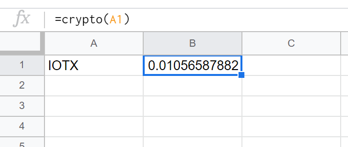

# Crypto

## Anonymous wallets

* [https://www.bitamp.com](https://www.bitamp.com) (Bitcoin only)
* [https://rahakott.ch/](https://rahakott.ch)
* Samourai (Android only)

## Gyventojo mokesčiai iš kriptovaliutų uždirbus milijoną eurų 2020 m.

2013 m. įsigijote 100 bitkoinų, o 2020 m. pardavėte. Gavote 1 mln. eur pajamų. 2020 m. vykdėte individualią veiklą ir iš prekybos bitkoinais ar kita kriptovaliuta taip pat gavote 1 mln. eurų įplaukų. Kokius mokesčius tokiais atvejais reikėtų mokėti?

**Vienkartinis kriptovaliutų pardavimas.** Apmokestinamasis pelnas (pajamos) apskaičiuojamas taip: iš kriptovaliutos pardavimo kainos atimama jos įsigijimo kaina ir kitos išlaidos, susijusios pardavimu (pvz., komisinis mokestis). Per metus gauto pardavimo pelno (pajamų) dalis, viršijanti 2500 Eur, apmokestinama taikant 15% gyventojų pajamų mokesčio tarifą. Dalis, viršijanti 120 VDU (VDU – vidutinis darbo užmokestis, taikomas apdraustųjų asmenų valstybinio socialinio draudimo įmokų bazei skaičiuoti), apmokestinama taikant 20% pajamų mokesčio tarifą. 2020 m. 120 VDU buvo 148.968 Eur. Tad 20% pajamų mokesčio tarifu apmokestinamos pajamos, kurios viršija 148.968 Eur sumą.

**Pavyzdys.** Gyventojas 2020 m. pardavė bitkoinų už 1.000.000 Eur. Bitkoinų įsigijimo kaina – 10.000 Eur. Kitų pajamų gyventojas negavo. Neapmokestinama suma – 2500 Eur. Vadinasi, per mokestinį laikotarpį asmuo gavo 987.500 apmokestinamųjų pajamų. Ši apmokestinamųjų pajamų sumą apskaičiuojama taip: iš kriptovaliutų pardavimo kainos atimama įsigijimo kaina bei neapmokestinama suma (1.000.000 Eur – 10.000 Eur – 2.500 Eur = 987.500 Eur).

Mokėtina gyventojų pajamų mokesčio suma apskaičiuojama taip:

(1) 148.968 Eur x 15% = 22.345,20 Eur;

(2) (987.500 Eur – 148.968 Eur) x 20% = 167.706,40 Eur.

Vadinasi, mokėtina gyventojų pajamų mokesčių suma būtų 190.051,60 Eur (22.345,20 Eur + 167.706,40 Eur).

**Individualios veiklos pajamos.** Jei asmuo iš kriptovaliutų prekybos siekia gauti ekonominės naudos per tęstinį laikotarpį, tokia veikla gali būti pripažinta individualia veikla. Vertinant, ar vykdoma veikla yra individuali veikla, be kita ko atsižvelgiama į tai, kokią pajamų dalį sudaro minėta nauda.

Individualios veiklos pajamos, gautos 2020 m., apmokestinamos taikant 15% pajamų mokesčio tarifą. Kadangi pajamos šiuo atveju viršytų 35.000 Eur sumą, todėl nebūtų taikoma pajamų mokesčio lengvata (pajamų mokesčio kreditas). Apmokestinamosios pajamos apskaičiuojamos iš gautų pajamų atėmus patirtas sąnaudas (pvz., kriptovaliutų įsigijimo kainą, komisinius ir pan.) arba 30% nuo pajamų. Vykdant individualią veiklą taip pat mokamos įmokos „Sodrai“.

**Pavyzdys.** Gyventojas 2020 m. iš prekybos kriptovaliutomis gavo 1.000.000 Eur pajamų. Kriptovaliutų bendra įsigijimo kaina mažesnė nei 300.000 Eur, todėl iš gautų pajamų atimama 30% (t. y. 300.000 Eur). Kitų pajamų gyventojas negavo. Vadinasi, per mokestinį laikotarpį asmuo gavo 700.000 apmokestinamųjų pajamų (1.000.000 Eur – 300.000 Eur = 700.000 Eur). Mokėtina gyventojų pajamų mokesčio suma būtų 105.000 Eur (700.000 Eur x 15% = 105.000 Eur). Jei asmuo nekaupia papildomai pensijai, jis dar turėtų sumokėti 10.409,14 Eur įmokų Sodrai (6.683,20 Eur valstybinio socialinio draudimo (VSD) ir 3.725,94 Eur privalomojo sveikatos draudimo (PSD) įmokų). Tiesa, asmenys, vykdantys individualią veiklą, gali nemokėti VSD įmokų, jei 2020 m. jiems buvo pirmieji individualios veiklos metai.

* [http://www.aginvest.eu/lt/gyventojo-mokesciai-kriptovaliutu-uzdirbus-milijona-euru-2020-m](http://www.aginvest.eu/lt/gyventojo-mokesciai-kriptovaliutu-uzdirbus-milijona-euru-2020-m)

## Track Shitcoin Pricing with Google Sheets

1. Access [https://coinmarketcap.com/api/](https://coinmarketcap.com/api/) to get the API key.
2. Open a Google Sheets spreadsheet and select the menu item `Tools -> Script editor`.
3. Created the function called “crypto” which takes ticker of cryptocurrency as an argument and return current price as USD:

```
function crypto(ticker) {
 
  var url = "https://pro-api.coinmarketcap.com/v1/cryptocurrency/quotes/latest?symbol=" + ticker;
  var requestOptions = {
    method: 'GET',
    uri: 'https://pro-api.coinmarketcap.com/v1/cryptocurrency/listings/latest',
    qs: {
      start: 1,
      limit: 5000,
      convert: 'USD'
    },
    headers: {
      'X-CMC_PRO_API_KEY': 'Your_API_key_is_here'
    },
    json: true,
    gzip: true
  };
  var result = UrlFetchApp.fetch(url, requestOptions);
 
  var txt = result.getContentText(); // JSON as a text
  var jsonData = JSON.parse(txt);
  var path = "jsonData.data." + ticker + ".quote.USD.price"; // path to the current price
  var price = eval(path);
 
  return price;
 
}
```



* You might want to refer the official API document: [https://coinmarketcap.com/api/documentation/v1/](https://coinmarketcap.com/api/documentation/v1/) to know detail.
* [https://elasticforest.com/2020/09/20/track-shitcoin-pricing-with-google-sheets/](https://elasticforest.com/2020/09/20/track-shitcoin-pricing-with-google-sheets/)
