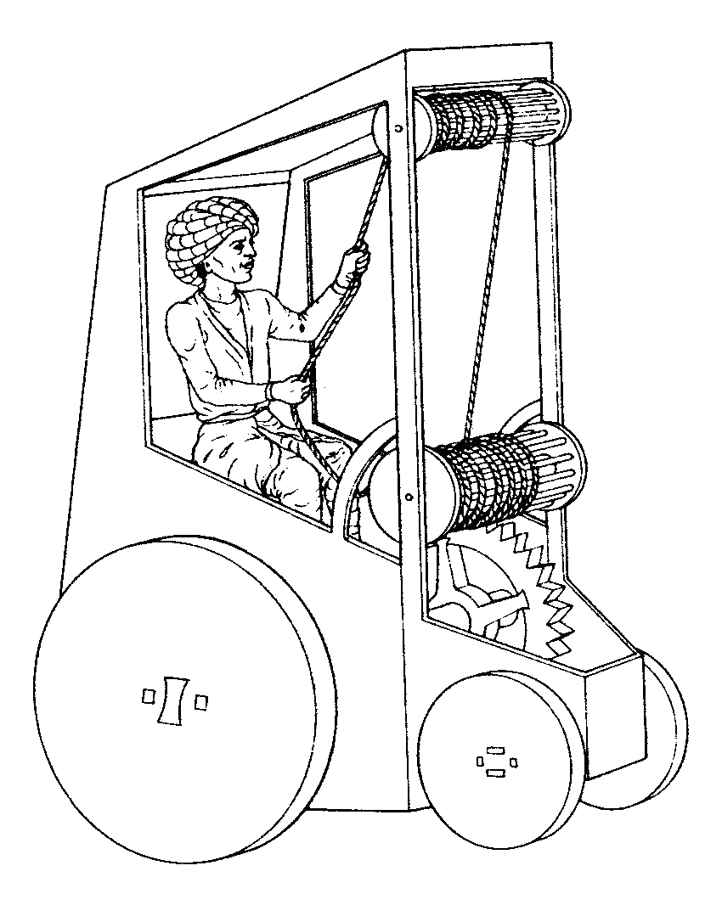
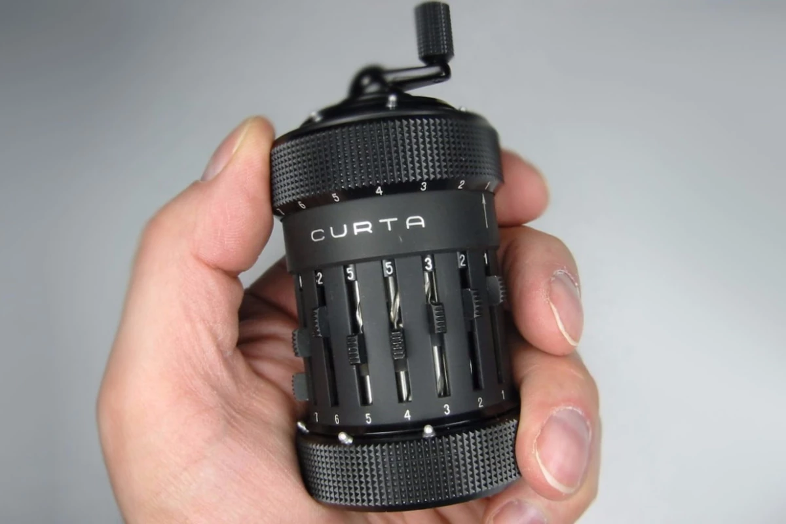

# Istorija

## Notes

* [Japonijos istorija](https://www.youtube.com/watch?v=Mh5LY4Mz15o)
* Pirmasis realus atsiskaitymas Bitcoin’ais įvyko, kai programuotojas atsiskaitė už picą. Tą kart jis paklojo [10 000 bitcoin’ų](http://www.coindesk.com/bitcoin-pizza-day-celebrating-pizza-bought-10000-btc/). Brangiausia pasaulio pica, BY FAR.
* [Antrojo pasaulinio karo metais](https://www.wikiwand.com/en/German_tank_problem#/Historical_problem) sąjungininkai statistinės tankų serijinių numerių analizės pagalba apskaičiavo Vokietijos mėnesinės tankų gamybos apimtis. Skaičiavimai pavyko netikėtai puikiai – buvo apsirikta tik vienu tanku.
* Susirūpinę dėl per didelio [kobrų kiekio Indijoje](http://www.wikiwand.com/en/Cobra_effect), britai buvo paskyrę premiją už jas, tačiau vėliau sužinojo, kad buvo įkurtos atskiros fermos, kurios augino kobras vien tam, jog galėtų pasiimti premijas. Tai sužinoję, britai premiją panaikino, o to pasekmė – minėtos fermos paleido jiems nebereikalingas kobras į laisvę, tad kobrų kiekis gamtoje tik dar labiau padidėjo.

### [Sovietų super lėktuvas](https://youtu.be/7Hv2dsVkA38)

Ekranoplan'as, milžiniškas, išties labai didelę talpą turintis lėktuvas pagamintas USSR laikais, kuris skrisdamas palei vandens paviršių, sugebėdavo ne tik pasiekti milžiniškus greičius, tačiau ir išlikti nepastebėtas radaruose išties labai ilgai. Nors turėjo išties didelių pranašumų, tačiau pasižymėjo ir gan rimtomis problemomis ir sugriuvus sovietų sąjungai, nebebuvo daugiau gaminamas.

### Pirmoji žmogaus jėga varoma transporto priemonė

* The concept of a human-powered vehicle goes back many centuries. The earliest reference I have found is to Venetian engineer Giovanni Fontana, who in the early 1400s described a four-wheeled carriage powered by a driver pulling on a loop of rope connected by gears to the wheels
* Straipsnis: [Kodėl dviratis nebuvo išrastas anksčiau?](https://rootsofprogress.org/why-did-we-wait-so-long-for-the-bicycle)

### Paskutinis sovietų sąjungos pilietis

* Yra 2004-ųjų metų filmas su Tom Hanks pavadinimu _The Terminal_. Istorija apie rytų Europos pilietį, kuris įstringa oro uosto terminale, nes skrydžio metu jo šalyje įvyksta perversmas, pasikeičia politinė situacija ir šalies tokiu pavadinimu tiesiog nebelieka. Jis, kaip nebeegzistuojančios šalies pilietis, nebegali nei įžengti kojos į Ameriką, nei sugrįžti atgal, tad jam tenka gyventi tiesiog oro uoste. Nors šis filmas įkvėptas[ Irano pabėgelio](https://www.wikiwand.com/en/Mehran_Karimi_Nasseri), kuris iš tiesų pragyveno viename prancūzijos oro uostų net 18 metų, tačiau yra ir kita išties gan nemažai panašumų turinti istorija.[ Istorija apie kosmonautą](https://www.rbth.com/history/330415-last-soviet-citizen-cosmonaut), kuris buvo Mir kosmoso stotyje, kai sovietų režimas sugriuvo. Dėl kilusios krizės ir prasidėjusios hiperinfliacijos, pinigų labai trūko ir buvo stengiamasi taupyti kiek įmanoma, tad akivaizdu, kad kosmoso industrija tikrai nebuvo pagrindinis prioritetas. Vietos Soyuz raketoje buvo atidavinėjamos kitų šalių astronautams už gan pigiai, o taipogi net buvo svarstoma apie kosminės stoties pardavimą, kol ji dar pilnai funkcionuojanti. Klausiant apie grįžimą namo, šiam kosmonautui būdavo atsakoma jog nėra pinigų, kad dar reikės palaukti. Rezultate jis kosmose įkalintas prabuvo dvigubai ilgiau nei buvo numatyta jo misija, t.y. 311 dienų ir gavo "paskutinio sovietų piliečio" pravardę. Nors skaičius ir nemažas, tačiau tai visgi nėra rekordas, kurį vis dar turi kitas rusas, toje pačioje Mir stotyje už poros metų išbuvęs daugiau nei 14 mėn, t.y. [437 dienas](https://www.wikiwand.com/en/Valeri_Polyakov). Skirtumas tik tas, kad rekordininko buvimas buvo numatytas, jis pats tam pasisiūlė savanoriu ir buvo pasiruošęs.

### Černobylis

* Serialas [Chernobyl \(2019\)](../filmai/#chernobyl-2019), kuris susilaukė netikėtai daug populiarumo \(ir ne be reikalo, nes jis išties puikus\), labai suaktyvino domėjimąsi šia istorine tema. Visgi tai išties labai įdomi istorija apie vieną didžiausių žmogaus sukeltų katastrofų istorijoje. Vienas reddit'o vartotojas sukūrė įrašą, kuriame prabėga pro visus pagrindinius šios istorijos punktus, kartu su [istorinėmis nuotraukomis](https://imgur.com/a/TwY6q). O kas liečia TV serialą, kaip bebūtų, 5 valandose visko nesudėsi ir žinoma show turi bent kiek dramatizuoti įvykius, tačiau kūrėjai stengėsi išlaikyti istoriją kuo arčiau teisybės ir jiem tai išties puikiai pavyko. Apie tai kokie sprendimai buvo priimami ką ir kaip parodyti ir kaip tokia istorija perteikiama video formatu - [podcaste ](https://www.youtube.com/watch?v=rUeHPCYtWYQ)pasakoja serialo autorius.
* Jeigu serialo kūrėjai sugalvotų tęsti savo darbą, tai sekanti istorija, kurią jie galėtų papasakoti, definitely galėtų būti gan menkai pasauliui žinoma [Kyshtym Disaster](https://youtu.be/SQCfOjhguO0), pasakojanti istoriją apie radioaktyvų ežerą, kuris po šiai dienai yra viena labiausiai radioaktyvių vietų pasaulyje.

### Kaip sovietai mainė karo laivus į Pepsi

* Pepsi buvo vienas pirmųjų kapitalistinių produktų, parduodamų SSSR bei turėjo kolos monopoliją net 13 metų.
* Prekybą sąjungoje apsunkino tai, jog pagal sovietinius įstatymus, buvo draudžiama naudoti valiutą užsienyje, tad tuometiniai rubliai tarptautiniu mastu buvo tiesiog beverčiai. Tad prekybai pasitelkti barteriniai mainai: mainais už kolą, Pepsi gaudavo Stolichnaya degtinės, kurią galėdavo importuoti ir pardavinėti JAV. 
* Prasidėjus karui Afganistane, Amerika pradėjo taikyti boikotus, tad teko ieškoti alternatyvų ir 89-ųjų pavasarį pasirašyta išties neeilinė sutartis - už gazuotus gėrimus atsiskaityta 17 povandeninių ir 3 karo laivų flotile. Jep, istorija gali būti išties keista ;\)
* [https://www.atlasobscura.com/articles/soviet-union-pepsi-ships](https://www.atlasobscura.com/articles/soviet-union-pepsi-ships)

### Pirmasis McDonalds Rusijoje

* 1990-tųjų sausio 31-ąją buvo atidarytas pirmasis [McDonalds restoranas Rusijoje](https://www.boredpanda.com/first-mcdonald-restaurant-opens-soviet-union-moscow-russia-1990/?utm_source=facebook&utm_medium=social&utm_campaign=organic). Buvo tikėtasi, kad atidarymo dieną bus aptarnauti apie 1000 žmonių, tačiau šalyje, kur vidutinė alga tuo metu siekė 150 rublių, kai tuo tarpu Big Mac'as - 3,75,  prieš restorano atidarymą lauke jau lūkuriavo apie 5x daugiau žmonių. Teigiama, kad dienos eigoje pro duris pražygiavo išviso apie 30 000 žmonių!

### Slapta JAV šaltojo karo misija

* [Project Azorian - slaptas JAV CIA projektas 74-aisiais iš Ramiojo vandenyno dugno ištraukti nuskendusi sovietų povandeninį laivą.](https://www.wikiwand.com/en/Project_Azorian)

### Požeminis laivas

* Jeigu turime povandeninį laivą, tai atominiai po žeme besirausiantys atitikmenys tikriausiai turėtų būti vadinami "požeminiu laivu". Šiaip tokio pobūdžio transporto priemonės populiarios fantastiniuose kūriniuose, tačiau, kaip Žiulis Vernas savo laiku rašė fantastiką, o Kubrik'as parodė iPad'us, taip ir šitie "kurmiai" turi kažkiek ir realių sąsajų: eksperimentiniai prototipai buvo kuriame JAV, Vokietijoje ir Sovietų Sąjungoje.
* [https://jalopnik.com/the-soviets-may-have-once-built-a-secret-nuclear-powere-1828395776](https://jalopnik.com/the-soviets-may-have-once-built-a-secret-nuclear-powere-1828395776)
* [https://ru.wikipedia.org/wiki/%D0%9F%D0%BE%D0%B4%D0%B7%D0%B5%D0%BC%D0%BD%D0%B0%D1%8F\_%D0%BB%D0%BE%D0%B4%D0%BA%D0%B0?oldformat=true](https://ru.wikipedia.org/wiki/%D0%9F%D0%BE%D0%B4%D0%B7%D0%B5%D0%BC%D0%BD%D0%B0%D1%8F_%D0%BB%D0%BE%D0%B4%D0%BA%D0%B0?oldformat=true)

### Curta skaičiuotuvas

* Austrų inžinieriaus koncentracijos lageryje sugalvotas išradimas - pirmasis, paskutinis ir vienintelis toks mažas kišeninis mechaninis skaičiuotuvas.
* Stebina savo kompleksiškumu ir genialiu dizainu, kuris ne tik vis dar puikiai veikia ir šiandien, praėjus 50-60 metų, bet ir atrodo vis dar išties puikiai. 
* Iki elektroninių skaičiuotuvų pasirodymo Curta buvo laikomas, pačiu geriausiu kada nors sukurtu skaičiuotuvu. Prietaisas buvo gan populiarus tarp automobilių lenktynininkų bei lakūnų.
* Viso pagaminta tik apie 140 tūkst. vnt, tad nenuostabu, jog dabar tai yra gan paklausi kolekcinė prekė, už kurią ebay prašoma po tūkstantį € ir daugiau. 
* [https://www.youtube.com/watch?v=P0cGjC62XRQ](https://www.youtube.com/watch?v=P0cGjC62XRQ)
* [https://en.wikipedia.org/wiki/Curta?oldformat=true](https://en.wikipedia.org/wiki/Curta?oldformat=true)

