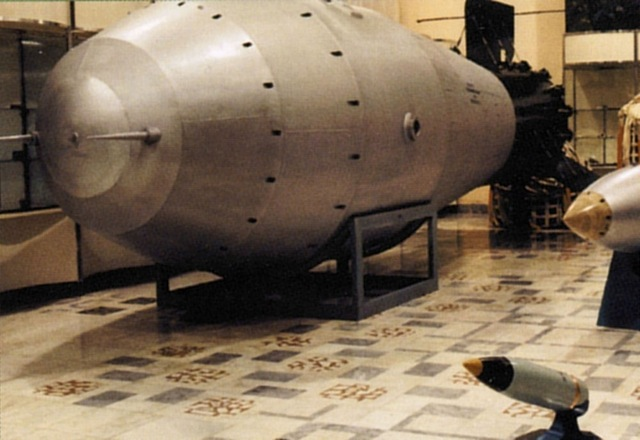
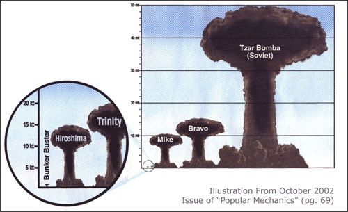

# Visų laikų pavojingiausias – Ivanas

Šį kartą, tai ne žmogus. Tai – visų laikų pati galingiausia bomba detonuota žemės orbitoje. Ivanu šią vandenilinę bombą praminė ją pagaminę sovietai, o Vakaruose jai buvo prilipdyta „Caro-Bombos“ etiketė arba tiesiog „King of the Bombs“.

Kodinis bombos pavadinimas – Tsar bomba arba kitaip RDS-220, tai maždaug 50 kartų galingesnė už bombą, numestą ant Hiroshimos, bei Nagasakio, ir buvo sukurta tam, kad Šaltojo karo metu amerikiečiai privarytų į kelnes. Šis 50MT sprogimas buvo įvykdytas 1961 m. spalio 30 d. Pagal planą ištikro šios bombos galingumas tūrėjo siekti 100 MT, bet buvo sumažintas per pusę baiminantis šios bombos padarinių. Ir taip sprogimas tūrėjo daugiau energijos, negu visi šaudmenys, panaudoti per II pasaulinį karą kartu sudėjus. Kitaip tariant, tai prilygo 1,4 % Saulės išspinduliuojamos energijos. Sprogimas išdaužė suomių langus už 1000 km, o susidaręs dūmų grybas buvo septynis kartus aukštesnis už Everestą. Kokios naujienos išties yra blogos? Sovietai sukūrė dvi tokias bombas. Antra iki šiol kažkur rūdyja.

Platesnė informacija susidomėjusiems:

[http://nuclearweaponarchive.org/Russia/TsarBomba.html](http://nuclearweaponarchive.org/Russia/TsarBomba.html)

