# Barcelona \(2019\)

## Kelionės info

### **Airport transfers**

* **Aerobus** - Cost: €5.90 for a single ticket, €10.20 for a return. Every 5-10 minutes to T1 and every 10-20 minutes to T2. Leaves from Pl. Catalunya, Pl. Espanya, Gran Via-Urgell and Pl. Universitat. More info about timetables and stops to be found [at the website](http://www.aerobusbcn.com/). I call this **the fast bus** because it **takes only 35 minutes**. It’s super convenient because one **leaves** **for the city centre** **every 5 minutes** and its **long operating hours** cover every flight.
* Hola Barcelona Travel Card - €28.80 4 dienoms, Unlimited journeys by metro and other public transport networks airport included - [https://www.holabarcelona.com/tickets/hola-bcn-barcelona-travel-card](https://www.holabarcelona.com/tickets/hola-bcn-barcelona-travel-card)
* **Taxi** - Cost to center: approximately €35. There are always a large number of taxis available at Barcelona Airport. They cannot be hailed randomly - it is necessary to join a queue, where you will be directed to a taxi that is waiting. There are taxi ranks outside both Terminal 1 \(T1\) and Terminal 2\(T2\) at Barcelona Airport.

### Getting around

[https://www.barcelonahacks.com/which-barcelona-discount-travel-card/](https://www.barcelonahacks.com/which-barcelona-discount-travel-card/)

* CITY PASS inclusion of Sagrada Familia, Park Guell, the Bus Turistic, and the Aerobus. The HOLA BCN is unlimited public transport on the metro, bus, tram, and funicular. recommend for those who aren't looking to see many attractions but will need to get around the city Barcelona Card - unlimited transport and free admission to 25 museums - 18.00€
* You can travel in almost every public transport in Barcelona using an integrated travel card. The most common card is the T-10. You can buy these nearly everywhere, including at the stations themselves, newspapers kiosks
* 10,30€. it can be used for 10 trips on the bus, metro, or train. you can switch transports up to 3 times within 1h 15 min, without spending additional tickets. Multiple people can use it at the same time

### Metro

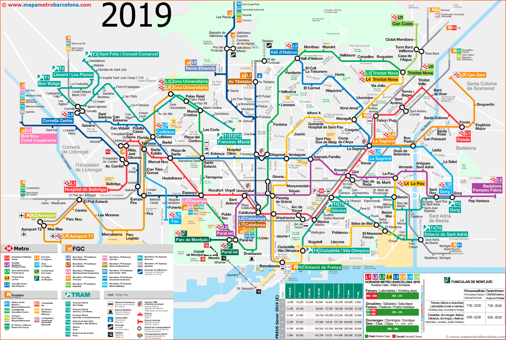

### Places

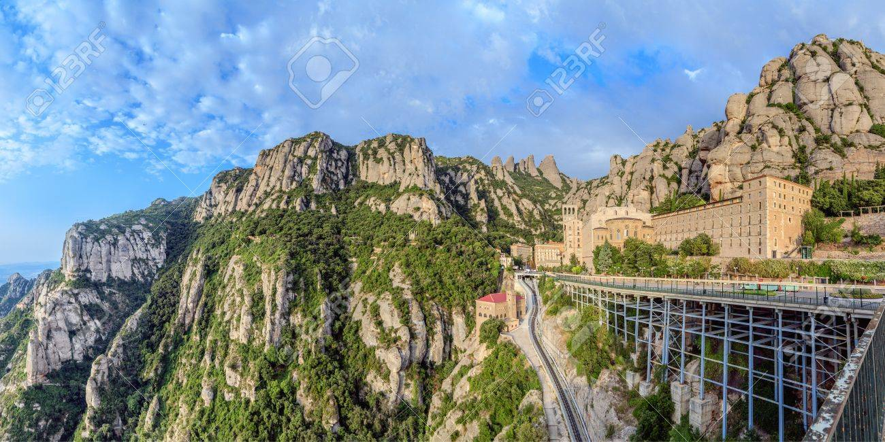

#### 04-17 - Montserrat Monastery

* About an hour each way by train. Generally a full day trip. 22 return, Trans Montserrat Ticket 35.30€ includes 2 return journeys on 2 different funicular rides
* You can travel to Montserrat by train which you catch from España rail station.
* Allocate 4-6 hours to visit Montserrat properly.
* The España rail station is on the green and red metro lines making it accessible from any part of Barcelona city centre that has a metro stop.
* Once at España look for **Line R5** headed towards Manresa. Ferrocarril’ train
* It's advisable to arrive at España station in plenty of time as it can be a little confusing to find R5 track. The España rail station is quite large and the directions to the R5 track could be clearer.
* from Plaça España to either the starting point to take the Cable Car ride \(Aeri\) or the starting point for the Rack Railway \(Cremallera\) which are at the foot of Montserrat mountain. For the Rack Train ride you will need to get off one stop after **Aeri de Montserrat** called Monistrol. The Rack Train ride will take 15 minutes to the Monastery
* There is no entrance fee to the Monastery however if you wish to visit the museum you will have to pay an entrance fee. 7€
* There is a restaurant at Montserrat mainly serving sandwiches. I recommend you also bring plenty of water, especially if you want to do some walking in the mountains. Just past the funicular station there’s a convenience store to buy snacks and drinks for your hike. Try the Aromes de Montserrat liquor \(a 12 herb liquor invented by the monks\).
* Keep an eye on the time as the Cable car only runs till around 18:40.
* Once you’ve arrived at Montserrat monastery with the cable car or funicular you can start your hiking adventure. Just get yourself to the tourist information booth, grab a map with a list of trails, and head for nature! It’s also the best place for **hiking** because of the sheer **variety of trails**. With 5 different options ranging from 2.7 km to 7.5 km you’ll find the hike for your level of difficulty. The Sant Joan funicular takes you to the very peak of the mountain

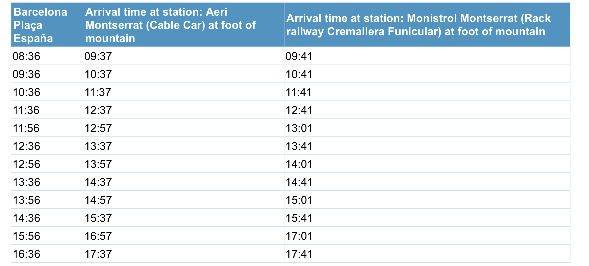

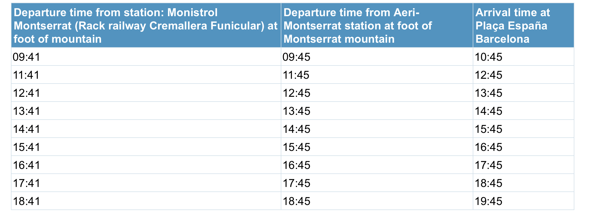

* [https://www.barcelona-tourist-guide.com/en/tour/barcelona-montserrat.html](https://www.barcelona-tourist-guide.com/en/tour/barcelona-montserrat.html)

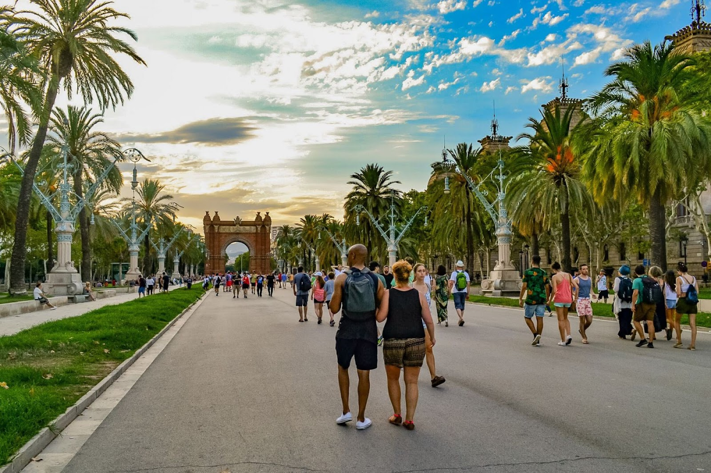

#### 04-17/18 - La Barceloneta beach / Port Olímpic / Parc de la Ciutadella / Arc de Triomf

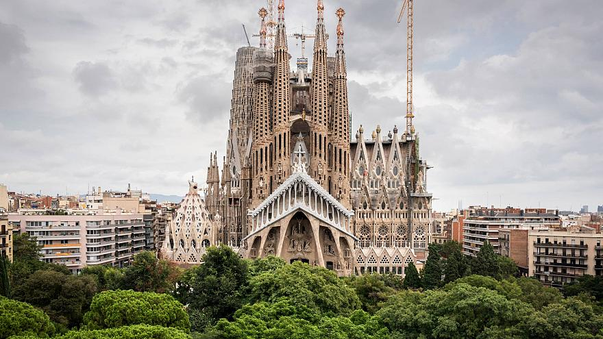

#### 04-18 - Sagrada Família - 13:15 - 13:30 h

* 9:00 am to 8:00 pm
* Price: Adults over 18: 23€, WITH TOWERS - 30 € [https://sagradafamilia.org/en/tickets-individuals](https://sagradafamilia.org/en/tickets-individuals)
* buy a ticket to visit the Towers. It is strongly suggested to purchase tickets online ahead of time, as there is often quite a line up for tickets.

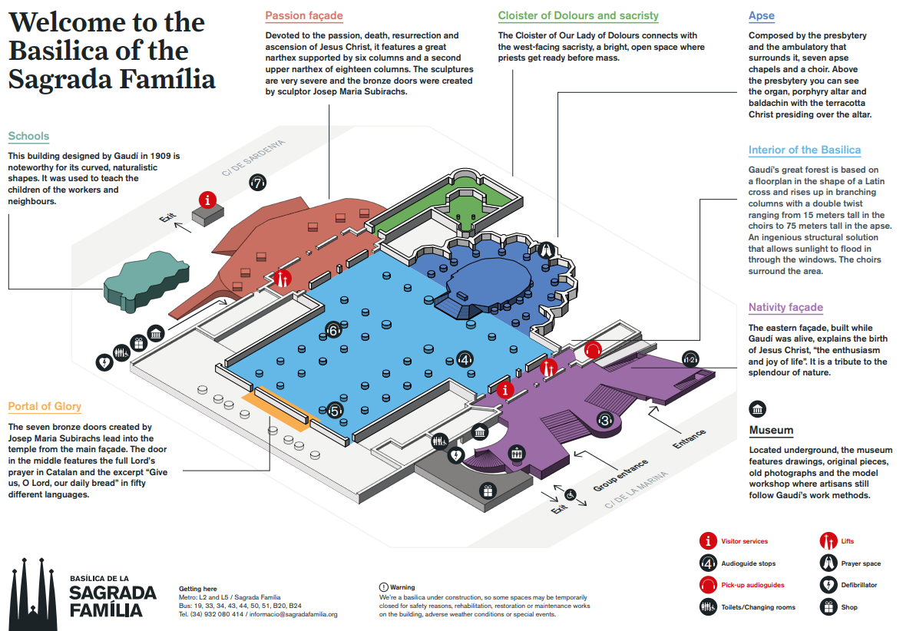

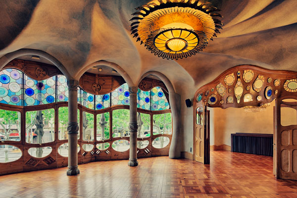

#### 04-18 - CASA BATLLO - 16h

* make it inside, no matter the queues, to go on a self-guided visit of the most beautiful Modernist building, in my opinion. I have been at least 3 times and every time I marvel at the incredible beauty and magic of the place Price: €25

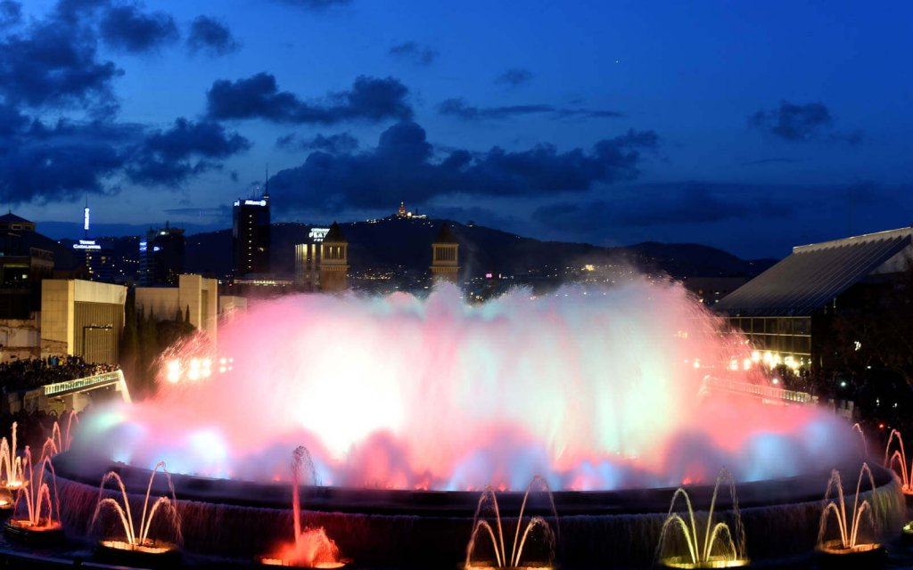

**04-18 - MAGIC FOUNTAIN SHOW**

* This enchanting fountain and light show uses 3620 water jets and 4760 lights to create over 7 billion combinations in what amounts of be one of the best free things to do in Barcelona.
* from 21:00 to 22:00 \(Thurs-Sat\)
* The Magic Fountain show lasts about 20 minutes and begin at 30 minute intervals, that means there are about ten minutes between show times to get into position – so get there early, wait for people to leave, and pounce!
* La Fuente Magica is found in **Plaza Carles Buigas** at the end of Avenida Reina Maria Cristina. The address is Pl. Carles Buïgas, 1. Simply arrive at Plaça d’Espanya \(**metro** station Espanya, red line L1 or green line L3\) and then follow the crowd toward the palace. It’s just beyond the two Venetian towers.

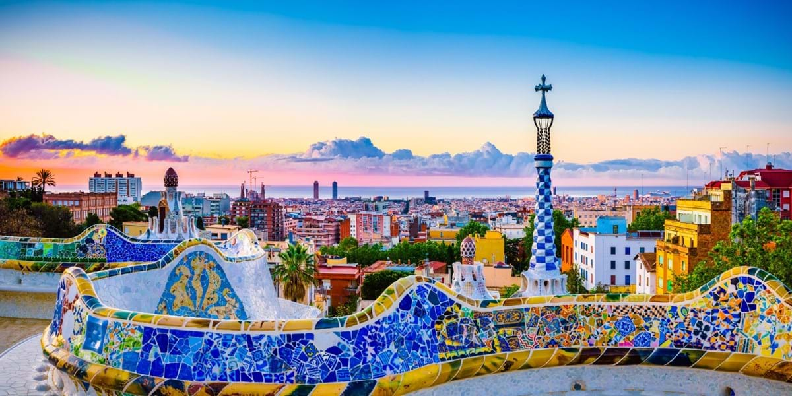

#### 04-19 - Park Güell

* Monumental Zone, you will need to buy a ticket. Remainder of the park is still free, and provides excellent walking and hiking trails, as well as beautiful views of the city. Price: 8€
* We take bus 24 from Passeig de Gracia and 30-40 minutes later we’re left at the gates. We could also take the green metro line to Lesseps but then we’ll have a steep walk waiting for us.
* Park Guell is open from 8:00 am to 6:30 pm \(low season\) or 9:30 pm \(high season\).
* You can get to Park Guell with the Lesseps metro station \(green line L3\)

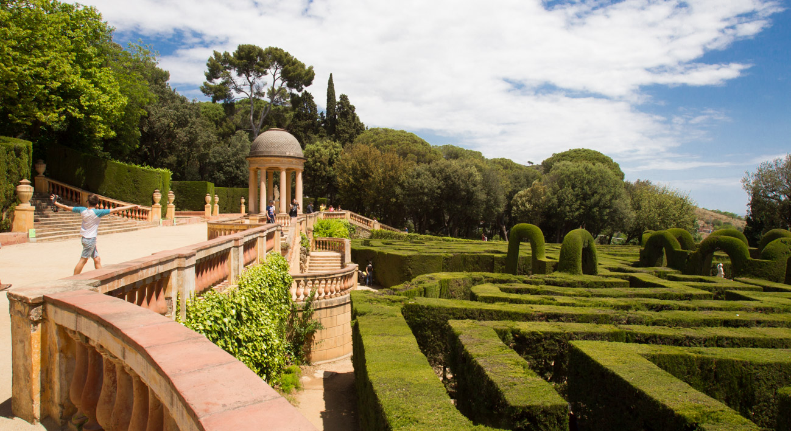

#### 04-19 - Parc del Laberint d'Horta

* This park is accessible by Metro L3, at the Mundet stop. Come out of the metro exit, and go to the right \(with your back to the metro steps\). Walk about 20 yards to the giant A and then walk up the hill past the Velodrome and to the gates. Continue up the steps, and pay your entrance fee in the tiny little shed on the left. You will find plenty of grass nearby to have a picnic and the toilets are up by the roman building above the maze. You have to pay an entrance fee of 2,17€
* The park is open from 10:00 am to 8:00 pm \(Apr 1st – Oct 31st\)

#### 04-19 - BUNKERS DEL CARMEL

* There’s a fantastic 360º city view with the Sagrada Famila, the sea, and Montjuic Hill.
* It is found in an unspoiled, natural setting that hasn’t sold out to tourists.
* It’s free!
* Public drinking is widely tolerated so you’ll have no problems. Just make sure to bring some water as well because the hike is a bit tiring. Add some bread, chorizo, and cheese and maybe something sweet and you’ve got the perfect meal or sunset snack.
* If you’re coming from the Gothic Quarter or Raval grab the 24 bus from Plaça de Catalunya and continue about 20 minutes uphill and get off at the ‘Doctor Bové Gran Vista’ stop – it’s number 268. Or metro: taking the blue line \(L5\) of the metro to El Carmel. Head out through the Llobregas exit and walk down to bus 86.

#### 04-20 - La Rambla / LA BOQUERIA MARKET / Gothic Quarter / Plaça de Catalunya

### Tips

* Skip restaurants and cafes if they have a menu with pictures, especially if they’re posted out front. I’m not saying you’ll eat horribly, but generally these are the tourist traps, and you won’t find authentic food there \(plus it will probably be overpriced\). If there is an employee waiting outside to greet you, don’t go in. If the menu is translated into a million languages, don’t go in.
* Eat the Menú del Día. Most authentic, local restaurants offer a “menu of the day,” which is a 2-4 course meal at a discounted price for lunch time \(depending on the restaurant, the price can be as low as 10 euros!\). This is most common to find Monday-Friday, but it is possible to find some restaurants serving it on the weekends as well.
* Many restaurants don’t open until 1pm for lunch, and don’t get busy until about 2pm. Don’t expect to have dinner until at least after 8pm! Locals generally don’t eat until 10pm or even later.
* La Rambla. The most recognized and touristic street in Barcelona, connecting Plaça de Catalunya with the Columbus monument and port. There are hundreds of street vendors and performers, so it can be nice to take a stroll on a sunny day. I recommend not stopping to eat/drink at any of the bars and restaurants along the way \(they’re ridiculously overpriced and touristy\). If you want to stop for a bite, walk for a few minutes along the side streets until you get out of the main tourist hub and you’ll find much better options. Also, don’t take pictures of any of the performers unless you’re willing and ready to pay for it! The Rambla’s famous Boqueria Market is closed on April 19th

