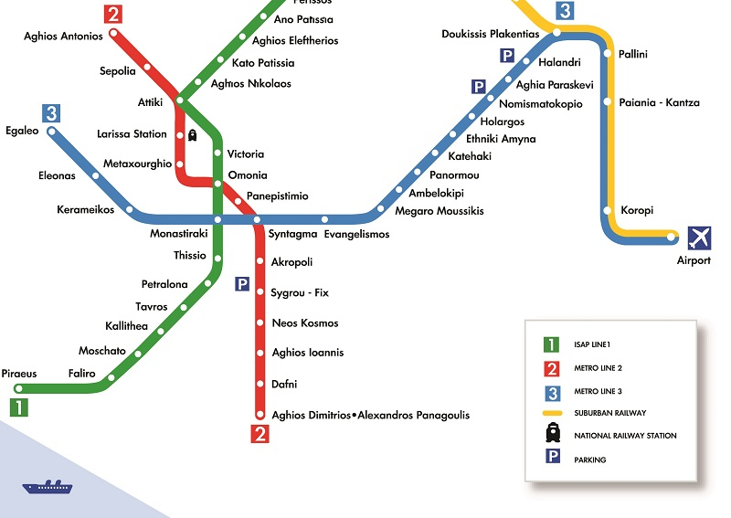

# Graikija \(2018\)

## **Kelionės info**

### **SIM**

* Vodaphone now has a kiosk at arrival gate a. 22€ for 300 minutes and 8 gig

### **Tickets**

* **If you plan to stay in Athens for up to 3 days**, you should consider purchasing a 3-day tourist ticket \(€22\) upon your arrival at the airport. Especially if you travel between the airport and the city center by Metro, and also take a few shorter rides while in Athens, this should be the best ticket for you. However, if you’re going to use an express bus for the airport \(€6 per route\) and then take the metro while in the city just a few times it might be better purchasing 90-minute tickets \(€1.40\) when you do so or get a 24-hour ticket \(€4.5\). \(Remember, 90-minute tickets, daily, and 5-day tickets are not valid for trips from/to the airport.\)

  For journeys from/to Athens Airport to/from any station within the urban section, metro tickets for the airport are valid.

  [https://www.athenstransport.com/english/tickets/](https://www.athenstransport.com/english/tickets/)

### Metro

### **Places to visit**

* Acropolis and its Slopes - €20 from April to October and €10 from November to March. Tickets are available only at the ticket office on site. Free admission days: Every first Sunday from November 1st to March 31st. As of September 1st 2018, opening hours will be modified due to the gradual decrease of daylight, as following: 1st till 15th September 08:00-19:30

  18€ with audio:

  [https://www.getyourguide.com/athens-l91/acropolis-skip-the-line-ticket-smartphone-audio-tour-t175587/?referrer\_view\_id=d135c916632aedccb089c9f7fca82f56&referrer\_view\_position=0](https://www.getyourguide.com/athens-l91/acropolis-skip-the-line-ticket-smartphone-audio-tour-t175587/?referrer_view_id=d135c916632aedccb089c9f7fca82f56&referrer_view_position=0)

  The Acropolis is well worth a visit, just to sit in the sun and take in the landscape of what was the hub of a mini empire. The associated museum is... well air conditioned, and the excavated houses with glass above them are nice. However, I prefer wandering around ruins in open air here - the Philopappos Monument and Arch of Hadrian - but especially the Temple of Hephaestus are must-sees.

  Enter sountheast entrance

  Metro Station "ACROPOLIS", then via Dionysiou Areopagitou str.

  Metro Station "ACROPOLIS" then through the archaeological site of South Slope, Dionysiou Areopagitou & Thrasyllou str.

  Metro Station "MONASTIRAKI", then through the archaeological site of Ancient Agora, or Plaka district.

  For security reasons the "Baggage-stroller check-in" service will not accept large luggage. Visitors are allowed to enter the archaeological site with small backpacks and handbags.

  [http://odysseus.culture.gr/h/3/eh355.jsp?obj\_id=2384](http://odysseus.culture.gr/h/3/eh355.jsp?obj_id=2384)

  Turas 1,5h - 29€

  [https://www.getyourguide.com/athens-l91/acropolis-skip-the-line-walking-tour-t54919/?referrer\_view\_id=3770a307781af7e803a2bfd691a74ae7&referrer\_view\_position=0?partner=true](https://www.getyourguide.com/athens-l91/acropolis-skip-the-line-walking-tour-t54919/?referrer_view_id=3770a307781af7e803a2bfd691a74ae7&referrer_view_position=0?partner=true)

  Muziejus - 5€

  [https://www.getyourguide.com/athens-l91/new-acropolis-museum-entrance-ticket-t71669/?referrer\_view\_id=d135c916632aedccb089c9f7fca82f56&referrer\_view\_position=5](https://www.getyourguide.com/athens-l91/new-acropolis-museum-entrance-ticket-t71669/?referrer_view_id=d135c916632aedccb089c9f7fca82f56&referrer_view_position=5)

  Monday - Thursday 9:00 a.m. - 5:00 p.m. \(last admission: 4:30 p.m.\)

  Friday 9:00 a.m. - 10:00 p.m. \(last admission: 9:30 p.m.\)

  Saturday - Sunday 9:00 a.m. - 8:00 p.m. \(last admission: 7:30 p.m.\)

* Hellenic Motor Museum - 8€
  * Monday - Friday 10:00 - 14:00
  * [https://www.getyourguide.com/athens-l91/hellenic-motor-museum-entrance-ticket-t70146/?referrer\_view\_id=2172d623ecb66fa7d7d19e6df3efe1a1&referrer\_view\_position=7](https://www.getyourguide.com/athens-l91/hellenic-motor-museum-entrance-ticket-t70146/?referrer_view_id=2172d623ecb66fa7d7d19e6df3efe1a1&referrer_view_position=7)

* Gourmet Food Tour 4h - 44€

  Greek pastries, wine, cheese and salamis

  [https://www.getyourguide.com/athens-l91/athens-private-walking-food-tour-t28591/?referrer\_view\_id=2172d623ecb66fa7d7d19e6df3efe1a1&referrer\_view\_position=0?partner=true](https://www.getyourguide.com/athens-l91/athens-private-walking-food-tour-t28591/?referrer_view_id=2172d623ecb66fa7d7d19e6df3efe1a1&referrer_view_position=0?partner=true)

### Rest of the Greece

**Nafplio**

* go to Nafplio instead. It's a year-round destination just a few hours' driving distance from Athens and it will give you an island-like experience with much much more to see and do. It's a very scenic and romantic spot, so ideal for an anniversary trip.

  Nafplio is amazing and it should be advertised more to tourists

  total time from Athens is 2h 10'. If you find the departure time convenient it will provide you a more comfortable cheap and accurate journey. 17e for a two way ticket \(in two parts, one till Korinthos, one for the rest\)[\[6\]](http://tickets.trainose.gr/dromologia/). Stops also at [Argos](https://wikitravel.org/en/Argos) and [Mycenae](https://wikitravel.org/en/Mycenae)

  [https://www.discovergreece.com/en/mainland/peloponnese/nafplio](https://www.discovergreece.com/en/mainland/peloponnese/nafplio)

  [https://www.youtube.com/watch?v=NPyIaEB\_dt4](https://www.youtube.com/watch?v=NPyIaEB_dt4)

* to catch the bus you have to get to kifissos ktel bus station in athens
* [http://www.ktelargolida.gr/?module=default&pages\_id=9&lang=en](http://www.ktelargolida.gr/?module=default&pages_id=9&lang=en)

**Meteora - monasteries**

* Biggest one: Holy Monastery of Great Meteoron[https://www.atlasobscura.com/places/meteora](https://www.atlasobscura.com/places/meteora)

  [https://meteora.com/tour/1-day-meteora-tour-athens-train/](https://meteora.com/tour/1-day-meteora-tour-athens-train/) - 89€

  [http://toursmeteora.com/onedaytourmeteora.htm](http://toursmeteora.com/onedaytourmeteora.htm) - 69€

  

### Islands

* [http://www.visitgreece.gr/en/greek\_islands](http://www.visitgreece.gr/en/greek_islands)
* **Corfu** [https://www.tripadvisor.com/Attraction\_Review-g189458-d196349-Reviews-Kassiopi-Corfu\_Ionian\_Islands.html](https://www.tripadvisor.com/Attraction_Review-g189458-d196349-Reviews-Kassiopi-Corfu_Ionian_Islands.html)

  Nearby small town: Kassiopi

  [https://www.discovergreece.com/en/greek-islands/ionian/corfu](https://www.discovergreece.com/en/greek-islands/ionian/corfu)

  

* **Santorini**

Oia village - main

The obvious activity is to walk the caldera edge and admire the views. Walks in and around Fira are spectacular, particularly heading north to Firostefani and Imerovigli along the caldera-edge pathway. Keep walking and you’ll eventually reach Oia, but be aware that this is no small undertaking and the trail beyond Imerovigli can be rough. It’s about 9km in all, and a good three- to four-hours’ walk in one direction.

Firostefani - less crowded: [https://www.greeka.com/cyclades/santorini/santorini-villages/santorini-firostefani.htm](https://www.greeka.com/cyclades/santorini/santorini-villages/santorini-firostefani.htm)

Must visit - Lucky's in fira

My recommendation: Stay in one of the four towns \(Fira, Oia, Imerovigli, and Firostafani\) that are located on the Santorini cliff.

[**https://www.letsferry.gr/en/**](https://www.letsferry.gr/en/)

