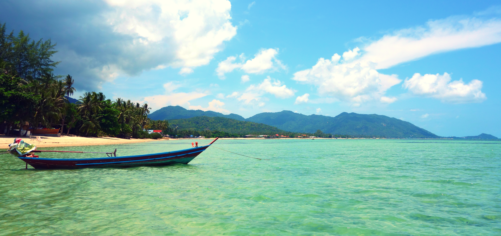
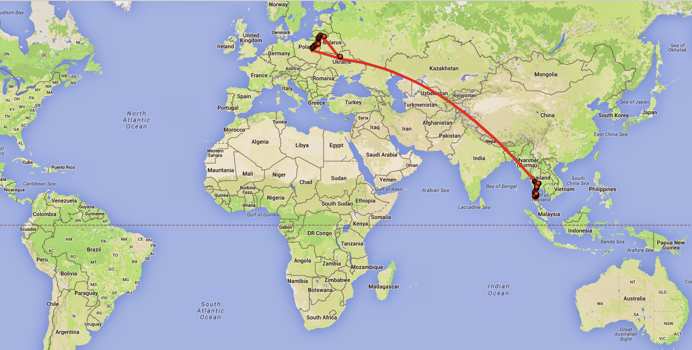
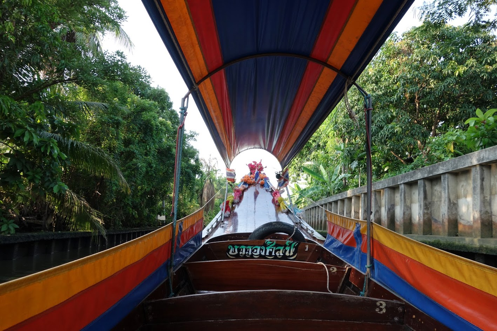
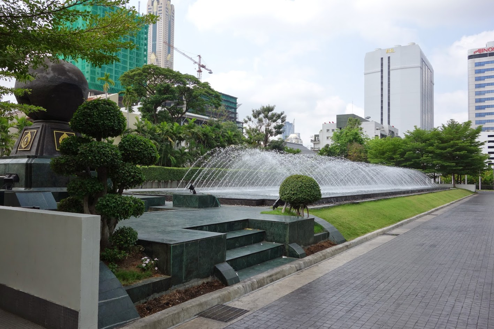
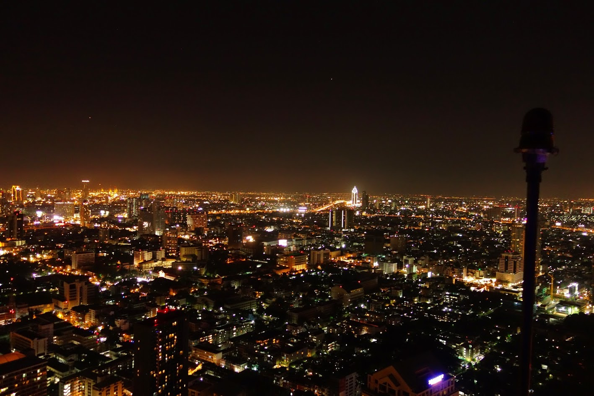
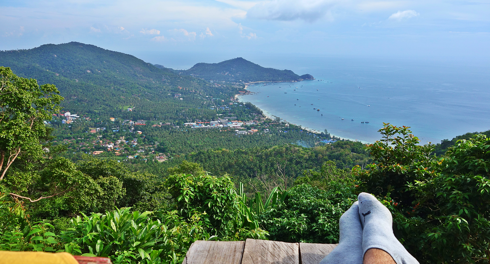
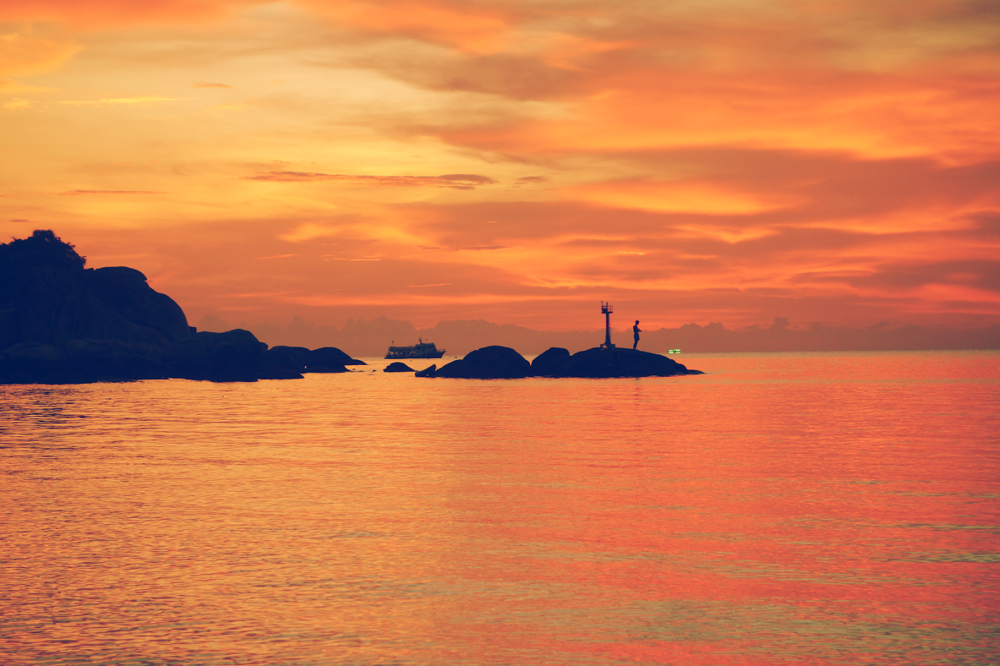

# Tailandas \(2015\)

Atitrūkus nuo pastovaus, nuolatinio bloginimo, kartais tiesiog sunku sugrįžti. Esi nusiplanavęs apie ką rašysi, tačiau to realizavimui dažniausiai pritrūksta ne tai, kad laiko, o paprasčiausiai ūpo. Anksčiau buvęs itin didelis savirealizacijos troškimas, numalšinamas kitur, kitais būdais ir dėlto prieš tai buvusio „nieštėjimo“ ilgėliau neparašius – nebėra. Ko gero būtent dėlto ilgai planuoti kelionės įspūdžiai pasirodo tik po 5 mėnesių. Galbūt taip net ir geriau, nes taip viskas kur kas labiau susigūlėję, nereikšmingos smulkmenos užsimiršusios ir galima viską daug labiau apibendrinti.

Skaitant kelioninius blogus \(kurių ruošiantis kelionei teko paskaityti išties nemažai\), pastebėjau, kad itin dažnai keliauninkai mėgsta aprašyti savo keliones ne visaip taip, kaip tikriausiai to norėtų skaitytojas. Jų pasakojimai patampa kelionės žurnalais, raportais, kuriuose jie aprašo kur konkrečiai buvo ir ką matė. Skaitai dešimtis skirtingų žmonių įrašus ir dauguma iš jų itin panašūs. Manau, kad tai yra tarsi savotiška ego boostinimo forma ir jeigu pačiam keliavusiam žmogui apie tai rašyti ir pasakoti įdomu ir jam tai atrodo svarbu, tai skaitytojui tokius straipsnius skaityti dažniausiai labai sausa ir tiesiog nuobodu. Jeigu jį domintų konkrečios vietos, statulos, šventyklos ar turgaus aprašymas, tai kur kas efektyviau nueiti į kokį Trip Advisorių ir paskaityti diversifikuotus atsiliepimus vienoje koncentruotoje vietoje. Manau, kad rašančiajam apie keliones, kur kas svarbiau yra perteikti nuotaiką, visuminę nuomonę, įspūdžius apie šalį, perteikti žavias, tik tai šaliai būdingas detales, smulkmenas, kurios skaitytojo galvoje, tarsi dailininkas ant drobės, nupiešia tos šalies paveikslą. Labai įdomu, kad du žmonės nuvykę į tas pačias vietoves, gali apturėti absoliučiai skirtingas patirtis. Grįžęs iš kelionės ir išgirdęs, kad mano draugas norėtų ten nuvykti ir galėčiau jam pateikti savo kelionės maršrutą/planą, pagalvojau, kad jis greičiausiai parsivežtų kur kas kitokią nuomonę, nei esu susidaręs aš.

### Apie keliavimo būdus

Esu kiek nusistatęs prieš keliavimą naudojantis kelionių agentūromis. Žinoma, tai yra puiki paslauga, jeigu nori patogiai, be rūpesčių pakeliauti, neturi laiko sukti galvos ir rūpintis begalėmis smulkmenų, na ir žinoma jei gali sau tai leisti. Sumokėjai pinigus ir viskas būna pasirūpinta ir suplanuota už tave. Gali visiškai atsipalaiduoti ir mėgautis atostogomis. Esu nusiteikęs prieš dėl dviejų konkrečių priežasčių: pirmiausia tai dėlto, kad tokiu būdu esi vežamas į pačias populiariausias, visiems žinomas turistines vietas, laiką leidi patogiuose gražiuose resortuose ir šitaip iš tikrųjų visiškai nesusipažįsti su tikrąja šalimi. Dažniausiai gali susidaryti visiškai kitokią nuomonę, nes matei tik tai, kas nugludinta, paruošta specialiai turistui, bei padaryta patrauklu parduoti. Aš nenoriu parvažiuoti iš kelionės, kuri bus identiška šimtams žmonių. Visi su vienodomis nuotraukomis, visi su vienodais suvenyrais ir tarsi štampuotais įspūdžiais. Keliaujant savarankiškai, gali pamatyti, kaip viskas atrodo ten, kur nebuvo planuota, jog turisto akis išvis pamatytų, tačiau taip gali atrasti kitų fantastiškų, gal net didesnį įspūdį paliekančių vietų, kurios yra nepakankamai įvertintos. Atsiduri įvairiose neplanuotose vietose, situacijose, susipažįsti su pačiais įvairiausiais žmonėmis ir tiesiog būni priverstas improvizuoti. Tai ir laikau tikru keliavimu, tikru nuotykiu. Būtent tokios kelionės palieka kur kas gilesnį įspūdį ir būna įdomesnės ir nuotaikingesnės. O taipogi keliaujant pačiam atsiranda privilegija savo planus koreguoti on the go: atvykai, nepatiko, gali išvykti tuoj pat, užuot tūnant nepatinkančioje vietoje kelias dienas ir taikstantis prie savo kelionių grupės. Ir atvirkščiai – jeigu staiga persilgalvojai ir nebenori kažkur lėkti, kažkur važiuoti, gali numoti ranka ir iškeisti planuotas atrakcijas į patogų laisvalaikį hamake patikusiame paplūdimyje. Esi pats savo laiko viršininkas. Pasyvias kelionių agentūros keliones galėsim apturėti, kai būsim garbesnio amžiaus, neturėsim laiko ir būsim skeptiškai nusiteikę.

Antra priežastis, kodėl esu prieš: kelionės planavimas man yra labai mėgiama veikla. Tai tarsi tyrimas, kurį tu atlieki: surenki informaciją apie tai kur verta apsilankyti, iš to sąrašo atsirenki tik tai, kas domintų tave, tada konkretini informaciją, perskaitai galybes skirtingų atsiliepimų, įsivertini, susidarai savo nuomonę ir galiausiai susidėlioji planą ką konkrečiai aplankysi, kur būsi ir kiek laiko tam skirsi. Šį planavimą atlikti man yra malonu, bei įdomu ir tiesiog negalėčiau mokėti pinigus kažkam už tai, kad šį malonumą iš manęs atimtų.

Na žinoma taipogi visada yra ir piniginis akcentas. Musuose norint nuvykti į egzotišką, šiltu klimatu pasižyminčią kurortinę šalį, dažniausiai renkamasi Turkija, Egiptas, Ispanija. Pasaulyje yra daugybę itin nuostabių ir egzotiškų vietų, tačiau jos pasirenkamos rečiau, nes yra manoma, kad kelionės į jas yra labai brangus malonumas. Ir taip, keliaujant per kelionių agentūras jums gali tekti atseikėti 2000-3500€. Tačiau jei nepatingėsite ir kelionę susiplanuosite pats, atsisakysite to, ko jums iš tiesų nereikia, galbūt vienur ar kitur susispausite, bet ne tiek, kad tai keltų didelį diskomfortą ir galėtų sumenkinti mėgavimąsi kelione, tai nukeliauti galite dvigubai ar net ir trigubai pigiau. Juk gyvename tik kartą, tad, kodėl turime save varžyti, nepasinaudoti pasitaikusiomis progomis? Šitiek sunkiai dirbę, kartas nuo karto tiesiog nepasidžiaugti ar nepasilepinti ten, kur niekada negalvojai pateksiąs?

### **Tailandas bendrai**

Taigi, kodėl Tailandas? Ar ne per drąsu, kaip pirmajai savo gyvenimo kelionei? Svajonių nuvykti konkrečiai būtent į šią turizmu, seksu ir transvestitais garsėjančią šalį nebuvo, tačiau netikėtai pasitaikius išties geram bilietų pasiūlymui, bei pridėjus mano mėgimą kartais nutrūtgalviškai šokti į avantiūras, buvo nutarta nepasikuklinti ir vykti tiesiai ten. Ši šalis jau daugelį metų didžiuojasi būdama visų turistinių sąrašų viršuje. Bankokas, Tailando sostinė, vadinamas labiausiai pasaulyje lankomu miestu ir per metus susilaukia apie 16 milijonų svečių iš užsienio ir tai lenkia net ir arčiausiai nuo mūsų esantį kultūrinį centrą – Londoną.

Manau, kad vienas iš būdų pažinti lankomą šalį yra per žmones. Tailandas yra vienintelė šalis pietryčių Azijoje, kuri nebuvo Europos kolonija, galbūt tai yra viena iš priežasčių kodėl su anglų kalba pas vietinių reikalai gan liūdni, nors ko gero čia yra labiau bendras Azijos bruožas. Tačiau tailandiečiai adaptavosi prie turistų srautų, tad ko ne bet kuris gatvės pardavėjas su savo broken engrish visgi galės pasakyti bent jau kainą. Problema, kad pabandant užklausti ko nors kitko, pvz ką tu čia netrukus valgysi, ko gero nesupras ir tiesiog šypsosis ir linkčios, kartodami „Yes“.  
Šypsenos šioje šalyje yra labai unikalus dalykas, nes tailandiečiai šypsosi ir pagarbiai linkčioja be galo daug. Ne be reikalo šalies turizmo pramonė Tailandą pozicionuoja, kaip _Land Of Smiles_ ir tajai šį šūkį tikrai pateisina. Būna miela ir šiek tiek juokinga, nes šypsenos nuoširdžios, bet labai dažnai su gaidele „I have no idea“. Tačiau, net neskaitant to, kad kartais pritrūksta kompetencijos, padėti stengiamasi itin daug. Jei ko nors ieškote ir nevisai tiksliai žinote, kur reikia eiti, tai greičiausiai dar net nespėjus išsitraukti telefono, jog pasižiūrėti žemėlapį, prisistatys koks prašalaitis ar netoliese dirbantis apsauginis ar durininkas ir jums nurodys kelią. Malonu ir neįprasta. Taipogi būnant šioje šalyje gan greitai atsirado saugumo jausmas. Žinoma, tai ne priežastis sumažinti apdairumą, tačiau jutau, kad net jei ir ką nors ir pamirši, tai grįžęs – tikrai rasi. O greičiausiai tau pamiršti tiesiog neleis in the first place. Ko gero prie to prisideda, tai, kad pagrindinė religija, kuria tiki net 95% šalies gyventojų yra budizmas. O budizmas yra nusiteikęs prieš konfliktus ir skatina harmoniją.

Ši šalis užima labai unikalią vietą Azijoje. Neskaitant savo pačių kultūros ir tradicijų, kurios yra labai ryškios, net ir dabartiniame moderniame pasaulyje, taipogi labai smarkiai jaučiama ir kitų dviejų itin stiprių kultūrų įtaka – t.y Kinijos ir Indijos. Apsilankęs šioje šalyje, padariau išvadą, kad jeigu nori susidaryti bendrą vaizdą apie Aziją, tai būtent Tailandas yra ko gero viena tinkamiausių vietų. Jeigu Europoje visi keliai veda į Romą, tai Azijoje, visi keliai baigiasi ties Bankoku. Čia rasite visus pagrindinius Azijos didžiausių kultūrų atributus: nuo Indijos šilko, smilkalų ir arbatų iki didžiausio pasaulyje ChinaTown’o su savo rėksmingais pardavėjais ir egzotišku maistu. Tai itin didelių kontrastų pilna šalis – čia šalia galima pamatyti prabangius dangoraižius ir prekybos centrus, kuriuose labai žvalgomasi į vakarus ir orientuojamasi į prabangą ir madas ir dėl kurių gali susidaryti įspūdis, kad esi kokiame nors Amerikos didmiestyje \(pvz prekybos centrai, kuriuose 15 kino teatrų ir per 500 parduovių, tarp kurių ir originalūs Armani ar Lamborghini salonai\), tačiau tuo pat metu, jų pašonėje, stovi „raudonųjų žibintų kvartalai“, bei mažos lūšnelės, su labai skurdžiais jų gyventojais, pilna valkataujančių šunų gatvėse, kavinėse ar net parduotuvėse. Ir nors jie visiškai nepikti, bet pasitikėjimo nepriduoda. Beje, tailandiečiai labai tiki reinkarnacija ir sako, kad blogi žmonės po mirties persikūnija į šunis ir turi atkentėti šunišką dalią. Tačiau tuo pat metu jaučiamas didelis dvasingumas, nes visur krūvos šventyklų, autorėlių ir degančių smilkalų ir žvakių. Taipogi tajai gan fanatiškai myli savo karališkąją šeimą. Beveik prie kiekvieno rimtesnio pastato karalienės ar karaliaus atvaizdai, nesvarbu tai užmirštas restoranėlis, prabangi parduotuvė, ligoninė ar kareivinės. Tai išties egzotiškas, gal ir ne visada prižiūrėtas ir tvarkingas \(azijoje švaros standartai kiek kitokie\), bet tuo pačiu metu civilizuotas, išsivystęs ir turistus mylintis, bei kainomis neskriaudžiantis kraštas. Šalis nors ir didelė ir šiaurė smarkiai skiriasi nuo pietų, tačiau šalyje transportas išvystytas gerai tad keliauti joje išties lengva.

Antras būdas pažinti šalį į kurią atvykote yra per maistą. Prieš atvykstant į Tailandą žinojau, kad tailandiečių virtuvė yra viena geriausiai vertinamų pasaulyje, tad seniai svajojau, kaip aš viską ragausiu ir bandysiu. Deja, visko iš eilės ragauti taip jau nesigavo ir toli gražu ne dėl sušlubavusios sveikatos ar ligų baimės, o dėl paprasčiausiai didelio karščio, dėl kurio organizmas dideliu apetitu girtis tiesiog negalėjo. Tačiau tajų maistas… Kai Dievas kūrė pasaulį, sukūrė daug virtuvių: prancūzų, italų, net lietuvių. Tajų virtuvės nekūrė – jis ją turėjo pats. Realiai išties sunku užtaikyti ant neskanaus maisto: viskas paruošta puikiai, maistas visur išties šviežias – ruošiamas čia pat, prieš jūsų akis, tiesiog gatvėje. Ir jis yra absoliučiai visur: kiekvienoje gatvelėje, kiekviename pakampyje kažkas čirška, kepama ar verdama ir bet kurią akimirką galėsite nusipirkti keptos mėsos ar daržovių ant iešmelio. Šaligatviais vaikščiojant dairaisi, kad netyčia neužkliūtum už kokio nors puodo ir jo neišverstum. Patiekalų atžvilgiu, tai dominuoja makaronai, vištiena, daržovės, ramen sriubos. Ir žinoma ryžiai. Ryžiai ko ne su viskuom. Skoniuose išties netrūksta aštrių atspalvių, tačiau turistams pritaikytas ir tikrasis tailandietiškas aštrumas yra du visiškai skirtingi dalykai. Ir nors ir esu aštraus maisto mėgėjas, tačiau net ir man kartais tekdavo valgyti apsiverkus. Aštrus maistas mėgiamas ne be priežasties – valgant aštriai imama aktyviau prakaituoti, o dėlto nukrenta kūno temperatūra ir pasidaro bent kiek vėsiau. Visgi ryškiausius maisto prisiminimus iš Tailando parsivežiau du – firminiu patapusiu patiekalą, pavadinimu [Pad Thai](http://www.sabcafe.com/wp-content/uploads/2015/01/pad-thai.jpg)\(kepti makaronai su bambukų ūgliais, daržovėmis, vištiena arba krevetėmis\), bei ananasai. Visi vaisiai ten kainuoja pigiai ir yra labai skanūs, tačiau dievaži, tokių ananasų nesu niekur valgęs: prisirpę, sultingi, labai saldaus ir ryškaus skonio ir itin minkšti, tiesiog tirpsta burnoje. Tie kas nėra ragavę tailandietiškų ananasų nė neįsivaizduoja, koks turėtų būti ananaso skonis, o tokie kokius galite nusipirkti parduotuvėje yra nebent tik liūdnas ananaso atsiminimas.

###  **Sostinė**

Atvykus į Bankoką iškarto pasitinka trys esminiai įspūdžiai: pirmiausia žinoma karštis. Mes europiečiai tikrai nepripratę prie 35-40 laipsnių temperatūros kiekvieną dieną. Vos iškišęs koją iš metro, kuriame vėsu, nes yra kondicionieriai, atsitrenki tarsi į karščio sieną ir pasijauti tarsi visas miestas būtų uždarytas vienoje didelėje pirtelėje. Pats karštis dar būtų pakenčiamas, jeigu nebūtum nusiplanavęs gan nemažai praleisti būtent lauke, vaikštant pėsčiomis, o dar priedo su gan nelengva kuprine ant pečių. Tokiu atveju jėgos kūną apleidžia kur kas greičiau, nei norėtųsi ir pasiryžimo  ir valios tenka ieškoti giliausiuose savo sielos kampeliuose. Temsta Bankoke neįprastai anksti – 18 valandą, o 18:30 jau pasidaro visai tamsu, tarsi kažkas būtų staigiai, per pusvalandį įjungęs naktį. Tik tuomet oras maloniai atvėsta ir būna viso labo apie 28 laipsnius šilumos. Būtent sutemus miestas, kuris ir taip šurmuliuoja nuolatos – atgyja. Dėl tokio didelio karščio, daug kas išlenda iš savo namų, į gatves tik sutemus, tad nieko čia nestebina, kad pvz statybininkai, gatvės prekybininkai, vyrėjai ir kiti prisistato į darbovietę ir pradeda darbus tik 18-19h vakaro.

Antra, kas iškarto krenta į akį – palmės. Šis akcentas, prie kurio nesame pripratę pasitinka dar net nenutūpus lėktuvui. Mieste jų, kaip ir bendrai žalumos iš tiesų netrūksta. Net nereikia dedikuotų vietų, parkų, palmių galima rasti net ir prie paprastų gyvenamųjų pastatų. Tai iškarto sukuria egzotiškos, kurortinės šalies įspūdį. Pasijauti, kad esi kažkur toli. Viena iš priežasčių, kodėl savo pirmąjai kelionei susiruošėme taip toli – norėjosi pamatyti visiškai kitokį gamtovaizdį, visiškai kitokį klimatą. Manęs nelabai domina architektūra, todėl keliones į ne tokius tolimus miestus, kaip kad Vieną, Prahą ir pan, kuriose bendras jausmas labai panašus, kaip mūsuose ir apie tai, kad esi kitoje šalyje išduoda tik iš užrašai kita kalba – pasilieku ateičiai, o savo pirmajam kartui norėjosi kažko ypatingo, kažko su nuostabiais, atvirukų vertais paplūdimiais ir palmėmis, o būtent tuom Tailandas tikrai gali pasigirti.

Na ir galiausiai, vienas iš įsimintiniausių Bankoko akcentų be nuolatinio šurmuliavimo, begalybės žmonių, bei išties chaotiško transporto judėjimo – tai kvapas. Nepagalvokite neteisingai – tai tikrai nėra nemalonus, atgrasantis, bei nosį riečiantis kvapas, nuo kurio norėtųsi nešdintis tolyn. Bankokas turi savo unikalų, labai specifinį ir sunkiai nupasakojamą kvapą, kurio ko gero nesutiksite kažkur kitur ir kuris įsismelks jūsų galvoje visam likusiam laikui. Apie šį kvapą jums ko gero galės pasakyti kiekvienas, kuris aplankė šią sostinę.

###  **Salos**

Žinoma pagrindinis akcentas be sexo turizmo dėl ko vykstama į Tailandą – salos, kurios ir pasižymi savo kurortais. Čia gyvenimas vyksta kur kas lėčiau ir tingiau. Vyrauja hipiškas atsipūtimas ir ramybė, vietiniai gyventojai niekur neskuba. Čia jau teks gan dažnokai patirti, kad jei parašyta, jog įstaiga atsidaro nuo 9:00, tai ji gali būti vis dar neatidaryta 10:30, o kavinės savininkas tiesiog užsižiūrės televizorių, pamirš, kad jus reikia aptarnauti. Tačiau kadangi čia atvykę taipogi niekur neskuba, tai niekas baisiai ir nepyksta.

Netruksite pamatyti, kad populiariausia transporto priemonė čia yra motoroleris. Atstumai visur nedideli, keliai siauri, net mažiausiame kaime vidury džiunglių gali rasti nuomos punktą ir degalinę \(jei tą staliuką, ant kurio pristatyta litrinių butelių su degalais, galima vadinti degaline\). Nuoma pigi \(parai kainuoja iki 5€\), degalai taip pat pigūs, o jų ir nereikia daug, tad, įvertinus galimybę būti nepriklausomam ir pačiam apvažiuoti salą, šis pasiūlymas dažnam skamba labai patraukliai. Beje, šioje vietoje reiktų paminėti, kad didžiausias verslas nuomotojams yra ne pati nuoma, o mokesčiai, kuriuos turistai sumoka už apibraižytų transporto priemonių remontą. Neatsargūs, dažnai apsvaigę nuo alkoholio turistai važiuodami itin kalnuotomis vietovėmis, per smėlį ir pan, nusirioblina ir ne tik, kad gerokai nusibalnoja rankas ar kojas, bet ir apibraižo nuomotą motorolerį, o pagal sutartį nuomotojas apmoka už apribraižytų detalių pakeitimą naujomis.

Salų Tailande yra išties daug \(apie pusantro tūkstančio\) tačiau yra iš esmės keletas esminių, į turistus orientuotų didelių salų, kuriose išvystyta ifrastruktūra, priruošta daug pramogų ir kuriose susikalbėsite angliškai. Prieš keliaujant patarčiau tiksliai išsirinkti ką konkrečiai norite patirti. Jei norite puikių vaizdų, gerų paplūdimių ir ramaus atsipalaidavimo – tinka vienos salos, jei vykstate konkrečiai dėl nardymo – reikėtų vykti visai į kitas, o jei norite pramogų, bei naktinio gyvenimo ir šėlionių – yra salos, kurios pasižymi bet kokio kurorto ypatybėmis: daug girtų, konfliktų, vagysčių, spūsties, bei didelės kainos. Būtent tokiose salose vyksta žymieji „full moon party”, vykstantys per kiekvieną pilnatį \(berots – 9 kart per metus\). Milžiniškas vakarėlis po atviru dangumi, paplūdimyje, pritraukiantis iki 50 tūkstančių žmonių, kurie sugūžta pašėlti ir visiškai išsinešti. Tarsi daug kartų per metus vykstantis festivalis, be konkrečių headliner’ių ir kuriuose gėrimai geriami ne taurėmis, o kibirėliais, kuriuose būna sumaišyta apie litras viskio, kolos ir redbull’io. Nutrūtgalviai gali užsiimti kopimu į kalnus, dramblių jodinėjimu, o tūsofčikai savo pagirias gali gydytis resort’ų baseinuose, bei meditacijos centruose. Žinoma didžiausią dalį atims gulėjimas paplūdimiuose ir maudymasis, tačiau vanduo – reikia pripažinti, ne itin gaivina, kai jo temperatūra apie 30 laipsnių, tad tenka pasitenkinti mirkimu, kaip didelėje baloje.

Be koralinių rifų, bei įvairiaspalvių, nebent akvariume matytų žuvų apžiūrinėjimo snorklinant, antras populiariausias užsiėmimas salose yra masažai. Žinoma, tailandietiškas masažas sutinkamas ant kiekvieno kampo visoje šalyje, tačiau ko gero niekas neprilygsta, kai po nerūpestingos maudynių ir deginimosi dienos, pasineri būtent į šį be galo atpalaiduojantį malonumą ir turiu pripažinti, kad tai buvo geriausias masažas, kokį esu patyręs gyvenime. 10 iš 10, masažinčiausi ir dar.

Keli smulkūs pastebėjimai iš salų:

-daugumoje salų nėra gėlo vandens, jis yra atvežamas iš žemyninės šalies dalies, dėlto, daugumoje hotel’ių būsite raginami taupyti vandenį  
-dauguma populiariųjų salų nėra didelės ir prilygsta mūsų šalies didmiesčiams, tad iš vieno salos galo, nuvažiuoti į kitą galima per pusvalandį  
-taip, kaip sostinėje būtina nusimauti batus, prieš įeinant į šventyklas, taip salose, tai daryti reikia net ir daugumoje parduotuvių. Po kurio laiko pabosta ir dėlto dauguma turistų vaikštinėja tiesiog su šlepetėmis.

### **Keli patarimai keliaujantiems**

Jeigu ateityje planuojate keliauti į šią šalį, tai turiu kelis paprastus patarimus, kad jūsų kelionė būtų patogi:

* pirmiausia, tai kaip ir bet kurioje kelionėje, jei planuojate nemažai vaikščioti, tai pasirūpinkite patogiais batais ir kuprine. Šie, atrodytų gan elementarūs daiktai, gali labai smarkiai įtakoti jūsų kelionės įspūdžius;
* nors Tailandas ir saugi šalis, tačiau nelaikykite visų pinigų vienoje vietoje. Geriausia išsiimti pinigų iš bankomato kelioms dienoms ir juos sudėti skirtingose vietose. Nešiotis su savimi visus kelionės pinigus nėra prasmės, nes bankomatų tikrai netrūksta;
* nors bendrai laikoma, kad ši šalis yra iš tiesų labai pigi ir dėlto dažniausiai neklystama, nes nakvynė \(už nakvynę tvarkingame 3 žvaigždučių viešbutyje dviese mokėdavome apie 20€\), maistas, drabužiai, bei transportas čia iš tiesų yra nebrangūs, tačiau kai kurios prekės pvz alkoholis, importinės prekės ar medicinos paslaugos, gali būti išties brangūs. Kai kuriuose baruose, kurie randasi populiariausiose turistų vietose, už 0,3l alaus buteliuką gali tekti sumokėti 4€, o už viskio butelį paprastoje parduotuvėje apie 60€.
* kadangi Tajų žemė yra didelė šalis, nesistengite vienos kelionės metu apgriebti per daug. Kitaip visą laiką lėksite, daugybę laiko praleisite keliaudami iš taško A į tašką B, ir užuot pasimėgavę tiesiog nuvargsite;
* prieš sėsdami į taxi, visada susitarkite, kad būtų įjungtas skaitliukas, nes kitu atveju greičiausiai permokėsite 2-3 kartus. Jei taksistas atsisako jungti skaitliuką, tiesiog susiraskite kitą, Bankoke taxi ko gero daugiau, už bet kokius kitus automobilius. Taxi važiuoti patogu, jei tiesiog yra per karšta ir norite atsivėsinti su kondicionieriumi ar vežate nemažai daiktų su savimi, tačiau įprastai su tuk-tuk’u važiuoti yra pigiau;
* ko gero, kaip ir visi turistai, neišvenksite scam’ų. Ankčiau ar vėliau, VISI susimoka vadinąmąjį turisto mokestį. Svarbiausia, kad tokiais atvejais neprarastumėte nuotaikos ir nesigadintumėte sau kelionės. Pora populiaresnių scam’ų: nemokama arba ypač pigi kelionė tuk-tuk’u, tačiau pakeliui reikės sustoti apsižvalgyti parduotuvėje. Parduotuvės savininkai tokiems tuk-tuk’ų vairuotojams moka komisinius, o atvežtus turistus labai aktyviai, stipriai ir dažnu atveju sėkmingai spaudžia nusipirkti kainos neatitinkačių drabužių ar brangakmenių. Kitas scam’as: pasakoma, kad karaliaus rūmai šiandien uždaryti ir vietoj jų stengiasi tave nuvežti kitur. Taipogi dažnu atveju prie jūsų gali pristatyti neaišku tipas su kortele ant marškinių ir pareikalauti nedidelį mokestį už bala žino ką. Vietinių įstatymų nežinantys turistai dažniausiai susimoka per daug nesusimastydami;
* nors bendrąja prasme tajai labai malonūs ir linkę padėti, bet kartas nuo karto, ypač labiau nuturistintose vietose sutiksite dviveidžių žmonių, kurie bendraus itin maloniai, tačiau turės užslėptą motyvą gauti iš jūsų pinigų. Priimkite žmonių patarimus with a grain of salt;
* derėkitės. Jei kaina nėra užrašyta, visuomet galite derėtis, nes dažnu atveju pardavėjai iškart užsikelia 2x didenę kainą turistams. Aš asmeniškai tai darydau retai, nes pirmiausia, man tai nelabai patinka daryti, nesijaučiu komfortabiliai, o antra, Tailande, prekių kainos yra panašios, kaip Lietuvoje, tad nemačiau ir tikslo derėtis;
* reikėtų gerai išsirinkti laiką kada keliaujate į šią salą. Sezono metu, ten būna turistų antplūdis ir salose bus itin daug žmonių ir nemaloniai ankšta, bei gerokai didesnės kainos, nei įprastai. Pasibaigus sezonui prasideda karščiai, kai dienos temperatūra gali būti ir 45 laipsniai ir kažką veikti lauke, tiesiog ne itin besinori, o iškart po šių karščių ir sausros prasideda lietingasis sezonas ir jūsų planus gali sugadinti nuolat pliaupiantis nesibaigiantis lietus. Geriausia vykti turistinio sezono pabaigoje, prasidėjus karštajam sezonui, tačiau karščiams dar neįsisiubavus;
* nuomodamiesi motorolerį, labai gerai jį apsižiūrėkite ir nusifotografuokite kiekvieną mažiausią nusidėvėjimo požymį. Tokiu būdu turėsite įrodymą, jei pasitaikys mažiau sąžiningas parduotuvės savininkas;
* ko gero vienas patogiausių keliavimo būdų iš sostinės į salas yra su naktiniu traukiniu. Turėsite savo privačią kupe, kurioje bus išskleidžiamos lovos. Puikiai išsimiegosite ir jau būsite atvykę.
* būtinai naudokite tonas kremo nuo saulės. Mūsų lietuviška oda toli gražu nepasiruošusi tokiems ekstremaliems išbandymams;
* gerbkite vietinius įstatymus: jokiu būdu nepasijuokite iš šalies karaliaus ar pinigų, eidami į šventyklas laikykitės dresskodo bei nusiaukite batus, kai du kartus per dieną prasideda himno giedojimas, sustokite ir nešurmuliuokite ir jūs, jokiu būdu nelieskite tajų galvos, o moterys nekalbinkite ir nesisėskite šalia venuolių;
* na ir galiausiai būkite mandagūs ir nepamirškite šypsotis ;\)

Kai manęs paklausia ar patiko ar keliaučiau ten vėl, atsakau, kad patiko, tačiau ne, kolkas grįžti nesiruošiu. Mano argumentas yra paprastas: yra tiek daug vietų, kurias dar noriu aplankyti. Kai jau būsiu patyręs ir pamatęs išties daug, tada ir galėsiu įsivertinti, kur buvo geriausia ir kur norėsiu keliauti dar ir dar. Gana tikėtina, kad Tailandas galėtų būti tokia vieta. Who knows.



\*\*\*\*

