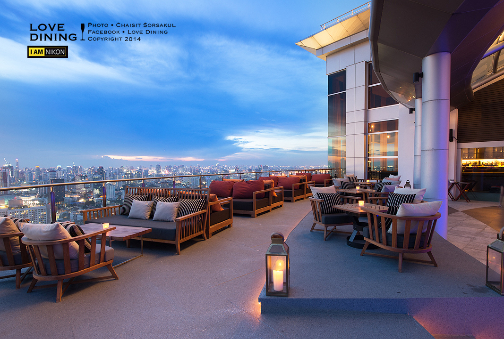
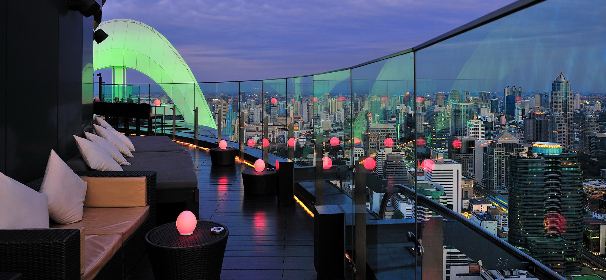
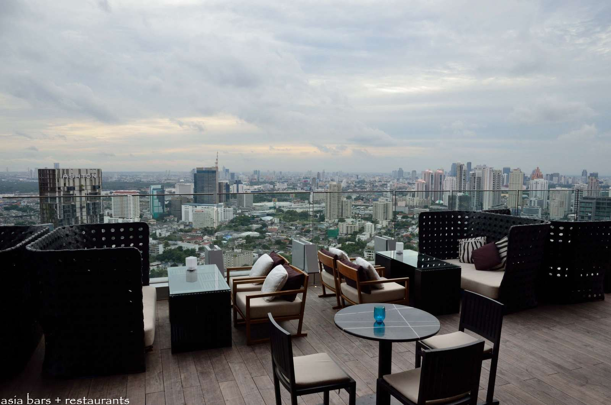
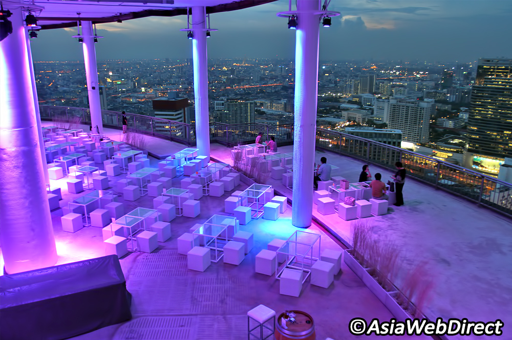
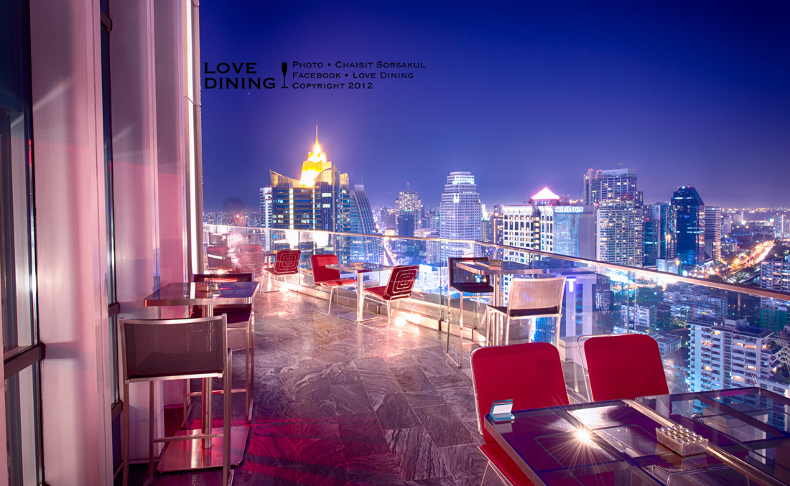
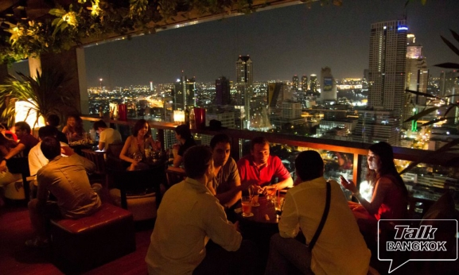
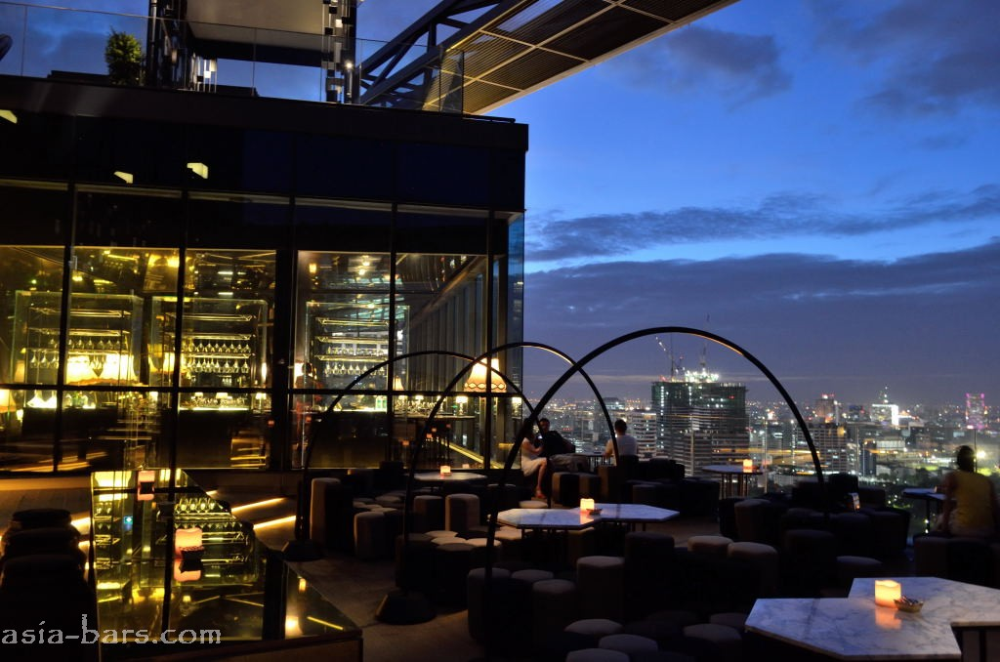

# Kelionės info

### Airport link ราชปรารภ (priešpaskutinė stotelė)

SuperRich - geriausios keityklos

**Boats in Bangkok:** [**http://www.transitbangkok.com/khlong\_boats.html?hc\_location=ufi**](http://www.transitbangkok.com/khlong\_boats.html?hc\_location=ufi)

### **Places to see**

#### Pak Khlong Talak, a flower market (\*\*Jakkrapet Road Bangkok)

* Depart in the early morning from Saphan Taksin BTS station, and take the Chao Praya River Express boat to Pak Khlong Talat, Bangkok's largest 24-hour flower market.
* SkyTrain to Saphan Taskin station, then transfer to Taksin Pier and take the Chao Phraya Express boat to stop #7, Rajinee. Alternatively, ask a taxi or tuk tuk driver to take you to Pak Khlong Talat, or show them this Thai text:  ปากคลองตลาด.
* A beautiful sight to behold as morning dawns, this market is also handily situated on the way to Wat Pho and Wat Arun; two of Bangkok's must-see temples.
* If visiting at night, be sure to visit nearby Yaowarat Road, Bangkok's Chinatown. From textiles to second-hand souvenirs, its a bargain-hunter's paradise.

#### **Grand Palace (Wat Pho)**

#### **The National Museum Bangkok**

* The National Museum is perhaps best reached by taxi, although you could get the Chao Phraya Express Boat to Maharaj Pier and walk from there (approximately 20 minutes).
* The National Museum is open daily from 9am to 4pm, except Mondays, Tuesdays and public holidays.
*   Address: Na Phrathat Road

    Phra Borom Maha Ratchawang, Phra Nakho

    Bangkok 10200

    Thailand\*\*

**Temple of Dawn (Wat Arun), and temple of the Emerald Buddha.**

* best place in Bangkok to enjoy the sunset. _a beautiful ending to your first day in the city._ 6:31 PM Netoli chinatown
* 158 Wang Doem Road, Wat Arun, Bang Kok Yai (Take the boat to Pier Tha Tien and then take the ferry to cross the river), Bangkok 10600

**Temple of the Golden Buddha (Wat Traimit)**

* Beautiful architecture, housing the golden Buddha. Chinatown heritage museum is also inside this compound.
* 661 Chaoren Krung Road\
  Talad Noi, Samphanthawong

**Temple of the Emerald Buddha (Wat Phra Kaew)**

* A must visit temple. Thailand has some beautiful temples and this is one of those ones.
* Na Phra Lan Road\
  Phra Borom Maha Rajawang, Phra Nakhon

**Snake Farm (Queen Saovabha Memorial Institute)**

* They perform a snake show every two hour which last for about 40-60 minutes. Apart from the show (if it troubles your heart too much) you can go and visit the snakes in the boxes in the display center. This center actually is a venom preserving center and various medicines are developed and researched here. It is often mistaken for a snake farm which it is really not. You can see the King Cobra, Rattle Snakes, Burmese Python and the famous Thai Red Neck Snake.
* Admission fee is THB 200
* 1871 Rama IV Road\
  Phathumwan

### ToEat

**Sukhumvit Soi 38 Night Food Market**

* Fancy trying one of the best pad Thais in the city? Then head to the unsuspecting ‘Pad Thai Fire Look’ stall near the entrance to Sukhumvit Soi 38 on the right.	&#x9;
* \*\*Address:\*\*	Soi Nana, Sukhumvit Road	Bangkok	Thailand&#x9;

**Supatra River House**

* might very well be one of Bangkok's best restaurant
* From Chang Pier a free shuttle operates to the restaurant.
* Must-try dishes: duck red curry, river prawns, and mango sticky rice.		&#x9;
* 266 Soi Wat Rakhang, Arunamarin Rd	Bangkok	Thailand&#x9;

**Creamery Boutique Ice Creams**

* To find this unique little ice cream parlour, head to the U-Center along Soi Chulalongkorn 42.
* U Center Chula Soi 42, Pathumwan, Silom

**ChikaLicious Dessert Bar**

* Phloen Chit Road\
  Central Embassy Mall, Lumphini, Pathum Wan

**Koi Bangkok**

Japonų restoranas

### **Shopping**

**Siam Paragon**

* On the weekends, the area is packed with make-shift stalls filled with fashionable clothing, shoes, key chains, and electronics. From international clothing brands to local fashion stores, everything you might want to buy is at Siam Paragon. This is also the place to be if you want to watch a movie, explore an underwater world, or visit the Madame Tussaud's Museum.
* The basement is filled with hawkers and restaurants where you can find an array of different cuisine from around the world. It's relatively cheap too!
* If you're buying things from the street, remember to haggle down to at least half the originally quoted price, and always question the goods' authenticity.

#### Patpong Night Market

* located at Silom MRT/Sala Daeng BTS station — is also a popular nightlife area. Explore the large variety of bars and infamous 'ping pong' night clubs and shows here, plus pick up any number of souvenirs, and perhaps a pair of the ever-popular elephant-style pants. The area is also flooded with food stands, many of which sell my favorite street snack — 'mo-ping' (barbecued pork on a stick).\*\*\*		Silom and Surawong Roads, Bangkok, Thailand&#x9;

### **Parkas**

**Erawan Waterfalls**

**8-16h**

The entrance fee is 300 THB for foreignershead back to BTS Saphan Taksin and board the Chao Phraya Express boat to Thonburi Railway Station, which will take you west to Kanchanaburi, a rural province home to the historical Bridge Over the River Kwai, a massive hilltop Buddha known as Wat Tham Sua and one of Thailand’s controversial Tiger Temples. Rattanakosin?

#### By bus

BKS public buses (line 81) leave from Bangkok's Southern Bus Terminal, which is located far west in the suburb Thonburi. In Kanchanaburi, there are two separate but nearby bus terminals, with 1st class buses departing from an office off Thanon Saengchuto, and 2nd class buses from the larger terminal one block east.

* 1st class buses should leave Bangkok every 15 minutes from 05:00-22:30, take about 2 hours, and cost 110 baht, including a bottle of water.
* 2nd class buses (new route) leave Bangkok every 20 minutes from 03:30-19:00 and take about 2 hours. Cost 95 baht.
* 2nd class buses (old route) leave Bangkok every 15-30 minutes from 04:00-18:00 and take about 3 hours.

There are also tourist minibuses directly to/from Khao San Road, departing Kanchanaburi at 13:30 and 18:30.

#### By minivan

Minivans depart to Kanchanaburi from BTS Victory Monument. The minivans leave when they are full or every 15 minutes. The price is 130 baht from Bangkok to Kanchanaburi and 120 baht from Kanchanaburi to Bangkok.

### Traukiniai

[http://www.seat61.com/Thailand.htm#Ko\_Samui](http://www.seat61.com/Thailand.htm#Ko\_Samui) - trains [http://thailandtrainticket.com/](http://thailandtrainticket.com) [http://www.railway.co.th/checktime/checktime.asp?lenguage=Eng](http://www.railway.co.th/checktime/checktime.asp?lenguage=Eng)

If you're going to Ko Tao, make your ferry connection at Chumphon. For Ko Samui and Ko Pha Ngan, go to Surat Thani (Phun Phin).

If you're aiming for Ko Tao, the express #85 is an option -- it gets you into Chumphon at around 04:00 (leaving Bangkok at 19:15 the previous night) which leaves you at Chumphon three hours before the Lomprayah ferry leaves for Ko Tao. The later (and far more popular) Express Special Diesel #39 leaves Bangkok at 22:50 and gets into Chumphon at 05:52 the following morning -- this leaves you an hour to get to the ferry, which is more than adequate time, BUT if the train is delayed (not unheard of) you will miss the ferry and will have to take the afternoon boat.

**Ko Pha-Ngan viaLomprayah**1000B; 3¼hr; 2daily (7am & 1pm)**Ko Pha-Ngan viaSongserm**900B; 5½hr; 1daily (7am)**Ko Samui viaLomprayah**1100B; 4½hr; 2daily (7am & 1pm)**Ko Samui viaSongserm**1000B; 7hr; 1 daily(7am)**Ko Tao viacar ferry**400B; 6hr; 1 daily(11pm Mon-Sat)**Ko Tao viaLomprayah**600B; 1½hr; 2daily (7am & 1pm)

If you're heading to Ko Samui which night train you take doesn't matter so much as there are far more frequent ferry connections out to Ko Samui from around Surat Thani. Despite these frequent ferry departures, the Express Special Diesel #39 from Bangkok remains by far the most popular choice.

To **Ko Tao** you have the following options, the [Lomprayah](http://www.lomprayah.com) high-speed catamaran (leaves Chumphon at 07:00 and 13:00) costing 550B and takes 90 minutes, and the Songserm and Seatran boats, both of which leave at 07:00, costing 650B and 450B respectively and take 2.5-3 hours. The Lomprayah service is worth the extra money. The night ferry leaves Chumphon at 23:00 and arrives at 05:00 costing 300B.

To **Ko Pha Ngan**, you need to go to Surat Thani from where Raja Ferry run five boats a day from Don Sak to Ko Pha Ngan and Songsern run two. There is also the night boat which leaves Surat Thani at 23:00 for Ko Pha Ngan (taking six hours). From Ko Pha Ngan to Surat Thani, though, the boat is an hour earlier, at 22:00. Note if you miss the 07:00 direct Songserm boat to Ko Pha Ngan, you may be able to go to Ko Samui, then grab an afternoon boat from there to Ko Pha Ngan.

To **Ko Samui**, there are ferries on the hour from Don Sak to Lipa Noi on Ko Samui and seven a day to Nathon -- these are all run by Raja Ferry. Seatran runs three ferries a day from Ban Don to Nathon on Ko Samui and Songserm run one a day (08:00) from Ban Don to Nathon.

The map below summarises the main ferry routes.

### Salos

#### **Kho Tao**&#x20;

* Even if you're not a diver, there's still plenty to keep you happy (it's the kind of place pharangs come for a couple of days and never leave);&#x20;
* Koh Tao has an irresistable charm - not to mention an excellent nightlife, including the odd full-moon party, that is a bit more grown-up than at neighbouring Koh Pha Ngan.&#x20;
* Haad Sairee is the main hub of activity and the best place to stay if you fancy late night buckets, dancing on the beach and fire shows.&#x20;
* North Sairee is home to a good number of upscale resorts far enough from the bustle of central Sairee to offer calm, while close enough to easily walk to and from the party.&#x20;
* Mae Haad is the second largest city centre. This is where you will find the pier alongside a slew of slightly more upscale restaurants and bars.&#x20;
* Chalok Ban Kao is peaceful and serene. While it offers fewer options in terms of nightlife than the other two hubs, you will not find yourself lacking in things to do past 21:00. &#x20;
* [http://tezza-thailandbeachesandislands.blogspot.com/2010/06/ko-tao-updated.html](http://tezza-thailandbeachesandislands.blogspot.com/2010/06/ko-tao-updated.html) - papludimiai
* Guided tours are also available and canbe booked at any local travel agency.&#x20;
* Toursrange from 500B to 800B (usually including gear, lunch and a guide/boat captain)and stop at various snorkelling hotspotsaround the island.&#x20;
* **Laem Thian** is popularfor its small sharks, **Shark Island** has loadsof fish (and ironically no sharks), **Ao HinWong** is known for its crystalline waters,and **Light House Point**, in the north, offers&#x20;

**Koh Phangan -** full moon party.&#x20;

* Ko Pha Ngan has great potential for boat and fishing trips, elephant trekking, diving, ATV rides, zip lines and even kite-boarding as well as other watersports. There's a smattering of waterfalls, many detox and yoga centres and the island is fast becoming renowned for meditation retreats. On the east coast, you'll also find Sanctuary and the related Wellness Centre — famous around the world for its [seven day fasting courses](http://www.travelfish.org/feature/5).&#x20;
* Yra krioklys If you want a picture-perfect strip of sand, then [Haad Saikantang](http://www.travelfish.org/location/thailand/southern\_thailand/surat\_thani/haad\_saikantang) is very difficult to beat -- white sand, crystal clear water and so far fairly limited development.&#x20;
* Other lovely strips include Thong Nai Pan Noi, [Bottle Beach](http://www.travelfish.org/location/thailand/southern\_thailand/surat\_thani/bottle\_beach), if it's not too busy, and [Haad Khom](http://www.travelfish.org/location/thailand/southern\_thailand/surat\_thani/haad\_khom) on the north coast.&#x20;
* [http://tezzasthaiinfo.blogspot.com/2006/12/ko-phangan.html](http://tezzasthaiinfo.blogspot.com/2006/12/ko-phangan.html) &#x20;
* [http://www.phangan.info/index.cfm?action=phangan.index\&CFID=173509\&CFTOKEN=17166e64454beb18-F9DB7406-F73B-0B0C-D404803A6BEFD36D](http://www.phangan.info/index.cfm?action=phangan.index\&CFID=173509\&CFTOKEN=17166e64454beb18-F9DB7406-F73B-0B0C-D404803A6BEFD36D) - gidas&#x20;

**Mu ko ang thong national marine park**&#x20;

* perfect snorkelling conditions. As well, you can explore caves and tunnels carved out of the limestone cliffs by erosion, creating strange rock formations that beckon one to investigate further. Bending low in your kayak as you just make it under a jagged rock overhang, through to a hidden lake, one can just imagine this being a perfect pirates’ refuge.&#x20;
* The easiest way to experience Ang Thong is via a tour operator, with several offering daytrips to the marine park. An average tour would collect you from your accommodation at around 07:30, and deliver you back around 17:00. Prices range from 1,200 baht per person to about 3,900 baht, and most include park fees of 200 baht as well as lunch and soft drinks.&#x20;
* Accommodation is available in the form of basic bungalows or tents for hire, and prices range from 500 baht to 1400 baht including bedding and a fan, no air-con.&#x20;
* Bookings can be made 60 days in advance from the national park website or call +66 25 620 760 (from abroad) for reservations. Ang Thong is also home to a sea gypsy village on Ko Paluay, included on some tours.&#x20;

#### **Ko Samui**

* daug turistų, bet turi daug gerų paplūdimių: [http://www.travelfish.org/feature/15](http://www.travelfish.org/feature/15)&#x20;
* Labai detalus žemėlapis: [http://samui.sawadee.com/map/index.html](http://samui.sawadee.com/map/index.html) &#x20;
* **Nam Tok Na Muang** WATERfALL\
  At 30m, this is the tallest waterfall on Samuiand lies in the centre of the island about12km from Na Thon. The water cascadesover ethereal purple rocks, and there’s agreat pool for swimming at the base. This is the most scenic – and somewhat less frequented – of Samui’s falls.\
  There are two other waterfalls in the vicinity: a smaller waterfall called **Na Muang2**, and the high drop at **Nam Tok Wang Saotong**, which, thanks to recently improvedroad conditions, is now accessible.&#x20;

#### Phuket-- / Koh Phi Phi / phataja

* package tour hordes and budgeteers will find it woefully overpriced

### Skybars

#### Zeppelin Rooftop Bar

* 180 degree cityscape from the 46th floor.
* The bar and restaurant are open 6:00 pm – 1:30 am
* Their range of beers and wines is very reasonably priced. The food is extremely good value too
* The crowds are absent, an evening here is affordable and the outdoor terraces faces the sunset, with a fantastic perspective over the city and the river that runs through it.
* This might not be the most trendy skybar from Bangkok but that's all for the better: les crowded and less tourists. It's very easy to get to with the sky train and easy to find.
* All looks, no substance. The service is unfortunately almost non-existing

#### **Red Sky**

* It has pretty impressive 360-degree panoramic vistas from its 55th floor, one of the most convenient locations in town
* Chances are you will end up shopping in the Siam area, where the largest and most trendy shopping malls are located, such as the legendary Siam Paragon, MBK and the newly rebuilt CentralWorld. Red Sky bar is part of the Centara Grand Hotel, which itself is actually part of this gigantic CentralWorld shopping mall.
* Here, there's no rush; take your time and enjoy the moment with an excellent Jazz quartet who understand what 'background music' really means
* Only few sofas actually facing the sunset, so if you really want to get the best seat, come a bit early
* There's a good selection of sophisticated European cuisine which is a bit pricey without being too extravagant and the cocktail and wine list are long enough so you're sure to find the perfect drink to go with your lamb or imported beef.
* Outstanding service. We felt welcomed by the warm hospitable atmosphere created by this manager and her team, as if we were among friends
* The drinks and food are much more expensive than restaurants down below. They had a 2 for 1 promotion. (5pm to 7pm)
* I've read that arriving around 5:30 PM might be a good idea, as long as you can see the sunset - so that's what I've done. If you arrive about that hour you can still find someplace do seat and whatch the sunset, having a glass of wine and tasting some snacks. the bill will sting

#### **Vertigo Grill and Moon Bar**

* Be sure not to arrive too late, the best seats are quite limited so to grab a table arrive well before sunset, which is usually around 6.30 pm. There are plenty more seats on the walkway leading to Vertigo restaurant but it's less comfortable and there’s a aerial in the way of those vista photos.
* Being a real open air bar and restaurant, they close it when it rains and use the less impressive room below, which is obviously not the same fun. Remember also to allow enough time to reach there; traffic jams on Sathorn road are not unusual at the end of the afternoon.
* Bar: 17:00 - 01:00 - Restaurant 18:00 - 23:00
* 61 floors up
* We went for post dinner drinks, not to eat. Expensive - Yes, but you have the view.
* Don't forget to book for dinner (it's always busy) and remember the booking will be cancelled if it's raining as it will only be open if there's no rain. There is also a dress code (no shorts or flip flops).
* Price for cocktail are abound 500 bath
* However is really too expensive, for example a steak costs around 3500/4000baht.. Anyhow, i would recommend the adjacent moon bar for a drink with a view that would be perfect for a date night..

#### **Octave Rooftop Lounge and Bar**

* Although the location is handy, it is slightly off the main tourist trail meaning that it is usually easy to grab a seat at one of Octave’s tables with a view
* 360 degree view
* 45th floor
* opens at 17:00
* Octave has made sure that there is an impressive selection of seating with uninterrupted views of the city
* The cocktail selection was creative with prices starting at 320 baht and included a Bangkok 57, a shot of saffron-infused vodka topped up with champagne and the pink tinged Bloom over the Roof, a mojito style blend with a hint of red fruit and the sweetness of elderflower cordial. Local beers start at 170 baht and there is a selection of wine by the glass. Mocktails start at 220 baht and we enjoyed the sweet but refreshing mango and ginger Sunset. less expensive than the other ones and the staff is very attentive
* They have a happy hour between 6 and 7pm.

#### **Sirocco Restaurant**

* No bags/suitcases - you must leave them to the staff. If raining - the famous outside bar is closed. Opens 6pm.
* The prices are monstrous. Sirocco was more expensive than any other restaurant either of us has been to, in terms of value for money. To give you an idea - for a shared entree (two scallops), two mains, a scoop of icecream and a bottle of Italian wine (one of the cheaper bottles at AUD120), our meal came to AUD450.
* 64th floor
* gets super crowded after 20h
* \+Silom Road

#### **CLOUD47 Rooftop Bar & Bistro**

* here prices are surprisingly friendly, atmosphere is casual and a beer costs no more than 160 baht. The location right in the centre of popular Silom Road, just past the famous Patpong night market and evening entertainment zone, is also quite convenient… if you know where to look!
* Cool After failing to get a reservation at another rooftop bar

#### **L'Appart Sofitel Bangkok Sukhumvit**

* On The 32nd Floor
* L’Appart is a French restaurant with perhaps the greatest concept design Bangkok has to offer. Styled as a high-society Parisian apartment from the turn of the 19th Century
* The French menu served at L’Appart has been prepared by Executive Sous Chef and Chef Jeremy Tourret who has a wealth of experience picked up from working in Michelin Star restaurants around the world. He enhances classic French recipes with locally sourced produce in dishes such as tuna tartar with avruga caviar topped with tropical mango and passion fruit condiment (450 baht) and snow fish steamed with lemongrass, ginger and kaffir lime leaves (950 baht). However, it is clear from the flavours and presentation of the food that L’Appart serves French cuisine – albeit with a twist – rather than fusion.
* The barmen at L’Appart have been trained extensively in the art of mixology and the best time to try their concoctions for yourself is during their daily sunset happy hour from 17:00-19:00 when all drinks are two-for-one.
* food which tasted as good As it looked, service was Attentive and efficient very friendly and happy staff nothing was too Much trouble. Drinks on the balcony before and after dinner started and finished the meal with a fantastic View of Bangkok.

#### **Scarlett Wine Bar & Restaurant**

* 37th floor
* we selected our wine from an extensive wine list of more than 150 labels and were eager to discover what a 2 star Michelin Chef has to offer. As usual the most fun sounding dishes are always the most appealing so we went for 'Bone Marrow with Shallots' (310 baht), a 'Lobster Caesar Salad' (690 baht), some 'Jamon Iberico de Bellota' (650 baht)
* 6:00 pm - 1:00 am
* convenience of great food with comfortable surroundings and superb setting is difficult to beat.

#### **Park Society Restaurant & Bar**

* 29th floor
* Would recommend for anyone looking for a great rooftop bar that is not laden with tourists.
* The cocktails I ordered are great and the prices are acceptable for 5 stars hotel. There are also some free snacks and nuts served after we ordered drinks. The manager were really professional and full of service mind.
