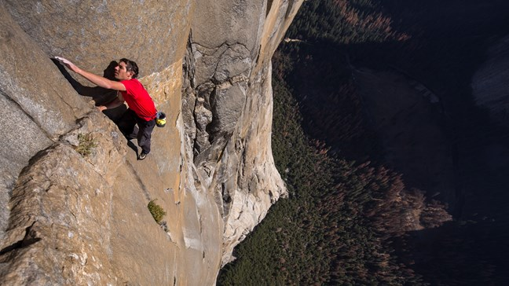

# Podcastai

## Programėlė

Podcast'ų klausymui yra išties nemažai gerų programų, tačiau pagrindinis mano kriterijus app'sui - jog būtų multi platforminis. Podcast'us galiu klausyti Android telefone, iPad'e, stacionariame kompiuteryje ar Google Home Mini kolonėlėje, tad naudojama programa turi palaikyti juos visus, sinchronizuotis tarpusavyje. Ir tai puikiai daro Pocketcasts. Tiesa, jis mokamas, tačiau vietoj subscription modelio, jie turi tiesiog vienkartinę įmoką.

## Prenumeratos

Šiuo metu esu užsiprenumeravęs ir kartas nuo karto paklausau šiuos podcastus:

* [1K Podcastas](https://pca.st/H8r7)
* [All About Android](https://pca.st/aaa)
* [Android Central Podcast](https://pca.st/androidcentral)
* [Android Police Podcast](https://pca.st/androidpolice)
* [Ask Mr. Wonderful](https://pca.st/6Hhp)
* [Conan O’Brien Needs A Friend](https://pca.st/n6Uc)
* [Cortex](https://pca.st/cortex)
* [The Cracked Podcast](https://pca.st/crackedpod)
* [Darknet Diaries](https://pca.st/darknetdiaries)
* [Developer Tea](https://pca.st/developertea)
* [Freakonomics Radio](https://pca.st/freakonomics)
* [The Game Informer Show](https://pca.st/mNBro4)
* [Giant Bombcast](https://pca.st/U6Vk0G)
* [Hello Internet](https://pca.st/hellointernet)
* [How I Built This with Guy Raz](https://pca.st/howibuiltthis)
* [ID10T with Chris Hardwick](https://pca.st/id10t)
* [The Infinite Monkey Cage](https://pca.st/infinitemonkey)
* [The Joe Rogan Experience](https://pca.st/joerogan)
* [The Laracasts Snippet](https://pca.st/a6jO)
* [No Such Thing As A Fish](https://pca.st/nosuchthing)
* [Planet Money](https://pca.st/planetmoney)
* [Pralaužk vieną šaltą](https://pca.st/SZNm)
* [Radiolab](https://pca.st/radiolab)
* [Recode Decode, hosted by Kara Swisher](https://pca.st/recode)
* [Reply All](https://pca.st/replyall)
* [Scam School](https://pca.st/Bx9IOh)
* [StartUp Podcast](https://pca.st/startup)
* [Still Untitled: The Adam Savage Project](https://pca.st/adamsavage)
* [Studio 360 with Kurt Andersen](https://pca.st/Cv0Jlv)
* [Stuff To Blow Your Mind](https://pca.st/blowyourmind)
* [Stuff You Should Know](https://pca.st/sysk)
* [TechStuff](https://pca.st/techstuff)
* [TED Talks Daily](https://pca.st/tedtalks)
* [This Week in Tech](https://pca.st/twit)
* [The Tim Ferriss Show](https://pca.st/timferriss)
* [The Tiny Meat Gang Podcast](https://pca.st/Yk3N)
* [Under The Skin with Russell Brand](https://pca.st/SOWN)
* [The Vergecast](https://pca.st/vergecast)
* [WTF with Marc Maron Podcast](https://pca.st/wtf)
* [Y Combinator](https://pca.st/3Gld)
* [The Yak Shave](https://pca.st/maOV)
* [«Не занесли»](https://pca.st/TQfa)
* [Радио-Т](https://pca.st/x6bUPQ)

## Perklausos

### 2019 - 06

* [Naval Ravikant](https://www.youtube.com/watch?v=3qHkcs3kG44) - vienas iš angel investorių AngelList kompanijoje

> If you want to see who rules over you see who you not allowed to criticise.

> Working for things as rewards is a real trap there a lot of people follow into.

Netapsi turtingu vien tik pardavinėdamas savo laiką. Kiekvieną kartą, kai pradedi charginti daugiau už savo darbą, prasideda lėtas upgrade loop'as ir tavo išlaidos taipogi padidėja. Savo pajamų prieaugį panaudoji gyvenimo kokybės nedideliam pagerinimui, galbūt pasidarai remontą, susitvarkai ar nusiperki automobilį, perki butą, persikraustai į geresnį rajoną ir t.t. Ir gan greitai pradedama vėl sieki didesnio charginimo, nes niekas pernelyg nepasikeitė. Kitaip tariant - jei nori užsidirbti, turi tiesiog daug dirbti. Jeigu nori praturtėti - turi daryti kažką kito. Dėl šios priežasties net dideles pajamas gaunantys žmonės, kaip pvz teisininkai, gydytojai ir pan taipogi nėra tokie jau išties turtingi, t.y. neturi sutaupę milžiniškų sūmų savo sąskaitose. Tai ypač pasitvirtina, jei turtu laikyti asset'us, kurie tau uždirba pinigų.

> There are two great addictions - heroin and the monthly salary.

> Specialisation is for insects.

Žmonės randa vieną sritį, kurioje jiems sekasi ir dažniausiai lieka joje visą likusį gyvenimą. Dėlto, kad patogu, dėlto, kad taip nepasirodys neišmanėliais ir dėl baimės pradėti viską iš naujo. Romėnai, graikai turėjo visą ciklą - eini į mokyklą, dalyvauji kare, vertiesi veslu, tarnauji senate ir galiausiai tampi filosofu. Kitaip tariant turi daug skirtingų "karjerų", išbandai save keliose visiškai skirtingose srityse. Tarsi gyvenimo arka. Dabar dažniausiai taip nebegyvename, specializuojamės.

> We each have two lives. The second one begins, when we realize we have only one.

> ### 2019 - 05

* [Jamie Metzl](https://youtu.be/aaZRiN15tXI) - futuristas, knygos Hacking Darwin autorius

> One of the biggest stories of the 21st century will be how the US - China rivalry plays out and the playing field will be revolutionary technologies and China has a national plan to lead the world in these technologies by 2050 they're putting huge resources they have really smart people they are really focused on.

> China is a country run by engineers... America is a country run by lawyers.

* [Lex Fridman](https://youtu.be/PmRYHWq4cn4) - mokslininkas dirbantis MIT ties Human-Centered AI & Autonomous Vehicles

> Once you become this thing that doesn't need emotion doesn't need conflict it doesn't need to be inspired it never gets lazy it doesn't have these things that we have built into us as a biological system like if you looked at us as we're operating software it's it's not good software right it's software designed for cave people and we're just trying to force it into cars and force it into cubicles but part of the problem with people and their unhappiness is that all of these human reward systems that have been set up through evolution and natural selection to have these instincts to stay alive they're no longer relevant in today's society so they become become road rage they become you know extracurricular violence it became depression they become all these different things that people suffer from

### 2019 - 04

* [Kevin Hart](asmenybes/pop-kultura/kevin-hart.md)

### 2019 - 03

* [Alex Honnald](https://youtu.be/2OhHkBmbb5Y) - kur kiekvienas interviu džiugina jau vien tuom, kad pašnekovas vis dar čia, vis dar gali atvykti. Alex'as yra žymiausias Free Solo kopėjas, kuris [vienintelis įlipo](https://www.wikiwand.com/en/Free_Solo) į garsiausią JAV kalną be jokios įrangos. 22 metus vyrukas vaikšto tokia slidžia riba, kur viena vienintelė klaida, jam kainuotų gyvybę. Podcast'e pasakoja apie tai, kad kopiant įsitempimas turi būti tarp 3,5-7, nes kitu atveju yra didelė tikimybė padaryti klaidą. Apie tai, kaip kopikai pasiilsina rankas kabėdami žemyn galva ir apie tai, kad turi būti pakankamai įsitempęs, kad neprarastum savo general alertness, tačiau tuo pat metu ir pakankamai atsipalaidavęs, jog jaustumeisi komforto zonoje ir nenuvargintum savęs. Yra puikus filmas apie tai, kaip vystėsi visa ši kopimo kultūra, pavadinimu [Valley Uprising](https://www.imdb.com/title/tt3784160/).

