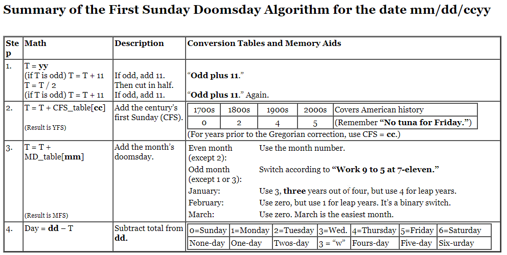

# Algoritmai

## Doomsday Algorithm

Metodas išskaičiuoti bet kurios datos savaitės dienai tiesiog mintyse.

Doomsday tai atspiros taškas, kuris naudojamas visų kitų datų išskaičiavimui. \
Metų doomsday (YDD) visada yra paskutinė vasario diena, nepriklausomai ar tai keliamieji metai.\
Kiekvieno kito mėnesio doomsday (MDD) galima nusistatyti pagal kelias paprastas taisykles ir toji diena visada yra lygi metų doomsday.\
Na o žinant bent vieną to mėnesio dieną - visas kitas visai nesunku išskaičiuoti tiesiog pliusuojant/minusuojant 7.

### Einamieji metai

Einamųjų metų dienas išskaičiuoti galima kiek paprasčiau, o tame tarpe nesunkiai galima sukoreliuoti ir praėjusių ar ateinančių metų datas. Kas iš esmės apima didžiają dalį panaudojamumo, nes labai retais variantais prireikia nusistatinėti tolimesnes dienas.

* Tad norint galėti išskaičiuoti einamųjų metų bet kuriai dienai, užtenka prisiminti tų metų YDD ir you good for the rest of the year.
* Kiekvienais nekeliamaisiais metais ši diena slekasi per 1, o keliamaisiais per 2.\
  Ar metai keliamieji galima nustatyti iš to ar jie dalinasi iš 4.
* Žinant tų metų YDD, kiekvieno mėnesio MDD galima nustatyti pagal šias taisykles:\
  1mėn - 3/4 diena priklausomai ar tai keliamieji metai\
  2mėn - 0/1 diena priklausomai ar tai keliamieji metai. 0-inė mėnesio diena yra tiesiog kito mėnesio paskutinė diena\
  3mėn - visada 0\
  4/6/8/10/12 mėn - lyginiams mėnesiams naudojama tiesiog to mėnesio skaičius\
  5/9 ir 7/11 mėn - apkeičiame mėnesių skaičius pagal frazę "9to5 at 7-eleven"
* Žinant mėnesio MDD, galima nebesudėtinga išdeduktinti ir visas likusias to mėnesio dienas

Pvz.: 2021-11-06

* Tiesiog esu įsiminęs, jog šių metų YDD yra sekmadienis
* Tad 11 mėnesio MDD yra 7, nes 7-eleven (11-07 yra sekmadienis)
* Tad 06 diena yra -1: šeštadienis

Pvz.: 2022-06-10

* Kadangi šių metų YDD yra sekmadienis, tad kitais metais tai pirmadienis, nes nekeliamaisiais slenkasi per 1 (02-28 bus pirmadienis)
* Tai 06 mėn MDD yra 6, nes lyginis mėn (06-06 yra pirmadienis)
* Tad 10d yra +4, tad penktadienis

### Bet kurie metai

Principas panašus, tačiau procesas susidaro viso iš 4 dalių:

1. Imami metų paskutiniai 2 skaičiai. Jei tai lyginis skaičius - dalinama iš 2, jei ne, pirmiau pridedami 11 ir tik tada padalinami. Jei rezultatas gaunasi nelyginis, tai vėl pridedame 11.\
   Jei skaičius gaunasi didelis - galima išsimesti perteklinius 7-etus.
2. Prie gautojo rezultato pridedame šimtmečio pirmąjį skaičių. Padeda prisiminti frazė "No tuna for friday": 0,2,4,5.
3. Prie gautojo skaičiaus pridedame to mėnesio doomsday pagal tokias pat taisykles, kaip aprašyta prie einamųjų metų skaičiavimo
4. Iš išskaičiuojamos dienos atimame rezultatą. Jei gauname minusinį skaičių, jį dar papildomai atimame iš 7 ir gauname tos dienos savaitės dieną.

Pvz.: 1989-11-06

* 89 - nelyginis. Tad 89+11=100; 100/2=50; 50 - lyginis nieko nebedarom, tik išsimetam perteklinius 7: 50-(7\*7)=1
* 1900 šimtmečio skaičius yra 4, tad 1+4=5
* Mėnesio doomsday yra 7, nes "7-eleven". tai rezultatas yra 5+7=12. Išmetus perteklinius 7: 12-7=5
* Dienos išskaičiavimas: 06-5=1. tad pirmadienis.

* [http://rudy.ca/doomsday.html](http://rudy.ca/doomsday.html)
* [https://firstsundaydoomsday.blogspot.com/2009/12/quick-start-guide.html](https://firstsundaydoomsday.blogspot.com/2009/12/quick-start-guide.html)
