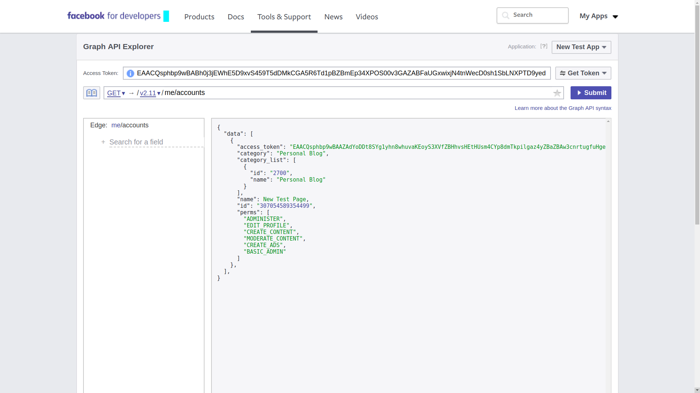
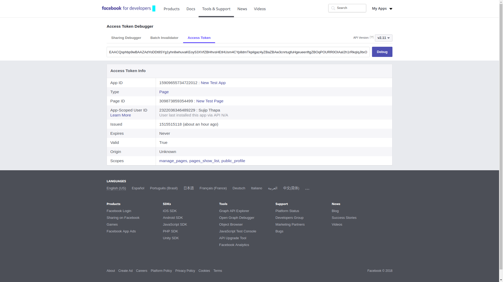

# API's

### Facebook page feed

Po Cambridge Analytica įvykių Facebook sugriežtino duomenų prieigą ir jei anksčiau viešus duomenis galėdavo pasiimti bet kas, tai dabar atsirado papildomų niuansų - norint gauti puslapio duomenis, reikia turėti [Page Public Content Access](https://developers.facebook.com/docs/apps/review/feature/#reference-PAGES_ACCESS) teises, o joms gauti reikia praeiti visą App Review procesą, kuris susideda ne tik iš įmonės duomenų suvedimo, tačiau reikia pateikti aprašymą ir nuorodas, kurios demonstruotų, kaip šios teisės bus naudojamos. Tačiau yra viena išlyga - šių teisių nereikia, jei vartotojas turi _manage\_page_ teises tam puslapiui. Kitaip tariant - jei tai puslapio administratorius. 

#### Access Token generavimas

Taigi užtenka tik susigeneruoti token'us ir juos naudoti duomenų paėmimui:

* Pirmiausia pradedama nuo New App sukūrimo [Facebook Developers ](https://developers.facebook.com/)puslapyje ir ten nusikopijuojame App ID ir Secret
* Einama į [Facebook Graph API Explorer](https://developers.facebook.com/tools/explorer) ir sugeneruojamas trumpos trukmės user access token'as. Teises vartotojui priskiriame "_manage\_pages_" ir "_pages\_show\_list_". Sukūrus nusikopijuojam _Access Token_ reikšmę.


* Einam į [Access Token Tool](https://developers.facebook.com/tools/accesstoken). Jeigu prie Apps'o nėra _User Token_, tai sugeneruojame jį. Jei yra, tai tiesiog spaudžiame _Debug_.
* Atsidariusiame lange įpastinama _Access Token_, kuris buvo nukopijuotas Graph API Explorer puslapyje ir spaudžiama _Debug_. Po paspaudimo matoma duomenų lentelė, kurioje turėtų matytis, kad  Expires reikšmė yra 1h. Lentelės apačioje spaudžiame "_Extend Access Token"_. Bus sugeneruotas naujas "long-lived" raktas, galiojantis 2mėn.
* Grįžtama į [Graph API Explorer](https://developers.facebook.com/tools/explorer), čia į _Access Token_ lauką įstatomas šitas long lived token'as, o kaip endpoint nurodomas "/me/accounts". Spaudžiam submit ir jei viskas ok, turimas gauti teigiamas response, iš kurio reikalingas naujasis, nesibaigiantis "_Access Token_" kuris ir yra reikalingas.



* Pasitikriname jį: einam vėl į [Access Token Debugger](https://developers.facebook.com/tools/debug/accesstoken/), susivedam jo reikšmę ir šį kartą Expires reikšmė turėtų būti "Never"



#### Api naudojimas

* [Facebook SDK](https://github.com/facebook/php-graph-sdk) 

```text
composer require facebook/graph-sdk

--
require_once __DIR__ . '/vendor/autoload.php';

$fb = new \Facebook\Facebook([
  'app_id' => '{app-id}',
  'app_secret' => '{app-secret}',
  'default_graph_version' => 'v2.10',
  //'default_access_token' => '{access-token}', // optional
]);

$response = $fb->get('/{page-id}/posts?&fields=id,created_time,permalink_url,message,attachments', {access-token});
```


