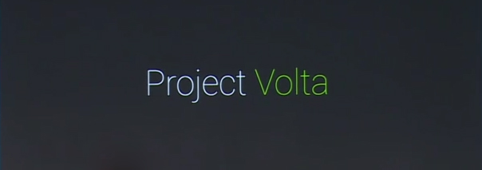
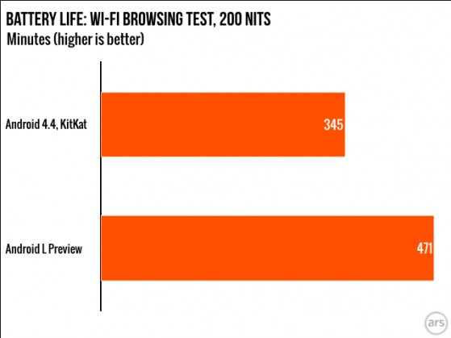

# Android iniciatyva pavadinimu „Project Volta“

Ironiška, kad praeitame straipsnyje užstūmęs apie android’ą, dabar rašau konkrečiai apie jį. Nesupraskite manęs klaidingai, man ši operacinė sistema patinka ir mano, kaip mėgėjo viską susicustomize’inti pagal save, poreikiams tai yra ko gero idealiausia mobili OS. Screw you, aš gi turiu patį „androidiškiausią“ telefoną – Nexus. Tiesiog manau, kad Android’ui dar reikia pasitempti su savo ekosistema, dedikuota planšetiniams kompiuteriams. Tik tiek.

Google, su kiekvienu dideliu android atnaujinimu mėgsta turėti dedikuotus projektus, kuriuose susikoncentruoja ties vienu esminiu trūkumu ir tobulina visą operacinę sistemą, siekiant šį trūkumą apeiti. Taip 2012-tųjų vasarą paleista Android 4.1 versija, žinoma Jelly Bean vardu, turėjo Project Butter, kuris sėkmingai nugalėjo ilgalaikį android priešą – interface’o pristabdymą, liaudiškai vadinamu lagu ir padarė, kad visos animacijos ėmė veikti maloniu akiai 60fps greičiu. Nebeliko dėl ko stumdytis ir iš ko šaipytis kaimynams su iOS ar Windows Phone operacinėmis sistemomis. Praėjusių metų rudenį pasirodė Android 4.4 arba KitKat, kuri žengė dar žingsniu toliau ir sistemą optimizavo dar smarkiau, priverčiant suktis sklandžiai net ir silpnuose biudžetiniuose telefonuose, o pastaroji iniciatyva įgavo lengvumo projekto \(Project Svelte\) pavadinimą. Ir štai, ką tik praūžusios Google prezentacijos metu, buvo anonsuota sekanti Android versija, kodiniu pavadinimu „L“ ir kuri šį kartą atvyksta su projektu, pavadintu Volta, kuris kovoja dėl telefonams taip reikalingo kiekvieno baterijos resursų lašo ir žada nemenkas optimizacijas būtent šioje srityje. 

Buvo atlikti testavimai ir paaiškėjo, kad jei telefone esanti programa pažadina telefoną iš miegojimo režimo \(deep sleep\) bent sekundei, tam, kad atliktų sinchronizacijas ar kitas užduotis, tai išnaudoja apie dvi minutes baterijos resursų. Niekada nesiskundžiau, kaip greitai telefonas eikvoja bateriją, kai juo naudojiesi. Akivaizdu, kad 1080p ekranai yra tikri baterijos siurbikai, bet „abydna“, kai telefonas išsikrovinėja, net kai guli padėtas ant stalo arba mums miegant. Kad išspręstų šią bėdą į Android L buvo įtraukta nauja JobScheduler sąsaja, kuri leidžia kontruoliuoti ne pirmo būtinumo užklausas, jas grupuoti, bei suteikia galimybę nukelti šias užklausas iki to laiko, kai telefonas bus pajungtas į tinklą krautis. Plius, nuo šiol telefonas nebesistenks atlikinėti tinklo užklausų, kaip kad pvz laiškų tikrinimas ar update’ai, kai išvis nėra prisijungta prie interneto.

Taipogi šioje Android versijoje padarytas pilnas šuolis nuo Dalvik prie ART virtualios mašinos, kuri užuot kompiliavusi atskirus programos kodo fragmentus, kiekvieną kartą jų prireikus naudojantis, sukompiliuoja viską pirmą kartą paleidus programą. ART, nors ir nėra tobula \(programos instaliuosis ilgiau, bei turės būti perkompiliuotos kiekvieną kartą po programos atnaujinimo\), tačiau yra spartesnė, už iki šiol naudotą Dalvik’ą, o tai reiškia mažiau procesoriaus resursų naudojimo, kas lygu mažesniam energijos eikvojimui.

Visą tai skamba išties šauniai, bet ar visa tai iš tikrųjų veiksminga?

Tinklapis Ars Technika, atliko naujosios versijos baterijos testą. Abu kartus Nexus 5 telefonas testuotas vienodomis sąlygomis: ekranas kolorometro pagalba nustatomas į 200 cd/m2 apšvietimo lygį, bei paleidžiamas scriptas, kuris prisijungus prie Wi-Fi krauna interneto puslapius kas 15 sekundžių iki kol telefonas išsikrauna ir išsijungia. Ir štai gauti rezultatai minutėmis:

Kitaip tariant 36% skirtumas! Kalbant buitiškai, telefonas kuris iki tol galėjo išpešti apie 6h neužgęstančio ekrano, dabar įgauna visas dvi papildomas valandas… Įspūdinga, ne kitaip.

Pradžioje atrodė, kad rezultatai nebus tokie geri, ypač turint omeny ankstyvą, vos developer preview stadiją. Tačiau štai kas gali būti padaryta, mažinant trintį programinėje įrangoje ir darant ją labiau, bei protingiau apgalvota. Ir tai dar neskaitant, kad dalis optimizavimų visgi yra susiję su telefono veikimu jam miegant, kas buvo nepaliesta šio testo metu, o ir iki pasirodymo rudenį, viskas bus dar ne vieną kartą nugludinta, atnaujinta, bus pritaikytos visos telefone naudojamos firminės programėlės, tad rezultatų bus galima tikėtis net ir dar geresnių.

Jei ne kelios suderinamumo, bei vientisumo bėdos su programomis, šią developeriams skirtą versiją susirašyčiau jau dabar \(Nexus privalumai\), nes ji pakankamai stabili, kad būtų galima naudoti kasdieniškai. O dabar, teks dar mažumėle palaukti iki rudens, tačiau, kaip jau dabar galima matyti, visas šis laukimas bus absoliučiai vertas.

