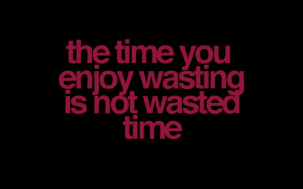

# Kaip Tadas naršykles kaitaliojo

Taip jau nutinka, kad apsistoji ties vienu produktu ir manai, kad jis pats geriausiais ir neprilygstamas. Taip buvo nutikę ir man. Vos tik pradėjęs domėtis kompiuteriais plačiau, supratau, kad _Internet Explorer_ nėra itin gera naršyklė ir tada mano gyvenime atsirado ne viena naršyklė. Ėmiau migruoti nuo vienos, prie kitos. Taigi šiandieniniame \(pirmame savo ką tik prasidėjusių atostogų\) įraše papasakosiu apie savo naršyklių patirtį, bei kas lėmė jų pasirinkimą.

Pamenu, kai kokioje penktoje, gal šeštoje klasėje apturėjau pirmąją pažintį su kompiuteriu, pirmuosius žingsnius internete. Įgavęs patirties pastebėjau, kad dažniausiai fone atsidarau begalės internetinių puslapių, kuriuos reiktų perskaityti ir pasibaigus mano laikui prie kompiuterio \(pats kompiuterio neturėdavau, tad naudodavausi viešojo naudojimo kompiuteriais bibliotekoje, bei mokykloje\) reikėdavo viską uždaryti ir prarasdavau daug vertingų straipsnių. Pamenu tokiais atvejais nusikopijuodavau svetainių adresus ir išsisiųsdavau juos sau el. paštu.

### **Po mažu užkibau ant įvairių reklamų internete, bei specialistų rekomendacijų naudoti kitą naršyklę – Opera.**

Pirmoji pažintis buvo stebinanti: skirtukai, kurių pagalba viename naršykles lange atidaroma daugybę puslapių, sesijos išsaugojimas, atsimenami slaptažodžiai, daug geresnis siuntimų organizavimas, daugybę nustatymų pagal vartotojo poreikius, temos \(vadinamieji skin’ai\) ir t.t. Tai buvo tarsi žingsnis epocha į priekį ir ši naršyklė dėlto mane pakerėjo.

Kadangi visi kiti kompiuterio vartotojai naudodavo tik IE, tad aš ją drąsiai instaliuodavau į kompiuterius prie kurių turėdavau galimybę sėdėti ir nebijodavau palikti išsaugotų langų. Tiesa, slaptažodžių tada nesisaugodavau. Bet po kokių metų ėmiau pastebėti, kad dažnai Opera būna paleista ir be mano žinios – kažkas išjunginėja mano įdomiuosius skaitinius, atšaukdavo siuntimus ir pan. Tai tikrai ėmė erzintis. Imdavau net slėpti pačią programą – ištrindavau visas nuorodas į programą ir pačią ją perkeldavau į kokį gilų, gilų užkampį, kad tik aš vienas galėčiau atrasti. Tada jau turėjau visiškai asmeninę naršyklę, kurioje galėjau net ir saugoti slaptažodžius.

Tačiau man greitai prireikė dar vienos naujos savybės – nešiotis naršyklę su savimi. Tai buvo daugiausiai dėlto, kad turėjau prieigą prie trijų skirtingų kompiuterių, kuriame kiekviename slaptažodžius reikėdavo saugoti iš naujo. Tad sugalvojau, kad jei įsirašyčiau naršyklę į atmintuką \(USB flash’ą\), tai būtų begalo patogu. Tik pagalvokit – panaršai internete, tada tiesiog išjungi programą, ištrauki atmintuką ir valio. Kompe nebelieka jokios naršymo istorijos, tavo slaptažodžiai visada su tavimi, naršyklė visada susikonfigūruota taip, kaip patinka būtent tau ir smagiausia, kad tai veikia ant bet kokio kompiuterio.  
Pagooglinau ir viena iš pirmųjų USB naršyklių, kurią radau buvo būtent Opera! Kadangi buvau tiesiog ją įsimylėjęs, tai nieko nuostabiau būti ir negalėjo.

### **Ir tada Tadas nusipirko kompiuterį…**

Pripratau viską nusistatyti, modifikuoti, tiuninguoti pagal savo poreikius. Pradėjęs studijuoti labai greit pastebėjau, kad Opera, kad ir kaip man būtų patikusi, tačiau praktiškai neturėjo jokių plėtimo galimybių, ką galėjo pasiūlyti kitos naršyklės. Mano mėgiamoje naršyklėje buvo begalės įvairių integruotų funkcijų, kurių aš nenaudodavau ir jų man paprasčiausiai nereikėdavo, o praplėsti galimybes galima tik widget’ų sistema, kurioje kiekvienas įtaisas veikia, kaip atskira programėlė ir kiekvieną kartą reikia pačiam jį pasileisti. Tai tikrai smarkiai nervina ir jų naudojimas paprasčiausiai nepatogus.

Taip po 3 ar 4 metų naudojimosi aš iškeičiau Operą į Mozilla Firefox. Pagrindinis jos pranašumas ir buvo begalo plačios plėtimo galimybės. Čia prisimeti kokių tik nori papildomų įskiepių. Na tarkim, naudojausi Last.fm tinklu. Suinstaliuoji įskiepį ir gali radijos klausyti ir ją valdyti tiesiog naršyklės įrankių juostoje. Kadangi įskiepių šiai naršyklei prikurta devynios galybės, tai praktiškai bet kokią funkcija, kokios tik užsigesdavai, galėdavai rasti vos kiek pasikapsčius internete.

Taip prasidėjo nauja mano naršymo internete era. Naršyklė po truputis vis tobulėjo, suteikdavo man vis daugiau informacijos, tapdavo vis produktyvesnė. Vienus įskiepius pakeisdavo kiti, bet bendroje sumoje jų kiekis tik didėjo, o tai turėjo vieną pašalinį efektą – lėtumas, pakibimas. Nors internete naršant greičio problemų nesijusdavo, bet lėtumas parodydavo savo veidą bandant šviežiai užkrauti pačią naršyklę. Paleidi ir gali minutėlei atsikvėpti kol ji pilnai pasileidžia ir tampa tinkama darbui.

### **Ir nežinia iš kur į visatą atskriejo Google produktas, pavadinimui Chrome.**

Mačiau šią naršyklę ko ne visą laiką naudodamasis Firefox’u, tačiau man Chrome’as buvo visiškai minimalistinė naršyklė, praktiškai be jokių konfigūravimo galimybių. Maniau, kad tai tiesiog alternatyva žmonėm, kurie prie kompiuterio ateina tik pasitikrinti paštą, ar pažiūrėti nuotraukų. Tas pats Explorer’is tik saugesnis, stabilesnis, gražesnis ir velniškai greitas… Google firmos atkirtis Apple kompanijos naršyklei Safari \(kuris tarp kitko man taipogi nepatiko\).

Ir štai vieną dieną sužinojau, kad Chrome’as sulaukė naujos versijos, kuri pasiūlė ne ką kitą, kaip plėtinius! Tai dėl ko labiausiai mylėjau Firefox’ą atkeliavo ir šią naršyklę. Kadangi mane jau buvo ėmęs nervinti Firefox’o lėtas darbas, tad nusprendžiau išbandyti tą visų išgirtąjį Chrome. Nuoširdžiai tikėjausi, kad išbandysiu, nieko gero nerasiu, kaip ir Safaryje ir grįšiu atgal. Tačiau…

### **Taip po dviejų metų pertraukos Firefox’as iškeliavo į kapinyną.**

Labiausiai bijojau, kad naudodamasi su Chrome labai pasigesiu kai kurių funkcijų. Tačiau klydau… Perėjau prie šios naršyklės ir supratau, kad pusė mano naudojamų įskiepių Firefox’e buvo ne tokie ir naudingi. Įsimečiau slaptažodžių sinchronizavimą, Gmail pašto tikrintuvą, paskutinės uždarytos kortelės įrankį, Greader, Facebook’o pranešimų plėtinius ir patobulintą speed dial ir viskas! Nieko daugiau man nebeprireikė. Viskas ko reikia – man po ranka ir kas svarbiausia, veikia be jokių stabdymų!

Be įskiepių visgi radau vieną kitą žavią savybę. Pirmiausia minimalizmas. Paspaudus dešinį klavišą iššoksta tik tokios komandos, kurių ištikrųjų reikia, o ne tokios, kokių gyvenime niekada nepanaudoji. O ką jau kalbėti apie, tai kad jei ryšis su kokiu flash puslapiu pastringa ir tas puslapis pakimba, kas tarkime Firefox’e sukeltų visos naršyklės pakibimą, tai Chrome’o atveju kiekvienas langas veikia ant atskiro proceso – uždarei jį ir dirbi toliau. Tas pats su plėtiniais – įsimetei naują plėtinį ir pamiršai. Jokių perkrovimų, jokių įkyrių žinučių atnaujinti naršyklę, kai būni atsidaręs 20 su viršum kortelių vienu metu. O labai, labai patinkanti funkcija, tai kad pažymėjus teksto dalį, tarkim kokį pavadinimą, frazę ir pan., kontekstiniame meniu atsiranda punktas “Search in Google”. Pvz susirandi kur nors dainos pavadinimą ir nereikia jo vesti iš naujo ar nuobodžiai kopijuoti. Pažymi ir jau ieškai ^^

Vienas vienintelis dalykas, kurio pasigedau perėjus nuo Firefox’o prie Chrome – Video Downloader įskiepis, kuris leidžia parsisiūti kone betkokį klipuką iš interneto… Tad jei dabar noriu klipo iš youtubės ir dar iškart .mp4 formatu, o ne įprastu .flv, vis dar tenka atgaivinti senuką Firefox’ą.

### **Conclusion’as:**

Nežinau koks bus mano naršyklių kelias toliau, bet šiuo metu esu tvirtas Chrome’o vartotojas ir sunkiai įsivaizduoju, kas galėtų pavergti mano simpatijas.

