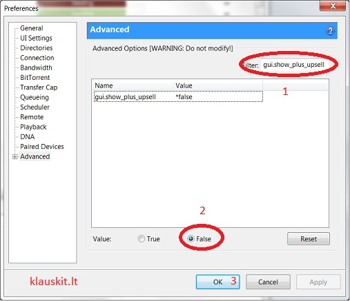

# Reklamos uTorrent programoje

Ko gero viena iš populiariausių ir labiausiai mum pažįstama ir naudojama programėlė torrentų siuntimui yra uTorrent, kuriai kažkada reikėjo apgalvoti veiklos modelį ir buvo sumąstyta, jog galim rodyti reklamas, kas žinoma naudotojams ne itin buvo prie širdies. Geroji žinia ta – kad reklamas galima pašalinti! Visai nesunku:

Instrukcijos

Spaudžiam **Ctrl + P** arba renkamės **Options** -&gt;**Preferences** \(Parinktys -&gt; Nustatymai\) ir pasirenkam paskutinį, Advanced \(Sudėtingiau\) punktą

1. Į paieškos laukelį įvedam: gui.show\_plus\_upsell
2. Paspaudžiam False

Tą patį darom ir su:

* offers.sponsored\_torrent\_offer\_enabled
* offers.left\_rail\_offer\_enabled

Viskas. Spaudžiam OK ir perkraunam programėlę ir sekantį kartą paleidus jūsų „miu torrent“ bus visiškai ads free ;j

