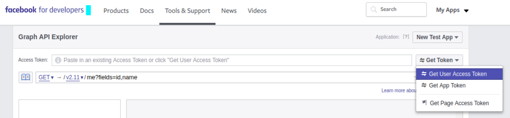

# API's

### Fake API for testing and prototyping

* [https://jsonplaceholder.typicode.com](https://jsonplaceholder.typicode.com)
* [https://httpbin.org/json](https://httpbin.org/json)

### Documenting APIs: A guide for technical writers and engineers

* [https://idratherbewriting.com/learnapidoc/](https://idratherbewriting.com/learnapidoc/)

### API Security Checklist

* [https://github.com/shieldfy/API-Security-Checklist](https://github.com/shieldfy/API-Security-Checklist)&#x20;

### JSON API in excel

* [https://www.howtoexcel.org/power-query/how-to-access-a-json-api-with-power-query/](https://www.howtoexcel.org/power-query/how-to-access-a-json-api-with-power-query/)
* [https://syntaxbytetutorials.com/import-json-data-in-excel-2016-or-2019-or-office-365-using-a-get-transform-query/](https://syntaxbytetutorials.com/import-json-data-in-excel-2016-or-2019-or-office-365-using-a-get-transform-query/)
* [https://syntaxbytetutorials.com/excel-import-coinmarketcap-api-data-with-query/](https://syntaxbytetutorials.com/excel-import-coinmarketcap-api-data-with-query/)

### REST, SOAP OR GRAPHQL?

When you make a data query in GraphQL, you specify exactly what you wish to receive. Such results are achieved through shifting the data definition functions to the client side, while in REST, data is defined on the server side. In other words, in REST API architecture, the server defines which data is to be returned, while in GraphQL API, the server only declares the available data, and the client specifies what should be returned.

Another thing you should consider while choosing the API protocol is data caching. Caching eliminates the need to send full requests and responses in case data has been cached from previous requests. REST API uses the HTTP caching mechanism that provides quite satisfactory results. At the same time, GraphQL has no inherent caching and requires additional mechanisms on the client side, such as **Apollo Client**.

* **SOAP** can be used in enterprise solutions with formal contract-based exchange formats. Also, SOAP APIs perform best when there are acceleration mechanisms implemented on both sides.
* **REST** is very JavaScript-friendly, so it is a perfect choice for JavaScript-based applications. Besides, it can cope with higher loads and process data quicker than SOAP. Thus if your application is rather load-intensive, REST may be your API of choice.
* **GraphQL** can show the best performance when the number of queries needs to be reduced to the absolute minimum. With its single query addressing multiple resources, GraphQL can be a good match to this challenge. Also, considering the fact that in GraphQL data is defined on the client side, it can be a good solution for cases when there is no dependency between the client application and the server.
* [https://da-14.com/blog/ultimate-guide-api-architecture-rest-soap-or-graphql](https://da-14.com/blog/ultimate-guide-api-architecture-rest-soap-or-graphql)

### API endpoint naming rules



### Facebook page feed

Po Cambridge Analytica įvykių Facebook sugriežtino duomenų prieigą ir jei anksčiau viešus duomenis galėdavo pasiimti bet kas, tai dabar atsirado papildomų niuansų - norint gauti puslapio duomenis, reikia turėti [Page Public Content Access](https://developers.facebook.com/docs/apps/review/feature/#reference-PAGES\_ACCESS) teises, o joms gauti reikia praeiti visą App Review procesą, kuris susideda ne tik iš įmonės duomenų suvedimo, tačiau reikia pateikti aprašymą ir nuorodas, kurios demonstruotų, kaip šios teisės bus naudojamos. Tačiau yra viena išlyga - šių teisių nereikia, jei vartotojas turi _manage\_page_ teises tam puslapiui. Kitaip tariant - jei tai puslapio administratorius.

#### Access Token generavimas

Taigi užtenka tik susigeneruoti token'us ir juos naudoti duomenų paėmimui:

* Pirmiausia pradedama nuo New App sukūrimo [Facebook Developers ](https://developers.facebook.com)puslapyje ir ten nusikopijuojame App ID ir Secret
* Einama į [Facebook Graph API Explorer](https://developers.facebook.com/tools/explorer) ir sugeneruojamas trumpos trukmės user access token'as. Teises vartotojui priskiriame "_manage\_pages_" ir "_pages\_show\_list_". Sukūrus nusikopijuojam _Access Token_ reikšmę.



* Einam į [Access Token Tool](https://developers.facebook.com/tools/accesstoken). Jeigu prie Apps'o nėra _User Token_, tai sugeneruojame jį. Jei yra, tai tiesiog spaudžiame _Debug_.
* Atsidariusiame lange įpastinama _Access Token_, kuris buvo nukopijuotas Graph API Explorer puslapyje ir spaudžiama _Debug_. Po paspaudimo matoma duomenų lentelė, kurioje turėtų matytis, kad Expires reikšmė yra 1h. Lentelės apačioje spaudžiame "_Extend Access Token"_. Bus sugeneruotas naujas "long-lived" raktas, galiojantis 2mėn.
* Grįžtama į [Graph API Explorer](https://developers.facebook.com/tools/explorer), čia į _Access Token_ lauką įstatomas šitas long lived token'as, o kaip endpoint nurodomas "/me/accounts". Spaudžiam submit ir jei viskas ok, turimas gauti teigiamas response, iš kurio reikalingas naujasis, nesibaigiantis "_Access Token_" kuris ir yra reikalingas.


* Pasitikriname jį: einam vėl į [Access Token Debugger](https://developers.facebook.com/tools/debug/accesstoken/), susivedam jo reikšmę ir šį kartą Expires reikšmė turėtų būti "Never"


#### Api naudojimas

* [Facebook SDK](https://github.com/facebook/php-graph-sdk)

```
composer require facebook/graph-sdk

--
require_once __DIR__ . '/vendor/autoload.php';

$fb = new \Facebook\Facebook([
  'app_id' => '{app-id}',
  'app_secret' => '{app-secret}',
  'default_graph_version' => 'v2.10',
  //'default_access_token' => '{access-token}', // optional
]);

$response = $fb->get('/{page-id}/posts?&fields=id,created_time,permalink_url,message,attachments', {access-token});
```
