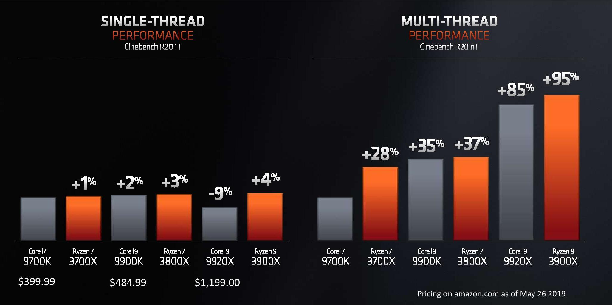

# TechIT naujienos

## 2019-05

### AMD Zen2 - 2019-05-28

* Kai AMD prieš porą metų pristatė savo Zen architektūros procesorius, tai sukėlė nemažai bangų tarp procesorių entuziastų. Tas pats kartojasi ir šiemet. AMD jau turėjo price/performance lyderystę, kai kalba buvo apie multi-thread spartą, tačiau pagaliau šį kartą galim pamatyti tokią lyderystę net ir single-thread atžvilgiu, ko iš AMD jau nematėme išties daugybę metų:

* Vienas įspūdingiausių chip'ų šį kartą tai Ryzen7 3700X: 8 branduolių, 16 thread'ų, 3.6Ghz procesorius už 330$, sueikvojantis viso labo 65W. Atrodo, kad tai turėtų būti pats efektyviausias kadanors sukurtas desktop procesorius. Ką jau kalbėti apie tai, kad lineup'e yra net ir 6 branduolių procesorius už viso labo 200$.
* Atrodo išties stipriai, tad beliko sulaukti benchmark'ų ir pažiūrėti realius rezultatus.
* [https://www.anandtech.com/show/14407/amd-ryzen-3000-announced-five-cpus-12-cores-for-499-up-to-46-ghz-pcie-40-coming-77](https://www.anandtech.com/show/14407/amd-ryzen-3000-announced-five-cpus-12-cores-for-499-up-to-46-ghz-pcie-40-coming-77)

### Mobile screen refresh rates - 2019-05-26

* Dar puikiai atsimename telefonų megapikselių lenktynes. Vėliau sekė varžymasis dėl ekrano rezoliucijų, ko rezultate buvo leidžiami net ir 4K telefonai. Dabar įsivažiavęs ciklas su berėmiais ekranais, kuris jau artėja link pabaigos, tad pats laikas kovai ieškoti naujų krypčių ir labiausiai panašu, jog sekančios lenktynės bus ties ekrano greičiu.
* [https://www.popsci.com/oneplus-7-pro-smartphone-screen-refresh-rate](https://www.popsci.com/oneplus-7-pro-smartphone-screen-refresh-rate)

### Starlink startas - 2019-05-25

* SpaceX padėjo pirmąjį sėkmingą žingsnį konstruojant savo Starlink palydovinio interneto tinklą. Pirmasis skrydis jau nugabeno 60 palydovų į 440km aukštį. Šiemet turėtų įvykti 2-6 tokio pobūdžio skrydžiai, o po 6-tojo sėkmingo skrydžio padengimas jau turėtų apimti Kanadą ir šiaurinę JAV dalį. Po 24 skrydžių tinklas bus pasiekiamas visoje planetoje.
* [https://www.space.com/elon-musk-says-spacex-starlink-satellites-doing-well.html](https://www.space.com/elon-musk-says-spacex-starlink-satellites-doing-well.html)

### Anonsuotas Minecraft Earth VR - 2019-05-19

* Įdomu matyti, kai produktui dar net nepasirodžius, kūrėjai patys kalba apie akivaizdžias problemas:

  Persistent holograms are obviously the end goal for Minecraft Earth, and it’s easy to imagine a future where players can drop these wherever they want once they’ve been approved. This user-generated content always comes with a mountain of risks, though. Whether that’s people building virtual penises or houses with swastikas, there’s always going to be people who would love to ruin the fun.

* [https://www.theverge.com/2019/5/17/18627341/minecraft-earth-ios-android-free-ar-game-features-pokemon-go](https://www.theverge.com/2019/5/17/18627341/minecraft-earth-ios-android-free-ar-game-features-pokemon-go)

### RealTalk - AI generuotas Joe Rogan balsas - 2019-05-17

* Manipuliacijos ties photoshop'u nesibaigia. Jau tikriausiai esate girdėję apie Deepfakes, tačiau tai kas daroma su vaizdu, taipogi gali būti daroma ir su balsu. Tiek Adobe, tiek ir kitos kompanijos dirba ties AI sistemomis, kurioms pateikiami kalbančio žmogaus balso įrašai, jie išanalizuojami ir sukuriami modeliai, kuriais pasinaudojant galima tiesiog rašyti tekstą ekrane ir perklausyti jį tarsi žmogus iš tiesų būtų visą tai pasakęs. Štai vienas iš pavyzdžių Joe Rogan. Kandidatas pasirinktas ne be reikalo, nes Rogan'as jau turi tūkstantinį podcast'ų archyvą, o turint didelius kiekius duomenų, jį atkartoti yra kur kas paprasčiau. Rezultatas dar nėra idealus, tačiau jau gąsdinančiai panašus.
* [https://www.youtube.com/watch?v=DWK\_iYBl8cA&feature=youtu.be](https://www.youtube.com/watch?v=DWK_iYBl8cA&feature=youtu.be)

### Google I/O - 2019-05-11

#### Biudžetinis Pixel 3a

* Biudžetiniai telefonai visada pasižymi prastesnėmis kameromis, įprastai nukenčia ekranas bei pasitelkiami labiau ekonomiški dizaino sprendimais. Ir ši formulė gyvuoja nuo pat išmaniųjų telefonų pradžios. Tačiau Google idealogiškai atsisuka ir grįžta prie buvusių Nexus linijos principų ir pristatė Pixel 3a - biudžetinės klasės mobilų telefoną. Kompanija pasirinko nedėti didelius kiekius RAM atminties ar flagmanų lygio procesoriaus, tačiau nesileido į kompromisus ekrano ir ypač kameros srityje. Dar niekada nėra buvę varianto, kai biudžetiniame telefone gali gauti geriausią kamerą mobiliųjų telefonų rinkoje. Bus labai įdomu stebėti kaip šiam telefonui seksis pardavimai.
* [https://www.youtube.com/watch?v=vcaXm9dgcpI&feature=youtu.be](https://www.youtube.com/watch?v=vcaXm9dgcpI&feature=youtu.be)

* Kai per savaitę įvyko dviejų IT gigantų pristatymai, nesunku juos palyginti. Kol Facebook'as savo renginyje kalbėjo apie tai, kaip jie galvoja daugiau dėmesio skirti privacy aspektams, Google tuo tarpu pristatė realius darbus šioje srityje. Tačiau viena iš kritikos strėlių vis dar aktuali - Google kiekvienais metais savo renginiuose pristato gan šaunių technologijų, tačiau kurios taip ir neišvysta dienos šviesos. Keli pastarieji pavyzdžiai: prieš porą metų buvo pademonstruota Photos galimybė ištrinti nereikalingus objektus iš foto, kaip kad pvz tvorą. Praėjusiais metais buvo parodytas Colorize funkcionalumas, kuris turėtų sugebėti įkvėpti gyvybės ir natūralumo senovinėms nespalvotoms senelių ar prosenelių nuotraukoms. Šiemet parodyti Live Caption, Duplex for Web, Google Maps AR ir kitos šaunios technologijos. Tik klausimas, kiek iš jų mes realiai turėsime progos išbandyti.
* [https://stratechery.com/2019/google-fights-back/](https://stratechery.com/2019/google-fights-back/)

## 2019-04

### NY Climate Mobilization Act - 2019-04-26

* NY miesto taryba priėmė Climate Mobilization Act, pagal kurį visi nauji gyvenamieji bei komercinės paskirties pastatai privalės turėti "žaliuosius stogus". T.y. stogas turės būti su augalais, saulės kolektoriais ar mini vėjo jėgainėmis.
* [https://www.dwell.com/article/new-york-city-requires-green-roofs-on-new-buildings-ede4deb8](https://www.dwell.com/article/new-york-city-requires-green-roofs-on-new-buildings-ede4deb8)

### Nvidia atsakas į Tesla pareiškimus iš Autonomy Day - 2019-04-24

* Labai solidus ir stebėtinai pozityvus NVIDIA atsakas į Tesla renginyje paminėtus kompiuterių palyginimus. Taip, Tesla pateikė klaidinančią informaciją, lygindama 2x procesorių sprendimą su 1x, tačiau NVIDIA patikslinti faktai taipogi nėra tokie jau visai tikslūs. Pirmiausia, naujausias NVIDIA sprendimas dar nėra iki galo paruoštas masinei gamybai ir Pegasus rinkoje pasirodyti turėtų tik Q3 2019, kai Tesla FSD yra montuojamas visuose Tesla automobiliuose. O taipogi kompanija praleidžia pro pirštus energijos sąnaudas, kurios elektromobilyje yra labai svarbios. Visgi Nvidia sprendimas naudoja net iki 500W, o Teslos - 72W.
* [https://blogs.nvidia.com/blog/2019/04/23/tesla-self-driving/](https://blogs.nvidia.com/blog/2019/04/23/tesla-self-driving/)

### Tesla Autonomy Day - 2019-04-23

* Pagrindinis didelis pranašumas: didelė, po realias gatves visame pasaulyje važinėjanti flotilė, kuri mokosi. Tinklas treniruojamas nepriklausomai nuo to ar autopilot yra įjungtas ar ne. Kiekvienas automobilis renka ir siunčia informaciją. Šis mokymasis susideda iš 3 komponentų:  -infrastruktūra, paremta trigeriais - siunčiama tik ta informacija, kurios šiuo metu reikia tolimesniam mokymuisi. Pagrindimas - nėra reikalo turėti didelius kiekius besikartojančios vienodos informacijos, užtat reikia tinkamos informacijos, tinkamu metu, kuri aprėptų daug skirtingų situacijų.  -duomenų algoritmai, kurie poto mokosi iš šių pateiktų pavyzdžių  -shadow režimas, kuris paleidžia išmoktą modelį demo režimu ir kuris veikia kartu su tuometine sistema vienu metu ir tikrina naujojo algoritmo efektyvumą realiose situacijose ir jeigu jis veikia gerai - tik tuomet galiausiai deployjina į jau veikiančią sistemą. 
* Visi šiai dienai parduodami Tesla automobiliai jau turi geležį, su kuria galima įgalinti autonominį važiavimą
* Lidar sugeba grąžinti tik ribotą kiekį informacijos. Pvz Lidar'as gali pastebėti objektą ant kelio, tačiau negali nustatyti ar tai yra cemento blokas ar tiesiog celofaninis maišelis. Žmonės sugeba vairuoti naudodamiesi viso labo rega, vadinasi tai galima atkartoti kameromis. Musk'o nuomone visi auto gamintojai, kurie šiuo metu visas pastangas meta į Lidar'ą eventually bus priversti jo atsisakyti. Lidar'as prašoka ir palengvina kelias problemas, tačiau jas išspręsti yra būtina, norint turėti full self-driving.
* Musk'as teigia, kad šiuo metu rinkoje vis dar nėra nei vieno automobilio, kuris galėtų konkuruoti su 2012-tųjų Model S. "Still waiting". Jeigu kas nors išties geras pradėtų dirbti ties tuo šiandien, tai turėtų pasiekti Teslos lygio sprendimus per 2-3 metus, tačiau Tesla per tą laiką jau bus nužygiavusi tolyn.
* Po metų kompanija tikisi turėti 1 milijoną automobilių savo Robotaxi tinkle. Įdomu kaip tai paveiks į akcijų biržą tik dabar susiruošusį Uber.

### Apple Music aplenkė Spotify in US - 2019-04-08

* Nors srityse į kurias dabar ateina Apple su savo paslaugų verslais jau yra puikias pozicijas užimantys konkurentai, tačiau Apple turi pranašumą - savo ekosistemą, kuri gali gan smarkiai boostinti skaičius. Naujausias pavyzdys - Apple Music, kuris JAV pagal prenumeratorių kiekį aplenkė daugiametį lyderį Spotify.
* [https://www.wsj.com/articles/apple-music-overtakes-spotify-in-u-s-subscribers-11554475924](https://www.wsj.com/articles/apple-music-overtakes-spotify-in-u-s-subscribers-11554475924)

### Netflix'as vis dar turi 2,7 milijonus DVD prenumeratorių

* Kai Netflix'as startavo, tai buvo prenumerata, pristatanti filmus DVD kompaktuose pašto tarnybų pagalba. Ir nors pagrindinė Netflix veikla pavirto į streaming'ą, tačiau pradinio verslo modelio taip niekada ir nebuvo atsisakyta: pernai Netflix'o kompaktus vis dar gavo 2.7 mln. prenumeratorių ir ši paslauga vis dar generuoja 212 mln $ pajamų.
* [https://edition.cnn.com/2019/04/04/media/netflix-dvd-subscription-mail-trnd/](https://edition.cnn.com/2019/04/04/media/netflix-dvd-subscription-mail-trnd/)

