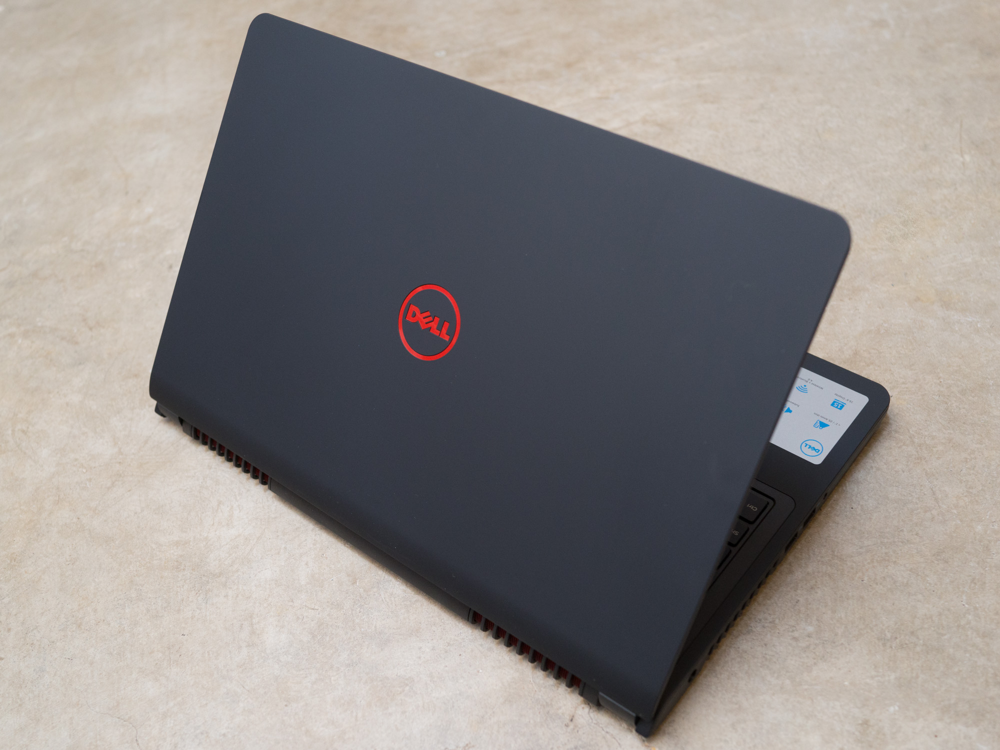
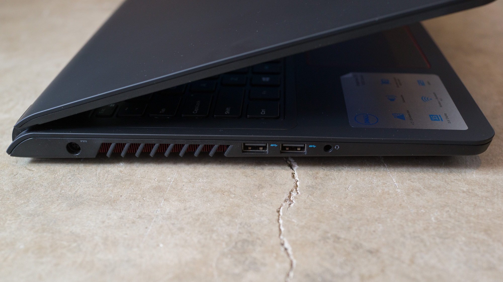
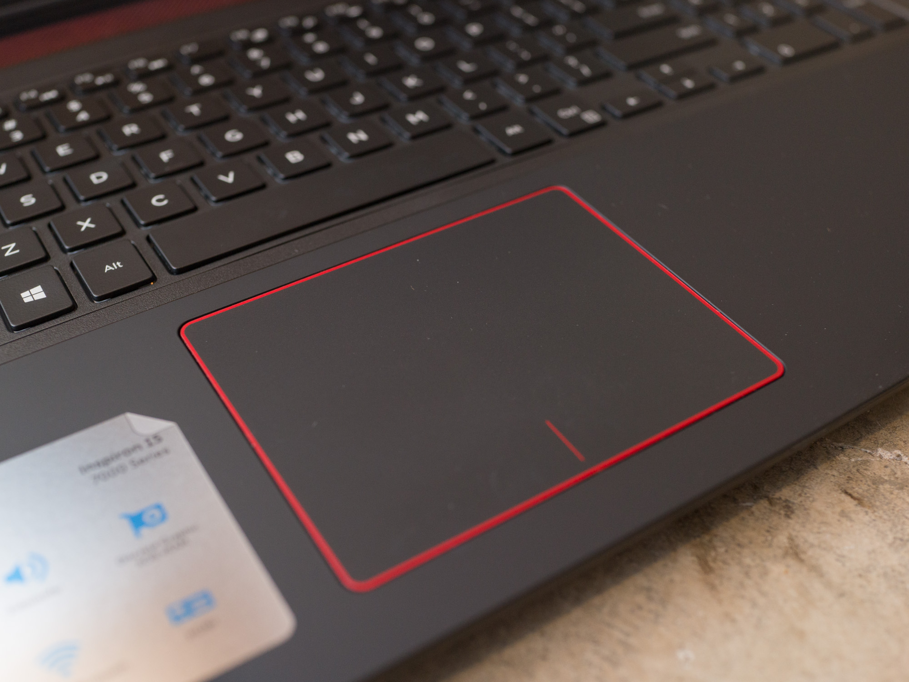
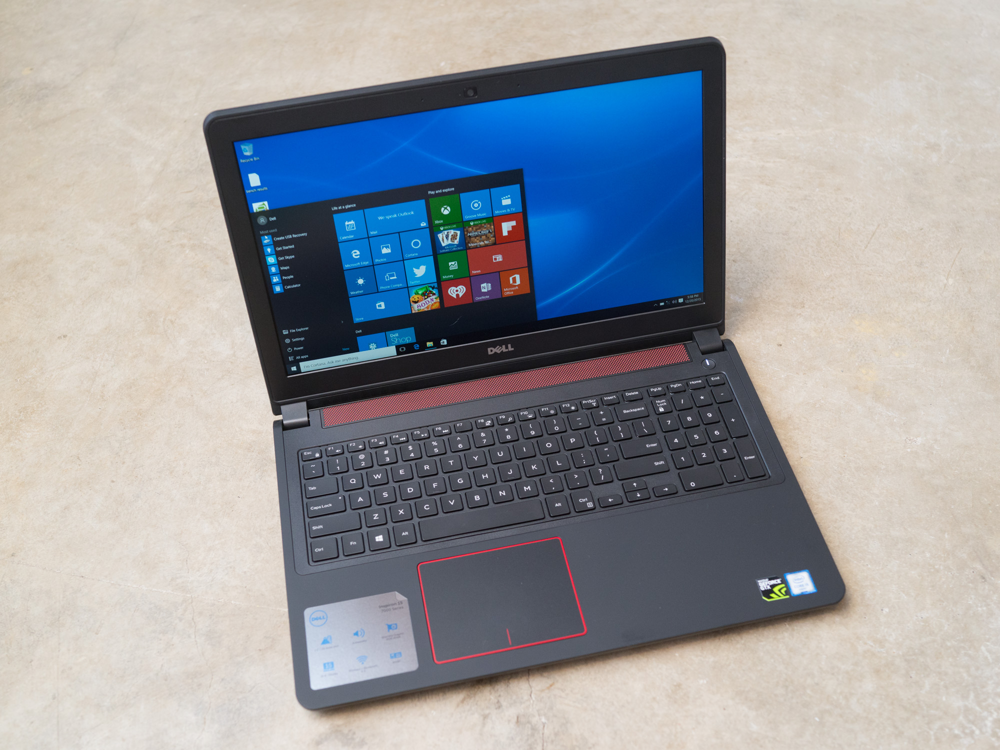
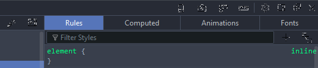
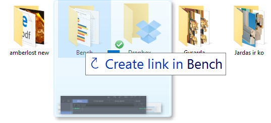
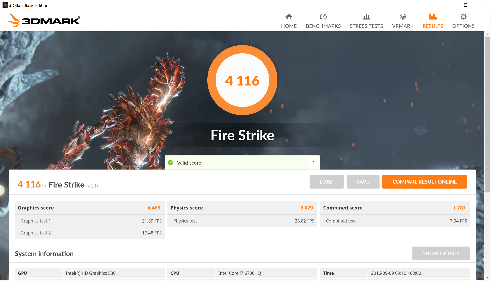
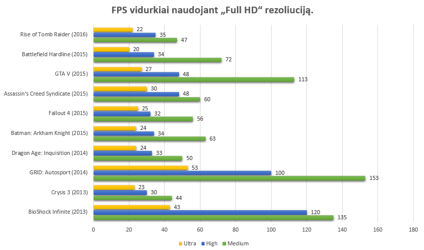

# Dell Inspiron 15 7559

## „Dell Inspiron 15 7559“ apžvalga – nebrangus kompiuteris žaidimų entuziastams

„Inspiron“ serijos kompiuteriai, kuriuos gamina kompanija „Dell“, jau gan ilgą laiką yra saugus pasirinkimas tiems, kas ieško vidutinės klasės kompiuterio. Šią produktų seriją sudaro trys kategorijos – „3000“, „5000“ bei „7000“, kurios atitinka biudžetinę, vidutinio našumo bei galingesnę klasę. Tiesa, 7000-uoju modeliu našumas neapsiriboja – kompanija siūlo ir entuziastams skirtą produktų seriją, žymimą „XPS“ prekiniu ženklu, tačiau šie nėra „draugiški kišenei“, tad „Inspiron“ modeliai vis dar išlieka kur kas populiaresni.

Šiemetinis „Dell Inspiron 15 7559“ yra į žaidimus orientuotas modelis, savyje slepiantis „Intel Skylake“ architektūros procesorių bei našią „Nvidia GTX 960M“ vaizdo plokštę, ir visa tai stengiamasi pateikti už išties prieinamą kainą. Būtent šis modelis atsidūrė mano rankose, tad įsitinkime, ar jam tai pavyko.

### Solidi išvaizda, tik šį kartą be aliuminio

Nuo praeitų metų 7000-osios serijos nešiojamųjų kompiuterių šio modelio dizainas išties skiriasi, tačiau nėra provokuojantis, kaip yra įprasta į žaidėjus orientuotiems kompiuteriams. Juodas korpusas yra minimalistinis, kokybiškai surinktas bei iškeitęs dar praeitais metais naudotą aliuminį į minkšto paviršiaus plastiką. Juodą korpusą papildo raudoni akcentai, randami ant logotipo, ventiliavimo grotelių bei aplink lietimui jautrų laukelį. Pirkdami galėsite rinktis ir raudoną kompiuterio variantą, kuris turėtų tikti trokštantiems labiau išsiskirti. Stebina tai, kad nors korpuse nėra metalo tačiau kompiuteris sveria išties nemažai – 2,7 kg. Jei nešiositės jį kuprinėje, apie save pamiršti jis tikrai neleis.

Tačiau pastebiu ir pirmąjį ryškų šio kompiuterio trūkumą – korpuso medžiagos pasirinkimas lemia tai, kad šis kompiuteris yra tikras pirštų atspaudų magnetas. Gumą primenantis paviršius geras tuo, kad suteikia tvirtą sukibimą, tad keliant kompiuterį nuo stalo viena ranka nereikia jaudintis, kad šis gali išslysti iš prakaituotų pirštų, bet kad tai paliks žymę nuo jūsų pirštų – galite net neabejoti. Blogiausia tai, kad jei piršto atspaudus nuo standartinių metalinių ar plastikinių paviršių bent jau lengva nuvalyti, tai nuo šio guminio paviršiaus jie nusivalo išties sunkiai, tad teks susitaikyti, kad kompiuteris visuomet atrodys nešvarus ir išteptas.

Maloniai nustebino, jog prie kompiuterio vidinę įrangą galima pasiekti atsukus vos vieną varžtuką! Atsukus jį, nuimamas visas kompiuterio dugnas – taip pasieksite ne tik prie operatyviosios atminties ar kietojo disko, tačiau pasieksite ir bateriją, belaidžio interneto modulį bei ventiliatorius. Atsinaujinti komponentus ar išsivalyti aušinimo sistemą galėsite beveik taip pat lengvai, kaip stacionariame kompiuteryje. Tai yra lengviausią priėjimą prie vidinių komponentų turintis nešiojamasis kompiuteris, su kuriuo esu susidūręs.

### Įvesties įrenginiai neypatingi, tačiau problemų nekelia

Klaviatūra, turinti skaičių bloką bei LED apšvietimą, didelio įspūdžio nepaliko. Įprastai man patinka tokio stiliaus klaviatūros – kvadratiniai mygtukai adekvačiai atskirti vienas nuo kito, o tai leidžia išvengti netyčinių gretimų mygtukų nuspaudimų. Nors klaviatūra yra geresnė nei praeitų metų modelių, tačiau klavišų paspaudimo gylis pakankamai nedidelis ir dėl to nesuteikia labai didelio rašymo malonumo. Rašyti galima gan greitai, tačiau klaviatūra mano skoniui per minkšta.

Panašiai ir su lietimui jautriu kilimėliu. Iš pirmos žvilgsnio jis turėtų būti puikus: didelis, dedikuotų mygtukų neturintis, malonus prisilietimui jutiklinis paviršius, kuriuo pirštas slysta lengvai. Taip pat yra kelių pirštų skaitymo galimybė, kuri kartu su „Windows 10“ įgalina panašius į „Mac“ kompiuteriuose randamus gestus. Vėlgi neišvengta minusų – tarp korpuso ir laukelio paliktas nedidelis tarpelis, dėl kurio kiekvieną kartą, vos palietus paviršių, atsiranda kliktelėjimo garsas. Didelių nepatogumų nekelia, tačiau įkyriai nemalonu.

Šis modelis siūlo visiškai tradicinį jungčių komplektą: 3 x USB 3.0, SD kortelių skaitytuvas, HDMI 1.4, LAN,  „Kensington“ užraktas bei kombinuota garso jungtis \(ausinės bei mikrofonas jungiami ten pat\). 2016-ųjų metų įrenginyje norėtųsi rasti ir USB 3.1 ar bent jau HDMI 2.0, nes dėl HDMI 1.4 prie šio galingo kompiuterio galime prijungti tik vieną išorinį monitorių, ir maksimalioje 4K raiškoje jis apribotas tik 30 Hz

Garsiakalbiai nuomonės nepakeičia – vėl nedidelis nusivylimas. Šis nešiojamasis kompiuteris turi 2.1 garsiakalbius. Trečiasis, žemiems dažniams skirtas garsiakalbis, sumontuotas kompiuterio apačioje, sudaro pradinį įspūdį, jog garsas turėtų būti gan sodrus, bet, deja, taip nėra. Žinoma, lyginant su biudžetiniais nešiojamaisiais kompiuteriais, kuriuose garsiakalbiai skamba kaip iš limonado skardinės, „Inspiron 15“ skamba geriau, tačiau iš žaidimų kompiuterio tikėčiausi daug geriau. Nors šis kompiuteris ir gali groti išties labai garsiai, bet pasiekus kiek daugiau nei pusę maksimalaus garsumo, atsiranda girdimi garso iškreipimai. Filmams žiūrėti tokių garsiakalbių pakaks, tačiau nuolatiniam muzikos klausymuisi siūlyčiau prisijungti ausines ar kolonėles.

Situaciją pataiso priekyje įmontuota HD kamera, šalia kurios rasite du mikrofonus. Vaizdo bei garso kokybė yra išties stebėtinai puiki ir visiškai patenkins daugumos vartotojų, norinčių bendrauti vaizdo skambučiais, poreikius.

### Ar 4K raiška išties reikalinga 15 colių ekranui?

Mano turimas 7559 modelio variantas pasižymi „Ultra HD“ \(3840×2160 rezoliucija\) lietimui jautriu IPS ekranu. Kadangi jis yra 15,6 colių, tai suteikia jam 224 taškų tankį colyje, kuris yra įspūdingas, kalbant apie nešiojamųjų kompiuterių ekranus.

IPS ekrano technologija suteikia sodrias, ryškias spalvas bei gerus matymo kampus, tačiau dėl prisilietimams jautraus ekrano, mano aptariamas modelis kenčia nuo atspindžių. Tiesa, galite rasti paprastesnes šio kompiuterio komplektacijas, kuriose sumontuotas lietimams nejautrus Full HD ekranas, padengtas matine, atspindžiams atsparia danga, tad ši problema tokiems modeliams nėra aktuali.

Tai buvo pirmasis mano turėtas nešiojamasis kompiuteris su UHD raiška ir paliko dvejopus jausmus. Iš vienos pusės, tokia didelė ekrano rezoliucija yra išties nuostabi – gulint lovoje, pasidėjus kompiuterį ant pilvo ir žiūrint 4K vaizdo klipus per „YouTube“, juntamas ryškus detalumo skirtumas, lyginant su Full HD ekranais. Vaizdas kaip niekada aiškus ir žiūrėti labai malonu. Kitą vertus, naudojantis kompiuteriu sėdint prie darbo stalo ir ekraną laikant normaliu darbo atstumu, didelė raiška netenka savo pranašumo ir skirtumas nuo Full HD tampa tiesiog neįžiūrimas.

Tačiau nepaisant to, kad toks ekranas stipriai didina viso kompiuterio kainą, yra ir dar vienas ryškus minusas – „Windows“ operacinė sistema dar nelabai gerai tvarkosi su tokia aukšta rezoliucija ir dirbant visą darbo dieną atradau aibę nepatogumų. Nenuostabu, kad 15 colių ekrane dirbti su 3840×2160 rezoliucija nelabai pavyktų, nes vaizdas būtų pernelyg mažas. Tam operacinėje sistemoje būna įjungiama didinimo funkcija \(_scaling_\), kai visi elementai ekrane proporcingai padidinami iki tokio dydžio, kad būtų lengvai įžiūrimi. Būtent ši funkcija ir sukelia daugiausia problemų. Kai kurių programų vartotojo sąsajos nepasididina taip puikiai, kaip turėtų. Susidūriau su „Firefox“ naršyklės mygtukų iškreipimu, per trumpais „Filezilla“ FTP programos teksto įvedimo laukeliais, įvairiose programose pasitaikančiais miniatiūriniais šriftais bei itin mažais langų dydžiais.

Visos šios programos atvaizduojamos korektiškai, nustačius „Full HD“ rezoliuciją, tad man kyla klausimas: jei „Ultra HD“ nesuteikia jokio akivaizdaus pranašumo nešiojamojo kompiuterio ekrane, tačiau sukelia tik nepatogumų \(didesnis energijos eikvojimas, didesnė kaina bei ne visada korektiškas programų atvaizdavimas\), ar tokios rezoliucijos ekranas išties reikalingas nešiojamajam kompiuteriui? Galbūt palikime aukštos rezoliucijos ekranus televizoriams arba dideliems stacionariųjų kompiuterių monitoriams?

### Baterija didelė tik specifikacijų lape

Įprastai žaidimų kompiuteriai yra labiau orientuoti į našų veikimą, tad jų viduje rasite galingas, tačiau daug energijos eikvojančias detales. Taigi, jokios didelės nuostabos šio modelio 47 WHr 6 celių baterija nesukėlė – naudojantis kompiuterio neapkraunant, galima tikėtis apie 3,5 valandos, o įsijungus kompiuterinį žaidimą ir nustačius maksimalų ekrano apšvietimą, baterija išlaikys vos vieną valandą. Tie, kas iš kompiuterio tikisi 12 val. trukmės baterijos tarnavimo laiko, turėtų dairytis į itin taupius ultrabook‘us, o ne į galingus žaidimų kompiuterius.

Tiesa, „i5“ procesorius yra galingas, tačiau energetiškai ekonomiškesnis nei mano turėtasis „i7“. „Skylake“ architektūroje „i5“ mobilieji procesoriai turi nebe 2, o 4 branduolius ir tai daro juos kur kas tinkamesniu pasirinkimu žaidimų kompiuteriuose, nes galios mobiliajam įrenginiui jie suteikia išties užtektinai. Pigesnis „Inspiron 7559“ modelis su komplektacijoje esančiu „i5“ procesoriumi be lietimui jautraus ekrano turėtų išlaikyti bent 5 ar net 6 val.

### Tikrąjį kompiuterio grožį atsiskleidžia našumas

Mano testuotas kompiuterio variantas turi vieną geriausių šio modelio komplektacijų:

15,6 colio „Ultra HD“ lietimui jautrus ekranas, „Intel i7-6700HQ“ procesorius, veikiantis 2,6 GHz \(turbo režimu iki 3,5 GHz\) dažniu, 16 GB DDR4 operatyviosios atminties, „Nvidia GTX 960M“ vaizdo plokštė su 4GB GDDR5 atminties bei 1 TB kietasis ir 128 GB M.2 SSD diskai. Tokio komplekto kaina Neriba.lt – 1350 €.

Tačiau galima rasti ir paprastesnių komplektacijų, kurių pati kukliausia –  15,6 „Ultra HD“ ekranas, „Intel i5-6300HQ 2,3 GHz“, 8 GB DDR3, 1 TB HDD, „Nvidia GTX 960M 4 GB“. Šios komplektacijos kaina tesiekia 880 €.

Specifikacijos išties geros ir gali lygintis su kur kas brangesniais žaidimų kompiuteriais. Tiesa, stebina, kad vaizdo plokštė pigiausiame ir brangiausiame modelyje išlieka tokia pati. Daugiau nei pusantro karto brangesniame modelyje tikėčiausi bent jau „GTX 970M“ ar net „980M“. Dėl šios priežasties galingesnius modelius rekomenduoti tampa sudėtinga, nes net ir patiems naujausiems žaidimams keturių branduolių „i5-uko“ galios tikrai užtenka. Vis vien nešiojamame kompiuteryje žaidimų spartą varžys vaizdo plokštės galios trūkumas. Tai kuo puikiausiai demonstruoja kompanijos „3DMark“ testas „Fire Strike“, skirtas žaidimų kompiuteriams bei „Sky Diver“, skirtas nešiojamiesiems kompiuteriams. Galime matyti, kad „i7“ procesorius yra daugiau nei 2 kartus našesnis žaidimuose už vaizdo plokštę.

Nelabai mėgstu sintetinių testų – nors jais remiantis ir lengva palyginti skirtingus kompiuterius, tačiau jie nereprezentuoja realios naudojimo spartos. Išbandykime vieną efektyviausių kompiuterių spartos testų – žaidimus. Visgi tai juk žaidimų kompiuteris!

Naivu tikėtis, kad su „GTX960“ būtų galima žaisti, išnaudojant didesnę nei Full HD rezoliuciją. Tačiau visi šiuolaikiniai žaidimai standartinėje 1920×1080 rezoliucijoje, puikiai veikia naudojant aukštus ar vidutinius grafikos nustatymus. Kiek senesni žaidimai, kaip „BioShock: Infinite“ ar „GRID: Autosport“  puikiai žaidžiami net ir esant patiems aukščiausiems nustatymams.

Daugiau rezultatų:

Kompiuterio ventiliatorių skleidžiamas triukšmas žaidžiant žaidimus yra girdimas, tačiau visiškai priimtinas ir išties kur kas mažesnis nei kai kuriuose žaidimų kompiuteriuose, su kuriais teko susidurti. Svarbiausia, kad dėl išties efektyvios aušinimo sistemos, turinčios net tris vėdinimo angas kompiuterio kraštuose, jis beveik neįkaista. Atliekant „Prime95“ testą, kuris procesorių apkrauna visu 100 %, net ir po pusvalandžio korpusas išliko tik lengvai šiltas, o procesorius temperatūra neviršijo 90 laipsnių.

Pagrindinė aušinimo problema, su kuria susidūriau, yra chaotiškas ventiliatorių veikimas dirbant kompiuteriu minimaliomis apkrovomis. Kai tiesiog naršoma internete ar atliekamos kitos, resursų reiklumu nepasižyminčios užduotys, tikėčiausi visiškai pasyvaus ir tylaus aušintuvų darbo. „Insipiron 15“ mane nustebindavo netikėtai pradėdavęs ūžti net ir nieko ypatingo neveikiant. Šis ūžimas tęsiasi apie 5-10 minučių ir tuomet kompiuteris vėl pradeda dirbti tyliai. Išvengti šios bėdos galima apribojant kompiuterio galią  įjungiant „Power saving“ profilį „Windows“ nustatymuose.

### Geras žaidimų kompiuteris, tačiau turintis kompromisų

Kompanija „Dell“ su „Inspiron 15 7559“ leidžiasi į kompromisus. Nors yra užtektina galingas, kad patenkintų užkietėjusio žaidėjo poreikius, ir tai padaro kokybiškai surinktame kompiuteryje, tačiau nuvilia kitose srityse: nuo garsiakalbių ar baterijos iki klaviatūros. Tai bent jau kompensuojama kainos atžvilgiu.

Tiesa, kaina yra išties konkurencinga tik jei kalbame apie silpniausios komplektacijos variantą su „i5“ procesoriumi. Specifikacijoms didėjant, modelis darosi vis mažiau konkurencingas ir konkurentų asortimente galima atrasti labai panašių ar net ir patrauklesnių variantų. Mano turėtąjį modelį su „i7“ procesoriumi, 16 GB RAM bei UHD ekranu laikau perdėtai galingu ir siūlyčiau rinktis ekonomiškesnį, kur kas geresnį kainos ir našumo santykį turintį variantą, kuris žaidimų sparta praktiškai niekuo nenusileis per 450 € brangesniam modeliui, kuris turi lygiai tą pačią vaizdo plokštę.

Šį kompiuterį bei jo konkurentą „Lenovo Y700“ priskirčiau biudžetinių žaidimų kompiuterių kategorijai. Tai puikūs ir galingi kompiuteriai, orientuoti į namų vartotojus bei galintys solidžiai atkurti visus naujausius kompiuterinius žaidimus, tačiau kainuojantys mažiau nei tipinis tokios klasės žaidimų kompiuteris. „Dell Inspiron 15 7559“ yra tarsi labiau biudžetinis „Dell XPS 15“ variantas, turintis beveik tokias pat specifikacijas, tačiau tuo pat metu ir kelis ryškesnius minusus.

 Šią mano apžvalgą buvo publikuota IT portale: [kompiuteriai.lt](https://www.kompiuteriai.lt/dell-inspiron-15-7559-apzvalga-nebrangus-kompiuteris-zaidimu-entuziastams/)

