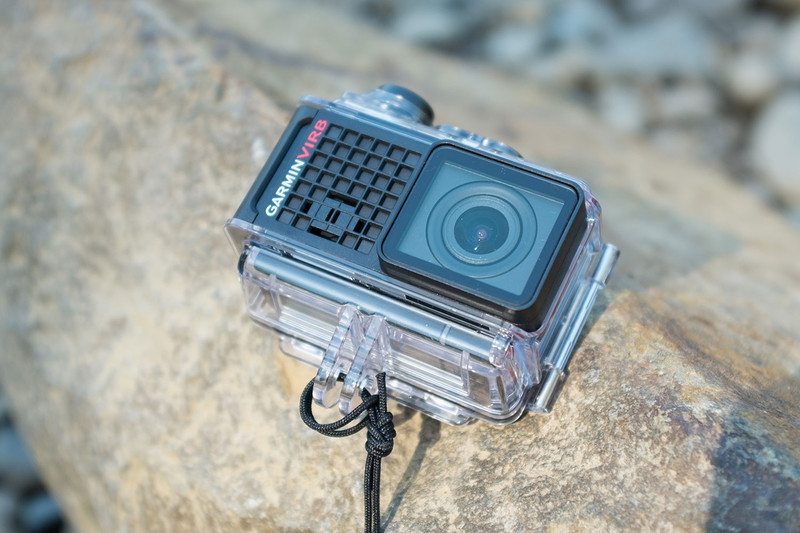
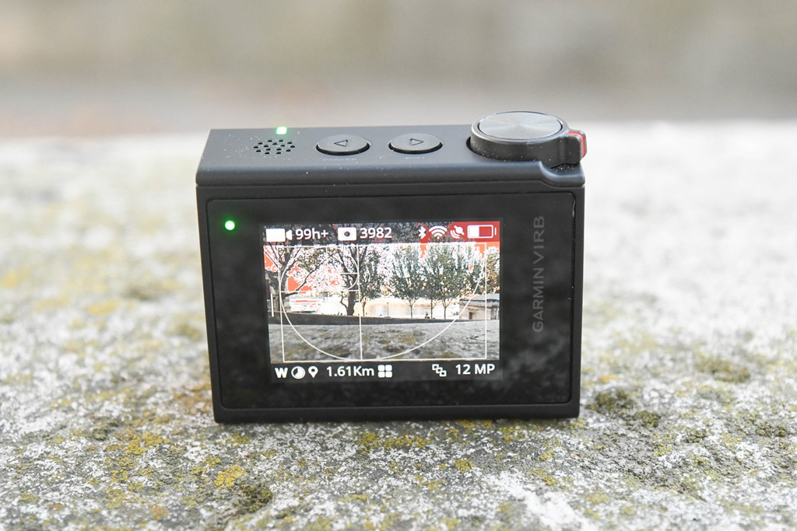
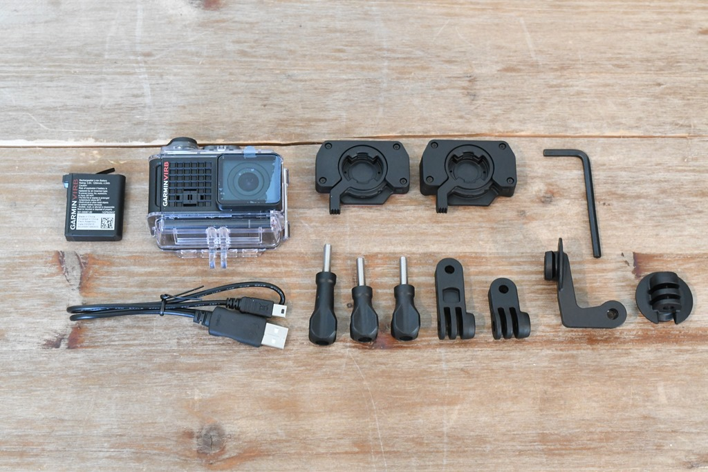
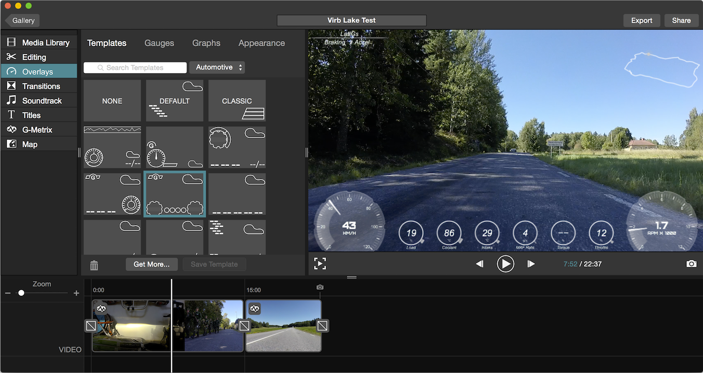

# Garmin Virb Ultra 30

## „Garmin Virb Ultra 30“: vertas dėmesio „GoPro“ konkurentas?

_Kiekviena veiksmo kamera gali nufilmuoti tavo fiasko, tačiau tik „Garmin Virb“ užfiksuos, kaip išties stipriai tu kritai._

Nors toli gražu ne kiekvienas esame sportininkas, tačiau veiksmo kameros visgi išlieka išties perkamos ir populiarios. Tai suprasti nėra sudėtinga – nebūtina šokti su parašiutu ar atlikinėti triukus krosiniu motociklu, jog būtų galima pateisinti veiksmo kameros įsigijimą. Nemaža dalis žmonių jas perka kaip kelionines kameras ne tik dėl itin kompaktiško dydžio, bet ir dėl atsparumo. Būtų sunku rasti geresnį kompanioną užsienio šalyje lekiant motoroleriu ar nardant tarp egzotiškų žuvyčių.

GPS navigacijų tvirtovė „Garmin“, kuri po mažu tampa vis labiau diversifikuota technologijų kompanija, bando dar kartą įsitvirtinti save veiksmo kamerų segmente. Pirmasis bandymas su ankstesniais „Virb“ prieš kelis metus, deja, nenusisekė. Šį kartą viskas kur kas sėkmingiau – kamera, vos pasirodžiusi, buvo, ko gero, pati funkcionaliausia rinkoje. Deja, tvirta pozicija išlaikyta viso labo kelias savaites. Nuo tada, kai „Garmin“ paskelbė „Virb Ultra 30“, tiek „Sony“, tiek ir „GoPro“ pateikė savo flagmanų atnaujinimus. Stipriausios „Virb Ultra“ savybės nebėra tokios unikalios ir jomis ši kamera nebeišsiskiria: elektroninį vaizdo stabilizavimą pralenkė „Sony“ optinė vaizdo stabilizavimo sistema, o valdymu balsu bei lietimui jautriu ekranu apsiginklavo ir rinkos lyderiai su „GoPro Hero5 Black“ modeliu. Reaguodami į tai, „Garmin“ nuleido savo kameros kainą 100 $, suvienodinant ją su konkurentų. Nors situacija ir tapo įtempta, tai toli gražu nereiškia, kad naujoji „Garmin“ kamera liko išstumta ar nebeaktuali.  
Iš pirmo žvilgsnio naujoji „VIRB Ultra 30“ turi visas madingiausias naujausių kamerų savybes: nuo balso komandų \(„Ok Garmin, take a picture“\) iki 4K raiškos vaizdo įrašymo ar tiesioginio transliavimo tiesiai į „YouTube“. Kuo labiau giliniesi į kameros galimybes, tuo daugiau jų atrandi.

### Dizainas

Išpakavę kamerą pamatysite, kad palyginimų su „GoPro“ išvengti nepavyks. „Virb Ultra“ atrodo dar panašesnė į konkurentus, nei anksčiau: panašus išdėstymas, beveik lygiai tokie patys matmenys ir net visiškai identiškas svoris – 88 g. Visgi „Hero“ veiksmo kameros yra sėkmingiausios pasaulyje, tad toks panašumas yra visai nebloga pradžia.  
„Garmin“ suprojektavo specialų, guma dengtą garso kanalą, sumontuotą atspariame vandeniui dėkle. Ir nors šis kanalas linkęs kaupti nešvarumus, tačiau garsas nuo to nenukenčia. Stebėtina, bet šis, iš pažiūros gan paprastas sprendimas, ištaiso vieną didžiausių trūkumų – garsas išlieka kokybiškas. Didelio skirtumo nuo to, ar filmuota su dėklu, ar be, net nepajusite. Iš visų veiksmo kamerų, kuriomis teko naudotis, ši pasižymėjo geriausia garso kokybe, nenaudojant papildomo išorinio mikrofono.

### Specifikacijos

Viduje sumontuotas 12MP sensorius, sugebantis filmuoti Ultra HD \(4K\) vaizdo įrašus 30 kadrų per sekundę greičiu. Jei namie jau turite 4K televizorių, galėsite įvertinti aukštų rezoliucijų pranašumą. Sumažinę raišką iki 720p, vaizdo klipus filmuoti galėsite net iki 240 kadrų per sekundę! Tad šuolį nuo tramplino ar salto galėsite išties labai ženkliai sulėtinti ir padaryti dar įspūdingesniais. Vaizdo stabilumui užtikrinti, kameroje įdiegtas trijų ašių vaizdo stabilizavimas – tad net jei slidinėsite, važiuosite dviračiu ar keliausite bekele, vaizdo įrašai neturėtų būti drebantys. Tiesa, stabilizavimas tik elektroninis, tad jei mokate dirbti profesionaliomis vaizdo apdorojimo programomis, galbūt vertėtų šią kameros funkciją išjungti ir kokybiškesnį darbą atlikti savo rankomis, nes automatinis režimas tiesiog sumažins matymo lauką, vaizdą ištemps ir dėl to prarasite dalį vaizdo kokybės.  
Kad ir kokia gera būtų 4K rezoliucija, tačiau dauguma kameros funkcijų visgi apsiriboja FullHD režimu. Pavyzdžiui, vaizdo stabilizavimas neveikia nei 4K, nei 2,7K rezoliucijose. Taip pat 4K apribota tik ties plačiu matymo lauku bei neleidžiama įjungti linzės iškraipymų taisymo režimo, kuris pašalina „žuvies akies“ efektą, kuris įprastas tokioms mažoms vaizdo kameroms. Prie 4K minusų galėčiau paminėti ir tai, jog kameroje rasite tik USB 2.0 jungtį, tad didesnių failų perkėlimas į kompiuterį užtrunka išties pernelyg ilgai.  
Nugarėlėje esantis 1,75 colio spalvotas ekranėlis pasižymi ne tik tuo, kad yra jautrus lietimui, tačiau ir tuo, kad priešingai nei „Hero 4“ atveju, kai įdėjus į dėklą tenka kamerą valdyti sunkiai spaudžiamais fiziniais mygtukais, „VIRB Ultra“ ekranas išlieka jautrus net ir per apsauginį plastiką. Šis vandeniui atsparus dėklas yra su atspindžiams atspariu padengimu, tad vaizdas ekrane išlieka ryškus esant gamtoje.  
Ne taip seniai į rinką išleista „GoPro Hero5 Black“ taip pat nuo šiol turi lietimui jautrų ekraną bei yra visiškai atspari vandeniui net ir be apsauginio dėklo, tad „Garmin“ modelis kažkam, galbūt, atrodys mažiau įspūdingai. Tačiau, papildomas apsauginis dėklas, suteikia daug didesnį atsparumą kamerai, tad naujojo „Hero5 Black“ sprendimo aš nepalaikau.  
Pats asmeniškai vis dar filmuoju su senesniu „GoPro Hero 4 Black“ modeliu, tad turėjau progą palyginti šias dvi kameras vienodomis sąlygomis ir visgi pirmenybę teikčiau „Virb“ modeliui, kuris pasižymėjo labai solidžiu garsu ir lenkė vaizdo kokybe esant prastesnėms apšvietimo sąlygoms. Atsižvelgiant į tai, kad „Hero 5 Black“ modelyje kameros sensorius nepasikeitė nuo ketvirtojo modelio, rezultatas lyginant su „Virb“ turėtų būti toks pat.

### Priedai

Veiksmo kamerų gamintojai dažnai padaro vieną esminę klaidą – bandydami susikurti savo montavimo priedų asortimentą. Reikia susitaikyti su faktu, kad rinkoje yra labai ryškus ir absoliutus lyderis, ir joks gamintojas, kad ir kaip stengtųsi, nepasiūlys tokios montavimo laikiklių, lipdukų, varžtelių ir rankenėlių gausos, kokia jau buvo sukurta per visus šiuos „GoPro“ karaliavimo metus. Tad tai, jog „Garmin“ nežengė tuo pačiu keliu, laikau vienu protingesnių sprendimų. „Virb“ korpuso sujungimai suderinami su visais standartiniais „GoPro“ priedais, tad bevargo rasite tinkamus tvirtinimus, kad ir kur sumanytumėte primontuoti kamerą, net jei „Garmin“ oficialiai norimo priedo ir negamina.  
Viskas slypi duomenyse  
Vienas esminis, tikras, vis dar išlikęs „VIRB“ pranašumas – tai daugybė sensorių ir jų teikiamų duomenų, kuriems buvo suteiktas „G-Metrix“ pavadinimas. Iš viso kameroje rasite 5 sensorius: akselerometrą, giroskopą, kompasą, barometrą ir GPS. Kartu šie sensoriai pateikia informacijos apie greitį, nuotolį, G jėgas, įkalnės statumą, maršrutą ir daug daugiau. Kompanija parduoda daugybę papildomų sensorių, kuriuos galima prijungti prie „Virb“ kameros ir gauti net ir dar daugiau informacijos, kaip, pvz. pulso, temperatūros, vėjo matuoklius, ar net specialią OBD jungtį, kurios pagalba prisijungsite prie automobilio kompiuterio ir galėsite pateikti daug įdomių skaičiukų tiesiai iš automobilio variklio.

### Valdymas

Labai džiugina, kad „Garmin“ kameros sistemoje paliko išties nemažai labiau pažengusiems skirtų nustatymų: galima rasti detalų vaizdo valdymą, didelio pralaidumo režimą, kuris leidžia įrašyti 60 megabitų per sekundę ar įjungti neutralų spalvų profilį. Pastarasis išsaugo didesnį dinaminį spalvų diapazoną ir reikalauja daugiau korektūros montavimo metu, tačiau leidžia išgauti geresnį, natūralesnių spalvų rezultatą. Taip pat galima redaguoti baltos šviesos balansą, taip išvengiant „Virb Ultra 30“ būdingo perdėto spalvų išryškinimo saulėtą dieną.  
Valdymas balsu veikia patikimai, nors, leidžiantis dideliu greičiu nuo kalno, iš pirmo karto komandos aktyvuoti gali ir nepavykti. Vienas iš minusų valdant kamerą tokiu būdu – kiekvienas jūsų vaizdo įrašas tuomet baigiasi fraze, išjungiančią filmavimą. Manau, jog buvo galima padaryti automatinį paskutinės sekundės nukirpimą, kad šių chaotiškai tariamą žodžių nebesigirdėtų.

### Baterija

Baterijos testavimo metu nustačiau kamerą filmuoti 1080p/30fps kokybe bei su įjungtu GPS. Kamera sugebėjo filmuoti lygiai pusantros valandos. Žinoma, su išjungtu GPS rezultatai turėtų būti geresni ir pasak „Garmin“, filmuojant tokiais nustatymais turėtų būti gaunamas 2 h 15 min. rezultatas. Tačiau mano testų metu, kamera nesugebėjo viršyti dviejų valandų ribos, kas šiek tiek nuvilia. Tačiau ji šiuo atžvilgu lygiavertė kitoms kameroms.

### Verdiktas

Veiksmo kamerų rinkai toliau vystantis, kiekviena kompanija stengiasi išsiskirti savo ekosistema, o ne tik kameromis. „GoPro“ atveju – tai įspūdingos vaizdo medžiagos kūrimas naudojantis kelioniniu „Karma“ dronu, rankiniu stabilizatoriumi, dar kompaktiškesne „GoPro Hero 5 Session“ kamera, „GoPro Plus“ debesies prenumerata bei „Quik“ vaizdo redagavimo programa. O „Garmin“ vilioja pateikiamais statistiniais duomenimis ir stengiasi suteikti daugiau konteksto bei dar labiau įtraukti jus į jūsų laisvalaikio užsiėmimus. Ir čia nėra netinkamos taktikos: nepaisant to, kad konkuruojama dėl tų pačių vartotojų rato, „GoPro“ ir „Virb Ultra 30“ yra išties labai skirtingos kameros.  
Planuojant įsigyti vaizdo kameras būna sunku rasti pirkimui tinkamą metą, nes nauji modeliai pasirodo nuolatos. Tačiau kadangi jau išvydome naujausią „GoPro“ ir „Sony“ asortimentą, galime susidaryti įspūdį, koks pasirinkimas bus artimiausius metus. Ir „Virb“ išlieka išties solidus pasirinkimas. Nors ir praradusi dalį savo išskirtinumų, ši kamera vis vien sugeba pasiūlyti viską, kuo gali pasigirti geriausios šių metų veiksmo kameros ir net daugiau. „Virb Ultra 30“ yra tikrai dėmesio vertas „GoPro“ konkurentas, sugebantis prie jūsų vaizdo įrašų pridėti dar ir šiek tiek asmeniškumo.

 Šis mano straipsnis buvo talpintas IT portale: [kompiuteriai.lt](https://www.kompiuteriai.lt/garmin-virb-ultra-30-vertas-demesio-gopro-konkurentas/)

