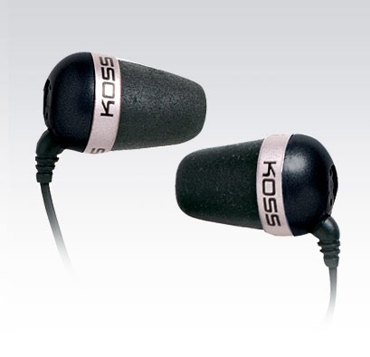

# Koss The Plug

Taigi, prisiminiau, kad ketinau padaryti du atskirus įrašus apie naujausius savo pirkinius – Ipod\`ą ir Koss The Plug ausines. Deja parašęs pirmąjį straipsnį, visai pamiršau apie antrąjį, na bet kaip sakoma – geriau vėliau, nei niekada.

Taigi, nusipirkus savo išsvajotą Apple grotuviuką, kuris, tiesa, buvo be ausinių, prasidėjo ilgas interneto naršymas renkantis “tobuliausią” ausinių variantą.  
Po tam tikrų paieškų apsistojau ties dviem: [Sony MDR-EX90LP](http://www.tuktuk.lt/283466), bei [AKG K 317](http://www.geefre.com/akg-k-317-%E2%80%94-didelis-stebuklas-juodoje-dezuteje/). Tiesa, pastarasis variantas man tą akimirką tapo neįkandamu kainos atžvilgiu, tad galvojau, kad tenkinsiuosi Sony variantu, bet keletas žmonių patarė tokiu atveju imti jau išgarsėjusias [Koss The Plug](http://www.fotofabrikas.lt/items/Koss/Ausines/1e7f49.2-Koss-The-Plug.html).  
Taip ir padariau.

Pasiskaitinėjau – dauguma giria, dėl garso sodrumo, gerai atkuriamų žemų bosų, bei dėl patogumo. Tiesa, teko užmatyt ir keletas nusivylusių komentarų, kur buvo teigiama, kad ausinės labai nekokybiškai groja ar, kad nesilaiko ausyje. Tačiau kiti komentatoriai tiesiog patarė dar kartelį pasižiūrėti į ausinių įdėjimo į ausis instrukciją. Blogai įsidėjus į ausis, išties garsas būna ne toks, kokio būtų galima tikėtis iš ~60 kainuojančių ausinių.

Taigi, kadangi Šiauliuose šių ausinių niekur neradau, pirkau internetu. Pirmasis pasitaikė fotofabrikas.lt iš ten ir ėmiau. Ausinių kaina 55 Lt, plius 9 litai už atvežimą. Prekė buvo pristatyta per 5 dienas, tiesa, ne itin patogiu laiku \(šiaip buvau nurodęs atvežti po 14 valandos, bet atvežė kur kas anksčiau, kai tuo metu buvau paskaitose\)

Taigi, pirmasis įspūdis vos pamačius ausines – didelės. Galvoju, shit, kad tik nebūtų per didelės, bet kai jas šiaip ne taip išpakavau iš ne itin patogios pakuotės, supratau, kad problemų su dydžiu netūrėsiu – tos pagalvėlės velniškai minkštos. Kažkur teko skaityti, kad pagalvėlės pagamintos, ne iš populiariosios gumos, o iš tokios labai kietos putos, kurių pranašumas nepalyginamas. Pirmiausia jų laikymasis ausyje – suspaudi, įdedi į ausį, palauki minutėlę pakol jos išsipučia and that\`s all. Išsipūtusios pagalvėlės priglunda prie ausies formos, todėl laikosi itin gerai, bei nemažai izoliuoja nuo aplinkos garsų \(geras dalykas, kai reikia mokytis gyvenant su triukšmingais kambariokais\), kas leidžia puikiai girdėti visus garsus klausant net nedideliu garsu.  
Be to didelis pranašumas susidaro ir dėl klausomos muzikos kokybės. Klausant su guminiais “grybais”, po kiek laiko ima skaudėti ausų būgnelius, bei kanalėlį. Viename užsienio forumų skaičiau, kad taip nutinka dėl ausinių sukeliamo slėgių skirtumo, bei pagalvėlių spaudimo į šonus. Na o klausant muzikos Koss ausinėmis jokio slėgių skirtumo nebūna, tad gali klausyti valandų valandas – malonumo neužgožia jokie nemalonūs pojūčiai.

Taip, kaip kiekvienos ausinės, šios turi ir savų minusų – kištukas yra tikrai mažas ir plonas. Bijau, kad galiu laidą prie pat kištuko užlenkti taip, kad jis nutrūks \(na bet tam yra garantija!\).  
Kita problemėlė, tai pagalvėlių nusidėvėjimas. Kaip ir kiekvienas daiktas, šios pagalvėlės turi savo tarnavimo laiką ir jam pasibaigus, tiesiog nebeišsipučia ir nebesilaiko ausyje, na bet guodžia tai, kad pakuotėje yra dar vienas atsarginis komplektas.

Overall labai džiaugiuosi abiem savo pirkiniais ir dabar galiu visapusiškai pasinerti į kokybišką muzikos klausimą.

