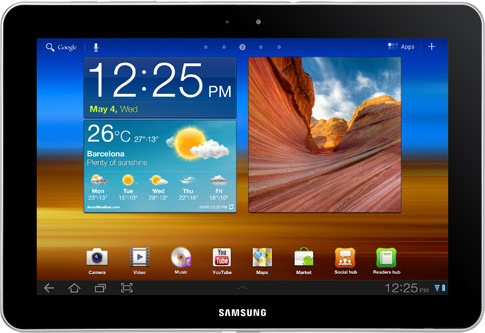

# Samsung Galaxy Tab 10.1

Kadangi domiuosi IT, bei turiu šį blogą, tai kaip pareigą laikau aprašinėti naujus savo technologinius žaisliukus. Skant, atsiliepimus iš savo perspektyvos. Taigi, lygiai prieš 2 mėnesius mano rankose atsidūrė ši planšetė. Neskubėjau apie ją aprašinėti, nes norėjau išsiugdyti šio daikčiuko naudojimo įprotį ir taip susidėlioti tvirtesnes mintis, nuomonę. Taigi, pabandysiu atsakyti pagrindinius klausimus. Kam gi reikia tokio dalyko ir kokios mintys jį jau turint.

### **Kas yra planšetė ir kam ji reikalinga?**

Visi matėm, kaip Apple’as prieš trejerius metus pristatė pirmąjį iPad’ą. Matėsi, kad net pati kompanija negalėjo įvardinti konkretaus tokio aparačiuko pritaikymo, ale tiesiog „kažkas tarp jūsų MacBook’o ir iPhone“. Su tokia intencija iPad’as ir buvo kuriamas: stengtasi padaryti mobilų, patogų nešiotis aparatą, kurį galėtumei naudoti ant sofutės ar lovoje neapsigriozdinant sunkiu nešiojamuoju kompiuteriu, tačiau išlaikant didelį ekraną ir pilnas naršymo internete galimybes. Panašu, kad kompanijos klientams panaudojamumą sekėsi surasti labiau ir šio daikčiuko pardavimai šokte šoko. Tiesą sakant sėkmingumas buvo toks, kad tai sukūrė ir atskirą kompiuterinės technologijos kategoriją, kuri realiai iki tol neegzistavo. Šiuo atveju tai tikrai yra konkretus Apple nuopelnas, nes jei planšetinių kompiuterių start’ą būtų pradėjus kita IT firma, kaip kad Asus, tai vargu ar tablet’ai būtų įgavę tokią akseleraciją.

Kompiuterių pažanga, dar prieš daugybę metų mums pristatė nešiojamuosius kompiuterius, o su jais – galimybę naudotis savo technika praktiškai bet kur. Tačiau šiais laikais to ne be pakanka. Nešiojamieji kompiuteriai patapo per daug gremėzdiški, dideli, sunkūs ir nepatogūs. Norint bet kada gauti prieigą prie savo medžiagos, tenka tampytis tašę ant kupros, turėti šiokius tokius judėjimo suvaržymus, o ir gaišti bent keletą minučių laiko išsipakavimui, bei kompiuterio įjungimui. Lyg santechnikas, kuris norėtų bet kuriuo momentu turėti galimybę taisyti vamzdžius ir vietoj vieno universalaus rakto tampytųsi visą savo įrankių dėžę kartu su savimi.  That’s too much! Gyvename laikais, kur viskas turi įvykti žaibiškai, kiekviena sekundė yra brangi. Ir jei tu lėtapėdis – tiesiog krenti iš žaidimo.

Būtent dėl mobilumo tabletai ir įgavo tiek daug susidomėjimo. Laptopai tampa per daug atgrąsūs. Jie turi arba smarkiai patobulėti (ultrabook’ų rinka) arba juos pakeis naujos kartos technologijos. Žinoma, visi dabar turi kietus mobiliuosius telefonus, kurie sugeba išties labai daug, tačiau kaip bebūtų esminė jų problema – sąlyginai mažas ekranas. Gi pripažinkit – naršot internetą telefone tik tada, kai neturit šalia kompiuterio, pvz troleibuse, laukiant eilėje ir pan. Joks durnius nesedės visą laiką įnikęs į telefoninį browsinimą, kai šalia stovi pilnai funkcionuojantis kompiuteris. Būtent šiuo atveju tablet’as ir pasiūlo tobulą sprendimą – telefoninį mobilumą, greitumą, bei patogumą apjungiant su normalaus kompiuterio atvaizdavimo, bei naršymo galimybėmis.

Pagrindinis minusas iš tablet’ų pusės – ne pilnavertės OS. T.y. jose naudojamos specialios OS versijos, kurios tikrai nusileidžia savo giminaitėms namų kompiuteriuose. Turėdamas tablet’ą tu turi taikytis su konkrečiai joms sukurtomis programomis, tad jei jūs naudojatės specifinėmis buhalterinėmis, architektinėmis ar bet kokiomis kitomis specialybei reikalingomis programomis, tai kol kas galite net nesitikėti jas išvysti „tapšnuko“ ekrane. Ir nors elementariam darbui su offiso programomis jo ir gali užtekti, tačiau dirbti taip nerekomenduojama. Kaip, kad su ferrariu: iš esmės galima vežti bulves kaime, tačiau jis buvo kurtas ne tam. Skirtingai nuo jau kiek atslūgusių netbook’ų. Pastarieji gali girtis visomis normalaus kompiuterio programomis. Tiesa, jų galios pavilkti pilnavertę OS yra kiek mažokai, tad nieko įprasto, kad jie ir veikia kiek lėčiau. Planšetas tuo tarpu yra 100% interneto įrenginys. Tai yra jo arkliukas, koziris ir pagrindinis naudojimo pritaikymas. Išsitraukei ir suradai ko norėjai internete. Sekundžių reikalas. Taip, kaip ir turi būti 2012-aisiais metais.

Taigi, planšetas, tai prietaisas suteikiantis galimybes skaitinėti naujienas, e-knygas, sedėti facebook’e, žiūrėti filmus, žvengti 9gag’e ar žiūrint naujausius viral klipukus youtubėj neišlipant iš lovos ar neužsispaudžiant savo pilvo 2 papildomai kaistančiais kilogramais. Kadangi didžioji interneto publikos dalis vien tik tai ir veikia internetuose, tad jiems tokio įrenginio turi būti į valias.

Na o norėdami išsiaiškinti, ar jums verta turėti tokį daiktą, tereikia sau atsakyti į klausimą: o kiek ir ką gi aš daugiausiai veikiu prie kompiuterio?

### **Kam aš pirkau planšetę?**

Taigi, mano atsakymas į tą klausimą: skaitau. Taip, iš tiesų, internete daugiausiai mano laiko sugaištama būnent skaitymui. Skaitau daugybę užsienio informacijos šaltinių, portalų, taipogi nemažai domiuosi IT naujienomis, mėgstu pasiskaitinėti ką rašo vienas kitas kolega blogeris. Antroje vietoje po skaitymo būtų serialų žiūrėjimas, muzikos klausimas, programos reikalingos paskaitoms, na ir galiausiai žaidimai. Bet kaip bebūtų būtent pirmąjam prioritetui galiu nė nepajusdamas skirti valandų valandas, naršant iš vieno puslapio į kitą. O su tokiu skaitymu tapau pririštas prie savo kompiuterio, nes iš esmės, nors jis ir yra nešiojamas, tačiau jo akumuliatorius senokai nupušęs ir geriausiu atveju tokį laptopą galima vadinti tik „pernešiojamu“. O iš tokio „bulky“ aparačiuko naudos būnant ne namie – išties mažai.

Tad nenuostabu, kad nusprendžiau įsigyti planšetuką, su kuriuo galėčiau daryti tai kas man labiausiai patinka, bet kur ir bet kada. Pvz laukiant paskaitos, važiuojant traukiniu namo or whatever. Ir iškart galiu pažymėti, kad produktyvumas su tokiu aparačiuku padidėja pastebimai (jei naudosit jį protingai – Fruit Ninja gi visada vilioja =j ).

Nešiojamo kompiuterio visai pakeisti intencijų ir neturėjau, jį tikrai naudoju ir turėdamas tablet’ą, tačiau draugavimą su internetais nemaža dalimi galima perkelti būtent į šį naują nešiojąmąjį draugą.

### **Planšetės rinkimasis**

Kodėl rinkausi ne populiarųjį iPad’ą, o konkrečiai šį, Galaxy Tab? Daug kas rėkia apie iPad’o išbaigtumą, bei smooth veikimą, tačiau aš susidėliojau prioritetus. Nors iOS šiuo metu turi didesnį kiekį planšetėms sukurtų programų, tačiau Android sistema sparčiai vejasi ir turi milžinišką potencialą. Mėgstu žaliūką už jo laisvumą, už tai, kad galiu lengviausiai pasikeisti, modifikuoti sistemą pagal save. Taipogi Apple’o produktas neturi tikro multitaskinimo, flash’o, bei gps’o. Taigi greitai nusprendžiau, kad tai nebus prakąstas obuolys. Tačiau rinkoje jau buvo ne vienas android tabletas ir reikėjo pasirinkti iš jų. Pasirinkimas nebuvo labai sunkus, iš esmės buvo vos keli variantai, tarp Motorola Xoom, Asus Transformer ir pan, tačiau rinkausi rimčiausią tuo metu iPad’o konkurentą – Galaxy Tab’ą. Spartesnis, turintis didesnę rezoliuciją, atsparųjį Gorilla Glass, lengvesnis, plonesnis, išlaikantis tokio pat lygio stilingumą, bei surinkimo kokybę, tačiau už mažesnę kainą. Tiesiog nesivaikom aklai madų. Pirmas išties iPad klasės lygio įrenginys, kuris pranokstą teikiamomis galimybėmis. Na o galaxiukas turi net kelias versijas: nuo 7.7 iki 10.1 colio skersmens. Rinkausi būnent pastąrąją, nes nenorėjosi aukoti browsinimo malonumo dėl mažo ekrano. Mažą ekraną jau turiu savo išmaniąjam. Na ir kas be ko, griebiau  3G versiją. Išvis nematau prasmingumo imti tokio internetinio prietaisiuko, kuris negalėtų garantuoti interneto all the time, tad Wi-Fi versija mano atžvilgiu netenka didelės dalies balų.

.png>)

### **Techninės specifikacijos**

| **Operacinė sistema** | Android Honeycomb v3.1 su Samsung TouchWiz                                                                                                     |
| --------------------- | ---------------------------------------------------------------------------------------------------------------------------------------------- |
| **Procesorius**       | Dviejų branduolių 1GHz pagrindinis procesorius ir Tegra 2 grafikos procesorius                                                                 |
| **Atmintis**          | 1 GB RAM ir 16 GB vidinės atminties                                                                                                            |
| **Ekranas**           | 10,1 colių (1280×800) PLS TFT capacitive, atkuriantis 16 milijonų atspalvių.                                                                   |
| **Kameros**           | <ul><li>3,15 mln. taškų galinė fotokamera galinti filmuoti 720p raiška;</li><li>2 mln. taškų priekinė fotokamera vaizdo skambučiams.</li></ul> |
| **Ryšiai**            | GPRS, EDGE, 3G ir Wi-Fi                                                                                                                        |
| **Matmenys**          | 256.7 x 175.3 x 8.6 mm (ploniausias tablet’as rinkoje)                                                                                         |
| **Svoris**            | 565 g                                                                                                                                          |
| **Baterija**          | 7000mAh, iki 2120 valandų 2G režime, iki 1840 valandų 3G režime.                                                                               |

**Mintys apie Galaxy Tab’ą**

Taigi, du mėnesiu pagyvenus su šia „galaktikos tablete“, žinoma turiu ir šiokių tokių pastebėjimų. Pirmiausia, tai ištikro galima kiek suprasti Apple poziciją, kai šioji pradėjo padavinėti Samsung’ą  į teismus. Galaxy tab’as bent iš priekinės pusės atrodo lygiai taip pat minimalistiškai ir dailiai, kaip iPad’as. Va čia ir problema. Per daug panašiai į iPad’ą. Technologijose mažiau patyrę žmonės neretai ir maišo šį aparačiuką su pirkiniu iš Apple stovyklos. Ir deja Samsung’ą galima peikti ne tik dėl to. Ok, jei dėl dizaino dar nesiginčijama ir jis išties dailus, tai kam kopijuoti neigiamas savybes iš konkurentų? Samsung’as lygiai taip pat neįdiegė atminties kortelių lizdo, krovimo laidą padarė ne standartiniu, o specialiu Samsung Connector, kuris niekur daugiau netinka, norint pajungti flashiuką, tenką pirkti atskirą priedėlį, o įsikelti filmus ar muziką į planšetą reikia specialios programinės įrangos pagalba, panašiai, kaip iTunes. Šiuos žingsnius tikrai galima vadinti nevykusiais. Jei jau kopijuoji, tai kopijuok kokybiškai ir nedaryk tų pačių klaidų.

Taip galbūt yra bendros šiuolaikinėms planšetėms būdingos bėdos: blizgus ekranas, kuris saulės atokaitoje priverčia sunkiau įžiūrėti vaizdą ir tenka apšvietimą statyti į maksimumą, negalėjimas praplėsti savo 16 GB atminties, ilgiau naudojantis ima vargti riešai, tačiau iš esmės šios problemos nėra kritinės ir būdingos daugeliui. Užtai prietaisas puikiai atlieka savo darbą: veikia švelniai, naršymas internete spartus, patį aparačiuką nešiotis visai nesunku, bei galima smarkiai nesijaudinti dėl ekrano subraižymo. Aišku, numesti ant žemės jo nepatartina, gali baigtis [taip](http://1.bp.blogspot.com/-6Fgi3mTgjUo/Ti7OYlUxDaI/AAAAAAAALF4/H6GWOi5B9jM/s1600/Chad%27s+Broken+iPad+2.jpg).

Samsung’as buvo prižadėjęs iki kovo mėnesio pabaigos išleisti ir oficialių ketvirtos Android versijos ICS atnaujinimą. Tačiau, kaip matome kovas jau užsibaigė, tačiau kol kas rezultatų dar nėra. Gamintojas teisinasi, nespėjęs užbaigti visko kaip dera ir atidėjo išleidimą porai mėnesių. O naujojo android’o laukti tikrai verta – šis atnaujinimas įneš ne tik daug didesnio stabilumo, tačiau pagreitins planšetės veikimą, bei pateiks keletą naujų, bei patogių funkcijų. Iš esmės nekantriausieji gali išbandyti neoficialius Cyanogen „naktinukus“, tačiau jie gan nestabilus ir turi nemažai neveikiančių funkcijų, tad daug geriau palaukti oficialiau release’o.

Be abejonės džiaugiuosi šiuo pirkiniu. Būtent jo dėka, dabar įprasminu kasdienį važinėjimasi viešuoju transportu ir išnaudoju tą laiką savišvietai. Tablet’ai definetly turės savo rinką. Pamatysit, kaip vis tobulės, darysis vis pigesni ir atras kelią į vis didesnį namų kiekį. Po keletos metų po tablet’ą galim turėti daugelis. Na, žinoma, ne taip masyviai, kaip mobilieji telefonai, bet pakankamai rimtai ir stipriai. Jau dabar galime matyti, kai išaušo pirmieji metai, kai mobiliųjų įrenginių parduodama daugiau nei kompiuterių. Šis skirtumas vis didės. Mobilieji įrenginiai, kaip smartphone’ai ir tablet’ai ir pataps mūsų kompiuteriais. Greitai, su Win8 pasirodymu situacija tablet rinkoje ims dar labiau aštrėti. Just wait for it and tablets will come to you. You will see. Aš kaip geek’as tai net labai approve’inu :3

Na ir galiausiai paprastas ir tiesus atsakymas į klausimą ar verta pirkti tablet’ą: jei gaila pinigų, abejojat ir galit be jo – nepirkit. Tai bus tik trumpa užgaida, kuri greitai jums užsimirš ir atsibos. Panašiai, kai vaikas pamato naują žaislą. Na ir kas, kad jūsų pažįstamas tokį turi…\
Na, bet jei galit sau tai leisti, skant, nesat varguolis – tai žinoma imkit. Manau tikrai rasit kur ir kaip naudingai išnaudoti. Blogiausiu atveju pasidėsit  tūlike ir galėsi nebepirkt kryžiažodžių :D
