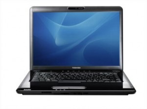
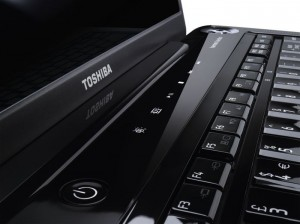
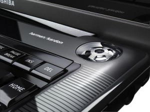

# Toshiba A300-1GN

Taigi papasakosiu apie naująjį savo žaisliuką. Ech… Kaip aš ilgai tokio norėjau ir štai vos kelios dienos prieš rugsėjo 1 pavyko tokį nusipirkti. Trumpai mano pirmieji įspūdžiai apie šią juodą panterą:

Komplekte pasigedau krepšio ir pelės, kaip dažniausiai būna su kitais nešiojamais kompiuteriais, tai teko pasijamti juos atskirai. Jų trūkumas nuo kompiuterio neatbaidė, tik suteikė truputi daugiau nenumatytų išlaidų.

Pirmas įspūdis: pakankamai galingas ir labai gražus. Tikrai apžiūrinėjant įvairius variantus šio mažylio dizainas man labiausiai krito į akis. Tobuliausias buvo Sony VAIO kažkuris modelis, kuris mane tiesiog pakerėjo, tačiau jo kaina man buvo neįkandama. Šis Toshiba variantas užėmė antrąją vietą, jį ir pasijamiau. Dėl galios buvo kiek kitaip. Buvo tikrai ne vienas galingesnis modelis, tačiau jie atrodė nykiai, pasenęs dizainas. Tokie buvo Dell, bei Lenovo variantai. Aš žmogus, kuriam galia tai dar ne viskas, tai ėmiau variantą, kuris mane patenkina ir savo stiliuku ir galia.

Kompiuteris gerai sukomplektuotas, galios tikrai per akis, bent dabar…O ir praplėtimo galimybės nemažos \(iki 2Gb vaizdo plokštė ir iki 8 Gb RAM\). Na taip, gal vaizdo plokštė ir ne Geforce, bet paskutiniai jos variantai jau pagarsėjo su kaitimo problemomis, tai šiuo atžvilgiu Radeon\`as gal ir nugali.

Didžiausia bėda, kurią daugelis pastebi, tai baterijos gyvenimo laikas. Maksimaliu režimu dirbantis kompiuteris gyvens tik apie 1.5 valandos. Bet visgi nusistačius long life režimą \(išsijungia visi švytintys pagražinimai ant korpuso, sumažinamas ekrano kontrastas, bei skiriama mažiau energijos techniniai įrangai\) ir neklausant muzikos, tai apie 2.5 valandos ištempia. Bet keliauju aš ne daug, tad tai jokių problemų nesukelia, o jei ir keliauju, tai tik traukiniu, kuriame prie elektros tinklo prisijungti galiu, tad no problemo.  
Dėl negyvų pikselių jokių bėdų nepastebėjau. Gamintoja teikia, kad tokie gali atsirasti per pirmas 180 valandų, tiek jau praėjo, bet „negyvelių“ neatsirado \(tfu, tfu, tfu\). Vaizdą atvaizduoja gražiai, taip kaip ir tikiesi iš jo. Labai naudingi easy media mygtukai ant jo korpuso, kurie leidžia paleisti, sustabdyti, perjuugti dainas, filmus, nė nesiliečiant prie pelės.

Darbas… Dirbo jis kaip reikia su Vista, bet kai instaliavau xp tam tikrų bėdų atsirado dėl greičio \(ypač kopijuojant ką nors iš kompakto – su kompiuteriu pasidaro beveik neįmanoma dirbti\). Bet čia tik kartas nuo karto taip užeina. O dabar turiu pasidaręs ir xp ir vista viename kompiuteryje, tai dirbant su vista greičio problemų tikrai nėra, o ko nesugeba paleisti Vista tą puikiai padaro xp, tad problemų jokių nematau.  
Tikrai geras dalykas yra integruotos kolonėlės \(harman/kardon\). Na taip jos neprilygsta 2.1 sistemai, bet palyginkit su kitų laptopų skleidžiamu garsu – skirtumas akivaizdus. Net juokas iš kitų ima, juos išgirdus. Gal tik garsumo kiek pritrūksta, bet pasiėmus geras ausines – tai ne problema.  
Tokį blizgantį daikčiuka tenka gan dažnai pavalyti, norint, kad gražiai atrodytų, nes labai akivaizdžiai matosi žymės nuo rankų ar nukritusios nenaudėlės dulkės. Bet čia smulkmena. Komplekte gauname švelnią servetėlę, su kuria tikrai gerai visus nepageidaujamus pirštų antspaudus galime pašalinti.

Bendrai paėmus tikrai nesigailiu, kad ėmiau šį modelį ir tikrai rekomenduoju kitiem – nepasigailėsit. Stilius ir galia, tai savybės kurių man ir reikia.

Na ir jūsų smalsumui techniniai duomenys:

Gamintojas Toshiba  
Garantija 24  
Ekrano įstrižainė 39 cm \(15.4″\)  
LCD matricos tipas WXGA+ \(1440×900\) TrueBrite  
Centrinio procesoriaus tipas Intel Core 2 Duo P8400  
Centrinio procesoriaus dažnis 2.26 GHz  
Operatyvioji atmintis 3072 MB DDR2 \(plečiama iki 8 Gb\)  
Standžiojo disko talpa 320 GB \(plečiama iki 1,5 Tb\)  
Vaizdo plokštė ATI Mobility Radeon HD 3650 HM  
Grafinė atmintis 512 MB DDR2 \(plečiama iki 2 Gb\)  
Optinio įrenginio tipas DVD+-R/RW DL  
Atminties kortelių skaitytuvas SD, MMC, MS, MS PRO  
Internetinė kamera 1.3 mln. taškų  
Bevielio tinklo sąsaja 802.11a/g  
Bluetooth sąsaja yra  
Express Card lizdas yra  
Modemas yra  
IEEE 1394 \(firewire\) jungtis yra  
TV-out jungtis yra  
eSATA jungtis yra  
USB jungtis yra, 3x USB 2.0  
HDMI jungtis yra  
Operacinė sistema Windows Vista Ultimate + Windows Xp SP 3  
Svoris \(kg\) 2.72

