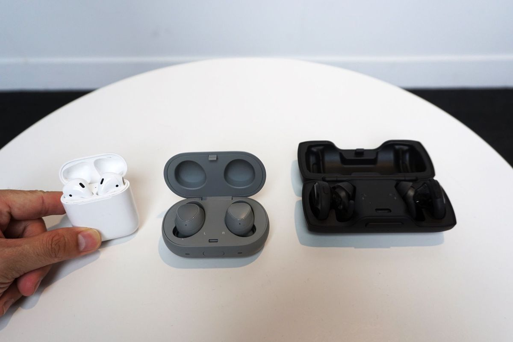

# Bevielės ausinės

Pakankamai nemėgstu laidų savo gyvenime ir po truputėlis bandau jų nusikratyti ir pereidinėju prie bevielių technologijų. Nors šios ir turi savų minusų, tačiau suteiktas patogumas tuos minusus atsveria. Pvz mano namų kompiuteris yra prijungtas ne tik prie PC monitoriaus bet ir prie televizoriaus vienu metu, tad bevielė klaviatūra ir pelė mano namuose jau naudojami pusę dešimtmečio, o baterijas iki šiol pakeisti teko viso labo vieną kartą \(Logitech teigia, kad klaviatūros baterija tarnauja 2 metus ir iš patirties galiu paliudyti, kad lūkesčiai ne tik pasiekti, bet net ir juos viršija, nes baterijas keičiu maždaug kas 2,5m\). Minėtasis televizorius, kabantis ant sienos neturi jokių matomų jungiamųjų laidų, rozetę susimontavau tiesiai už televizoriaus, o kompiuterio HDMI kabelis paslėptas pačioje sienoje. Nesenai įsigyjau PS4 Pro ir jį jungti reikėdavo papildomu HDMI laidu, tad gan greitai suradau išeitį - [HDMI šakotuvą](https://www.varle.lt/usb-irenginiai/sakotuvas-mini-hdmi-perjungejas-su-stiprintuvu-logilink--7306384.html). Dabar tuo pačiu paslėptu sienoje kabeliu galiu žiūrėti tiek ir iš PC transliuojamą vaizdą, tiek ir žaisti PS4 žaidimus, tad dar vienu laidu mažiau ir negadina bendro vaizdo. Net ir fuckin [siurblys](https://www.dyson.com/sticks/dyson-v8-absolute-nickel-iron.html) ir tas pas mane jau bevielis! Tad nenuostabu, kad buvo tik laiko klausimas kada mano gyvenime atsiras ir bevielės ausinės.

Iš esmės Bluetooth ausinės turėdavo tris ryškius trūkumus:  
-ribotas baterijos įkrovos laikas  
-garso kokybė, trūkinėjimai, trukdžiai  
-kaina

Šios trys priežastys ir buvo pagrindinė priežastis, kodėl apie bevieles ausines net ir nelabai svarstydavau. Technology wasn't there yet. Tačiau per paskutinius porą metų situacija gan smarkiai pasikeitė ir dabar, kai telefonų gamintojai pradėjo karą su ausinių lizdais, pasirinkimo variantų bevielių ausinių scenoje atsiranda vis daugiau, o minusai tampa nebe tokie ryškūs. Taigi, aptarkim kelis variantus.

### **Headphones**

Tai ausinės su lankeliu apgaubiančios visą ausies kaušelį. Jos pačios pirmosios pradėjo bandymus su bevielemis technologijomis, o turėdamos didelį plotą, kuriame gali būti laikomos baterijos, pasižymi išties solidžiomis darbo valandomis. Nieko nenustebinsiu paminėdamas, kad tokios ausinės puikiai laiko po 20-30 h nepertraukiamo grojimo, tad dažnas ausinių naudotojas jas turi pakrauti tik kartą per savaitę. Taipogi tokio tipo ausinės turi daug didesnius, geresnes savybes turinčius garsiakalbius, tad gali pasigirti žymiai solidesniu garsu, kurį vertina išrankesni muzikos mylėtojai. Ne be priežasties visos geriausios pasaulio ausinės būna būtent šio tipo.  Šiuolaikiniai variantai, kaip kad mano svarstytos labai patogios [Bose QuietComfort 35 II](https://www.bose.com/en_us/products/headphones/over_ear_headphones/quietcomfort-35-wireless-ii.html) ar [Sony 1000X](https://www.sony.com/electronics/headband-headphones/mdr-1000x) pasižymi ir išties įspūdingai efektyviu triukšmo blokavimu \(ANC\). Tai ypač patogu skrendant tolimas keliones lėktuvu ar dirbant triukšmingame ofise. Triukšmo blokavimas veikia taip efektyviai, jog muziką galima klausyti visai patyliukais, o jūs vis vien visiškai nebegirdėsite aplinkinio ūžesio ar pokalbių. Užsiblokuojate nuo aplinkos trukdžių visiškai, tarsi pasinerdami į izoliuotą kambarį.

Tikriems muzikos fanams, tokio tipo ausinės yra pats tas. Tačiau aš asmeniškai visgi jų nepasirinkau. Kodėl? Nors šios ausinės ir yra bevielės, tačiau jų dydis kelia papildomus nepatogumus: kai muzikos nėra klausoma, dažniausiai jos yra laikomos žemiau kaklo ir tai varžo galvos judesius, gabenant jas galima nusiimti ir susilankstyti, tačiau jų transportavimo dėžutės vis vien yra pakankamai nemažo dydžio, tad būtina turėti papildomai vietos krepšyje ar kuprinėje. Taipogi tokiomis ausinėmis nepatogu naudotis gulint, nes negalima pasukti galvos ar atsigulti ant šono. Nors žiemą jos ir apsaugo ausis nuo vėjo, tačiau karštos vasaros metu ar išsiruošus pabėgioti ausys gali pakankamai neblogai šusti, o išvalyti prakaito dėmes nuo paminkštintų kraštų gali būti ne tokia ir lengva užduotis. Nepamirškime ir vieno svarbiausių aspektų - kokybiškas garsas ateina ir su atitinkama kaina, pvz. mano minėtieji modeliai kainuoja apie 350€. Toli gražu ne kiekvienam priimtina suma mokėti viso labo už ausines. 

### **Neckband**

Dažniausiai dėl savo itin kompaktiško dydžio, patogumo nešiotis tiesiog kišenėje ir to, kad šios ausinės neblogai užkemša ausis ir tokiu pasyviu būdu gerokai sumažina aplinkos triukšmus, dažniausiai naudodavau į ausies kanalą įstatomus earphones, dar žinomus, kaip in ear tipo ausines. Tokios ausinės irgi gali būti bevielės ir vienas iš sprendimo būdų ir yra neckband - tarpusavyje laidu sujungtos in ear ausinės, kurios tiesiog neturi jungiamojo kabelio su grotuvu/telefonu. Tad laidas yra trumpas, guli ant kaklo ir suteikia privalumą, jog vienai auksinei iškritus iš ausies, ji lieka kabėti, o ne krenta ir pasimeta ant žemės. Taipogi aktyviai sportuojant laidą galima užkabinti už ausies kaušelio ar net naudoti papildomai pridedamus silikoninius laikiklius, kurie statosi į ausį ir taip sustiprinti ausinės laikymąsi, pvz. kaip [Jaybird x3](https://jaybirdsport.com/en-us/x3-bluetooth-headphones.html). Tokių ausinių esminis privalumas - patogumas. Būdamos mažo dydžio, jos visai nesimaišo, netrukdo, galima naudoti net po šalmu, nešiotis jas yra patogu, aplinkos garsus blokuoja išties neblogai. Dėl šių priežasčių jos dažniausiai reklamuojamos sportuojantiems žmonėms. Tokių ausinių baterijos laiko apie 8 h, tad realistiškai jų užtekti turėtų visai dienai, o jei ir pritrūktumėte, tai jas galima išties greitai pakrauti - pvz. [BeatsX](https://www.beatsbydre.com/earphones/beats-x) ausinės giriasi, kad viso labo 5 minučių įkrova, leis muzikos klausyti 2 h. Tokių ausinių kaina yra kur kas priimtinesnė lyginant su prieš tai minėtomis headphones ir siekia apie 150€.

Problema ta, kad nors kai kurios iš jų garsą atkuria gal ir patenkinamai, tačiau bendra garso kokybė ausinių kainos išties neatitinka. Paprastos ausinės su laidu, už tokią kainą skambės nepalyginamai geriau. Į ausies kanalą įsistatančios ausinės sugeba visai neblogai atkurti žemų dažnių garsus, tačiau bendras garsas būna skurdokas. Labai išryškėja pojūtis, lyg galva būtų mažoje, uždaroje dėžutėje, kurios viduje groja muzika, t.y. klausantis muzikos trūksta erdvės pojūčio. Taigi, pinigai keliaują už patogumą, o ne už garsą. O kai kurie žmonės tokio tipo ausinių net negali nešioti, nes jiems dėl sukuriamo slėgio greitai paskausta ausų kanalą ar net pasidaro bloga. Kai kurie, pasyvų triukšmo blokavimą net nelaiko pliusu - naviguojant mieste, važiuojant dviračiu ir pan, jie nori gaudytis kas vyksta aplinkoje, nebūti apkurtintais ir žinoti kas vyksta jiems už nugaros, tad laiko tokias ausines net ir pavojingomis. Tame yra tiesos, nes negirdėti atlekiančio automobilio išties gali būti pavojinga.

Tad tokios ausinės manęs nesužavėjo. Baterijos laikas problemų nekelia, garso kokybės atžvilgiu galima rasti acceptable variantų, keliaujant mieste audiofilinis garsas nėra prioritetas. Tačiau mano požiūriu, tai yra toks tik pusiau iškeptas kompromisas. Visgi laidas, nors ir trumpesnis, tačiau niekur nedingsta, tad jis vis vien laikant ausines kišenėje susipainioja, jis vis vien išlieka viena pagrindinių vietų, dėl kurios ausinės gali sugesti. Vaikštant žiemą apsivyniojus šalikais ar gulint lovoje, laidas vis vien kliūna ir gali išmesti ausinę iš ausies, o bėgiojant vis vien girdimas laido trankymasis. Mano minėtos BeatsX ausinės \(kurios groja subtiliau, nei būtų galima tikėtis iš Beats ausinių ir nepasižymi tuo firminiu smarkiai perspaustu bosu\) turi išties per ilgą kabelį, o Jaybird kabelio ilgį galima sutrumpinti, suvyniojant jį ant specialių laikiklių, kurie būna pridedami komplekte. Tačiau kyla klausimas kuo šios ausinės pranašesnės už tiesiog paprastas ausines su laidu? Kaip ir dingsta esminiai bevielių ausinių pliusai, tad man netiko ir šis variantas.

### **Wireless in ears**

Na ir galiausiais belieka ekstremaliausias variantas - į ausis įstatomos visiškai bevielės ausinės. Jokių laidų, jokių kliuvimų, mažos ir labiausiai portable ausinės kokios tik gali būti. Šioje kategorijoje verta paminėti [Samsung IconX 2018](http://www.samsung.com/uk/wearables/gear-iconx-r140/SM-R140NZKABTU/), [Sony WF-1000XF](https://www.sony.com/electronics/truly-wireless/wf-1000x), [Bragi The Dash](https://www.bragi.com/) ir [AirPods](https://www.apple.com/shop/product/MMEF2AM/A/airpods). Būdamos tokios nedidelės pasigirti baterijomis jau nebegali - dauguma iš jų sugeba groti tik apie 5 h. Tad jei planuojate klausyti visą darbo dieną, tai be pauzės visgi nesigaus. Tačiau pliusas tai, kad jos turi dėkliukus, į kuriuos įstatant ausines, jas galima greitai pakrauti. Sony ausinės gali pasigirti iš ties neblogu triukšmo blokavimu, tačiau jų baterija laiko viso labo 3h. Samsung ar Bragi visai neblogai draugauja su Android telefonais, palaiko nemažai gestų, pvz galima keisti garsumą, perjungti dainas ar iškviesti virtualų asistentą telefone, tačiau jų dėklai yra gan dideli, tokio dydžio kad tiesiog kelnių kišenėje nešiotis jau būtų nebepatogu, taipogi šie dėklai ausines sugeba pakrauti labai ribotai, pvz Samsung'o IconX dėklas sugeba laikyti energijos viso labo tik vienam ausinių pakrovimui. O ir šių ausinių kaina yra išties didelė, pvz Bragi kainuoja 330$, o tai jau dvigubai to, kiek kainuoja AirPods.

Tad iš esmės vienintelis viable variantas ir belieka AirPods. Pakalbėjime apie jas atskirai.

### **AirPods**

Kai jos buvo pristatytos 2016-tųjų gruodį, daug kas nevengė iš jų [pasijuokti](http://knowyourmeme.com/memes/events/apple-airpods-controversy) - įstatytos į ausis šios ausinės atrodo išties keistai, lyg dvi cigaretės kyšančios iš ausų. Kaina taip pat pasirodė neadekvačiai didelė, eilinis vartotojas nėra pasirengęs mokėti 170€ tiesiog už tokias mažytes ausines. Nemažai žmonių nusivylė ir tuo, kad garso kokybės atžvilgiu jos nelabai skiriasi nuo standartinių [Apple EarPods](https://www.apple.com/shop/product/MNHF2AM/A/earpods-with-35-mm-headphone-plug) ausinių. Vartotojų pirminės reakcijos buvo kritika ir pajuoka, nors apžvalgininkai apie jas blogai ir neatsiliepė.

Bet praėjo šiek tiek laiko ir šios ausinės tapo vis labiau ir labiau įvertinamos. Pasirodo, kad kaina jų yra visiškai normali lyginant su kitomis bevielėmis ausinėmis. Konkurentų gaminiai šioje kategorijoje įkainoti panašiai ar net ir brangiau, tad nesijaučia to standartinio "Apple tax" mokamą už "premium" patirtį, marketingą ir prekinį ženklą. Jos yra patogios ir dėl mažo svorio, praktiškai net nejuntamos ausyje. Kadangi jų netempia joks kabelis tai net ir smarkiai purtant galvą ar bėgant jos puikiai laikosi ausyje ir neiškrenta, tad pametimo rizika nėra jau tokia aktuali. Jų dėklas, panašus į dantų siūlo dėžutę, yra neįtikėtinai mažas ir telpa net į mažąją vyriškų kelnių kišenę, tačiau tuo tarpu sugeba talpinti įkrovą išties įspūdingoms 24h grojimo! Lyginant su Samsung ausinėmis - skirtumas tiesiog neįtikėtinas. Ausinės kraunasi taipogi išties sparčiai - 15 min pabuvusios dėkle jos vėl sugebės groti iki 3 h, pilnam pakrovimui, tam kad grotų 5 h, jas krauti užtenka apie 25 minutes, o visą jų dėklą nuo nulio įkrausite per 40 min ir vėl būsite pilnai pasiruošę 24 h klausymui. Taigi, nors penkios valandos gali pasirodyti mažai, tačiau žiūrint į realų praktinį pritaikymą - klausant darbovietėje, kol spėsite pabendrauti su kolegomis ar papietausite, jos jau bus pasikrovusios likusiai dienos daliai. Baterija tampa visiškai neproblematiška. Net ir overall dizainas, ypač palyginus su kitomis bevielėmis ausinėmis, kurios atrodo labiau kaip klausos aparatai, o ne ausinės - nebe atrodo toks jau ir blogas.

Yra ir kelios tokios smulkios, tačiau gerai apgalvotos detalės, kaip kad galimybė klausytis tik su viena ausine ir ji automatiškai persijungia į mono režimą, tad jokių garso kanalų jūs nepraleisite ar kad išėmus ausinę iš ausies, automatiškai sustabdoma muzika. Apie tai, kaip AirPods turi W1 chip'ą, kurio dėka ausinės įstabiai lengvai ir patogiai susiporuoja su kitais Apple įrenginiais ar apie tai, kaip puikiai jos laiko signalą, be jokių ryšio trūkinėjimų, trukdžių ir nuo telefono galima nueiti išties labai toli, aš jau nė nekalbu. Kai pradedi gilintis į detales, pasirodo, kad tai yra išties stebinančiai puikus gaminys ir ko gero vienas labiausiai Apple produktų nuo pat Steve Jobs mirties. Konkurentai lenkiami išties ženkliai, viskas labai paprasta, patogu ir tiesiog veikia.

Kad ir kokias papildomas funkcijas turėtų ausinės, jos nublanksta, jei garsas yra prastas. Kad jį įsivertinti pasiskolinau laidines EarPods ausines, kurios groja išties labai panašiai ir pasileidau [Soundcheck](https://open.spotify.com/user/postnick/playlist/0ih1tDAm9eB3Ay9VxfsfS6?si=KXUpgPofSDGYcifVuzaZIg) playlist'ą, kuriame sudėtos dainos, išties padedančios neblogai įsivertinti garso atkūrimo tikslumą. Praklausius dieną, galėjau padaryti kelias išvadas: tiek metų naudojus vien tik in ear ausinėmis, garso izoliacijos nebuvimas blaško. Važiuojant viešuoju transportu, einant šalia triukšmingos gatvės ar tiesiog stovint prie dviejų besišnekučiuojančių žmonių tenka didinti garsą, nes kitu atveju muzika tampa sunkiai girdima. Tačiau kaip minėjau šią savybę galima laikyti tiek pliusu, tiek minusu. Kadangi nemažai klausau podcast'ų, girdėti net menkiausias detales juose nėra taip jau svarbu, svarbu jog girdėtųsi pats pokalbis, tad neskubėjau vien dėlto ausinių sukritikuoti. Svarbiau buvo, tai kaip gi jos tiksliai atkuria garsą. Būnant gan tylioje ofiso aplinkoje šias ausines lyginau su [Sennheiser CX 3.00](https://en-ie.sennheiser.com/in-ear-headphones-cx-3-00). Nors pastarosios ir turėjo stipresnį bosą, tačiau turiu pripažinti, kad tas uždaros dėžutės efektas išties pasidaro ryškus, ypač lyginant su Apple ausinėmis, kurių garsas nors ir aukštesnis, tačiau daug erdvesnis ir dėlto skamba natūraliau. Ryškiausiai skirtumas juntamas būgnų skambesyje ir atlikėjo balse jei atliekama acapella. Visgi turiu duoti pliusą Apple, nes senesnės kartos ausinės Apple earbuds, buvo nepalyginamai prastesnės. Negalvojau, kad po jų redesign'o 2012-taisiais jų garsas taip pagerėjo. Nesupraskit klaidingai, jis nėra kažkoks fantastiškas ar ypatingas. Tiesiog respektabiliai subalansuotas ir išties pavyzdingai kokybiškas, kaip ausinėse, kurios yra pridedamos nemokamai į komplektą perkant telefoną. Kai galų gale teko išgirsti bevielių AirPods, teko pastebėti, kad garsas jose išties yra labai panašus. Didžiausias skirtumas juntamas vos šiek tiek sodresniame bose, tad nors ir nežymiai, bet AirPods yra geresnės nei laidinės iPhone ausinės. Jei patinka pastarosios, tai šios negali nepatikti. Tad kas liečia kokybę - AirPods neskamba prastai, tikrai užtektinai klausymuisi keliaujant ar dirbant. Jos groja kaip ausinės už maždaug 50€ ir mano testas su Sennheiser'iais tai tik patvirtina. Žinoma už jas mokėsite 3 kart daugiau, bet čia jau yra technologijos ir patogumo mokestis.

Liko išsiaiškinti suderinamumą, nes Apple telefono nenaudoju ir savo kišenėje labiau toleruoju Android įrenginius, nes mėgstu pasirinkimo laisvę bei galimybę susikonfigūruoti nustatymus pagal savo poreikius, o ne taikytis prie telefono. Kaip bebūtų, Apple viena tų kompanijų, kurios nemėgsta jog jų įrenginiai gražiai "draugautų" su kitais, ekosistemai nepriklausančiais įrenginiais. Iš dalies tai galioja ir AirPods: naudojant šias ausines su bet kuriuo ne Apple įrenginiu, jos tampa ko ne standartinėmis bluetooth ausinėmis. Netenkama galimybė patikrinti ausinių baterijos lygį, dingsta auto sustabdymo funkcija ar galimybė išsikviesti telefono asistentą. Tačiau tai nėra jau tokia didelė bėda - ausinės vis vien lieka pakankamai funkcionalios: dainas galima sustabdyti du kartus patapšnojus per ausinę, jos vis vien moka automatiškai persijungti į mono ir jos vis vien groja tiek pat ilgai ir yra tokios pat patogios. Tiesa ausinių nustatymus galite keisti TIK prijungę jas prie Apple įrenginio. Tačiau tai vienkartinis poreikis ir galite tai padaryti tiesiog iš draugo ar giminaičio iPhone ar iPad. Šiuo metu jau sukurta ir [neoficiali programėlė](https://play.google.com/store/apps/details?id=friedrich.georg.airbattery), kuri dauguma prarastų funkcijų sugeba atkurti net ir ant Android įrenginio, tad dingsta net ir šie apribojimai.

Spėliojama, kad jau bręsta laikas šių ausinių atnaujinimui. Šiemetinis variantas ko gero per nelyg nesiskirs - dizainas išliks toks pat, tik bus montuojamas galingesnis W2 chip'as, kuris turėtų dar labiau mažinti energijos sąnaudas ir leisti išsikviesti Siri tiesiog balso komanda. O pasak Bloomberg analitikų, kitų metų modelis jau turėtų įgyti atsparumą vandeniui bei aktyvų triukšmo slopinimą ir tuomet turėtų tapti išties labai įdomiu pasirinkimu.

Į visą tai atsižvelgus, nors pats tuo ir netikėjau, bet būtent Apple ausinės tapo vienu geriausiu pasirinkimu norint turėti bevieles, kompaktiškas ausines ir nusipirkau būtent jas. Mano nuomone jos suteikia mažiausiai minusų sukuriantį patogumo lygį, kokio ir ieškojau. Tačiau, ar jums taip pat tiktų tokios ausinės, atsakyti užtikrintai negalėčiau. Kiekvieno poreikiai skirtingi. Kažkam gali pasirodyti kvaila, kad nenusipirkau "tikrų" ausinių ar kad nuo šiol turėsiu girdėti kiekvieną automobilio supypenimą. Tačiau ar džiaugiuosi jomis ir galėčiau jas rekomenduoti? Žinoma, tai, mano galva, vienos labiausiai convenient ausinių, kurias esu turėjęs. Dar niekada turėti ausines visuomet su savimi, jas išsitraukti ir pradėti akimirksniu klausyti, be jokio terliojimosi su supainiotais laidais, nebuvo taip paprasta ir būtent dėl šios priežasties muzikos ir podcast'ų nuo šiol suklausysiu gerokai daugiau.

