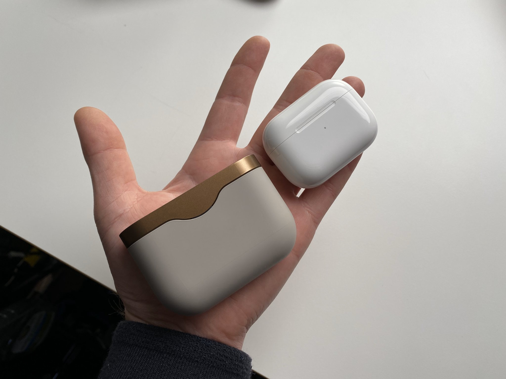
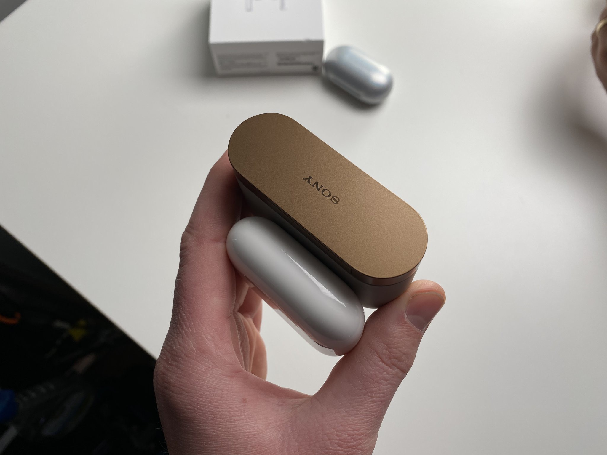

# Airpods Pro

Kadangi originaliasias Airpods ausines aš įsivertinau [tikrai teigiamai](./), tai neturėtų stebinti ir tai, jog į Airpods Pro aš taipogi žiūriu išties palankiai ir net planuoju upgrade'ą į jas. Bet apie viską iš eilės.

Kaip ir rašiau praėjusiame straipsnyje, kai 2016-ųjų pabaigoje buvo pristatytos pirmosios kartos Apple bevielės ausinės, kito išties sulyginamo produkto rinkoje kaip ir nebuvo. Ne, nekalbu apie jokią iPhone lygio "revoliuciją" - neblogų bevielių ausinių rinkoje tikrai netrūko ir iki tol. Tačiau tuo metu rinktis buvo galima arba iš kiek kitokio formos faktoriaus ausinių \(neckband'ai ar ausis apgaubiantys headband'ai\), arba iš išties gerokai brangesnių sprendimų iš rimtų audio gamintojų \(Klipsch, Audio-Technica, Sennheiser, B&O\), arba iš panašių produktų, pasižyminčių ženkliai prastesne baterija ir gerokai didesniu case'u \(Samsung'o Galaxy Buds\). Taigi, Airpods būdamos tokios mažytės, turinčios visai adekvačią bevielių ausinių kainą, pasižyminčios puikia baterija ir skambėdamos OK, išties greitai atrado savo nišą. Pridėkime Apple "mados faktorių" ir produktas tapo taip gerai parduodamu, jog net mūsų sostinės gatvėse nebegali prasieiti neprasilenkęs su Airpods'ų savininku.

Tačiau nuo jų pasirodymo konkurencija vietoje taipogi nestovėjo. Per dvejerius metus, kol pirmasis Apple ausinių atnaujinimas buvo tik bevielio krovimo korpusas, be krūvos kiniškų klonų atsirado ir daugiau tokio pobūdžio gaminių iš kitų žinomų gamintojų, lenkenčių šias ausines tiek ir baterija, tiek ir garso kokybe. Tad Airpods'us, neturinčius nė pasyvios garso izoliacijos, rekomenduoti pradėjo darytis vis labiau sudėtinga. Iš visų konkurentų stipriausiu tapo [Sony WF-1000XM3](https://www.sony.com/electronics/truly-wireless/wf-1000xm3) ir visai nesunku suprasti kodėl: puikus triukšmų blokavimas, greitasis įkrovimas, 6 valandas vienu įkrovimu \(su išjungtu ANC - 8!\), viso net iki 32h laikanti baterija, na ir žinoma - Sony ir toliau išlaiko savo solidžios garso kokybės reputaciją. Visa galva aukščiau už abiejų kartų Airpods. 

Tačiau dabar sulaukėme [Airpods Pro](https://www.apple.com/airpods-pro/). Taip, galbūt Sony vis vien vis dar laimi šiek tiek geresne garso kokybe \(pasakyti kol kas vis dar sunku, nes dabartinės pirmosios apžvalgos labai prieštaringos ir jei vienosios teigia, jog Airpods Pro garso kokybė prilyginama ar net ir geresnė, tai kitos apžvalgos teigia priešingai - kad jos skamba tik vos geriau, nei senieji Airpods ir Sony vis vien groja pastebimai geriau\), ko gero Sony vis dar turi šiek tiek geresnį garso blokavimą, tačiau manau, kad Airpods visgi yra geresnis produktas. Kodėl?

Pirmiausia GERAS produktas nebūtinai yra pats geriausias. Geras produktas turi būti kompetentingai geras visais atžvilgiais ir neturėti išties rimtų trūkumų. Šios WF ausinės universaliai giriamos už garso kokybę ir triukšmo izoliavimą, tačiau: 1\) Ryšys nėra itin stabilus ir garso signalas kartais trūkinėja ar išvis pametamas. 2\) Ausines naudojant su keliais įrenginiais kiekvieną kartą norint persijungti tenka kartoti poravimo procesą. 3\) Mikrofono kokybė išties nuvilianti. Kai kurie ausinių savininkai teigia, jog geriau kompanija mikrofono tuomet iš viso būtų atsisakiusi. 4\) Na ir galiausiai - case'o dydis:

|  |  |
| :---: | :---: |
|  |  |

Manau, kad būtent šis, paskutinis point'as, yra ne inkrementinis, o išties esminis, svarstyklių rodyklę į Airpods pusę persveriantis pranašumas. Iš esmės niekas kompaktiškų ausinių nesirenka dėl jų garso kokybės. \#1 priežastis kodėl žmonės išvis perka bevielius in-ear'us yra jų patogumas. Kai ausinių case'as yra su dydžiu, kaip floss siūlo dėžutė, kišenėje jos yra tiesiog nepastebimos. Apie jas nereikia galvoti, gali turėti jas su savimi visur ir visada. Tad turint omenyje šios konkrečios produktų nišos tikslą ir lyginti produktus tarpusavyje reikėtų atsižvelgiant į tai. Sony dėžutės dydis visgi prasilenkia su komfortabilia kasdieninio nešiojimosi kartu riba ir jų nesinorėtų nuolatos laikyti kelnių kišenėje. Kiekvieną kartą atsisėdus norėtųsi case'ą išsitraukti ir pasidėti ant stalo. Tokias ausines kur kas patogiau nešiotis striukės, švarko kišenėje, įsimesti į kuprinę ar rankinuką ar tiesiog palikti automobilyje ar sportiniame krepšyje. Vadinasi apie jas jau tenka galvoti, reikia jas persidėti, norint jas pasiekti reikia daugiau pastangų ir tikėtina, jog nesinešiosi jų visuomet su savimi. O tai ir yra fundamentalus skirtumas.

Tad Airpods Pro gali turėti, nors ir 20% prastesnį garsą, garso izoliavimą, bei prastesnę bateriją, bet įgyjusios atsparumą vandeniui ir garso izoliaciją, jos nebeturi akivaizdžių trūkumų ir yra išbalansuotai geras produktas. Kitaip tariant "great all around". O tai ir yra mano pagrindinis Airpods Pro argumentas:   
geros specifikacijos, dėmesys į usability ir dizainą visada yra &gt; nei tiesiog pačios geriausios specifikacijos rinkoje.

Tikiu, jog Sony neatsiliks ir pamatysime atnaujintą variantą, kuris galbūt visgi gan ženkliai aplenks Airpods'us, bet iki kol taip nutiks, Airpods Pro definitely gulės mano kišenėje.

