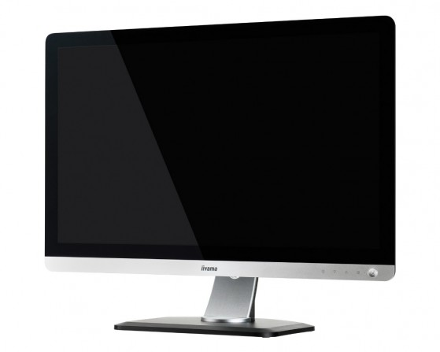
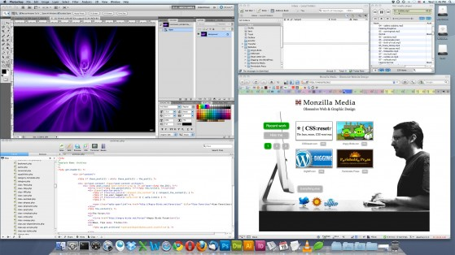
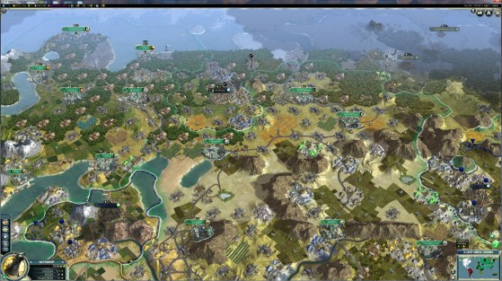
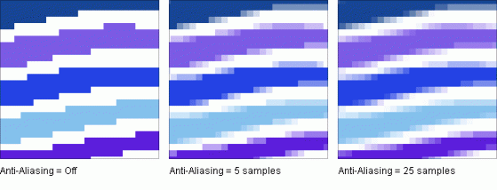

# 1440p prieš 120Hz monitorių

Savo tinklaraštyje visada rašau apie tai kuom labiausiai domiuosiu tuo metu. Ar tai būtų dienoraščio tipo prisiminimai, pasvarstymai ar tai reddit’o istorijos, kino filmai, IT. Paskutiniosiomis dienomis mane labiausiai domino dvi temos: krokodilas ir pranašesi monitoriai. Krokodilas, tai vienas labiausiai kenksmingų narkotikų, kokie tik yra buvę \(jei apie jį dar nežinot, tai geriau ir nesidomėkit – that’s for sure\), pūdantis žmogų iš vidaus, tad gal geriau pagalbėkim apie monitorius ;\)

Taigi, kai stacionarių kompiuterių monitoriams 1080p raiška tapo įprasta, visai nestebina, kad tech entuziastai pradeda žvalgytis į pranašesnius ekranus. Iš [Steam’o statistikos](http://images.anandtech.com/doci/6985/20130528%201440p%20gamers.png) galima matyti, kad nors FullHD vis dar yra de facto standartas su savo daugiau nei 30% žaidžiančiųjų, tačiau visgi susidaro ir apie 4% visų žaidėjų tuinčius setup’us VIRŠ 1080p. Atsižvelgiant, kad statistika apima apie 4,6 milijono Steam’o vartotojų, tai gaunam ~200 000 entuziastų, kas nėra tiek jau mažai. Taipogi galime pastebėti, kad kai kalba prasideda apie didesnes nei 1080p rezoliucijas, tai labiausiai dominuoja 4 dydžiai: **1920×1200** \(kas yra mažumėle daugiau vertikaliai apimantis \(16:10\) atitikmuo FullHD variantui\(16:9\)\), tuomet **2560×1080**, šio standarto 16:10 atitikmuo **2560×1600**, bei galiausiai **5760×1080** kas yra triple fullhd monitor setup’as.

### **Kam rūpi ekrano rezoliucijos?**

Rezoliucijas galima nusakyti dviem dydžiais – taškų skaičius aukštyje ir plotyje, ko pasekoje ir turime pvz 1920×1080, kas reiškia, kad yra 1920 mažų taškelių į ekrano ilgį ir 1080 į aukštį; beigi jų pasiskirstymas plote matuojamas PPI \(pikselių kiekis vienam coliui\). Labiausiai savo PPI gali didžiuotis dabartiniai mobilieji telefonai. Sąlyginai mažuose 5 colių ekranuose sutalpinantys 1080p kokybės ekranus, ko pasekoje PPI šie mažyliai turi po 320 ir daugiau. Atsižvelgiant, kad mes juo laikome apie 30 cm atstumu nuo akies, toks PPI kiekis reiškia, jog žmogaus akis nebesugeba išsikirti atskirų pavienių taškelių. Mūsų 50 colių plazminiai ir lediniai telikai kabantys ant sienos turi tą patį taškelių kiekį, tas pats 1080p, tačiau vietoj to, kad jį paskirstytų 5 coliuose, paskirsto 50-tyje, kas reiškia, kad atitinkamas vienas taškelis ir yra dešimt kartų didesnis, nei jo brolis telefone. Ten PPI būna pvz vos 50. Atrodo prastai ir jei prieitumėte prie pat teliko, tai ištikrųjų galima kuo puikiausiai įžiūrėti atskirus segmentus, tačiau šiuo atveju viskas yra ok, nes mes sėdime kelių metrų atstumu nuo televizoriaus ir tų pavienių pikselių mūsų akis papraščiausiai nemato. Kompiuterio ekranai tuo tarpu randasi gerookai arčiau mūsų, o ir atvaizduojami smulkūs elementai, kaip kad tekstas, tad šiems ekranams reikalingas didelis tikslumas, kuo mažesnis taškeliai tam ryškumui išgauti, tad kitaip tariant – raiška tiktai svarbi. Juo labiau tai galioja nešiojamiesiems kompiuteriams. Jei nuo monitoriaus mes sėdim per gerą pusę metro, tai nešiojamieji neretai atsiduria mum ant pilvo ant ar kelių ar patys prilimpam kone visai prie ekrano ir būnam tikrai arčiau. Dėl šios priežasties asmeniškai man pasidarė tikrai gan nemalonu, atgrąsu naudotis notebook’ais su dabar gan popular vidutiniokų rezuliucija 1366×768, kurioje net tie patys Windows atrodo kreivai. Tai ne tik technologiniai epitetai pasimaivyti, kad va pas tave skaičiukai didesni. Kuo rezoliucija didesnė, tuo dailesnės, sklandesnės, bei detalesnės kraštinės, smulkios detalės, kampai, tuo visas vaizdas atrodo kokybiškiau. Šituo arkliuku labai gerai joja Apple, kuri savo aukštos raiškos ekranams sugalvojo atskirą pavadinimą – retina ir kurį turi jau ko ne visi Apple produktai išskyrus iPad Mini \(tačiau beveik net neabejoju, kad jo antroji versija taipogi susilauks pastarosios džiaugsmo\).

### **Kodėl 1440p?**

Iš temos matote, kad pasirinkau kalbėti konkrečiai apie **1440p** \(dar kartais reklamuojamas, kaip **2K HD** ar **WQHD**\). Kodėl? Visgi yra gi tiek ir 1600p, tiek ir žmonės kalba ir apie pirmuosius 4K monitorius. Atsakyti galima paprastai: [ASUS PQ321Q](http://www.amazon.com/ASUS-PQ321Q-31-5-Inch-4K-Monitor/dp/B00DJ4BIKA) – vienas iš pirmesnių 4K monitorių šiuo metu kainuoja 3500$ \(kas yra netoli 9 000 Lt\) – tad manau klausimas su 4K daugeliui atsakytas… Kas liečia 1600p – šis 16:10 įstrižainės santykis yra puikus, tačiau jo nauda priklauso nuo to ką veikiate prie kompiuterio. 16:10 labai puikiai tinka darbui su programomis, ypač kas liečia video/foto redagavimą, 3D modeliavimą, braižymą ar net tam pačiam naršymui internete, nes tokiu atveju gaunate daugiau vertikalaus ploto lyginant su 1440p ir tiesiog galima apimti daugiau, tačiau nėra toks jau puikus dalykas, kai kalba pasisuka apie filmų žiūrėjimą ir kompiuterinius žaidimus. Žiūrint kino filmus jums bus tiesiog pateikiamos pastebimai platesnės juodos juostos video viršuje ir apačioje, tad iš esmės papildomas atvaizdavimo plotas šiuo atveju neduoda jokio, nes šis plotas tiesiog neišnaudojamas. Kompiuteriniai žaidimai, kaip bebūtų, dažniausiai jau turi pritaikymą tokiam ekrano įstrižainės santykiui \(tačiau vėlgi – ne visi\) ir problemų kilti neturėtų, tačiau problema atsiranda žaidžiant senesnius žaidimus – gali tekti susidurti su tomis pačiomis juodomis juostomis geriausiu atveju arba nepagarbiu ekrano ištampymu – prastesniu. Na bet ko gero svarbiausias argumentas – kaina. Nors 1600p apgalvojus kompromisus yra gan puikus variantas, tačiau pigiausias 1600p monitorius nors ir nėra tos velniškai brangus, kaip, kad 4K, tačiau visvien kainuoja bent dvigubai brangiau, nei vidutiniokas su 1440p. Taigi 2K standartas gaunasi sweet spot jei jau nusprendėte žengti žingsnelį pirmyn.

Taipogi, kai diskusija eina apie 1080p vs 1440p, žinoma daug papraščiau, lengviau ir pigiau yra pasirinkti tiesiog 1080p ir nesukti sau galvos. Bėda ta, kad manau, kad 1080p kompiuterių ekranuose tinka nebent jei kalba eina apie 25 colius ir mažiau. Jei norite didesnio ekrano, tarkime 27 colių, tai be 1440 – niekaip, nes elementariai sėdėdami prie tokios įstrižainės, tačiau tik FullHD ekrano vėlgi pradėsite matyti atskirus pikselius, panašiai, kaip kad mano pasakotam teliko atveju. Netenkate tikslumo ir detalumo, o tai jau yra nemalonu.

### **1440 privalumai**

Išsiaiškinom, kodėl konkrečiai 1440p. Toliau panagrinėkime kokie tokio ekrano privalumai. Žinoma pagrindinis ir esminis – suteikiamas plotas. Jei tiksliau: 3 686 400 pikselių prieš 2 073 600, kas yra 75% padidėjimas nuo FullHD. Ką tai reiškia? Leiskite paklausti kokiu monitoriu dabar naudojatės? Gan tikėtina, kad tarpe tarp 20-23 colių. Taigi, 1440p rezoliucija suteikia galimybę viename ekrane sutalpinti daugiau, nei dviejuose 23 colių 1080p monitoriuose! Jei kada naudojotės 27 colių iMac’u, tai tada patys patyrėte, ką reiškia šios rezoliucijos. Lange kuo puikiausiai sutalpinsite 4-5 programas, kurias galima pilnavertiškai ir patogiai, be jokių kompromisų naudoti, jau nė nekalbu, kai dirbama didelio tikslumo reikalaujantys darbai, pvz braižymas sy autocad’u, kur galima modelį atsidaryti stambiu planu ir visvien turėti vietos išsidėlioti įrankių juostas neperdengiant pačio brėžinio.

Žinoma kitas superinis tokio ekrano pranašumas – geiminimas, kuris galima sakyti pakyla į laipteliu aukštyn, nes veikėjų modeliai tampa dar natūrelesni, tikroviškesni ar apimamas daug didesnis matymo laukas, kas išvis yra labai faina MOBA ar strateginių žaidimų atveju.

### **1440 trūkumai**

Tačiau kas turi privalumų – turi ir trūkumų. Pagrindinė 1440p problema – labai didelis vaizdo plokštės resursų šoktelėjimas. Logiška – reikia generuoti gerokai daugiau taškų – reiškia daug daugiau darbo. Jei įvardinti tiksliau: jums reikės net 30% daugiau resursų tam pačiam žaidimui paleisti tais pačiais nustatymais. Žmonės, kurie turi dviejų ar trijų metų senumo vaizdo plokštę iš esmės turi tik du variantus – arba dėtis antrą tokią pačią plokštę SLI režimu arba tiesiog atsišviežinti į kažką šiuolaikiško. Kas liečia apie kiek naujesnių plokščių savininkus, pvz, kaip mano turima GTX 670 – dauguma žaidimų vis dar galima žaisti ant Ultra nustatymų, tačiau jei 1080p variantu to dar nepasitaikydavo, tai 1440p visgi jau yra vienas kitas labiau resursams ištroškęs žaidimas, kuriem kartelę reiktų mažinti \(kaip pvz Witcher 2\) ir tektų ultra nustatymo jau atsisakyti. Taigi, norint džiaugtis 2K rezoliucija reikia  high-end’inės vaizdo plokštės. Iš esmės tai ir yra priežastis, kodėl šiai dienai 4K geiminimas iš esmės dar neįmanomas – pasiekti stabilų 60FPS \(kadrų skaičius per sekundę\) ant vidutinių resursų reikalaujančio žaidimo, prireikia net 4-ių nVidia Titan plokščių \(1000$ vienos kaina\).

The thing is, kad galima mažumėle susukčiauti ir šią problemą pabandyti apeiti net keliais būdais. Pirmasis ir labiausiai rekomenduotinas – mažinti arba visai nuimti AA \(anti-aliasing\) filtrą, kuris žaidimuose sumažina kampuotumą, kraštų aštrumą, suteikia blur efektą. Tokiose aukštose rezoliucijose taškai ir taip labai maži, tad detalumas praktiškai toks didelis, kad AA jei ir rekalingas, tai gan minimaliai. Kampai ir taip pakankamai dailūs. AA buvo neįtikėtinas, kai žaidėmė ant 1024×768, o kodėl dabar kas nors jungia 16x AA kai turi 1080p – man yra nesuprantama. Pasidarykis screen’us su 8x ir 16x ir pabandykit įžiūrėti skirtumą bent kokį… Taigi, ant 1440 daugumai žaidimų užtenka vos 2x AA ir vertės kėlimas ten iki 16x ar net 32x nebeduoda jokio įžiūrimo efekto, išskyrus žvėriškai krentantį jūsų FPS’ą. Tad jei GPU nesugeba sklandžiai patraukti 1440p – sumažinus ar visai išjungus AA, galimas daiktas, kad ištrauksite inkarą ir jūsų laivelis ims plaukti į priekį.

Kitas sprendimo būdas – mažinti rezoliucijas. Žinoma, labiausiai logiška būtų persijungti į tą patį 1080p ir smagiai sau žaisti be parkių. Tačiau nėra taip viskas paprasta. Nors tikrai taip – galime taip padaryti, tačiau neretu atveju vaizdas gali nedžiuginti. Problema ta, kad persijungus į 1080p režimą ant 1440p vienas to 1080p pikselis turėtų būti atvaizduojamas 1,77 pikseliu jūsų ekrane, kas fiziškai yra neįmanoma \(taškelis arba dega arba ne, negali degti tik dalis jo\). To pasekoje gaunasi, kad vietomis atvaizduojama po vieną, vietomis po du, tačiau taškelių vidurkis visumoj išsilygina. Tačiau tai suteikia žaidybinių elementų nelygumą, išsitampymą vietomis ir nors prie tokių rezoliucijų gali būti mažai pastebimos, tačiau kai kuriuos tai gali erzinti ar net gan smarkiai trukdyti. Kai kas vadina tai girtumo efektu. Šią problemą galima taipogi išspręsti, tačiau ne visiem tas sprendimas gali būti priimtinas – tereikia žaidimą paleisti windowed režimu. Žaidimas bus atidaromas lygiai 1920×1080 dydžio lange ir bus tvarkingas ir švarus, toks koks ir būtų bet kuriame FullHD monitoriuje, tiesiog ekrano kraštai lieka nenaudojami. Užmetus kokį juodą foną tai gali taip jau smarkiai netrugtyti, o atsižvelgiant į jūsų ekrano dydį, tai windowed langas nebūtų toks jau mažas ir galbūt visai puikiai galėtumėte žaisti. Tiesiog nevisi taip sugeba pilnai pasinerti į žaidimą.

Paskutinis problemos sprendimas taipogi susijęs su rezoliucijų mažinimu, tačiau vietoj mažinimo į 1080p galima rinktis tiesiog 720p, kuris puikiai draugauja su 1440p santykiu 4:1. Tai reiškia, kad vienas 720p vaizdo taškelis jūsų ekrane bus atvaizduojamas 4 taškais. Matmenys, žaidimo objektai lieka tokių dydžių, kokių ir priklauso, jokio netolygaus ištampymo, jokių artifaktų, tačiau žinoma nuo to krenta detalumo, ryškumo lygis. Tačiau sutaupius GPU syvus, galima bandyti detalumą kompensuoti smarkiai užkeliant minėtąjį AA, tačiau žinoma efektas tikrai nebus toks geras, kaip tiesiog žaidžiant ant 1080p native monitoriaus.

Baigiant su rezoliucijų problematikomis, kaip bebūtų išlieka nemažas trūkumas ir ta pati kaina. Jei visai normalų tokio pat dydžio, t.y. 27 colių FullHD ekraną nusipirksite už 700-900Lt, tai pigiausi 2K monitoriai prasideda nuo 1800Lt, kas matome yra dvigubai brangiau. 2K kainuoja 2x ;D

### **120Hz**

Išsiplėčiau apie rezoliucijas, o apie dažnius tiesą sakant pakalbėsiu labai trumpai. Eiliniam vartotojui, kuris pvz tik browsina internete daugiau 60Hz monitoriuje absoliučiai nereikia. Tai kam tada gaminami tokie monitoriai? Kam gi tokį rekomenduočiau? Iš esmės tam skirtos dvi publikos: 3D mėgėjai, bei competitive online gamers. Jeigu žaidžiate multiplayer FPS, jei žaidžiate profesionaliai, jums svarbiausias greitas mąstymas, pelės jautrumas, bei monitoriaus vėlinimas. Tokiems žmonėms stabilumas, sklandumas yra pirmiau už bet kokį tekstūrų detalumą. Žinoma minėta žaidimą jūsų kompiuteris tuo metu turi ir tempti daugiau, nei 120 FPS, nes jei sukatės tik ties 60-80 tai iš 120Hz monitoriaus nebūtų naudotos. Taigi, būtent tokie žmonės labai įvertina 120Hz pranašumus, kai žaidimas dirba it bitutė ir kursiorius ekrane juda neįtikėtinai minšktai. Žinoma, kad jį įvertinti jūsų akis visų pirma turi būti pakankamai jautri, kad tai fiksuoti, bei reikia laiko ir pripratimui. Kiekvieno žmogaus akis skirtinga ir jei esu girdėjęs atsiliepimų, kad skirtumas tarsi diena nuo nakties, tai lygiai taip pat esu girdėjęs atsiliepimų, kad prisėdus prie 120Hz nepastebėjo absoliučiai jokio skirtumo \(kai kurie žmonės ir CRT monitorių mirgėjimo nematydavo gi\). Tačiau dauguma visgi kalba, kad įpratus prie tokio monitoriaus – nauda jaučiasi ne tik varžymosi žaidimuose. Gerokai labiau įsiliejama į tokius žaidimus, kaip kad Dishonored, Bioshock ar Dirt.

Taipogi minusas su 120Hz, kad tokiuose ekranuose dažniausiai būna naudojamos gan prastokos TN matricos, ko pasekoje, monitorius gal ir spartus it velnias, tačiau spalvos pas jį nėra labai tikslios, gražios. Šiuo atveju 1440 smarkiai laimi, nes kiek teko susidurti, visuose juose dedamos IPS LED panelės, pasižyminčios eilinio vartotojo lūkeščius tikrai patenkinančia vaizdo kokybe.

### **Per daug teksto, neskaičiau**

1440p – paveikia ne tik žaidimus, bet ir visą naudojimasį kompiuteriu. Skirtas jei norite produktyvesnio darbo, daugiau sutalpinti ekrane, bei jei turite galingą vaizdo plokštę – pastebimai gražesniems žaidimam.

120Hz – jei profesionaliai žaidžiate šaudykles tinkle ir jums reikia greičio ir sklandumo.

Deja, deja šiuo metu realiai negalime turėti visko \(nebent norit turėti nepatikimą kinišką monitoriu su neaiškiomis veikimo perspektyvomis\), tad iš dviejų gėrių rinktis visgi reikia tik vieną. Man, kaip visokių Civ V ar Magicka žaidėjui kursoriaus judėjimo, bei vaizdo sukinėjimo sklandumas tikrai neturi įtakos, dėlto mane labiausiai ir domina 1440p a.k.a. 2K standartas.

