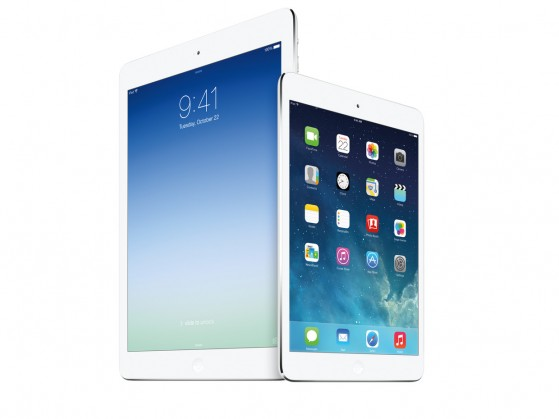

# Apie Apple Event’ą

Taigi, praūžė dar vienas ko gero daugiausiai dėmesio ir apkalbų sulaukiančios IT kompanijos _Apple_ renginys, kuriame pristatyti naujausi kompanijos gaminiai. Kas konkrečiai buvo atnaujinta labai plačiai nesiplėsiu, galit paskaityti štai [ten](http://www.theverge.com/2013/10/22/4866718/ipad-air-to-mac-pro-everything-you-need-to-know-apple-fall-event). Tačiau turiu kelis pastebėjimus iš renginio:

* Apple nebenaudojo žodžio „revolutionary“. Iš esmės puiku, nes „evolutionary“ tikrai nėra lygu „revolutionary“.
* Naujasis iPad’as bus parduodamas iškart vos po savaitės \(va ko reikia smarkiai pasimokyti Microsoft’ui, kuris pristato, tačiau pateikia rinkai tik po 9 mėnesių, per kuriuos visi jau ir užmiršt suspėja\). Mini tuo tarpu užsilaiko keliomis savaitėmis ilgiau ir pasirodys lapkričio pabaigoje.
* Naujas vardas: iPad Air. Teigiama, kad Air pavadinimas suteiktas, dėl lengvumo \(2 milimetrų storio sumažėjimas neatrodo reikšmingas, tačiau kartu su tuo atsikratyti 200g nuo svorio \(27%\)  jau yra ganėtinai ryškus ir pagirtinas atnaujinimas, ypač, kai kalba eina apie planšetes\), tačiau galbūt tai atveria duris kitais metais paleisti naują iPad’ų kategoriją ir taip supanašinant Macbook ir iPad linijas \(suprask: iPad Pro\)?
* Nustebino, kad Mini gavo ne A6, o A7 procesorių, tokį patį, kaip kad naujasis iPhone 5S. Tikėjausi, kad Mini iš esmės vilios pagrinde tik mažesniu formos faktoriumi, tačiau pastoviai atsiliks specifikacijose bent jau viena karta ir kurių norėdamas pirkėjas būtų priverstas pirkti brangesnyjį jo brolį. Šiuo atveju naujas iPad Mini su retina dabar yra visiškai identiškas pilno dydžio iPad’ui, tačiau su patrauklesniu nešiojimui dydžiu, mažesne kaina, bei didesnius PPI \(pikselių skaičius colyje\). Iš esmės rinkimasis dabar persikelia į dydį, o ne specifikacijas.
* Taipogi naujas iPad’as visgi be Touch ID. Ko gero ši naujovė palikta kito rudens atnaujinimui.
* Mini ištikro yra vos pastebimai storesnis ir sunkesnis, nei praėjusių metų modelis, bet žinoma tai nelabai kur buvo akcentuojama.
* Senasis, praeitų metų Minis niekur nedingsta \(nors lieka apribotas tik 16GB variantu\). Senasis variantas atpigintas 10%, tačiau naujasis brangesnis 20%. Daug, nes iki šiol visų iPad’ų kainos būdavo vienodos, tačiau pateisinama, kai pagalvoji, kad prietaisiukas peršoko iškart trimis kartomis į priekį.
* Tikėjausi, kad iPad’as jau bus nusikratęs 16GB varianto ir bazinis modelis prasidės nuo 32Gb. Tačiau to neįvyko ir Apple vis dar toliau juokingai brangiai apmokęstina didesnios talpos variantus, nes flash atmintis ištiesų yra pigi. Tai ir yra viena iš priežaščių, kodėl Apple mobilieji įrenginiai neturi atminties kortelių palaikymo.
* Peržiūrint atnaujintus Macbook’us, pastebėjau, kad Apple atsisveikina su DVD-ROM’ais ir ištiesų: užmetus akį į visą oficialų [naująjį line’up’ą](http://www.apple.com/mac/compare/notebooks.html), matosi, kad vienintelis Macbook’as vis dar turintis diskų įrenginį belieka senasis, 13 colių Macbook Pro be retinos \(senasis 15″ Macbook Pro nebeparduodamas, o atnaujintieji Pro – įrenginio jau nebeturi\).
* Daug kas stebisi ganėtinai neprotinga iPad 2 kaina \(400$ už trijų metų senumo specifikacijas\).  Trečios ir ketvirtos kartos iPad’ai sustabdyti, nebeparduodami ir užuot suteikus nuolaidą būtent jiems, daroma nuolaida jau išties morališkai pasenusiui modeliui. Atrodo išties kvailai, kai už dvigubai mažesnę kainą galima nusipirkti šiuometinius ir gerokai pranašesnius varžovus. Teigiama, kad jis vis dar labai gerai parduodamas ir dėlto paliekamas prekyboje \(oficiali versija\). Manau, kad ištiesų jis paliktas grynai marketingo tikslais. Kainos inkaras. Žmonės, norintys didelio iPad’o dabar turi du pasirinkimus iPad2 ir iPad Air. Pažiūrėję į iPad2 specifikacijas ir susidarę nuomonę, jie žvilgtelį į naująjį iPad’ą, kuris yra akivaiždžiai geresnis ir taip paskatinama išleisti 100$ daugiau, nes atrodo ne tokia jau didelė kaina už tokį smarkų patobulėjimą. Jei būtų lyginamas 4-tasis modelis su Air – tokį kainų skirtumą pateisinti būtų sunku ir vartotojas rinktųsi tiesiog pigesnį variantą, nuo ko kentėtų naujosios planšetės pardavimai. Lygiai dėl tokios pat priežasties pristačius iPhone 5s, senasis iPhone 5 buvo nutrauktas, kai tuo tarpu 4s toliau paliktas prekyboje.

Kokias galima padaryti išvadas?

* Iš esmės naujintis iš 3-čios ar 4-tos kartos iPad’o į Air kaip ir nėra tikslo: ekranas tas pats, procesoriaus pagreitėjimo gyvenimiškame naudojime net nepajusit, o vien dėl kitokio dizaino išties neverta.
* Tuo tarpu iPad mini man asmeniškai tampa nauju flagman’u, nes šis device’as iš esmės nebeturi jokių kompromisų ir siūlo tą patį, tik patogiau nešiotis, lengviau laikyti viena ranka, bei mažesne kaina.
* Androidininkai, bei šiaip taupantys šypteli: vėl lengvesnis, plonesnis ir greitesnis, tačiau nieko baisiai įspūdingo. Ir iš esmės jie teisūs, tačiau bendrai paėmus – renginys vykęs ir atnaujinimų netrūksta \(nuo Macbook’ų ir Mac Pro iki OS, bei iPad’ų iš esmės šiemet praleisti tik iPod’ai\).
* Nesistengiama konkuruoti kaina, net ir tas pats minis, kuris buvo, kaip „biudžetinis iPad“ – dabar brangesnis. Apple užsiaugino ir puikiai pažįsta savo vartotojus ir tai, kaip jie nori pirkti jų device’us. Pardavimai tuo tarpu skatinami nemokamu softu.
* Konkurencija iPad’ui kas metais vis sparčiai stiprėja. Pagrindinis iPad Mini konkurentas – Nexus 7 su FullHD ekranu, kainuoja vos ne dvigubai pigiau. Tačiau kaip bebūtų, reikia pripažinti, kad Mini turi aukštesnės kokybes medžiagas, geresnę bendrą [surinkimo kokybę](http://gizmodo.com/nexus-7-touch-problems-persist-despite-googles-fix-1238958581), didesnį ekraną su 4:3 įstrižainės santykiu \(kuris yra [priimtinesnis turinio vartojimui](http://i-cdn.phonearena.com/images/reviews/123247-image/Apple-iPad-mini-vs-Google-Nexus-7-001.jpg), nei Nexus’o 16:10\), bei žinoma nepalyginamai turtingesnę eko sistemą \(konkrečiai tablet specific programoms\). Ar šie pliusai jums atrodo verti 170$ didesnės kainos – jūsų požiūrio reikalas. Iš esmės už vieno iPad mini kainą galima nusipirkti Nexus 7 šiemet ir atsinaujintį jį į šviežesnį kitąmet… Kiekvienam savo prioritetai. Jei pagrindinis rinkimosi kriterijus kaina – tai pasirinkimo čia net nėra, bet asmeniškai pats gan rimtai galvoju apie savo Galaxy Tab’o iškeitimą į šį naująjį Mini…

