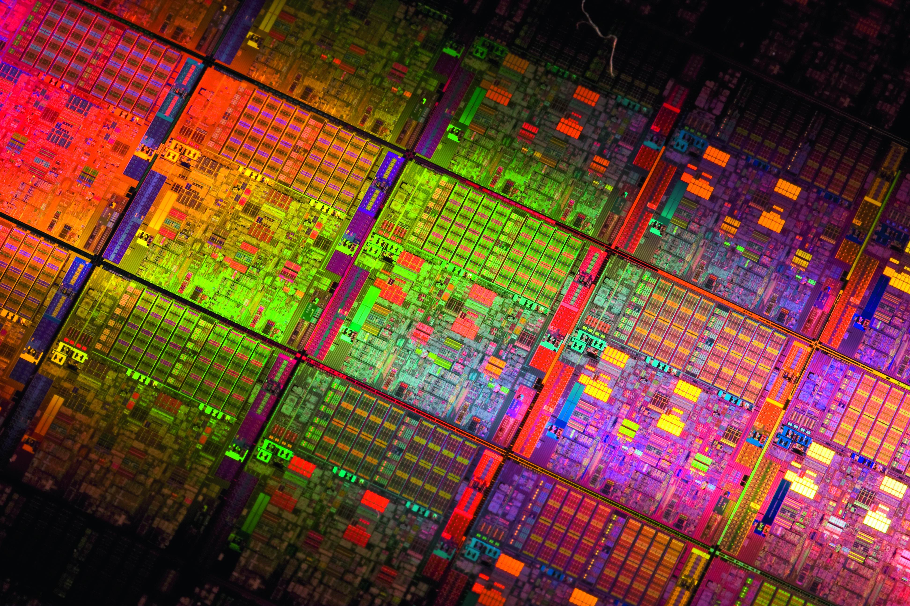
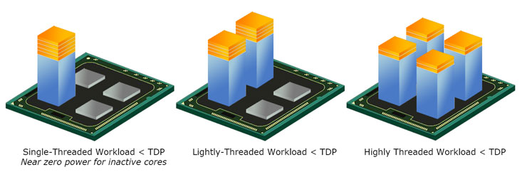
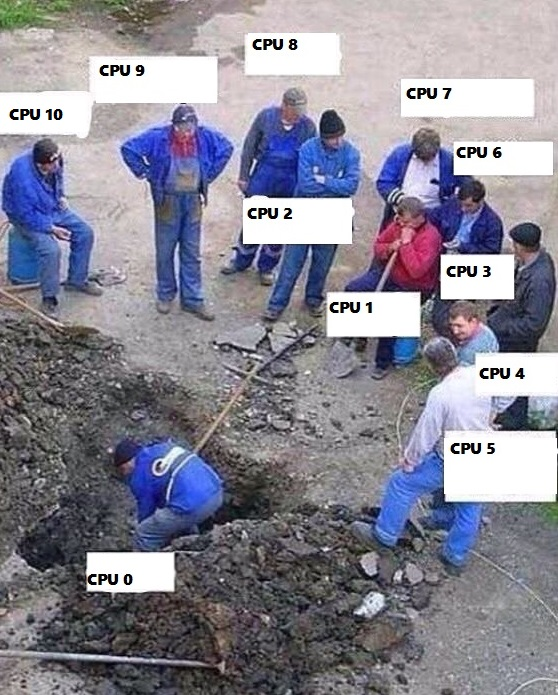

# Apie branduolius ir telefonus

Kartas nuo karto mėgstu pasiimti vieną, gan dažnai sutinkamą kompiuterijos temą, su kuria susiduria ko ne kiekvienas kompiuterio naudotojas, tačiau kuri yra mažumėle keblesnė, tikrai suprantama ne kiekvienam ir ją paaiškinti paprasčiau, bei suprantamai eiliniam kompiuterio naudotojui. Praeitą kartą viena iš tokių temų buvo video artifaktai, atsirandantys kompiuteriniuose žaidimuose ir apie tai, kaip šios problemos [yra sprendžiamos](http://reanimated.lt/nvidia-g-sync). Šį kartą mano akiratyje – procesorių branduoliai.

Kai prieš daugiau, kaip dešimtmetį pradėjo rastis pirmieji 2 branduolių procesoriai, žmonėms natūraliai kilo daug klausimų. Ar dviejų branduolių 1,6 Ghz taktiniu dažniu veikiantis procesorius yra geriau už vieno branduolio 3,2? Ar operacinės sistemos sugeba išnaudoti papildomus branduolius? O kaip dėl žaidimų? Ar programos neturi būti specialiai perrašomos, kad galėtu išnaudoti papildomus branduolius? Ir panašiai. Tai yra išties geri klausimai, tad mažumėle pasiaiškinkime.

Pagal tai, kaip jie yra suprojektuoti, kompiuteriai yra puikūs atlikti vienam konkrečiam darbui. Nori iš 100 milijonų skaičių atrinkti tik pirminius? Be problemų! Kompiuteris gali automatiškai sukti ratu tą pačia formulę vėl ir vėl ir dirbti, kaip vienas galingas skaičiuotuvas. Tačiau vos tik užsimanai, skaičiavimams prailgus, tuo pačiu kompiuteriu paklausyti dar ir muzikos – aparatiniu lygmeniu viskas pasidaro žymiai sudėtingiau.

Kad kompiuteriu būtų galima naudotis taip, kaip juo naudojamės mes, buvo sugalvota multitaskinimo technika, kai kiekvienam darbui skiriama dalelytė procesoriaus darbo laiko. Kitaip tariant procesorius plėšosi ir daro jau ne vieną, o keletą darbų vienu metu, kiekvienam skirdamas, tik mažą mažytę akimirką. Mėtosi tai prie vieno darbo, tai prie kito. Tai vyksta itin greitai, tūkstančius kartų per sekundę, dėlto kompiuterio naudotojui galėtų atrodyti, kad va, jis klausosi muzikos ir sėdi internete tuo pat metu, kai iš tiesų kompiuteris šokinėja tarp šių dviejų darbų pirmyn atgal. Truputėlis laiko skiria muzikos grojimui, šiek tiek duomenų užklausoms. Vėl grojimui, o tuomet internetinio puslapio atvaizdavimui. Operacinėse sistemose, tokiose, kaip Linux, MacOS ar Windows, pačioje jų gilumoje sukasi procesas, kuris yra atsakingas už tai, kurie procesai ir kokia tvarka gaus sekančią laisvą procesoriaus darbo laiko dalelytę. Šis procesas vadinamas sheduler.

Kai procesorius turi porą branduolių, šis procesas gali išskirstyti vieną darbą vienam branduoliui, o kitą jau kitam ir tokiu būdu juos abu vykdyti tuo pat metu, užuot itin dideliu greičiu šokinėjęs tarp vieno ir kito. Kai branduolių daugėja, šių atliekamų darbų vienu metu kiekis gali taipogi didėti.  Paprastas kasdieniškas pavyzdys: parsisiuntėte muzikinį albumą flac formatu, klausytis ant savo geros garso sistemos namuose, tačiau jūsų automobilio magnetola nepalaiko tokio formato ir norite susikonvertuoti šias dainas į patogųjį mp3. Šiuo atveju konvertavimo programa gali paskirti, jog kiekvienas kompiuterio branduolys užsiimtų atskiros dainos konvertavimu, tad keturių branduolių procesorius konvertuos 4 dainas tuo pat metu. Tai žymiai geriau, nei laukti pakol bus sukonvertuota viena, o tik tada bus imamasi antros. Verta pažymėti, kad procesoriaus branduoliai padidina atliekamų darbų krūvį, tačiau nepaspartina individualaus darbo atlikimo greičio. Kitaip tariant, tai galima sulyginti su keliu turinčiu dvi juostas, bei keliu, turinčiu 4: automobilių judėti gali daugiau, tačiau greičio limitas išlieka tas pats.

Šios technologijos atsiradimas įtakojo ir tai, kad šiuolaikiniuose kompiuteriuose, jei kuri nors programa užkimba, galima ją tiesiog išjungti ir toliau dirbti, lyg niekur nieko, nors dar ne taip senai reikėdavo taikstytis su tuo, kad gan dažnokai kompiuteriai tiesiog užkibdavo visiškai ir net kursoriaus ekrane pajudinti nebe išeidavo ir padėdavo nebent tik kompiuterio maitinimo išjungimas. Tas pats principas galioja mano mėgiamoje, bet tuo pačiu metu ir nekenčiamoje naršyklėje Chrome: kiekvienas atidarytas skirtukas, sukasi ant atskiro proceso. Tai suteikia laisvę: užkibus vienam, nesutrinka visos likusios naršyklės darbas,  o tai yra išties didelis privalumas. Tačiau iš to atsiranda ir [kitokių problemų](http://i.imgur.com/bhfYx6R.jpg).

Tad, kaip jau supratote, sheduler išties gerai tvarkosi skirstydamas skirtingus darbus. Tačiau procesorius negali išskirstyti individualios užduoties. O ar tikrai?

Kai kurie darbai pagal savo natūrą susideda iš keleto etapų ir sekantys etapai priklauso nuo pirmųjų etapų rezultatų. Vėlgi pavyzdys: tarkime susiruošėte kepti pyragą. Pirmiausia jums reikia išplakti miltus, kiaušinius ir kitus produktus ir paruošti tešlą. Tol, kol to nepadarėte, negalite šauti į orkaitę. Tai, kad virtuvėje turėsite du šefus, dar nereiškia, kad pyragą iškepsite greičiau. Du šefai tos pačios tešlos nepamaišys, tad antrasis turės tiesiog stebėti ir laukti, kol pirmasis baigs savo darbą. Jį galima panaudoti nebent kam nors kitam, pvz jis gali pradėti ruošti kitą patiekalą. Tokios, nuo eiliškumo priklausančios užduotys negauna naudos iš papildomų darbininkų \(branduolių\), vis vien visą darbą daro vienas branduolys ir nesvarbu, kad jų sistemoje yra 4 ar 12.

Tačiau ne visi darbai yra tokie. Dauguma užduočių, kurias atlieka kompiuteris, visgi gali būti išskaidytos į smulkesnes užduotis. Pirminis procesas gali sukurti dar vieną papildomą procesą ir dalį darbo atiduoti jam. Pvz., naudojant ankstesnį pavyzdį su pirminiais skaičiais: vienas procesas gali praskenuoti pirmus 50 milijonų skaičių, ieškodamas pirminių, o antras tuo pat metu skenuoti jau antrąjį 50 milijonų. Bet kad tai veiktų, programos turi būti specialiai tam pritaikytos, kitaip tariant programos kūrėjai turi būti numatę ir iš anksto aprašę darbų skirstymą į smulkesnes užduotis. Iš čia ir atsiranda gan dažnai prie procesorių sutinkami terminai „single-thread“, bei „multi-thread“. Iš esmės jie reiškia, kad programa sukurta tik su viena vykdomąja programa \(viena gija\) arba su keliomis, kurios kiekviena gali atskirai gauti procesoriaus darbo laiko. Tad vienos gijos programa negaus jokio pranašumo vykdoma ant multi-branduolinio procesoriaus, kai tuo tarpu multi-thread programa – gaus.

Taigi, kas liečia programas – visgi dauguma žmonių dar naudojasi dviejų branduolių procesoriais, gerokai mažesnė dalis turi 4-turis ir tik maža, mažytė dalis naudotojų yra su 8 ar daugiau branduolių, tad nenuostabu, kad programų ir žaidimų kūrėjai labiausiai taikosi į daugumą. Žinoma, yra programų, kurios išties sugeba efektyviai išnaudoti visus jūsų procesoriaus darbininkėlius ir dažniausiai tai būna labai specializuotos, didelius ir sunkius darbus, kaip tarkime video redagavimas, atliekančios programos. Tačiau visgi dauguma programų sukurtos daug elementariau, nes arba to pilnai užtenka arba nelabai apsimoka apsisunkinti sau darbą dėl itin mažo vartotojų rato, arba kitaip tariant, įdėti daug resursų, dėl mažo rezultato. Iš to ir atsiranda taisyklė, kad single-thread sparta procesorių testuose yra gerokai svarbesnis rodiklis, nei multi-thread, nes single-thread aplikacijas naudojate kur kas dažniau. Ypač, tai galioja renkantis procesorių skirtą žaidimų kompiuteriams. Žaidimai tik dabar pradeda išmokti dirbti multi-thread režimu ir vis vien vis dar yra vos keli pavyzdžiai, kurie sugebėtų panaudoti daugiau, nei 4 branduolius.

Kitaip tariant yra geriau turėti mažiau, bet spartesnių branduolių, nei daugiau lėtesnių. Būtent dėl šios priežasties labiau į biudžetinį segmentą susikoncentravusi kompanija AMD smarkiai atsilieka nuo Intel ir niekaip nesugeba jų prisivyti ir praktiškai vienareikšmiškai Intel visada tinkamesni žaidimams, nes jų procesoriai turi geresnę single-thread spartą.

### Telefonai

Jeigu situacija pretty much aiški personaliniuose kompiuteriuose, visi branduoliai vienodi ir tiesiog dirba skirtingus darbus, kurių kompiuteriuose netrūksta, tai ar lygiai taip yra ir su mobiliaisiais telefonais? Prieš penkerius metus pradėjo rastis pirmieji telefonai su dviem branduoliais, o dabar jūsų rageliuose jau nieko nestebina 4, ar net 8 branduolių procesoriai. Bet ar tikrai reikia 8 branduolių išmaniajame? Filmų konvertavimų ar 3D renderinimų gi nesiruošiam atlikinėti telefonuose, o juk kiekvienam branduoliui reikia energijos, tad tokie procesoriai turėtų ryte ją ryti?

Paimkime Android operacinę sistemą. Iš tikrųjų šioje sistemoje vyksta išties nemažai: paišomos animacijos, atliekami duomenų sinchronizavimai, naujinami widget’ai, palaikomas ryšys su bokštais ir t.t., tad galime numanyti, kad Android sistema susirenka keleto branduolių privalumus iškarto, net nepaisant to ar apps’ams jie reikalingi ar ne. Tad turėti kelis branduolius telefone yra išties logiška. O kaip su 8? Mano iki šiol turėtas ir mylėtas už savo programinį švarumą Nexus 5 \(kurį visgi iškeičiau į LG G3 ir labai tuo džiaugiuosi\), turi 4 branduolius, tačiau buvo galima pastebėti, kad jis kuo puikiausiai susitvarko su bet kokiomis jam paduodamomis užduotimis ir ne tik, kad niekada nepristabdo, tačiau ir lenkia 8 branduoliais besigiriančius telefonų modelius. Koks tada tikslas?

Atsakymas tas, kad ne taip, kaip stacionariuose kompiuteriuose, telefoniniuose procesoriuose, kurie turi daugiau, nei 4 branduolius, dažniausiai naudojami mažiausiai du skirtingi dizainai ir ne visi branduoliai yra lygūs. Vieni branduoliai yra našūs, o kai kurie gerokai silpnesni, tačiau labai energiškai efektyvūs. Tokiuose procesoriuose darbai suskirstomi išmaniai ir tos užduotys, kurioms reikia daug galios, atiduodamos galingiems darbininkams, kurie darbą atlieka greitai ir tuomet gali išsijungti ir neeikvoti energijos, o kiti, mažiau reiklūs darbai, kaip tarkime el.pašto sinchronizacija, kuri užtrunka, nes reikia sulaukti, kol baigs atkeliauti visi duomenų paketai, o jų priiminėjimas tikrai nėra sudėtingas, gali būti atliekami silpnųjų, kurie net ir veikdami ilgai, sunaudoja išties mažai energijos, kuri yra tokia svarbi nešiojamuose įrenginiuose. Kitaip tariant 8 branduoliai telefonuose yra orientuoti ne į našumą, o būtent į energijos taupymą. Žinoma, tai nereiškia, kad toks procesorius yra lėtas ir telefonas dėlto pristabdys, tačiau 2 ar 4 branduolių atitikmenys būna spartesni. Žinoma, jei paleistumėte sintetinius testus, kurie turėtų parodyti jūsų telefono spartą, aštuonių branduolių procesoriai visada nugalės, bet tai yra dėlto, kad šie testai yra taip parašyti, jog uždeda milžinišką pliusą branduoliams ir išpučia rezultatus, tačiau neatspindi realaus naudojimo. Apie tai plačiau galima pasiskaityti [čia](http://www.androidauthority.com/beware-of-the-benchmarks-604989/).

### Daugiau branduolių = geriau?

Visgi ne viskas procesoriuose susiveda tik į branduolius. Procesoriaus visuminė sparta susideda iš daugybės elementų ir dažnis, bei branduolių kiekis yra tik keli iš jų. Be jų, procesoriui visgi ypatingai svarbu ir atminties laidumas, vėla, gijų efektyvumas, instrukcijų palaikymas ir kita. Visa tai nusako kokį kiekį skaičiavimų procesorius sugeba atlikti per vieną ciklą \(intruction per cycle – IPC\). Tad nesvarbu, kad jūsų procesorius suksis, nors ir 5Ghz taktiniu dažniu, jei vieno ciklo metu, jis visgi tesugeba mažai ką nuveikti. Tai yra viena iš priežasčių, kodėl kadaise monstriuku buvęs 10 metų senumo 3,2Ghz procesorius gauna į vienus vartus nuo dabartinio 1,4Ghz procesoriaus, kurį dabar galima sutikti biudžetiniame laptope.

Grįžtam prie telefonų temos. Tuo metu, kai kiekvienas iš didžiųjų telefonų gamintojų šiuo metu reklamuoja savo 8-iais branduoliais padabintus telefonus, kompanija Apple išleidžia iPhone 6, kuris turėdamas viso labo du branduolius, kurie maksimaliai pasiekia tik 1,3Ghz dažnį, aplenkia bet kokį kitą mobilųjį CPU, kaip kad 8 branduolių Snapdragon 805, besisukantį net 2,7Ghz dažniu ar dabartinį absoliutų Android spartos karalių Exynos 7, kuris puošia arčiausiai prie Apple priartėjusį telefoną Samsung Galaxy S6, bei kuris sukasi ant 2,1Ghz. Kaip taip gali būti? Ar iOS yra tokia efektyvi ir nereikli? Ne, tiesiog ši kompanija pasirinko teisingus sprendimus \(bei kompromisus\) kurdami savo procesorius, kai tuo tarpu Android pasaulyje prie megapikselių karo prisijungė ir dar vienas vartotojus klaidingais pažadais viliojantis – branduolių karas. Apple, kuri pradėjo kurti savo nuosavus procesorius nuo 2011-tųjų metų, tikriausiai ėmėsi to todėl, kad jai netiko nei vieno kito gamintojo pateikiami variantai ir savo dizaine susikoncentravo būtent į IPC. Žinoma, IPC neskamba gerai reklaminėse brošiūrose, vartotojai to nesupranta, o štai branduoliai skamba kur kas galingiau, suprantamiau \(net ir durniui aišku, kad 8 yra dvigubai geriau, nei 4\) ir seksualiau, dėlto kompanijos, kaip Qualcomm ar MediaTek ir pametė savo fokusą ir didina branduolių kiekį, kuris nėra toks svarbus.

Tiek šį kartą apie branduolius kompiuteriuose, beigi telefonuose. Tikiuosi, kad dabar mažumėle aiškiau ir sužinojote kažką naujo. Ir galbūt jau nebešauksite, jog 8 branduoliai telefone yra visiškas išsipisinėjimas ;\)

