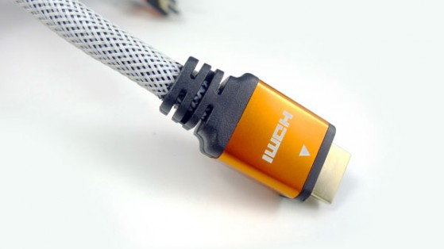
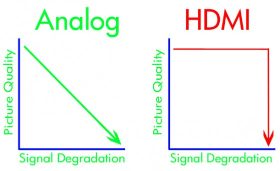

# Apie HDMI

Vakar kaip tik teko užmatyti diskusiją, kurioje žmonės kalbėjo apie didžiausias visų laikų apgavystes. Buvo apkalbėta nuo piniginių manipuliacijų, dėl kurių prie bankroto ribos galima privesti visą šalį iki deimantų, apie kuriuos aš ir turiu savo nuomonę. Taipogi buvo paminėti ir HDMI laidai ir prisiminiau, kad apie juos aš kaip tik ketinau ir parašyti.

Visada yra tokių žmonių, kurie perka tik tai kas yra geriausia. Nieko dėlto ir nesakau, tikrai geriau vieną kartą nusipirkti brangesnį, tačiau gerą daiktą, nei terliotis ir gadintis nervus su pigiais ir visumoje sumokėti dvigubai. Tačiau tikrai ne visada tai kas yra brangiausia yra ir geriausia. Galime matyti žmones, kurie prie savo hi-fi įrangos būna perka jungiamuosius laidus, kainuojančius tūkstančius, gaunamas rezultato pagerėjimas galbūt net nebūna girdimas žmogaus ausiai, tačiau tokie žmonės įsitikinę ir bando įtikinti kitus, kad „dabar groja daug gražiau“. Gaunasi toks placebo efektas, nes išleidęs tiek pinigų nenori pripažinti, kad galbūt juos išleidai be reikalo ir vaizdas arba garsas stebuklingai tampa lyg ir švaresnis, lyg ir ryškesnis, nei prieš tai buvęs.

Na gerai, palikime analoginę elektroniką vietoje, visgi tai yra elementari fizika ir taip, su kokybišku ir atitinkamai brangiu laidu signalas išties gali ir dažnu atveju išties ir būna geresnis. Naudojamos geresnes charakteristikas turinčios medžiagos, yra pasirūpinta kokybiškesniu ekranavimu, t.y. apsauga nuo išorinių iškraipymų ir pan. Tiesiog norėjau pastebėti, kad gaunamas galutinis pagerėjimas ne visada būna vertas tos smarkiai pakeltos kainos. Ir vat būtent su jungiamaisiais laidais gamintojai yra labai mėgėjai scaminti ir apgaudinėti. Laidų kainos būna smarkiai išpūstos ir dažnu atveju moki už bala žino ką. Už marketinius triukus. Vienas ir ryškesnių pavyzdžių ir yra HDMI kabeliai.

Atsidarius vieną iš populiarių kompiuterinės technikos internetinių katalogų, galima rasti jog HDMI kabeliukus šiuo metu Lietuvoje galima nusipirkti ne tik nuo 5 iki kelių šimtų litų už vienetą, bet yra net ir 2000Lt kainuojančių variantų. Ir žinoma sandėlininkai, konsultantai ir be abejo pačių laidų gamintojai stengiasi įtikinti, kad pigūs laidai bus nekokybiški, gali iškraipyti vaizdą, perteikti ne tokias tikroviškas spalvas, galbūt, kad net ir rezoliucija jų bus ne tokia aukšta ir pan. Na, o štai nusipirkite kabeliuką už kelis šimtus litų ir vat ten bus „super natūralios spalvos“, auksiniai antgaliai stiprins signalą ir pan. Visa tai yra totalus bullshit ir iš tikrųjų jie meluoja. Supraskit ir juos, su laidais galima išties neblogai pasipelnyti. Pasipelnyti iš jūsų nežinojimo :j Iš tikro uždarbis iš kabeliukų yra toks geras, kad praktiškai kiekvienas gamintojas turi savo liniją „high-end HDMI“ kabeliukų tikėdamasis, kad pirkėjas pasirinks būtent jų, ten 250Lt kainuojantį variantą, o ne 30-50Lt kainuojančią alternatyvą, kuri realiai duoda tą patį rezultatą. Tuo tikslu parduotuvėse galima pastebėti ištisus plakatus ar stendus, kuriuose toks kabelis prapjautas ir lyginamas su paprastu HDMI kabeliuku ir balamutijamos smegenėlės, kaip čia viskas yra geriau ir kaip jūsų vaizdas stebūklingai pagerės.

Realijos yra tokios, kad kabelių gamintojai vis dar žaidžia prie analoginės technikos pripratusių žmonių įsitikinimais, kai atrodo mažesnės varžos, mažesnį pasipriešinimą turintis kabelis, su geresniu ekranavimu ir pan iškarto turi gerokai mažesnį signalo degradavimą. HDMI kabelis skirtas ne analoginiui signalui, kuriam tai turi kažkiek įtakos, o skaitmeniniui, kuris susideda vien iš vienetukų ir nuliukų. Šis signalas neturi jokių pereinamų būsenų, nereikia daryti jokio signalo tiesinimo ir susidarę iškraipymai labai puikiai korektinasi ir pašalinami 100% tikslumu. Naudojant skaitmeną nėra jokio sąryšio tarp signalo degradacijos ir vaizdo kokybės. Čia yra tik dvi reikšmės: 1 arba 0. Arba pikselis yra ir jis idealus, arba jo nėra išvis. Tad iš esmės jei laidas nėra perpjautas ar nutrūkęs tai perduodamas vaizdas yra idealios kokybės, absoliučiai identiškas tam, ką perduoda jūsų grotuvas. Tikrai neatsiras joks „sniegas“, spalvų iškraipymai, rezoliucijų neatitikimai, neryškumai ar panašūs vaizdo kokybės artefaktai. _You either get everything and it’s perfect, or it isn’t perfect and you get nothing._

**Bet ne visi kabeliai vienodi**

Pirkėjui besirenkančiam HDMI kabelį reikėtų atkreipti į pagrindinį aspektą – yra 4 baziniai HDMI kabelių greičiai:

* High-speed \(taipogi kartais vadinama Category 2\)
* High-speed with Ethernet
* Standard-speed \(Category 1\)
* Standard-speed with Ethernet

Standart-speed kabeliukai yra skirti perduodi vaizdui iki 1080i. Dažniausiai kabeliukai ir būna būtent šio greičio, net jei ant pakuotės ir nenurodyta. High-speed kabeliai jau gali dorotis puikiai su didesniu, nei 1080p turiniu iki tų pačių 4K, 3D ar Audio Return Channel \(ARC\). Iš esmės, jei perkate grynai atsižvelgdami į kainą, tai realiai nėra prasmės nepirkti high-speed kabeliuko, nes kainų skirtumas nuo standartinio būna visai nežymus. O, kad šiuo metu neturite 2K ar 4K atvaizduojančio prietaiso, tai nereiškia, kad neturėsite ir artimiausioje ateityje.

Kad jau neigiu mitus, tai reikia paminėti ir dar vieną: gamintojai mėgsta ant high-end’inių brangių kabelių pakuočių rašyti „made for 120 Hz“ arba „made for 240 Hz“. Taip, visa tai taipogi yra melas. Kovertavimas į 120 ar 240 Hz vyksta jūsų televizoriuje ir laidais jis neperduodamas. Nėra tokio dalyko, kaip 120/240 Hz signalas. Blu-ray turinys yra 1080p/24, tačiau tikėtina, kad jūsų grotuvas kovertuoja signalą į 1080p/60 ir perduoda būtent tokį signalą. 60 Hz visada yra maksimaliai kiek gali būti perduodama ir „made for 120 Hz“ yra beprasmis teiginys.

Taigi pirkdami pagriebiate bet kurį jums pagal kainą tinkantį High-speed kabeliuką, patikrinate, kad nebūtų jis visai jau „nupigiakintas“ iki tiek, jog jungtys kliba arba apsauginis šarvas lupasi ir pan ir jei kokybė jo tenkinama – jį ir griebiate. Į šimtinių pusę dairytis net neverta.

Apibendrinant – gamintojai mėgsta apgaudinėti ir pelnytis iš daugelio žmonių nežinojimo apie technologijas, kurias perka. Jeigu mokate po 200-300 litų už HDMI kabelį, tai nuo šiol žinokitės, kad esate kvailas, kišate pinigus niekais ir permokate dvigubai/trigubai ar gal net daugiau.

