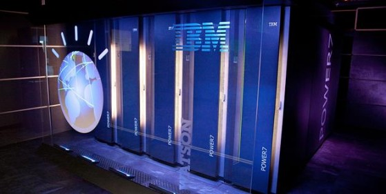
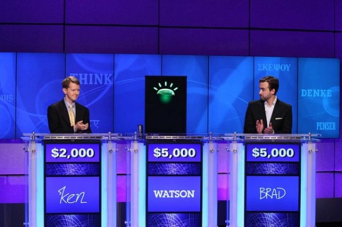

# Apie superkompiuterius ir dirbtinį intelektą

Negaliu apsakyti, kaip myliu Wikipedia. Rimtai, jeigu kažkas lieptų išsirinkti vieną vienintelį pagrindinį interneto puslapį, kuris vertas tolimesnio egzistavimo, o visus kitus internetus tiesiog išjungtų, tai įvardinčiau būtent Wiki. Aišku, nors reddit’as yra puikus dėl socialinio aspekto ir galima prisiskaityti daug šaunių istorijų iš žmonių gyvenimų, tačiau būtent Google ir Wikipedia yra du įrankiai sužinoti apie bet ką, bet kur, bet kada. Tai yra du esminiai, aukščiausi žmonijos pasiekimai šiam momentui, kai bet kuris individas su aparačiuku iš savo kišenės, gali pasiekti visą žmonijos išmintį vos sekundčių greitumu. Kaip koks kolektyvinis protas sujungtas tarpusavio ryšiais. O geriausia, jog mes šiuos aparačiukus naudojam žiūrėti kačiukų nuotraukas ir ginčytis su kitais žmonėms dėl beprasmiškų dalykų. Yeah, pabandykit paaiškinkit tai žmogui, atvykusiam iš kokių 1900-ųjų.

Taigi, ko gi aš taip alpstu dėl Wikipedijos? Nes jau tikrai ne pirmą kartą, pradėjęs skaityti vieną straipsnį šioje internetinėje enkciklopedijoje, užbaigi tik po kažkiek valandų, perskaites gal dešimtis kitų, susijusių straipsnių. Mano troškulys naujoms žinioms šio portalo pagalba gali būti pasotinamas, persotinamas ir užkemšamas neribotam laikui :j

Pakalbėkim apie vakar dienos sukauptas žinias apie galingiausius pasaulio kompiuterius. Įdomu? Man net labai!

### Analitikas vardu Watson

Tikriausiai esate girdėję, kad 1997-aisiais įvyko istorinis šachmatų mūšis, kurio metu superkompiuteris [Deep Blue](http://en.wikipedia.org/wiki/Deep_Blue_%28chess_computer%29) pirmą kartą įstorijoje sugebėjo nugalėti žmogų, t.y. tuometinį neginčijamą šachmatų čempioną Garry Kasparov. Po šio mūšio kompanijai IBM reikėjo naujo iššūkio. Ir štai pietaudamas 2004-aisiais restorane IBM tyrimų skyriaus vedėjas Charles Lickel pastebėjo, kad staiga ko ne visas restoranas nutilo. Priežastis buvo paprasta – į restoraną užsuko [Ken Jennings](http://en.wikipedia.org/wiki/Ken_Jennings) – šviesaus proto žmogus, kuris protų kovų laidoje Jeopardy! jau buvo sužaidęs 74 sėkmingus žaidimus iš eilės. Restoranas nuščiuvo, nes šou buvo ant populiarumo bangos ir amerikiečiai prilipę prie ekranų stebėdavo genijų kovas, kuriose būtent Ken sekėsi sėkmingiausiai. Būtent tada IBM atstovui Charles ir kilo mintis sukurti kompiuterį, galintį varžytis būtent šioje laidoje. Kitaip tariant, naujasis IBM tikslas – sukurti kompiuterį, kuris galėtų bendrauti natūralia žmogiška kalba, suprasti žmonių užduodamus klausimus ir pateikti visada teisingus atsakymus tiesiog akimirksniu, bei paprasta, žmonėms priimtina, natūralia kalba.

Kadangi IBM pasauliniame superkompiuterių reitinge yra pirmūnai, nes iš 10-ties galingiausių žmonijos turimų kompiuterių, net 6 priklauso būtent šiai kompanijai, tuo tarpu iš visų 500 tope esančių kompiuterių po IBM vėliava sėdi net 213 \(beveik pusė!\), buvo nuspręstą šį iššūkį priimti. Vardan mokslo ir kompiuterijos vystymosi!

Nors pradžioje mintis atrodė iš fantastikos srities, tačiau po mažu į tai buvo pradėta žiūrėti rimčiau, nors ir buvo sudėtinga rasti žmonių, kurie sutiktų dirbti prie šio, velniškai sudėtingesnio projekto, nei, kad senasis šachmatų kompiuteris. Buvo sukurtas pradinis prototipas pavadinimu Piquant, kuris teisingai atsakydavo tik apie 35% atvejų, o atsakymui prireikdavo keletos minučių. Dalyvavimui šou, to žinoma neužtenka ir galutinė užduotis pradėjo atrodyti, kaip neįmanoma. Tai patvirtino testinis žaidimukas 2006-aisiais metais, kai kompiuteris buvo papildytas faktine informacija iš daugiau, nei 500 šio šou laidų ir netgi su ja, žmonės atsakydavo apie 95% teisingumu, kai tuo tarpu kompiuteriui pasisekdavo viso labo tik 15%.

2007-aisiais surinkta 15 specialistų komanda, kuri tęsė darbus prie šio kompiuterio ir kuriems buvo skirti nuo trijų iki penkių metų pasiekti rezultatus. Jau 2008-aisias patobulintas variantas, kuriam suteiktas vardas Watson galėjo gan tolygiai varžytis prieš žmones, o štai 2011 nugalėjo du pačius kiečiausius Jeopardy! čempionus, taip laimint 2,65 milijonų Lt prizą, kuris visas paaukotas labdarai.

Įstabiausia, kas susiję su šiuo kompiuteriu – ne konkreti jo skaičiuojamoji galia, nes yra gerokai galingesnių kompiuterių ir Watson’as pasauliniame reitinge užima viso labo 94-tąją vietą, o būtent tai, kad kompiuteris sukurtas su dirbinio intelekto sistema, galinčia suprasti klausimus, užduotus žmonių natūralia kalba ir atsakyti vos sekundžių greitumu su ypač dideliu tikslumu, išanalizavęs daugiau, nei 200 milijonų puslapių struktūrizuotos informacijos, užimančios 4 terabaitus disko vietos. Į šį informacijos lobyną įeina enciklopedijos, žodynai, archyvai, laikraščiai, pranešimai ir netgi visa Wikipedia. Žaidimo metu įspūdingasis Watson’as net nebuvo pajungtas prie interneto!

Juokingiausia, kad visai nesenai kompiuterio kūrėjai tikėdamiesi pagerinti nefomalios žmonių kalbos supratimą šiame kompiuteryje \(visgi mes naudojame nemažai trumpinių, slango, buitiškų žodelių, kurių žodyne paprasčiausiai nėra\) ir patalpino visą internetinio šaltinio Urban Dictionary duomenų bazę. Tačiau gautas rezultatas nors iš pradžių kūrėjam ir atnešė daug juoko, tačiau buvo visai ne toks, koks tikėtasi – kompiuteris ėmė keiktis!  _„In tests it even used the word „bullshit“ in an answer to a researcher’s query.“_ Visą žodyną kūrėjams teko trinti lauk :p

### Kas gi slypi protingiausio pasaulio kompiuterio viduje?

Watson’as yra sudarytas iš 90 IBM Power 750 serverių, iš kurių kiekvienas dirba su 3,5GHz POWER7 procesoriumi, turinčiu aštuonis branduolius ir po 4 gijas kiekvienam branduoliui. Taigi, viso 2880 branduolių ir 16 terabaitų RAM atminties. Kadangi HDD diskai būtų per lėti, visi 4TB informacijos talpinama tiesiai į ramus. Tad kiekvieną kartą kompiuterį išjungus, tenka viską sutalpinti iš naujo. Visas šis įrangos komplektas atsiėjo maždaug apie 8 milijonus Lt.  
Mokslininkai labai sunkiai ir ilgai dirbo ties skirtingų informacijos rūšiavimų, vertinimo mechanizmų ir Watson’as kiekvieną atsakymą praleidžia per daugiau, nei 100 skirtingų analitinių įrankių, norint surasti patį tiksliausią ir labiausiai tikėtiną atsakymą. Taigi, visa ši serverių kombinacija leidžia žmogaus klausimą išanalizuoti, surasti galimus atsakymus, įvertinti jų tinkamumą ir atsakyti viso labo per tris sekundes. Kitaip tariant –  tai apie 500Gb apdorojimas \(kas prilygsta 1 milijonui knygų informacijos\) per vieną sekundę.

### _Kas toliau?_

Taip, laimėjo Watson’as prieš vienus galingesnių pasaulio protų, tačiau koks likimas laukia Watson’o toliau? Šiuo metu yra tyrinėjamos Watson’o pritaikymo galimybės medicinoje. Tikimasi lygiai tokiais pat principais suvesti medicininių archyvų ir informacijos šaltinių duomenis ir pasitelkiant Watson’o puikiais analitiniais sugebėjimais gerokai palengvinti diagnostikos daktarų darbą. Tik įsivaizduokit, suvedi paciento simptomus, jo, bei šeimos ligos istorijas, dabartinės būsenos duomenis ir kompiuteris tau pateikia visas esmines galimas ligas.  Žinoma, IBM aiškiai pabrėžia, kad kompiuteris daktarų nepakeis, tačiau tai sudarys priemones daktarams nepraleisti pro akis svarbių aspektų, bei išvengti klaidų. Kitaip tariant Watson’as taptų vos ne daktaru House’u, kai dauguma spėjimų ir teorijų visgi atlieka komandos nariai, o šis patvirtina arba atmeta teorijas.

### Galingiausiasis iš titanų

Taip, pakalbėjom apie įspūdingas žinių bibliotekas, bei nerealius analitinius sugebėjimus turintį Watson’ą, kuris visgi yra viso labo 94-tas pasaulyje. Tai kas gi pirmas…?

O pirmoje vietoje yra Titan, kuris yra tikras monstras skaičiavimo lygmenyje. Ir nors Watson’as man ir daro didesnį įspūdį būtent dėl neprilygstamų informacijos rūšiavimo sugebėjimų, tačiau neįvertinti Titan galios tiesiog neišeina. Oak Ridge jau turėjo savo super kompiuterį, pavadinimu Jaguar, tačiau 2011-aisiais buvo imtasi šio kompiuterio atnaujinimo darbų, kai į jo sudėtį buvo įtraukti ne tik skaičiavimo procesoriai \(CPU\), bet ir grafiniai \(GPU\), kas padarė šį kompiuterį pirmuoju hibridiniu kompiuteriu, perlipusiu 10 petaFLOP’ų spartą \(1peta FLOP’as = 1 x 10^15 slankiojo kablelio operacijų per sekundę\). Palyginimu: Intel i7-3770k procezorius, kuris šiuo metu yra vienas sparčiausių procesorių skirtas namų rinkai, už overclock’intas iki 4,6Ghz duoda 106 GFLOP’ų spartą \(1 giga FLOP’as = 1 x 10^9\). Kadangi, buvo pasirinktą naudoti senojo kompiuterio struktūrą, tai buvo galima sutaupyti apie 50 milijonų litų, nes nereikėjo visko statyti visai nuo nulio. Vien jau tai, kad buvo pasirinkti kiek plonesni elektros kabeliai, nei kad JAV standartas, sutaupė 2,65 milijonus litų, kurie būtų išleisti vien variui. Tačiau kaip bebūtų, viso šie atnaujinimo darbai vis vien kainavo 159 milijonus Lt.

### Po gaubtu

Taigi, Titan’as naudoja AMD Opteron CPU procesorius, bei Nvidia Tesla GPU \(Kepler architektūra dar tuomet nebuvo prieinama\). Šie procesoriai yra išties energiškai efektyvūs, nes nors ir sunaudoja visu 1,2 MW energijos daugiau \(bendras Titan energijos eikvojimas – 8,2 MW. Palyginimui: viena branduolinė elektrinė vasaros laikotarpiu pagamina 500-1200MW energijos\), tačiau lyginant su senuoju Jaguar’u skaičiavimo sparta išaugo beveik 10 kartų, taip žymiai pagerinant tokio super kompiuterio energinį efektyvumą. Išviso Titan’as turi 18688 tokius CPU, bei tokį patį kiekį GPU, kurie sutalpinti į 200 spintų, kurių bendras plotas 404 kvadratiniai metrai. Kiekvienas iš šių CPU turi 16 branduolių, bei 32GB DDR3 atminties, kai tuo tarpu kiekvienas GPU yra 6GB GDDR5. Taigi, viso šiame titane yra 299 008 procesoriaus branduolių ir 710 TB operatyviosios atminties. Prie viso to prisideda 10 PB \(petabaitų\) kietųjų diskų, tarp kurių duomenų perdavimas vyksta 240 GB/s greičiu. Dėl gan smarkiai atpigusios kompiuterio atminties kainų, per 2013-uosius tikimasi šią talpą padidinti iki 20-30 PB ir perdavimo spardą pakelti iki 1TB/s. Na ir galiausiai, teorinė apskaičiuota tokio kompiuterio sparta galėtų siekti net 27 petaFLOP’us \(palyginimui, minėtasis protingasis Watson’as siekia tik 80 TeraFLOP spartą\). Tačiau 2012 lapkritį darytas LINPACK testas, kuris naudojamas TOP500 organizacijos, kuri reitinguoja galingiausius pasaulio kompiuterius, pasiekė „tik“ 18,59 petaFLOP’ų sparta. Na bet to užteko, kad šį kompiuterį pastatyti į pirmąją Top’o poziciją.

Titan’as yra prieinamas praktiškai bet kokioms užduotims: nuo molekulinės, branduolinės fizikos skaičiavimų iki finansinių, bei klimato prognozių. Tačiau visas kompiuterio darbo laikas jau yra užsisakytas ir dėlto prioritetas teikiamas, tik patiems svarbiausiems, didžiausią reikšmę turintiems skaičiavimams. Vienu metu Titan’as dirba su 4-5 projektų skaičiavimais.

Kad geriau suprasti šio kompiuterio išvestį, mokslininkai pastatė ir vizualizacijų kambarį, kurį praminė EVEREST \(Exploratory Visualisation Environment for Research and Technology\) ir kuriame įrengtas 10 metrų ilgio ir 3 metrų aukščio ekranas, su 37 megapikselių raiška ir stereoskopinio 3D galimybe.

### Dirbtinis intelektas

Kalbant apie tokius nerealius monstriškus kompiuterius su sunkiai įsivaizduojama skaičiavimo sparta, kažkam automatiškai kyla klausimai ir nepasitikėjimas. Ar neištiks mūsų filme Matrix rodyta ateitis, kai kompiuteriai tampa protingi ir dirbtinis intelektas sukyla prieš žmones.  Žinoma, dabar baimintis nėra ko. Nes minėtieji kompiuteriai net neturi intelekto požymių. Titan yra viso labo galinga skaičiavimo mašina, tuo tarpu Watson’as apdoroja informacija pagal tam tikras apdorojimo taisykles. Apie jokį informacijos įsisavinimą ir supratimą čia negali būti nė kalbos.

Tačiau mokslininkai kelia teorinius pamąstymus ir yra išvedę stipraus dirbtinio intelekto sąvoką, kurią itin mėgsta fantastai ir futuristai:

Strong AI – tai mašinų sistema, turinti žmogaus protui prilygstantį ar net viršyjantį intelektą, kuris gali sėkmingai įvykdyti bet kurią intelektinę užduotį lygiai taip pat, kaip kad tai gali padaryti žmogus.

Ir nors vieno vieningo apibrėžimo intelektui visgi nebuvo prieita ir tai sukelia daug diskusijų ir ginčų, tačiau dauguma pripažįsta, kad intelektas privalo pasižymėti tokiomis savybėmis:

> -argumentavimas  
> -samptovimas  
> -minčių pagrindimas  
> -užduočių sprendimas  
> -loginis mąstymas  
> -žinių taikymas  
> -savarankiškų sprendimų priėmimas esant neapibrėžtumui  
> -planavimas  
> -mokymasis  
> -komunikavimas natūralia kalba  
> -visų šių gabumų sujungimas siekiant užsibrėžtų tikslų

Taipogi pripažįstama, kad be intelekto žmogus pasižymi ir kitais komponentais, kuriais turėtų pasižymėti stiprus dirbtinis intelektas, norintis prilygti žmogui:

> -sąmomingumas \(turėti sąmonę, mintis, galima interpretuoti, kaip sielos turėjimą\)  
> -savęs pažinimas  
> -jautrumas  
> -išmintigumas

### Tiuringo testas

Dar 1950-aisiais buvo pristatytas Tiuringo testas, kurio pagalba testuojamas mašinos sugebėjimas atkartoti sumanę elgseną, prilygstančią žmogaus protui. Alan’as Turing’as savo knygą „Computing Machinery and Intelligence“ pradeda nuo klausimo „Ar mašinos gali galvoti? Kadangi „galvojimas“ yra gan sunkiai apibrėžiama sąvoka, mes pakeičiame klausimą į kitą, labai susijusį klausimą: ar yra skaitmeninių kompiuterių, kuriems taip gerai sektųsi imitaciniame žaidime, kad skirtumo nebepavyktų surasti? Būtent šis klausimas yra tas į kurį atsakyti tikrai galima.“

Šiaip tai testas gan paprastas:

teisėjas žmogus paprasta, kasdiene kalba dalyvauja pokalbyje su dviem dalyviais – vienas iš jų žmogus, kitas – kompiuterinė sistema. Visi dalyviai atskirti vienas nuo kito ir bendravimas vyksta grynai tekstine išraiška, kad nereikėtų remtis kompiuterinės sistemos balso atkūrimo galimybėmis, kurios galėtų kompiuterį išduoti. Jeigu teisėjas negali atskirti kuris iš jų yra žmogus, o kuris ne – laikoma, kad mašina testą išlaikė. Šis testas netikrina sugebėjimo atsakyti klausimus teisingai, jis koncentruojasi į sugebėjimą pateikti įprastus, žmonėms būdingus atsakymus.

Ir tiesą sakant, dar 1966-aisiais buvo sukurta programa, pavadinimu ELIZA, kuri Tiuringo testą nesunkiai praėjo, taip parodydama šio testo spragas. Programa tiesiog išanalizuodavo kiekvieną žodį, kaip raktažodį ir pagal tam tikras taisykles suformuluodavo tinkamą atsakymą. Iš esmės kažkuom primena dabartinio Google’o paieškos sistemą.

Dar įdomesnis atvejis nutiko 1972-aisiais, kai buvo sukurta „ELIZA su charakteriu“ ir pavadinta PARRY vardu. Ši programa panašiais į ELIZA naudojamais principais įmitavo paranojiško šizofreniko paciento elgseną. Testo atlikimui buvo pasikviesta grupė patyrusių psichiatrų, kuriems buvo pavesta užduotis kompiuterinio bendravimo pagalba išanalizuoti būrį tikrų pacientų, bei tarp jų įmaišytų kompiuterių su vykdoma PARRY programa. Tada kita grupė, susidaranti iš 33 psichiatrų skaitė vykusių pokalbių iškoltines ir turėjo atpažinti kurie pacientai buvo tikri žmonės, o kurie ne. Stebėtina, tačiau šie psichiatrai buvo teisūs tik 48% atvejų, kas prilygsta atsitikninam spėliojimui.

Įdomu ir tai kad šių dviejų programų principu veikiančių programų dar dabar yra pilna, jos naudojamos internete, pokalbių kambariuose siekiant išpešti naudingos informacijos iš pašnekovų ar nukreipiant juos į svetaines su kenkėjišku kodu. Netgi žymusis CleverBot’as yra parašytas remiantis tais pačiais principais, sugalvotais prieš daugiau nei 50 metų.

### Kinų kambario argumentas

John Searle buvo skeptiškai nusisteikęs Tiuringo testo atžvilgiu, nes prieštaravo minčiai, kad mašiną sugebančią išlaikyti Tiuringo testą galima laikyti mąstančia ir protinga. Tai yra gan nelogiška, nes mašina tiesiog atlieka tai, kas jai užprogramuota, be absoliučiai jokio klausimų ar atsakymų supratimo ir interpretavimo.

Stipraus dirbtinio intelekto šalininkai mano, kad žmogaus smegenys yra ne kas kita, kaip natūralus kompiuteris, o mąstymas yra tiesiog tam tikromis taisyklėmis veikianti programa. Taip pat dažnai manoma, kad sistemos, sugebančios parodyti tokio mąstymo sugebėjimus galėtų mums padėti paaiškinti žmogaus mintis. Taip pat manoma, kad biologinė materija, iš kurios sudarytos žmogaus smegenys yra nebūtinos mąstymui.

Kaip priešpriešą šiam Tiuringo testui, John’as pateikė minties eksperimentą \(minties eksperimentas – tai loginis eksperimentas, skirtas filosofiškai nagrinėti galimoms baigtims ir eksperimento išvadoms, kai šio eksperimento tiesiog neįmanoma įvykdyti ar jo įvykdymas tiesiog yra beprasmiškas. Vienas iš žymiausių minties eksperimento pavyzdžių – Šriodingerio katinas\) – Kinų kambarys.

Kinų kambario eksperimente, žmogus, kuris nesupranta kinų kalbos sėdi kambaryje į kurį paduodami užrašyti kiniški hieroglifai. Kambaryje taip pat yra knyga, kurioje yra sudėta aibė taisyklių, kurių pagalba žmogus mechaniniu būdu gali manipuliuoti duomenimis. Tai veikia pagrindu: „kai pamatai simbolį X, parašyk simbolį Y.“  Mintis yra ta, kad kiniškai kalbantis žmogus paduotų į kambarį kiniškai užrašytus klausimus ir gautų atitinkamus atsakymus iš kambaryje sėdinčio žmogaus tokia forma, jog kinui atrodytų, kad kambaryje yra kinų kalbą mokantis žmogus. J. Searle įsitikinimu, tokia sistema išlaikytų Tiuring testą, tuo tarpu asmuo, sėdintis kambaryje ir manipuliuojantis simboliais akivaizdžiai nežinotų kinų kalbos. Tokiais motyvais yra bandoma sugriauti stipraus dirbtinio intelekto šalininkų tvirtinimus.

Kiniško kambario motyvas „užpuola“ du stipraus dirbtinio intelekto šalininkų tvirtinimus. Pirmas tvirtinimas yra tas, kad sistema, sugebanti išlaikyti Tiuring testą supranta įeitį ir išeitį. Akivaizdu, kad kinų kambario atveju žmogus sėdintis kambaryje nė nenutuokia apie ką yra įeinantys hieroglifai. Antras tvirtinimas yra, kad Tiuring testą išlaikanti sistema galėtų paaiškinti žmogaus mąstymą. Akivaizdu, kad kinų kambario atveju apie jokį mąstymą negali būti nė kalbos.

Esminis argumentas čia yra skirtumas tarp sintaksės ir semantikos. Kambarys gali manipuliuoti simboliais pagal taisykles, kurios yra surašytos knygoje. Tokiu būdu kambario elgseną galima apibūdinti sintaksinėmis taisyklėmis. Tačiau šiuo atveju nėra jokios kalbos apie manipuliuojamų simbolių supratimą, t. y. jų semantiką.

Akivaizdu, kad sintaksė nėra pakankama norint turėti semantiką. Taip pat sunku pasakyti ko trūksta sintaksiniam supratimui, norint pasiekti semantinį. J. Sarle šioje vietoje kaip kandidatus pasiūlo jau anksčiau minėtus sąmonę, intencingumą, subjektyvumą.

Gerai, užteks jau šiam kartui visos šios fantastikos :j Tikiuosi buvo įdomu. Jei sudomino, tai visą itin įdomių straipsnių seriją galima rasti Wikipedijoj, ties tema: [Philosophy of artificial intelligence](http://en.wikipedia.org/wiki/Philosophy_of_artificial_intelligence)

