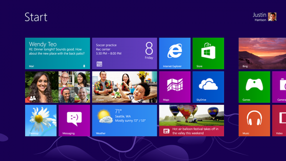
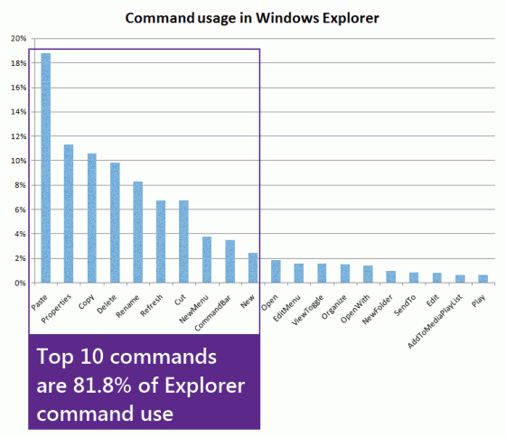
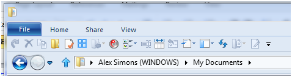
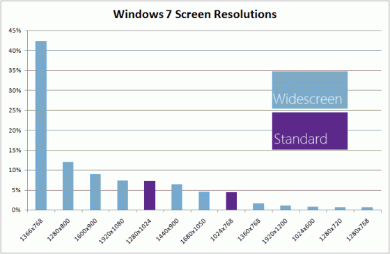
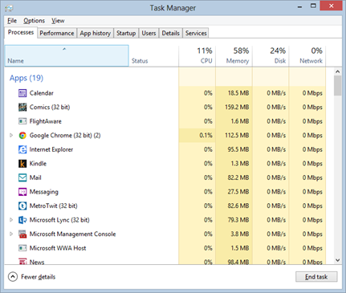
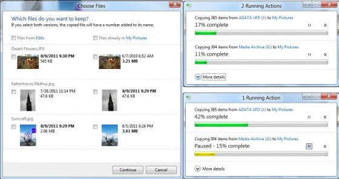
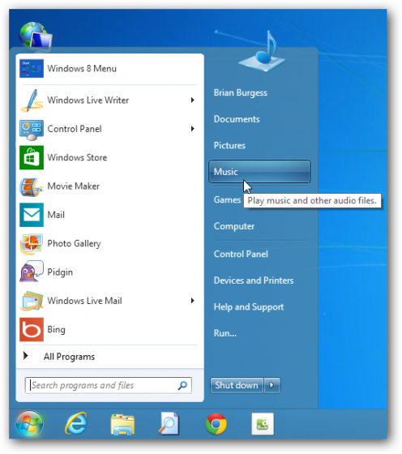

# Apie Windows 8

Prieš daugiau, nei trejerius metus nusprendžiau padaryti septintųjų windows’ų apžvalgą, nes dar net ir beta stadijoje, man ši operacinė paliko išties gerą įspūdį. Tam net įrašiau savo pirmąją [video apžvalgą](https://vimeo.com/2942448). Ir iš esmės dėl šios OS aš neklydau – Microsoft’as iki išleidimo ją dar labiau užlopyjo, padarė stabilesne, o krūva atnaujinimų bei galiausiai service pack’as nušlifavo iki tikrai kokybiško produkto ir naudotojai tai įvertino: dar šį rugsėjį galėjome skaityti, kad Win7 naudotojų skaičius pagaliau perkopė senutėlės XP naudojus \(42.76% Win7 naudai ir 42.52% XP vartotojų\).

Operacinių sistemų išleidimo ciklas prasisuko \(beja šį kartą kiek ir sutrumpėjęs\) ir štai jau sekantį mėnesį, spalio 26-tąją turime naujausią septintuko įpėdinį – Windows 8. Internetas dar nuo praeitų metų spalio, kai buvo parodyta pirmoji Developer Preview versija, tapo užkimštas naujosios sistemos apžvalgomis ir įspūdžiais. Tokių apžvalgų tik dar padaugėjo po Release Preview pasirodymo, o šiuo metu projekto kūrimo ciklas jau pasibaigęs ir naujoji sistema jau atiduota leidybai. Viskas, finišo tiesioji. Stebėdami žmonių reakcijas galime padaryti išvadas, kad dar net nepasirodžiusi, ši operacinė sistema yra tikrai prieštaringa. Yra žmonių, kurie gerbia drąsius Microsoft korporacijos žingsnius ir visiškai naują požiūrį į darbą su kompiuteriu, už įnovatyvius žingsnius kuriuos ji žengia naujosios kompiuterijos linkme, tačiau rasite ir dvigubai tiek žmonių, kurie žiūri gan skeptiškai į tokius didelius pasikeitimus, priverstinį įpročių keitimą, mano kad ši naujoji sistema smarkiai sumažins darbo produktyvumą ir nuolatos kartoja, taisyklę, kad MS operacinės būna geros tik kas antra karta. Tačiau galima pastebėti, kad dauguma žmonių skundų yra orientuoti daugiausiai tik į naująją Modern \(ex Metro\) vartotoją sąsają. Apie ją kalbėta, apkalbėta ir prisiskūsta į valias, palikime ją šį kartą ramybėje ir pažvelgime giliau po blizgiu ir spalvotu Modern UI ir įvertinkim kitus šios operacinės sistemos pasikeitimus, kurių išties yra pakankamai nemažai ir kurie dažnai praleidžiami tų žmonių, kurie išbandė 8-tukus labai trumpai, liko nepatenkinti ir grįžę atgal prie 7-tų keliauja į įvairias interneto bendruomenes ir rašo nepatenkintus komentarus.

Taig,i šios apžvalgos tikslas labiau orientuotis į pasikeitimus kituose Windows 8 aspektuose, pranašumuose, bei galiausiai įvertinti ar atneštos naujovės yra pakankamai vertos atsinaujinimo.

### **Pirmasis susidūrimas iš vartotojiškos perspektyvos**

Smalsumo vedamas, pirmą kartą susirašiau parodomąją Win8 versiją vos tik po jos pasirodymo. Nustebino tikrai greitas sistemos įdiegimas, bei pagirtinas darbas su driveriais. Taigi evoliucinis žingsnis į priekį Windows 7 atžvilgiu. Na ir žinoma, po instaliacijos sekė pirmasis susidūrimas su visų taip minima Modern UI. Pirmas vaizdas išties nebuvo itin pozityviai nuteikiantis, bet iš esmės, nieko labai kritiško neįžvelgiau. Ši nauja sąsaja automatiškai paleidžiama vos įjungus kompiuterį, tačiau vėliau pereinama į Desktop režimą ir moderniosios sąsajos praktiškai nė nebepastebi, tad smarkiai pykti ant jos, kaip ir neturiu už ką. Vis vien didžiausią kompiuterio įjungimo laiką būna atidarytas Chrome ir iš jo net neišlendu, tai esminio skirtumo, kokia OS, 7 ar 8 – nesudaro. Žinoma, kiek negerai, jog kūrėjai nepaliko galimybės Modern’o išjungti, arba neintegravo automatinio atpažinimo \(ala instaliavai į stacionarą – kraunasi į desktop, instaliavai į planšetą – pasileidinėja Modern\). Juk jei vartotojai turėtų galimybę rinktis – perėjimas nebūtų toks skausmingas ir vartotojai susidurtų su naująją sąsają tik kartais ir palaipsniui tiesiog priprastų. Tačiau šį kategorišką pasirinkimą, kai kūrėjai nusprendė už mus, galima kiek ir suprasti – MS deda daug vilčių į šią daugiaplatformę sąsąją ir jeigu vartotojas nebūtų priverstinai užkraunamas tiesiai į ją, nemaža dalis vartotojų jos išvis nenaudotų. Tad Modern, kad ir kišamas per prievartą, bando išsigelbėti nuo elementariausio užmiršimo.

Įdomu tai, kad žmonės reiškia tokį didelį nepasitenkinimą dėl Start’o dingimo, nors pastarieji metai parodė trend’ą, kad start’as buvo naudojamas vis mažiau ir mažiau. Tai paaiškėjo iš surinktų telemetrijos duomenų.

> When we evolved the taskbar \(Windows 7\)  we saw awesome adoption of pinning applications on the taskbar. We are seeing people pin like crazy. And so we saw the Start menu usage dramatically dropping, and that gave us an option. We’re saying ‘look, Start menu usage is dropping, what can we do about it? What can we do with the Start menu to revive it, to give it some new identity, give it some new power?'“ – sakė vienas iš MS programų direktorių.

Ir ištikrųjų, pagalvokite apie tai, kiek laiko jūs praleidžiate Start meniu? Visas reikalingiausias programas laikote ant desktop’o, o dažniausiai naudojamas – prisisegę prie start juostos \(taskbar\). Iš esmės start’as naudojamas tik retesnių programų paleidimui, paieškai arba greitai nuėjimui į My Computer, My Pictures etc. Na ir va, iš esmės nič nieko neprarandat – Modern’as išlaiko lygiai tą patį funkcionalumą: galit atlikti paiešką, galite susidėlioti ar išmesti programas, kurių jum nereikia. Tik tiek, kad dabar šis start’as – ne be juosta išlendanti ekrano šone, o visą ekraną dengianti sąsaja, pateikianti jums naudingos informacijos, kaip kad jūsų elektroniniai laiškai, naujienos, orai, ar jūsų draugų socialinių tinklų žinutės. Galima traktuoti, lyg start’as būtų patobulėjęs ir susijungęs su ekrano įtaisų \(gadget\) platforma. Modern atsiradimas sumažina tokių programų, kaip praplėsta įtaisų sistema Rainmeter, reikalingumą.

Taipogi dalis kritikos kliūna už nevykusias integruotas Win8 programas. Visų pirma prisiminkit, kad iki šiol tai buvo tik parodomosios programos ir jos galutinėje versijoje bus patobulintos. Taipogi MS visada įtraukdavo standartinių programų paketą, gi ir anksčiau turėjote teksto redaktorių \(Notepad, Wordpad\), standartinę vaizdo programą \(Paint\), muzikos grotuvą \(Windows Media Player\), nuotraukų peržiūros programą ir pan. Tačiau niekas neliepia priverstinai jų naudoti, jos tiesiog pasiūlo galimybę atidaryti failus tiesiai, iškart po diegimo, out of a box. Gi niekas ir neužsiiminėjo nuotraukų redagavimu su Paint’u. Taigi, jeigu jums nepatiks kartu su Win8 atkeliaujantis muzikos grotuvas, tai nubėgant ir suintaliuojat AIMP, Winamp ar bet kokią kitą jūsų mėgiamą programą ir nusistatom, kad muzikiniai failai būtų atidaromi būtent su ja. Standartinę programą galim pamiršti ar išvis ją pašalinti iš kompiuterio.

Dalis žmonių, kiek nesupranta, kodėl reikėjo taisyti tai, kas iš esmės kaip ir nebuvo sugedę. Kompiuterių vartotojai per daugelį metų labai prisirišo prie klasikinio desktop’o ir nesupranta kam dabar visa ta sumaištis, įvedanant kažkokią naują sąsają. Atsakymas gan paprastas – sąsajų testinumas. Mūsų kompiuteriniai įpročiai kinta, internetu naudojamės ne tik stacionariais ar nešiojamaisiais kompiuteriais, tačiau ir telefonais, bei dabar jau ir planšetėmis. Korporacija nori išlaikyti vientisumą, tęstinumą, bei skirtingų prietaisų integraciją per visus savo prietaisus. Gi pripažinkit, paėmus mobilų telefoną, su sąsaja, su kuria jūs dar niekad nesusidūrėte – pirmieji žingsniai būna lėti, jums reikia laiko priprasti. Lygiai taip vartotojui reikia pratintis prie kiekvieno naujo įrenginio. Argi nebūtų šaunu, kai visur naudojama vieninga, jau pažįstama sąsaja. Išmokai vieną kartą – mokėsi elgtis su viskuom. Vos paėmęs visiškai naują prietaisą įrankas, pasijauti pažįstamoje aplinkoje ir jau žinai kur rasti vieną ar kitą nustatymą. Ir tokia linkme žygiuoja ne tik Microsoft, bet ir visi konkurentai. Technologijos liejasi ir greitai turėsim vieną nepakartojamą computing experience, kur bet kur ir bet kada galėsime naudotis savo individualizuota sistema.

Žinoma, jums ir daugeliui kitų naujasis pradžios langas po etikete „Modern“, gali būti visai ne prie širdies, tačiau pagalvokit į tai iš kitos pusės – šioje naujoje aplinkoje jūs praleisit ne tiek jau ir daug laiko. O labai norint, galima išvis išsiversti ir be jos. Taigi, nejaugi manot, kad Modern toks jau nepakenčiamas?

### **Windows 8 naujovės**

Taigi užteks apie Modern’ą. Kaip jau minėjau įrašo pradžioje – straipsnio tikslas ne toks. Tiesiog daviau peno pamąstymui tiems, kurie  pasidarė labai greitas išvadas. O dabar įliskim kiek giliau, po gaubtu ir apžvelkime pagrindines naujos operacinės sistemos naujoves:

– Akivaizdžiausias Win8 privalumas – [greitis](http://faceit.lt/2012/windows-8-lenkia-windows-7/). Ši OS sukasi ant naujos failų sistemos, iš naujo perrašytas įsijungimo, bei išsijungimo, procesų pasileidimo ciklai \(procesai pasileidinėja vienu metu, o ne vienas paskui kitą, taipogi nenaudojami procesai automatiškai išjungiami\), procesoriaus darbui pasitelkiama GPU akseleracija, tad OS ne tik, kad gerokai greičiau įsijungia, pasirengia darbui po operacinės starto, tačiau ir darbas su ja vyks dar sklandžiau, nei kad su ankstesnėmis versijomis. Ypač tai jaučiasi ant media konvertavimo, bei su DirectX susijusiais veiksmais.  
– Ilgesnis nešiojamųjų kompiuterių baterijos darbo laikas. Perdarytas foninių procesų darbas, bei Aero efektų atsisakymas davė kardinalius energijos efektyvumo rezultatus, dėl kurių jūsų nešiojamasis galės dirbti gerokai ilgiau.  
– Geresnis darbas su driveriais. Su Win7 Microsoft atidirbo savo tvarkyklių atnaujinimo platformą ir db OS žymiai efektyviau atpažįsta prijungtus prietaisus. Elementarus pvz – suinstaliavus Win7 į savo naująjį surinktą kompiuterį, pirmiausia turėjau suinstaliuoti tinklo plokštės draiverius, tada perkrovus kompiuterį jau galėjau pasijungti prie interneto ir Windows Update pagalba parsisiūsti visas likusias tvarkykles, tarp kurių kritinės – vaizdo plokštės, nes be jų FullHD monitorius galėjo rodyti tik labai mažomis rezoliucijomis. Win8 su tokiomis problemomis nereikėjo susidurti – vos po instaliacijos veikė viskas.  
-Padidėjęs saugumas. Gaunate operacinę su integruotu Security Essentials paketu, kuris yra nemokamas, paties Microsoft leidžiamas antivirusas, kuris pakankamai neblogai dorojasi su potencialiomis grėsmėmis. Iš esmės naudojimui namuose, atskiro antiviruso ko gero nė nebereikia.  
-Kaina. Dar nei viena MS operacinė nekainavo taip pigiai: atsinaujinti iš Win7 bus galima vos už 14.99 euro.  
-Suderinamumas. Iš esmės, viskas, kas tik veikė su 7-tukais, tikrai veiks ir ant šitų nes operacinės sistemos branduolys iš esmės liko nepakitęs. Tai tie patys septinti windows’ai su kiek patweakinta išvaizda.  
-Skirtingi atrakinimo būdai. Nuo šiol galime rinktis ne tik tarp standartinio slaptažodžio įvedimo ar pirštų antspaudų, bet ir skaitinio pin ar visai smagaus paveikslėlio tipo slaptažodžio.  
-Atnaujintas, padidinto efektyvumo Windows Explorer. Apie jį plačiau – netrukus.  
-Geresnis darbas su 64-bit’ų platforma, bei tobulesnis multi monitorių palaikymas.  
-Našesnis RAID technologijos panaudojimas.  
-Efektyvesnis darbas su SSD diskais.  
-Debesų tarnybos integravimas ir automatinis sinchronizavimas.  
-EXIF orientacinė informacija paveikslėliams. T.y. jei darysite nuotraukas pasukę fotoaparatą šonu, nuotraukos Win8 bus automatiškai  pasukamos žiūrėjimui tinkamu kampu.  
-Integruotas ISO, bei VHD atvaizdų palaikymas. Nuo šiol galima išsiversti be Daemon Tools ar VirtualBox programų.  
-Intergruota Windows Store, kurios pagalba programų kūrėjams bus lengviau surasti naudojus, bei geriau pristatyti savo sukurtas programas.

### **Windows Explorer naujovės**

Surinkus duomenis iš milijonų Win7 vartotojų – paaiškėjo, kad iš daugiau, nei 200 skirtingų Windows Explorer valdymo komandų, vartotojai naudoja tik ganėtinai mažą dalį komandų:  top 10-tukas sudaro net 81,8% viso naudojimo, o iš jų 7-ios –  failų manipuliavimo komandos:

Dar įdomiau, kad surinkti duomenys parodė ir tai, kad 54,5% visų komandų vykdoma iš dešiniojo pelės klavišo kontekstinio meniu, o dar 32,2% vykdomos klaviatūros kombinacijomis. Ir viso labo 10,9% atitenka komandų juostai – labiausiai matomam explorerio elementui, esančiam ekrano viršuje.

Taigi, MS iškėlė tris esminius tikslus, kuriuos turėjo pasiekti iš naujo pergalvotas Exploreris:

1. Optimizavimas failų manimuliavimo užduotims. Jeigu jau 7-ios komandos iš 10 yra naudojamos failų kopijavimui, trynimui, pervadimui ir pan., tai logiška, kad šioms komandoms turima skirti daugiau dėmesio: turėtų būti iškeltos į priekį, tapti lengviau ir greičiau pasiekiamos.

2. Sukurti produktyvesnį darbą su komandomis. Rečiau naudojamos komandos turėtų būti lengvai randamos, sudėtos tose vietose, kuriose tikiesi rasti, suskirstytos loginėmis grupėmis, priklausančiomis nuo konteksto.

3. Gerbti Explorer sukauptą patirtį. XP sistemoje darbas su failais laikomas pačiu geriausiu iš visų MS produktų. Nuspręsta grįžti prie pagrindų ir gražinti keletas paslėptų „arkliukų“, kurie dingo iš Explorer’io nuo Vista pasirodymo ir apie kurių egzistavimą, dalis vartotojų galbūt išvis net nežino. Vienas tokių: mygtukas „Up“, leidžiantis grįžti vienu katalogu atgal, katalogų hierarchiniame medyje.

Buvo išbandyti keli dizaino sprendimai, pasitelkiant Vista/Win7 komandų juostą, Windows 95/Windows XP įrankių juostas ir meniu. Bet galiausiai prieita prie Office stiliaus kaspino \(ribbon\). Ir pasirodo būtent ribbon efektyviausiai leidžia pasiekti visus tikslus:

-Visos 200 komandų pasiekiamos vientisame, logiškai suskirstytame interfeise.  
-Svarbiausios komandos iškeliamos į pradinį Ribbon langą, tad vartotojai galės savo dažniausiai naudojamas komandas pasiekti dar greičiau.  
-Komandos pagal vartojimo dažnumą gali būti skirtomos į dažnesnes, svarbesnes ir į rečiau naudojamas, tad joms parenkami skirtingi mygtukų dydžiai.  
-Interfeiso vientisumas. Vartotojai jau pažįstami su ribbon iš Paint, Wordpad, Office, Live Essentials programų  
-Dinamiškumas. Ateityje galima pridėti papildomų komandų, kardinaliai nekeičiant, nesugadinant senojo išdėstymo.

Iškarto aišku, kad dalis vartotojų, kaip pvz power-user’iai šį naują dizainą sutiks su kritika, tačiau pažiūkite į papildomus ribbon teikiamus privalumus:

-Iškelia paslėptas galimybes, kurias pasiekti reikėjo mokėti arba kurias pasiekti buvo gan sudėtinga \(pvz. Invert selection, Show file extensions\).  
-Iškelia dalį funkcionalumo į priekį, kurį power-useriai naudodavo trečiųjų šalių programų pagalba \(pvz. Copy path, Open folder in command promt\).  
-Suteikia absoliučiai visom komandoms greitąsias klaviatūros kombinacijas.  
-Suteikia UI customize’inimo galimybes, susidedant  komandas į asmeninį toolbar’ą \(iš esmės grįžtama prie XP funkcionalumo\).

-Prie pastarosios galimybės labai gerai derinasi ir kita – galima įrankių juostą išvis suskleisti, paslėpti. -Kontekstinės meniu kortelės. Pagal peržiūrimą turinį gali atsirasti papildomos kortelės, padedančios pasiekti svarbiausias funkcijas. Tokios kortelės gali būti specifiniams nuotraukų, muzikos, vaizdo medžiagos katalogams, failų bibliotekoms. Pvz, štai kaip atrodo kontekstinė kortelė atliekant paiešką:

### **Pritaikymas platesniems ekranams**

Tęsiant statistikos rinkimo temą, MS suprato, kad absoliuti dauguma vartotojų naudoja plačiaekranius monitorius \(rezoliucijų santykis &gt; 1.3\):

Pasirodo iš 20-ties naudojų, net 17-ka turi plačiaekranį monitorių. Taigi tai yra naujasis standartas, sudarantis 83% visų Win7 vartotojų. Tai lėmė nešiojamųjų kompiuterių masyvus paplitimas, o kaip žinom, visi laptopai yra plačiais ekranais. Taigi ekranas subtiliai pertvarkytas efektyvesniam horizontalaus ploto panaudojimui.

### Patobulintas Task Manager’is

Tiesą sakant, vien dėl jo jau būtų galima atsinaujinti į naująją OS. Naujasis Manageris tikrai patobulėjo ir tapo gerokai naudingesnis. Esminė šio lango paskirtis visada turėjo būti atsakymas į klausimą: kas gi po velnių vyksta. Pagaliau manager’is pradėjo daryti būtent tai. Jau galima matyti aiškų skirtumą tarp programų, foninių veiksmų, servisų ir t.t. Galima matyti kiek ir kokių resursų sunaudoja kiekvienas procesas, galima matyti kurios programos sulėtina kompiuterio užsikrovimą ir jas išjungti, na ir tiesiai iš task maneger’io dabar galima stabdyti operacinės servisus, kurie jums nereialingi.

### **Patobulinta failų perkėlimo sąsaja**

Taipogi labai teigiamai priimama Win8 naujovė, tai pagerinta failų perkėlimo sąsaja. Nuo šiol keli perkėlimo progreso langai susilieja į vieną. Taip ne tik tvarkingiau, kompaktiškiau, bet ir gerokai patogiau. Taipogi atsirado galimybė kopijavimą sustabdyti ir pratęsti kiek vėliau – itin naudinga vienu metu kopijuojant kelis failus į išorinę rinkmeną. Kompiuterį užmigdžius, kopijavimas bus automatiškai sustabdomas, na o paspaudę mygtuką _More details_, galėsite matyti realiu laiku brėžiamą statistiką apie kopijavimo greitį.

### **Negalintiem priprasti**

Galiausiai – sunkiai priimantiems naujoves, tačiau norintiems išnaudoti siūlomus naujosios OS pranašumus prieš Win7 visgi yra ir išeitis. Dar net oficialiai nepasirodžius operacinei, jau galime rasti krūvas third-party programų, kurios grąžina standartinį start mygtuką su visu standartiniu jo funkcionalumu ir paslepia Modern’ą. Taigi galite savo kompiuterį paleisti suktis ant technologiškai pranašesnių aštuntukų, su Modern reikalų visai net neturėdami. Viena iš tokios rūšies programų – Windows customize’inimu garsėjantys Stardock ir jų [Start8](http://www.stardock.com/products/start8/). Štai, kaip tai atrodo:

### **Galutinis žodis**

Aišku sunku kalbėti apie OS sėkmingumą, kai ji dar net nepasirodžiusi. Galima išmastyti tikrai stiprių argumentų tiek į teigiamą, tiek į neigiamą pusę. OS išlaiko įdirbį, patirtį, kurią turėjo 7-inti, tačiau ją dar patobulina ir įneša ne vieną patogią ir išties gerą naujovę. Ir dėl tų naujovių išties niekas ir nesiskundžia, o kaip tik žiūri į jas tikrai teigiamai. Na kas gi gali skųstis dėl greitesnio veikimo ar patobulinto Task Managerio ;\) Visa bėda, tai pagrindinis OS veidas – Modern sąsaja. Ji asmeniškai manęs nesužavėjo, tačiau pasipiktinęs nesu. Naudoti galiu, tačiau žinau, kad tą darysiu gan retai, bei minimaliai. Iš esmės ko gero MS dar reikia įdirbo su naująja koncepcija. Atidirbs, pasimokys ir štai 9-tuose windows’uose jau galbūt turėsim kažką tikrai verto dėmesio. Tačiau, kaip bebūtų Modern’as kad ir nėra blizgantis ir žavintis produktas, tačiau nemanau, kad tai priežastis atsisakyti viso kito. Bet nevisi bus tokie tolerantiški ir pasirenkite po 8-tukų išleidimo sulaukti tonas bitch whining’o.

Iš esmės šis releaze’as nėra dėl progreso ar dėl vartotojų. Tai Microsoft reakcija į tai kas dedasi rinkoje, nes jaučia artėjančią ir gan realią grėsmę, jei nieko nedarys. Deja šis bandymas, ant kurio metamos gan reikšmingos kortos – yra tikrai rizikingas ir nepatenkina daugumos vartotojų ir juo labiau verslo lūkesčių. Aš nė neabejočiau Win8 naudoti planšetėje, nes tai panaikina skirtumus tarp tikrų ir mobiliųjų kompiuterių ir pagaliau mobiliuosius įrenginius gali padaryti išties produktyvius ir naudingus darbui. Tikiu, kad ši OS tikrai gerai susidoros lietimui skirtuose ekranuose, nes dar bandomosios versijos sukosi tikrai sklandžiai ir sparčiai, o ir integruota gestų sistema, bei ta pati Modern sąsaja tikrai atrodo logiška ir pasiteisina liečiant. Tačiau nemanau, kad ant asmeninio kompiuterio, kuriame vienu metu gali būti atvaizduojamos dešimtys valdymo įkonų, sudėtingos įrankių juostos ir meniu pasirinkimo elementai, reikėtų viską išdidinti ir nuprastinti iki minimumo. Ši OS prašo, kad mes adaptuotumėmės prie jos, o argi neturėtų būti atvirkščiai? Kodėl vartotojas turi slinkti daug didesnius atstumus pele, kad paspaustų vieną ar kitą elementą, vien tik dėlto, kad interfeisas yra logiškas touch screen’ams? Kodėl  mano nepertraukiamas „flow“ darbas turi būti sutrukdytas start meniu, kuris užima visą ekraną, kaip kokia aplikacija? Kodėl norėdamas išjungti kompiuterį, turiu spausti 4-is kartus, užuot du? Kodėl turiu taikstytis su besidubliuojančiomis programomis \(vienas Internet Explorer’is ar Chrome’as desktop’ui ir visai atskiras Modern’ui\) ir dar priedo negalinčiomis viena su kita keistis duomenų? Ir t.t.

Win8 tikrai paplis ir surinks pakankamai solidžius paplitimo procentus. Tikiu, kad ši OS visgi bus sėkmingesnė, nei Vista. Tačiau praktiškai net negalvoju, kad ji galėtų išversti dabartinį karalių iš sosto. Didžiausio svorio paplitimui duos tai, kad MS pasirašęs sutartis su visais esminiais kompiuterių gamintojais, taigi sekančių metų kompiuteriai bus su iškart įrašytais Win8-tais. Kažkas išbandys ir jiem galbūt patiks. Dar kažkas naudos dėl intergracijos su kitais MS produktais: Xbox, Windows Phone, Surface. Kitiem OS nepatiks, tačiau vis vien sedės su 8-tais, lygiai taip, kaip pas kai kurių dar dabar galima rasti kompiuterius su besisukančia Vista \(tokių dabar vis dar apie 7% visų Windows naudotojų. O ar žinot, kad Vista nors ir liūdnokai pagarsėjęs produktas vis vien buvo užkopęs iki 26% paplitimo ribos?\). Tačiau, kaip bebūtų labai abejoju, dėl didelio paplitimo verslo sektoriuje. Įmonėms tiesiog nėra priežasčių keisti operacinės sistemos. Jokių pranašumų jos negaus, priedo reikės apmokyti darbuotojus su ja naudotis. Kam gi to reikia? Lietuviškose įmonėse išvis galima matyti itin didelį XP paplitimą. Jei viskas gerai ir taip veikia – kam bereikalingai leisti pinigus?

Taigi, aš Win8 naudosiu. Matau teigiamų ir naudingų pasikeitimų, nauja sąsaja manęs negąsdina, o ir matau jos panaudojimo galimybių ir tikiu, kad po oficialaus pristatymo Windows Store bus galima rasti tikrai neblogų ir naudingų Modern aplikacijų, pvz kaip jau ir dabar esantys Bing žemėlapiai. Gi tikrai patogiau ir greičiau bet kuriuo kompiuterio naudojimosi metu paspausti Start mygtuką klaviatūroje, parašyti dvi ar tris žodžio Maps raides ir paspausti enter – žemėlapiai paleisti, nei kad atidarinėti naršyklę, vesti internetinį adresą ir laukti kol ji užkraus. Dėl susidarytų įpročių tikriausiai naudosiu minėtąją Start 8 programėlę, tačiau tai nieko naujo, nes aš visada buvau mėgėjas susicustomize’int viską pagal save. Ar tai liečia kažkokias programas ar net pačią operacinę.

Taigi, o ar jūs naudosite Windows 8?

